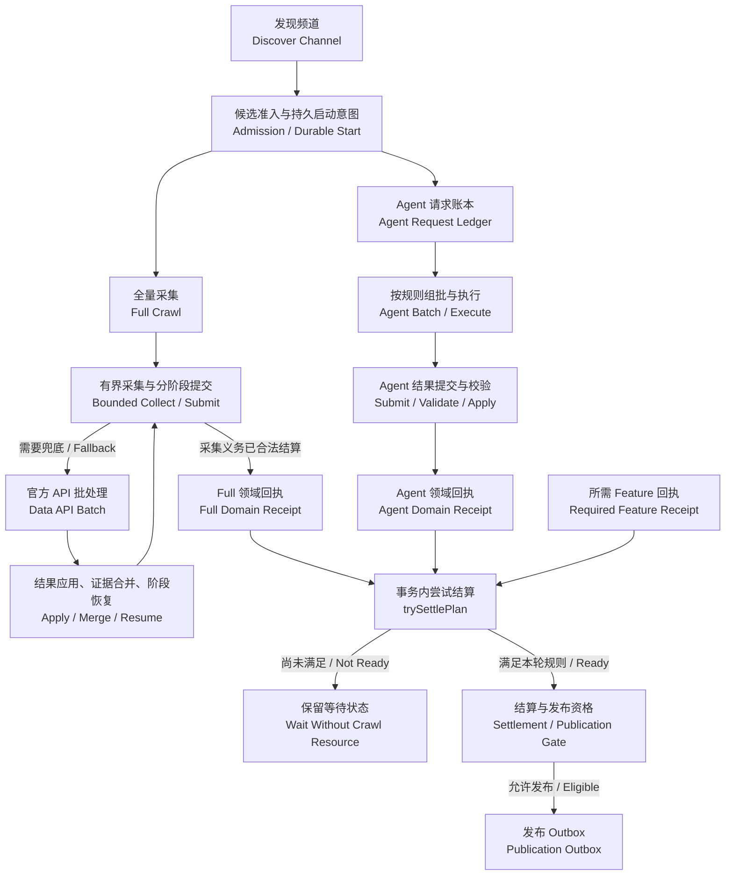
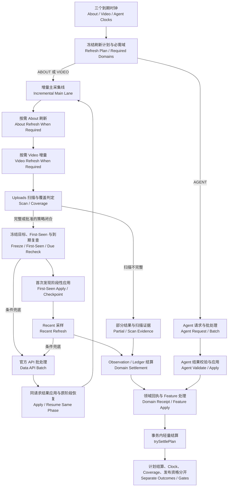

# crawlSystem 完整重构方案 · 24.3
## 保留采集核心、五执行角色、双支路并行、三 Clock 增量、Query 自生长闭环与轻量原子收口

**版本：24.3｜修订日期：2026-09-16｜状态：完整开发基准，待代码实现与业务／故障／容量验收。**

本文件以 **24.2 执行链路重构版**为直接底稿，完整继承 24.2 已定案的五执行角色、Main Lane／Agent Lane、Data API 回流、三 Clock 增量、领域证明与轻量原子结算，同时把 Discover 的 Query 从“可重复执行的搜索词”正式提升为一个**按国家和业务分类组织、能够由频道／视频／Agent 信号持续生成新 Query、并通过 Query Clock 周期性再执行的自生长闭环**。本版不是 Query 补丁，也不重新选择基础设施：Control／Worker／Data／Storage 四平面、一个逻辑 PostgreSQL＋Primary/Standby HA、SeaweedFS、ClickHouse，以及独立的 `publication.outbox → Debezium → Kafka → Business Consumer` 分发链继续保留。

**本版核心：保留经验证的采集算法与业务判定，重建外围执行与恢复；执行角色仍为发现（Discover）、全量（Full Crawl）、增量（Incremental）、官方 API 批处理（Data API Batch）、Agent 批处理（Agent Batch）。Query Engine 新增 `QueryTerm → QueryBinding(country + business_category) → QueryRun → Candidate/Channel → 新 Query Candidate → Query Pool` 闭环；Business Category 严格对应业务数据库固定的 19 个一级分类，英文为稳定领域值、中文为 UI 展示名，并与 Query Source Signal（例如 `AUTO_TAG`）明确分离；首次 Query Run 使用 `THIS_YEAR` 建立发现基线，成功后不保存连续“质量分”，只根据本轮产出与策略版本得到离散 `refresh_factor = WEEK | MONTH`，从而生成下一次 Query Clock：WEEK 对应下一周执行并携带 `THIS_WEEK`，MONTH 对应下一月执行并携带 `THIS_MONTH`；低价值 Query 可进入 `COOLDOWN / DORMANT`，后续新 Signal 可重新唤醒。**

**执行链路核心仍不变：**Full 与 Agent 可按输入契约异步并行；增量按 About／Video／Agent 三 Clock 冻结本轮 Plan，再分主采集与 Agent 支路。取消独立 Finalize 队列／Worker，完整性职责内聚到可信 Apply／Store，并由事务内 `trySettlePlan(tx, plan_id)` 轻量原子收口。

第 24 章提供中文＋英文完整链路和返回路径；第 25 章提供工程契约、AI 重构规则与 P-01～P-40 新验收；**第 26 章正式冻结 Query 自发现飞轮、Country／Business Category 绑定、Query Clock、刷新因子、生命周期、血缘、数据模型、UI 与 Q-01～Q-30 验收。**原第 4～8 章的 146 条采集／恢复规则、69 原因码与 T/C/D 验收继续保留。旧源码中的 Finalize、BullMQ 等描述仍作为【现有基线】存在，不是要求在新系统重建旧队列。

**实施方式：新架构直接建设。** GitHub 旧代码用于提取采集实现、业务规则、字段证据与经验证的恢复语义；旧调度、旧幂等和旧安全恢复实现不默认可信。BullMQ、NATS、旧 Center、旧 Publisher／Projector 与独立 Finalize 队列不进入目标生产运行时。Shadow/Diff 在隔离环境验证业务保真，已证实的缺陷按批准修复，不长期生产双写双跑。

**阅读顺序：**先读[第 24 章：重构链路](#chapter-24)、[第 25 章：工程与验收](#chapter-25)和[第 26 章：Query 自生长引擎](#chapter-26)；查原业务规则读 4～8；查事务／协议读 9～15；查规模、通信、HA 与分发读 19～23。

### 先看确定结论

| 事项 | 24.3 版决定 |
|---|---|
| 业务 | 不改 Full 有界目标、Incremental 的 `scanUploads`／First-Seen／Recent／API 等待与生命周期规则；频道历史可持续增长，但单次提交始终有界 |
| 平面拆分 | Control Plane 决定“做什么”；Worker Plane 负责“去采什么”；Data Plane 负责“结果怎么可靠进入事实库”；Storage Plane 负责权威数据和持久对象 |
| 多节点 | Discover、Full、Incremental 三采集池＋Data API／Agent 两批处理执行角色；Planner、Starter、Data Ingestor、Feature 支持多实例；角色不等于服务器数量 |
| 并行与互斥 | 同频道冲突主采集写权互斥；API 为原 Full／Incremental 计划的阶段依赖；Agent 是独立输入版本与授权的并行支路 |
| 批处理 | Data API 按端点／参数／配额规则组批；Agent 保留用户确认的 30 条批处理基准，满批／尾批／并发等细节须核对源码与配置 |
| 完整性收口 | 取消独立 Finalize 队列和专属 Worker；Apply／Store 形成领域证明，并在统一锁序的同一短事务内调用 trySettlePlan；不重扫历史明细 |
| 增量分流 | 三 Clock 冻结本轮 required domains；About／Video 进主采集，Agent 进批处理；Agent-only 不启动采集网络任务 |
| Query 自发现闭环 | Query 不再只是一张人工关键词表；Discover 找到频道后，频道／视频／Agent 产生的新 Query 先进入 Candidate／去重／准入，再回到 Query Pool，形成可持续自发现飞轮 |
| Query 业务维度 | 稳定执行身份为 `QueryBinding = QueryTerm + country_code + business_category_id`；Business Category 只能来自业务数据库固定 19 类；英文分类值作为稳定领域代码，中文名称仅用于 UI；同一文本在不同国家或业务分类下拥有独立 Clock、生命周期与运行历史 |
| Query Clock | 首次 Run 固定使用 `THIS_YEAR`；成功后策略只输出离散 `WEEK` 或 `MONTH` 刷新因子，不保存连续质量分；WEEK → 下一周＋`THIS_WEEK`，MONTH → 下一月＋`THIS_MONTH` |
| Query 生命周期 | `BOOTSTRAP / ACTIVE / COOLDOWN / DORMANT / DISABLED` 分开；COOLDOWN 时长由策略配置，DORMANT 不主动运行；新高质量来源 Signal 或人工操作可重新唤醒 |
| Query 运行冻结 | 每次 QueryRun 冻结 query/country/category/upload window/locale/sort/policy version；同一 Run 的 continuation 和重试不得改变参数；YouTube 原始 `sp` 只属于 Adapter，不进入领域事实 |
| 完成口径 | APPLIED、Domain Settled、Plan Settled、Coverage、Publication Readiness、DELIVERED 分开；完成证明绑定 plan/domain/generation/input version |
| 执行平台 | 三条主业务链使用 Temporal 的有限 Plan／Run；网络内部循环保持阶段／会话粒度，不逐 HTTP 请求建任务，也不把大业务结果塞入 Workflow History |
| 热结果通信 | Worker 使用少量长期 gRPC Channel；**每个 Submission 或有界 Submission Group 使用有界生命周期 RPC Stream**，不使用“一个永不结束的 bidi stream 承载所有频道”；新增实例通过新 RPC/新连接获得流量 |
| K8s 负载均衡 | 生产必须明确二选一：① Headless Service + gRPC 客户端服务发现／负载策略；② gRPC-aware L7 Gateway。普通 L4 Service 可作为连接入口，但不能把“已有长连接会自动迁移到新 Pod”当扩容机制 |
| 数据组织 | 首次迁移/Full 是有界 Snapshot；后续 Incremental 是 Delta，只传本轮新增／变化的数据；完整扫描区间里的“缺失”只能形成 `missing/presence evidence -> recheck`，不能直接写 Deleted/Private |
| 大对象 | SeaweedFS 不在正常 Delta 主链；只保存大型 Raw、诊断证据、超大结构化 Submission 或必须中央接管恢复的不可变对象 |
| Data Plane 背压 | 连接、RPC Stream、压缩字节、解压后字节、Decode CPU、Apply 事务、PG Pool 分层限额；恢复时使用指数退避 + Full Jitter，禁止固定周期同步重传 |
| 数据库 | 一套逻辑 Crawler PG：稳定写入口 → PgBouncer → Primary + Standby；本版明确不做应用级分片/Citus/Shard Router；必要时只做 PostgreSQL 原生表分区 |
| PgBouncer | 目标使用 Transaction Pooling，但必须冻结驱动／PgBouncer兼容组合；protocol-level named prepared statements 可在受支持版本与配置下使用，不做“一律禁用”的错误规定；业务事务禁止依赖不可迁移的 session state |
| Advisory Lock | 当前重点协调锁已使用 `pg_advisory_xact_lock`；继续以事务级锁为默认，完整审计 session advisory lock／LISTEN／临时表／SET SESSION 等会话依赖 |
| 数据库扩展 | 先通过索引、短事务、批量写、连接池、原生表分区、冷热归档、HA 与硬件扩容解决；若未来实测证明必须跨库分片，另立新版本/ADR，本版不预建设分片基础设施 |
| 数据正确性 | 本地原子事务与可靠异步分开；三身份、三完成、原生错误证据与业务总预算不削弱；COMMIT_UNKNOWN 先查回执 |
| 分析与分发 | ClickHouse 仍负责历史分析；跨系统 Publication 使用独立 `publication.outbox → Debezium → Kafka`；普通遥测走 OTel／Prometheus。分析链和业务分发链不混用同一消费进度 |
| 旧运行时 | NATS／BullMQ／旧 Center／旧 Publisher-Projector 不进入新架构生产运行时；仅作为冻结源码行为参考 |
| 明确排除 | RSS 轮询、WebSub 推送、Worker 直写 PG、per-channel 新建网络连接、一个永久 bidi stream 承载所有结果、所有结果先绕 SeaweedFS、无界内存队列、无抖动重试、无依据固定性能比例 |

### 依据、状态与使用边界

| 基准 | 内容 |
|---|---|
| 文档版本 | 24.3；Query 闭环与策略整合日期 2026-09-16 |
| 输入主文档 | `24.2_爬虫平台完整重构方案_执行链路重构版.md`，完整继承 24.1/24 的底稿、业务矩阵与 24.2 执行链路；本版叠加 Query Engine 定案 |
| 仓库／分支 | `hjyl-cheng/crawlSystem` / `agent/incremental-migration-release` |
| 业务源码基线 | `10a43473232d70a76bdcf4c7312d4cb833642af3`；继承底稿中的静态核查；本次未重新全仓审计、未重新确认当前分支 HEAD |
| 继承内容 | 原 146 条视频判断／恢复规则、69 个原因码、100 项原验收场景、T1～T4、三身份／三完成、多节点数据归属与源码索引 |
| 24.1封版修订 | 继承24版全部架构与业务契约；补齐单表Publication硬DDL与Debezium禁止自动扩表；冻结PG17+ failover logical slot要求与PG<17恢复Runbook；明确Analytics不复用Publication Kafka链；补齐三服务器ClickHouse归属与Kafka/PG/存储共置资源隔离；清理重复Markdown标题 |
| 24.2执行重构 | 五角色、Full＋Agent并行、三Clock增量、API／Agent结果回流、共享恢复内核、领域证明与轻量原子结算、P-01～P-40验收 |
| 24.3 Query Engine | Query 自生长飞轮、Country＋固定 19 类 Business Category Binding（中英文映射）、Query Candidate／来源血缘、首次 THIS_YEAR、WEEK／MONTH Query Clock、COOLDOWN／DORMANT、Query Source Signal（含 Auto Tag／Keyword 等）与 Business Category 分离、Q-01～Q-30 验收 |
| 依据分级 | 旧代码事实来自底稿；Agent并行／30条批处理等来自用户确认；事务化收口细节为本版新增设计，不冒称旧源码已实现 |
| 未做 | 未改 GitHub／生产代码，未部署新服务，未请求真实 YouTube，未做生产业务集成／容量／故障切换测试；文档中的吞吐和并发阈值仍须压测冻结 |

### 继承的 24.1 生产修订边界

24.1 已补齐以下六项生产落地约束；24.2 全部继承，不将执行链路重构扩大成基础设施重新选型：

1. PostgreSQL Publication 由 DBA／迁移脚本显式创建，并且只包含 `publication.outbox`；Debezium 不允许在生产自动创建或扩大为 `FOR ALL TABLES`。
2. `table.include.list` 只是 Connector 捕获范围的第二道保险，不能替代 PostgreSQL Publication 本身的单表边界。Logical Decoding 仍读取 WAL；单表 Publication 的价值是限制 `pgoutput` 输出和下游解码／传输范围，不宣称能让其他表的 WAL 物理消失。
3. PostgreSQL 17+ 的生产 HA 必须把 Debezium logical slot 纳入 failover-slot 方案并验证 Standby 上 slot 已同步；PostgreSQL 16 及更早版本必须提供 slot 重建、LSN／offset 对账与恢复 Runbook，不得把“PG 有 Standby”直接等同于“CDC 已 HA”。
4. Analytics 链首期继续使用独立 minimal outbox → ClickHouse。未来若分析链也引入 Kafka，必须另立 ADR，使用独立 Outbox／Topic／Consumer Progress／Retention，不复用 `publication.outbox` 与 `crawler.publication.v1`。
5. 三服务器成本拓扑补齐 ClickHouse 物理归属，并把 CPU、Memory、IO、磁盘、OOM/故障保护优先级写成硬约束；不使用固定 `4C/8G` 一类未经压测数字。
6. 清理从旧版合并产生的重复锚点与重复 Markdown 标题；规则编号、原因码、阶段编号和既有验收 ID 不因此改变。

**【源码确认／现有】**表示底稿继承的冻结代码事实；**【用户确认】**表示本轮明确需求；**【架构判断／24.2新增目标】**表示目标设计，不表示已经实现；**【需要压测／生产数据验证】**表示不能用文档数字替代现场测试。`captured`、`settled_error`、`stored`、`terminal_excluded`、`fetch complete`、`RECEIVED`、`APPLIED`、`DELIVERED` 仍不可合并成一个“成功”。模块解耦也不能拆散必须在同一连接中完成的原子事务。

### 目录

1. [技术范围、开源与自研分工](#chapter-1)
2. [执行、发布和分析三条链](#chapter-2)
3. [保留的业务模型与源码边界](#chapter-3)
4. [Full Crawl 视频判断清单](#chapter-4)
5. [Incremental 视频判断清单](#chapter-5)
6. [共享响应、字段、Disposition 与复查](#chapter-6)
7. [API、远端恢复与会话契约](#chapter-7)
8. [生命周期与 Full／Incremental 差异](#chapter-8)
9. [本地事务、可靠异步与三完成](#chapter-9)
10. [69 个原因码、降噪与质量隔离](#chapter-10)
11. [Store、数据库访问、HOT 与键设计](#chapter-11)
12. [Publication、轻量分析链与 Dashboard](#chapter-12)
13. [Temporal、KEDA、Argo CD 与节点通信](#chapter-13)
14. [结果数据模型、通信边界、SeaweedFS 与恢复](#chapter-14)
15. [依赖版本与跨语言契约统一](#chapter-15)
16. [已确认风险与不可默改的业务](#chapter-16)
17. [实施顺序、影子验证与文件地图](#chapter-17)
18. [业务、故障、容量验收矩阵](#chapter-18)
19. [三链路多节点与海量数据调度](#chapter-19)
20. [评审采纳记录与上线参数](#chapter-20)
21. [生产通信、Data Plane 与单库PG主备](#chapter-21)
22. [生产加固：gRPC负载、PgBouncer、Delta缺失证据与恢复洪峰](#chapter-22)
23. [Distribution Plane：Transactional Outbox、Debezium 与 Kafka](#chapter-23)
24. [重构链路：Full／增量／API／Agent／原子收口（中文＋英文）](#chapter-24)
25. [工程契约、AI实施约束与 P-01～P-40 验收](#chapter-25)
26. [Query 自生长引擎：国家／业务分类、Query Clock、生命周期与 UI](#chapter-26)

看最新执行流程先读 24～26；看业务规则读 4～8；看事务与错误处理读 9～10；看总体技术和部署读 1～3、11～15、19；看生产通信读 21～23。实施沿用 17 的阶段0～9，同时执行18、22、23、25、26的验收矩阵。

<a id="chapter-1"></a>

## 1. 技术范围、开源与自研分工【目标】

### 1.1 本轮采用

| 能力 | 选型与范围 | 开源成熟能力 | 保留／自研业务适配 |
|---|---|---|---|
| 流程执行 | Temporal，自建方案作容量基线 | 任务队列、持久流程、定时器、重试与超时 | Workflow、会话边界、领域恢复、总预算、回执 |
| 多节点运行 | Kubernetes | 容器调度、副本与滚动发布 | 工作角色、资源限制、Rota 身份、优雅退出 |
| Git 发布 | Argo CD | 配置同步、差异与发布状态 | 审批、CI 镜像构建、兼容数据库迁移 |
| 自动伸缩 | KEDA + HPA，分步启用 | Temporal／指标适配、副本调节 | 安全缩容、需求口径、上下限；不重做一套弹性平台 |
| 事务事实 | PostgreSQL | 原子事务、约束、索引与并发控制 | CrawlerStore／PlanStore／Feature Store、数据身份与业务不变量 |
| PG 运维 | Pigsty／pgBackRest 等既定配套 | 专用 Linux 节点部署、备份与 HA 管理 | RPO／RTO、故障域、恢复演练与连接预算 |
| 热结果数据面 | 多实例 Data Ingestor + gRPC/HTTP2 长连接 | HTTP/2 流控、成熟 RPC 工具链 | 版本化结果契约、字节准入、幂等回执、T2/T3 与领域校验 |
| 大对象与恢复证据 | SeaweedFS，标准 S3 API | 对象保存及容量扩展 | 只承担大型Raw/恢复对象、Manifest、引用保护、分块及 GC |
| 历史分析 | ClickHouse | 列式存储、批量插入、多维查询 | 分析模型、版本去重、回填、质量与统计口径 |
| 跨系统业务分发 | Transactional Outbox + Debezium PostgreSQL Connector + Outbox Event Router + Apache Kafka | WAL CDC、持久事件日志、分区顺序、Consumer Group、重放 | Publication 事件定义、revision/schema、Business Consumer 的 Inbox 幂等与业务 Apply |
| 分析可靠传输 | PG 最小分析 Outbox + 批量 ClickHouse 适配 | PG 并发原语、ClickHouse 客户端／HTTP | 与 `publication.outbox` 分开：独立目的地、进度、保留与故障预算，不借 Kafka offset 证明业务交付 |
| 网络资源 | 保留 Rota | 复用项目现有实现，不将其冒称外部通用组件 | 租约、路由、预算、任务收尾与 SessionContext 绑定 |
| API／Agent批处理 | 两类独立领域执行角色，复用Temporal＋PG | 任务执行、事务、约束；不新增通用消息平台 | 组批规则、配额、批次清单、请求身份、结果逐项验收与回流 |
| 业务完整性结算 | Data Plane／Store 内 trySettlePlan | PG短事务、锁与唯一约束 | 领域证明、封口、Plan代次、Feature Gate、原子发布；没有独立Finalize队列 |
| 观测 | OTel + Prometheus + Alertmanager + Grafana | 追踪、指标与告警 | 阶段、原因、低基数维度、降噪与处置手册 |
| 依赖治理 | 现有包管理器／CI，Renovate 可辅助 | 锁文件、自动更新 PR、不可变构建 | 同类版本统一、例外清单与兼容矩阵 |

普通日志／Trace 优先复用一条已有采集管线。需要 ClickHouse 日志 Sink 且现有能力不足时，再选 Vector 作为适配；不同时新建两套功能相同的遥测收集链。[U3](#src-u3)

### 1.2 本轮明确不做与条件路线

| 项目 | 决定 | 边界 |
|---|---|---|
| RSS／WebSub | **本轮不做**；继续 `scanUploads` | 不预置实现任务，也不将其列为海量频道前置条件 |
| Kafka／Debezium | **正式采用，但只用于 Distribution Plane** | 只消费 `publication.outbox`；禁止把 Worker Result、Raw、普通遥测或内部任务总线化 |
| Schema Registry | **首期不强制** | 首期可用版本化 JSON payload + Kafka batch compression；当多团队、多语言和严格 schema governance 成为真实需求时再启用 |
| PeerDB | 不采用 | 本版 CDC 标准路线已经确定为 Debezium PostgreSQL Connector |
| Citus／应用级数据库分片 | **本版明确不做** | 单逻辑 Crawler PG + HA；需要时仅做 PostgreSQL 原生表分区。未来若实测必须跨库分片，另立新版本/ADR |
| contents 动静拆表 | 做对照测试，不一律直接拆 | 等价查询、锁、HOT、WAL、磁盘与事务成本证明净收益后再执行 |
| 独立凭据池平台 | 不建 | 只明确采集器 SessionContext，不假定 Token 可跨视频通用 |
| BullMQ／NATS／旧 Center | **新架构运行时不使用** | GitHub 旧代码仅用于参考业务行为与恢复语义，不建设生产兼容桥 |
| 独立 Finalize 队列／Worker | **24.2 不建设** | 完整性验证保留在领域Apply／封口，最终由同事务 trySettlePlan 判定；不再派一个任务重扫明细 |
| 自研 Publication Poller／Publisher／Projector 基础设施 | **不保留** | 业务侧只保留事件产生规则；传输交 Debezium + Kafka；Business Consumer 保留幂等 Apply |

**不重写三 Clock 算法，不强拆 Feature，不全面重写 Kysely，不为每频道建 Pod 或每视频建 Kubernetes Job。** 不把全部持久服务强行塞入 Kubernetes；PG/SeaweedFS/Kafka 是否在 K8s 内运行由硬件与运维模型决定，但逻辑职责不变。

24 版是新系统直接重建，不存在“同一生产工作由 Temporal 与旧 BullMQ/NATS 共同拥有”的过渡目标。业务等价验证通过隔离 Shadow/Diff、固定输入回放与数据库对照完成，而不是长期双写生产事实。

### 1.3 减少自研的实际边界

通用调度交 Temporal，应用部署交 Kubernetes／Argo，弹性交 KEDA，跨系统 Publication 的 CDC、持久消息、重放和消费者扩展交 Debezium + Kafka，批量分析写入交 ClickHouse 现成客户端。项目维护业务语义：频道准入、目标／字段证据、执行权、Disposition、API／Agent组批与请求契约、事务／领域回执、Plan结算、Publication event schema/revision、Business Apply和统计口径。

`publication.outbox` 本身是业务一致性模式，不等于自研分发系统。项目只负责在 T3/T4 业务事务里原子写入 Outbox；不再自己实现轮询、claim lease、publisher leader、last_id、传输重试队列和跨库 Projector plumbing。Business 端仍必须保留 `event_id` 幂等 Inbox／Apply，因为 Kafka 的投递确认不能替代外部业务数据库自己的本地事务。

<a id="chapter-2"></a>

## 2. 执行、发布和分析三条链【目标】

### 2.1 执行与数据：五执行角色，结果直接进入 Data Plane

```text
控制平面（Control Plane）
  Discover查询／Full意图／Feature与三Clock
           │
  Planner＋PlanStore → PG持久启动意图 → Temporal有限工作流
           │
           ├─ 发现（Discover）
           ├─ 全量（Full Crawl） ─┐
           ├─ 增量（Incremental）─┴→ 条件依赖：官方API（Data API Batch）
           └─ Agent批处理（Agent Batch，与采集支路并行）
           │
五角色结果 → 本地日志（Local Journal）／有界提交（Submission）
           │  长期复用gRPC Channel＋有界RPC
           ▼
数据平面（Data Ingestor × N）
  契约／身份／Hash／质量／字节预算／背压
           │
           ├─ 正常结构化Snapshot／Delta／Repair → Fast Apply
           └─ 大Raw／恢复对象 → 受保护S3对象引用（SeaweedFS）
           │
  PgBouncer → 稳定写入口 → 一个逻辑Crawler PG Primary／Standby
           │
  事实＋Checkpoint＋Receipt＋领域证明／可靠义务
           │
           ├─ Feature Engine → 统一Feature／三Clock／处理回执
           ├─ trySettlePlan：同事务、按计划与版本轻量收口
           ├─ 分析Outbox → 有界批投递 → ClickHouse
           └─ Publication Outbox → Debezium → Kafka → 外部Business
```

图表示逻辑职责，不要求数据经过额外“结算服务器”。Full／Incremental产生的API依赖先持久化再交接；API结果回到原计划，Agent结果按请求／输入版本关联原义务。完整时序见第24章。

**Worker 不直接写 Crawler PG，也不把普通结果先发控制面再转发。** Data Ingestor接收所有执行角色的结果；控制面主要承载任务身份／冻结引用／状态。普通结果不默认绕SeaweedFS；大Raw可由Worker直写S3后提交受保护引用，避免数据面二次搬运。

API／Agent／Crawl结果的APPLIED与“领域完成”不同；领域由可信Store形成证明。trySettlePlan与结果／领域证明更新共用原子事务，必要Feature回执后续到达也会触发同样的轻量判定，不产生独立Finalize队列。

**PG管业务事实、授权和回执；Temporal管执行位置；Data Plane管可靠写入口与背压；Feature保留统一三Clock算法。** Workflow完成不是APPLIED，APPLIED不是整轮成功，Plan结算不是DELIVERED。旧源码中的center／Finalize词语仅为历史入口，不是目标单机中心或必建服务。

### 2.2 部署与弹性：不重新派频道业务

```text
Git 代码 -> CI 测试/构建 -> 镜像仓库（固定摘要）
                                  |
                         Git 部署配置审核
                                  |
                               Argo CD
                                  |
                              Kubernetes
                                  |
                          五类执行角色／常驻 Worker 池
                                  ^
                                  |
     合格待执行需求/Temporal积压 -> KEDA/HPA
```

先固定副本验证多节点与退出，再开启扩容；安全缩容验收后逐步启用。Argo 管镜像、资源和扩缩容上下限，KEDA/HPA 管启用后的实际副本数，Dashboard 管业务接单。不同 Worker 版本的积压不混作一个无定义的伸缩目标。[O4](#src-o4)[O5](#src-o5)

### 2.3 分析：业务可靠事件与普通遥测分流

```text
A. 关键业务变化
   PG事务：事实 + 最小分析事件/可靠义务
                     |
             批量投递器（复用并收口）
                     |
          ClickHouse 写入确认 + 去重/对账
                     |
              Dashboard 历史分析

B. 普通遥测
   Worker/API 的指标、采样日志、Trace
                     |
         既有统一采集链（必要时 Vector）
             /                     \
     Prometheus/Grafana       ClickHouse 遥测表
```

A 的提交不能改成“PG 提交后裸异步发消息”；B 不必将每次 HTTP 访问写入 PG。两类数据明确可丢失性，不能以采样日志计算承诺精确的成功频道数。

**24.1封版约束：** A 首期继续使用独立的 analytics/minimal outbox → 有界批量 Publisher → ClickHouse，不复用 Publication 的 Debezium/Kafka 链。未来若分析链确实需要 Kafka，必须另立 ADR，并使用独立 Outbox、Topic、Consumer Progress、Retention 与故障预算；`publication.outbox` 和 `crawler.publication.v1` 永远只表达跨系统业务 Publication，不用分析 offset 冒充业务交付。

### 2.4 跨系统分发：Distribution Plane 不进入采集主链

```text
Crawler PG local transaction
   facts + publication.outbox
              |
              | WAL / logical replication
              v
      Debezium PostgreSQL Connector
              |
      Outbox Event Router
              v
      crawler.publication.v1
          Apache Kafka
              |
      Business Consumer Group
              |
      Inbox + local transaction
              v
         Business DB
```

Business DB 位于 crawlSystem 边界之外。Crawler 不直接持有 Business DB 写权限；Crawler 的稳定对外接口是 versioned Publication Event。Kafka 只负责持久事件流和消费者解耦，`DELIVERED` 仍以 Business Consumer 的幂等本地事务／业务回执为准，不能把 Kafka offset 提交当成业务数据库已经正确落地。

<a id="chapter-3"></a>

## 3. 保留的业务模型与本次核查边界

### 3.1 主业务模型不改【目标】

```text
Discover -> Candidate/资格 -> Full -> 当前频道与内容
                                         |
                                  Observation
                                         |
                              一个 Feature Engine
                              统一 Feature State
                                         |
                       +-----------------+-----------------+
                       |                 |                 |
                   About Clock       Video Clock       Agent Clock
                       +-----------------+-----------------+
                                         |
                                     Scheduler
                                         |
                               Incremental 冻结 Plan
```

业务顺序、休眠、补全、API 等待、Publication 准入和恢复语义保留。查询优化、引擎迁移、策略算法变更分开发布。

### 3.1.1 Discover Query 是自生长飞轮，不是静态关键词清单【24.3新增目标】

```text
                     ┌────────────────────────────────────┐
                     │                                    │
                     ▼                                    │
              Active Query Pool                          │
          QueryBinding + Query Clock                     │
                     │                                    │
                     ▼                                    │
               Discover QueryRun                          │
                     │                                    │
                     ▼                                    │
             Candidate Channel                            │
                     │                                    │
          资格／去重／Registry 归并                        │
                     │                                    │
                     ▼                                    │
              Full Crawl + Agent                          │
                     │                                    │
                     ▼                                    │
        Channel / Video / Agent Facts                     │
                     │                                    │
                     ▼                                    │
              Query Candidate                             │
          Normalize / Dedup / Admission                   │
                     │                                    │
                     └──────────────→ Query Pool ──────────┘
```

这里的 Query 不是一次性输入。**频道与视频采集事实会持续产生新的 Query Candidate，合格 Query 再进入 Query Pool 并执行新的 Discover Run，从而不断发现新的频道。**同一个 Query 也不是只能请求一次：它有自己的 Query Clock、最近成功时间、下一次运行时间和生命周期。

24.3 不引入连续 `quality_score`。Query 每次成功 Run 只保存真实运行指标和一个版本化的策略决定；策略结果直接形成下一档 `refresh_factor`：`WEEK`、`MONTH`，或者生命周期动作 `COOLDOWN / DORMANT`。首次 QueryBinding 处于 `BOOTSTRAP`，首次运行使用 `THIS_YEAR`；后续 WEEK 使用 `THIS_WEEK`，MONTH 使用 `THIS_MONTH`。完整契约见第 26 章。

**24.2 执行关系补充：**Discover准入后Full与Agent义务可异步并行；三Clock生成冻结Plan，About／Video走Incremental，Agent走批处理。API是原采集计划的依赖阶段；最终采用领域证明＋事务内结算，详见第24章。上图是原业务反馈关系，不是把Agent强制排到Full之后。

### 3.2 20／20.1 已跟踪的采集路径【现有基线】

| 路径 | 跟踪入口与共享函数 |
|---|---|
| 全量 | `fullCrawlYoutubeJs.js` → Factory → Model/Store → `youtubeJs` → Detail/API → Close/Handoff |
| 中心增量 | `executeIncrementalYoutubeJsVideo` → 扫描/冻结 → `first_seen` → `recent` → `recordVideoCycle` |
| 整频道远端增量 | `channelPlanExecutor` → `wholeChannelNode` → `wholeChannelCollector` → frozen snapshot/adopt |
| 共享判断 | 可访问性、内容类型、评论、时间/数值证据、Disposition、API fallback、活动/休眠 |
| 数据安全 | 原事务 helper、Observation Store、Finalize 发送、Feature applier 的相关入口 |

继承的依据是这些主路径的静态核查，**不是全仓每个旧入口和每个第三方库内部的穷尽审计**。例如官方 API 执行器中所有底层错误分支、`yt-dlp` 独立旧流程，没有被本轮逐函数全量验证。不能用本表替代生产样本和调用链测试。

### 3.3 一个重要纠正：按实际入口讨论并发【现有】

前轮已读取的 Full Factory、中心增量 checkpoint phase、whole-channel 远端 Detail 主循环都是逐项 `await`。`ProxyAgent` 的 `connections: 2` 是 HTTP 连接池配置，**不能推导出两个视频业务任务同时执行**。[F2](#src-f2)[I1](#src-i1)[R2](#src-r2)[Y1](#src-y1)

【目标】保留每条入口实际行为；扩容先依靠不同频道并行。不要在迁 Temporal 时顺手扩大单频道并发。若另有旧入口确实两路抓视频，须单独用入口和测试确认后保留。

### 3.4 不增加 RSS／WebSub 发现分支【目标】

Video 域到期后继续走 `scanUploads`：按原锚点、分页、解析缺口、国家复查和完整性规则决定 First-Seen、Recent、partial 与生命周期。不会增加 Feed 订阅管理、回调服务或“RSS 为空即无需采集”的快路径。

不采纳 RSS 的理由是本轮范围与未经验证的收益，不把“服务器订阅”与“账号关注频道”混为一谈，也不把“必然封号”写成已经证实的事实。

<a id="chapter-4"></a>

## 4. Full Crawl：视频采集的完整判断链【现有】

**24.2阅读说明：**本章保留冻结源码行为；旧Finalize交接为历史实现。目标执行采用24.3～24.4的Full＋Agent并行与可信领域回执，不再建设独立Finalize队列。F-26／F-27的迁移目标已同步调整，原采集判定不变。

### 4.1 实际流程

```text
恢复绑定、Run、Candidate、fetch contract
                 |
          +------+-------+
          |              |
     terminal/existing   需要继续
          |              |
       幂等收口       About / 准入
                         |
                    读取 Uploads
                         |
          验证空响应 / 国家复查 / 活动证据
                         |
               固定目标集合 + Hash
                         |
                领取下一条 Detail
                         |
           +-------------+----------------+
           |                              |
     预告/正在直播/明确超期             普通目标
           |                              |
       排除证据                       full Detail
           |                         类型/评论/字段检查
           |                              |
           |                       有条件 API fallback
           +---------------+--------------+
                           |
                  再判直播、时间、访问、类型
                           |
                   候选与内容短事务提交
                           |
                    下一条或 closeFetch
                           |
                  Finalize/Publication 交接
```

Full 是既定有界采集流程。默认 30 是配置默认值；是否更多、窗口是否启用，须看实际 Run/设置，不能声称已经验证了生产环境的值。

### 4.2 Full 决策矩阵

| 规则 | 判断条件 | 当前代码动作／结果 | 保留或迁移时注意 | 源码 |
|---|---|---|---|---|
| F-01 | Job／恢复身份不完整或不一致 | 核对 candidate、run、business binding、频道、fetch contract；缺失或冲突抛 checkpoint/contract 异常。 | 不是网络故障；不能通过重新抓视频来掩盖。 | [F2](#src-f2) [F4](#src-f4) |
| F-02 | 已终止、已拒绝、已存在、频道 removed | 恢复到 terminal/existing 分支，按现有绑定与通知逻辑退出。 | ok/skipped 表示无需本次继续，不等于重新采集成功。 | [F2](#src-f2) [F4](#src-f4) |
| F-03 | 只修复 About 的任务 | 执行 About 的专门恢复／完成路径。 | 不能为了统一 Full Workflow 再抓一遍视频。 | [F2](#src-f2) [F4](#src-f4) |
| F-04 | 需要采集频道头和 About | 要求 About 被请求、被观察且无 about_error；返回频道 ID 必须匹配，标题与 URL 必须存在。 | handle 可缺失，例如某些 Topic 频道；不要新增无来源的强制字段。 | [F2](#src-f2) |
| F-05 | 订阅资格检查 | 仅在任务明确 enforce_min_subscribers 时执行；阈值来自设置／任务。 | 不是所有 Full 调用都统一以 1000 为硬条件。 | [F2](#src-f2) [F4](#src-f4) |
| F-06 | 晋升频道时发现竞争者已完成 | 通过现有 Registry Promotion 与候选身份检查处理已存在情况。 | 保留晋升幂等，不重复创建正式频道。 | [F2](#src-f2) [F4](#src-f4) |
| F-07 | 首次进入 Uploads | 读取 Uploads 播放列表；内容上限通常默认 30、配置限制 1～100；Run 已存参数优先。 | Full 是当前定义的有界全量流程，不是永久扫描该频道全部历史。 | [F2](#src-f2) [F4](#src-f4) [Y1](#src-y1) |
| F-08 | 冻结时间与窗口参数 | 以当前业务 Run 的参考时间和已有设置判断内容窗口，恢复时复用。 | 重试不能用不断变化的当前时间重新决定同批目标。 | [F2](#src-f2) [F4](#src-f4) |
| F-09 | Uploads 返回空或播放列表缺失 | 先经空响应证据验证，再走 About 国家复查／休眠判断。 | 未验证的空返回不能直接清空历史或判频道无效。 | [F2](#src-f2) [Y1](#src-y1) [Y7](#src-y7) |
| F-10 | Uploads 达到目标数、页数或解析缺口 | 保存 scan.complete、stop_reason、terminal_reason、parse_gap_count 和有界目标。 | 达到配置数量不等于扫到历史末尾；活动证据完整度与扫描终止原因分别保留。 | [F2](#src-f2) [F3](#src-f3) [Y1](#src-y1) |
| F-11 | 目标中重复 video_id 或 position | 目标规范化时拒绝重复；计算文档 Hash 与 Target Hash。 | 不能先静默去重再声称与旧协议相同。 | [F3](#src-f3) |
| F-12 | 恢复时已有 Uploads 与候选 | 验证 uploads_hash、target_hash、selected_count 与候选记录相符。 | 不允许旧目标集合存在时用新扫描结果替换。 | [F4](#src-f4) |
| F-13 | Uploads 证据满足当前迁移休眠规则 | 迁移活动策略可以提前得到 dormant，并冻结空目标集合。 | required 标志、证据完整性、近期内容和不确定内容共同决定。 | [F2](#src-f2) [L1](#src-l1) |
| F-14 | Uploads 首次持久化 | 写候选、冻结目标及 scan/活动证据；非空政策分支会重设现有 contents.is_recent；empty_uploads 分支不按同样方式清空。 | 保存空列表政策分支的差异；不要把 is_recent 操作扩大为删除内容。 | [F4](#src-f4) |
| F-15 | 本次详情执行权失效 | claimDetailScope 与每次候选操作检查 Fence；失效抛 CONTENT_DETAIL_EXECUTION_FENCE_STALE。 | 停止旧写入，保留已经成功的数据。 | [F2](#src-f2) [F4](#src-f4) |
| F-16 | 选择下一条 Detail | 按 position／candidate_id 领取 queued/failed 项，改 running 并增加对应尝试计数。 | 本入口 while + await 是逐视频串行，不能把连接池 2 个连接写成两个视频线程。 | [F2](#src-f2) [F4](#src-f4) |
| F-17 | 预检查发现 upcoming 或正在直播 | 不做常规完整详情抓取，构造现有排除证据，按 terminalReason 提交 disposition。 | 仍有后续低频复查，不是永久遗弃。 | [F2](#src-f2) [F3](#src-f3) [D2](#src-d2) |
| F-18 | 预检查有明确窗口外发布时间 | 仅 classifyContentWindow 的 relation=outside 且窗口启用时排除。 | relative、estimated、未知时间及 cutoff_overlap 不能直接判旧。 | [F3](#src-f3) [Y8](#src-y8) [Y9](#src-y9) |
| F-19 | 通过预检查，需要正常 Detail | 采用 full 模式、strictRequiredSurfaces、requireContentType；按现有客户端和评论逻辑提取。 | 不能用 metrics-only 结果充当 Full 所需完整数据。 | [F2](#src-f2) [Y1](#src-y1) [Y2](#src-y2) |
| F-20 | Full fetch contract 允许官方 API fallback | 只有对应 API Full contract 走 fallback；请求身份绑定 full/run/video。 | 不是 Full 所有合同默认启用官方 API。 | [F2](#src-f2) [A1](#src-a1) |
| F-21 | 详情回来后发现状态变化 | 再次判断 upcoming、live_in_progress 和内容窗口，再确定最终处置。 | 列表提示与详情可能不同；冻结目标不等于冻结外部世界。 | [F2](#src-f2) [F3](#src-f3) |
| F-22 | 详情或验证抛异常 | 本 Factory 没有把所有异常统一吞掉继续；fallback 可处理部分异常，其余向上层传播。 | 上层 Rota、任务恢复和预算决定后续；不能推导所有错误永久结束频道。 | [F2](#src-f2) [A1](#src-a1) [E1](#src-e1) |
| F-23 | 提交该候选 | 同一事务复核候选 running、执行 Fence、身份；保存 Detail、类型证据、access、disposition 和下一次复查时间。 | captured 原始证据与 contents 实际写入仍是不同阶段。 | [F4](#src-f4) [D1](#src-d1) [D2](#src-d2) |
| F-24 | 已有内容变为受限访问 | 根据已知 content_key/type 走 update_access；不凭受限响应重写已知类型。 | 会员或 unlisted 不是一律删除；新内容写入另看权威类型。 | [F4](#src-f4) [D1](#src-d1) |
| F-25 | 没有可领取的候选，进入 closeFetch | 要求每个候选 detail 为 done/unavailable 且有 disposition，核对目标 Hash；再要求 Detail 收口条件满足。 | fetch 完成允许包含 deferred／excluded 数量；不等于全部内容完整入库。 | [F4](#src-f4) |
| F-26 | 已有 fetch receipt，恢复为 handoff | 复用采集结果，只重做后续需要的通知／Finalize 交接。 | 24.2复用领域证明与原计划结算／可靠通知，不重建Finalize队列；交接失败不能重采全部视频。 | [F2](#src-f2) [F4](#src-f4) |
| F-27 | 触发 Finalize | 当前 full 入口在 withTransaction 内调用会 queue.add 的方法。 | 24.2删除独立Finalize投递；领域证明与trySettlePlan同事务。必要后继工作／通知仍同事务落意图、提交后可靠发送，不访问Redis。 | [F1](#src-f1) [T3](#src-t3) |
| F-28 | 全量成功返回 | 代表当前 Full 执行路径已完成约定交接或终态处理。 | 业务 Publication readiness、业务端交付回执仍独立验收。 | [F2](#src-f2) [F4](#src-f4) |

### 4.3 Full 的完成条件不要简化

还有一项具体约束：这个 YouTubeJS Store 的恢复检查要求候选 `api_status=not_needed`；允许的官方 API fallback 使用独立的 `youtube_api_detail_requests` 等账本，而不是把旧式 Candidate API 状态混入本流程。迁移不能把两种 API 协调方式简单合并。[F4](#src-f4)[A2](#src-a2)

`assertFetchCheckpoint`/`closeFetch` 关心的是冻结目标的 Detail 是否已走到规定状态、每条是否有 disposition、Hash/数量是否匹配。**这允许目标被排除或延迟处置，并不保证每个目标都变成完整的公开视频记录。**[F4](#src-f4)

三种情况必须分别统计：

```text
目标已走完当前采集路径
        != 该视频已经 stored
        != 该频道 Publication readiness 已通过
        != 业务库已经 DELIVERED
```

【风险】Full 的个别 `done`、候选 `deferred` 与界面的“完成”容易混读。目标文案应显示“已处理目标数、已入库、待后续确认、已排除”，而不是统一成功数。

<a id="chapter-5"></a>

## 5. Incremental：新视频发现、旧视频采样与恢复【现有】

**24.2阅读说明：**本章是Video域的冻结采集规则，不是完整三Clock执行图。七种About／Video／Agent组合、独立Agent批处理、API回流和原子计划结算见24.5～24.13。Due Recheck沿原目标阶段归属，不凭示意图添加第三轮无条件抓取。

### 5.1 实际流程

```text
冻结 Plan + Run/cycle + 执行 Fence
                   |
          已有 finalized ? ------ 是 -> 返回原回执
                   |
                   否
                   |
            复用 Batch 或扫描 Uploads
                   |
       锚点 / 页数 / 追赶上限 / 解析缺口
                   |
       +-----------+---------------------+
       |                                 |
   不完整扫描                        完整/政策性闭合
       |                                 |
候选 deferred，Recent skipped      冻结目标与采样资格
Observation partial                       |
不推进完整锚点                       first_seen 阶段
                                          |
                              内容 + First-Seen 检查点
                                          |
                                     recent 阶段
                                          |
                          captured/settled_error/API等待
                                          |
                            事务内复核、应用、Observation
                                          |
                             生命周期与 Publication
                                          |
                              Batch finalized + 回执
```

“完整”存在多个层次：扫描覆盖、Discovery 义务、Recent 采样、Video 周期。当前代码不是一个 `success` 布尔值贯穿所有阶段。

### 5.2 Incremental 决策矩阵

| 规则 | 判断条件 | 当前代码动作／结果 | 保留或迁移时注意 | 源码 |
|---|---|---|---|---|
| I-01 | 开始增量 Video | 校验 Plan 的 planner_config_version，计算 Run/cycleKey，领取本次 Video 执行 Fence。 | 运行时恢复必须绑定原业务身份；不是每次重试随机新 Run。 | [I1](#src-i1) [I2](#src-i2) |
| I-02 | 已有 finalized Batch | 验证关联 Observation，返回已保存 final_result_json；必要的 onFinalized 仍按既有路径调用。 | 不重新扫 Uploads、抓 Detail 或重复记 First-Seen。 | [I1](#src-i1) |
| I-03 | 已有 fetching/ready Batch | 加载已冻结 scan、targets、sampling 配置、锚点和参考时间继续。 | 新配置或新的频道内容不能悄悄替换这次任务输入。 | [I1](#src-i1) |
| I-04 | 没有 Batch，要查找新内容 | 读取有序锚点，再调用 scanUploads；默认 maxPages=20、后续页 catchUpMaxItems=50，均可配置。 | 这是额外追赶额度，不是整个频道永远只留 50 条。 | [I1](#src-i1) [I2](#src-i2) [Y1](#src-y1) |
| I-05 | 扫描遇到旧锚点 | 停止并记录 matched_anchor_id、crossed_anchor_ids；解析无缺口才是 complete。 | 旧锚点被越过的事实不能丢掉。 | [Y1](#src-y1) |
| I-06 | 扫描自然结束 | 无 continuation 到 list_end；只有无 parse gap 时才表示完整覆盖该扫描。 | 第一页面空但还有 continuation 不能当列表结束。 | [Y1](#src-y1) [Y7](#src-y7) |
| I-07 | 扫描达到页数上限 | 保留 max_pages、不完整证据；不直接宣称已追到旧锚点。 | 按 partial 路径处理已发现线索；不扩大成功游标。 | [I1](#src-i1) [Y1](#src-y1) |
| I-08 | 分页调用失败 | parser_runtime/content_terminal 类可转为 incomplete scan；其他失败上抛，等待对应恢复策略。 | 具体分类来自当前错误策略，不是所有分页错误都一样。 | [I1](#src-i1) [E1](#src-e1) |
| I-09 | 扫描记录有解析缺口 | parse_gap_count>0 会阻止一般扫描 complete。 | 遗漏的 renderer/条目不能当作不存在。 | [I1](#src-i1) [Y1](#src-y1) |
| I-10 | 追赶达到 catchup_limit，且满足严格放弃缺口条件 | 无锚点、无解析缺口、计数和唯一身份一致、额外追赶数恰好达到配置等条件满足时，只选最新 30 条，标 complete 并记录 gap_abandoned_latest_30。 | 这是既有政策性完成，不是历史无遗漏；保存 abandoned anchors 与原始扫描／选中 ID。 | [I1](#src-i1) |
| I-11 | catchup_limit 但条件不满足 | 不执行 latest-30 转换，保留原始不完整状态。 | 不能把所有追赶异常统一改成最新 30 条成功。 | [I1](#src-i1) |
| I-12 | 扫描到已在 contents 中的视频 | 不当作新 First-Seen；可更新见到时间、位置，并按证据优先级合并日期。 | 完整/不完整扫描的后续义务不同；新看到不等于新入库。 | [I1](#src-i1) [I3](#src-i3) |
| I-13 | 未入库视频有 deferred/terminal_excluded 记录 | 按最新 disposition 和 next_attempt_at 判是否复查；未到期跳过并保留 deferred 义务。 | terminal_excluded 不是永久禁止；一般扫描不随意重试未来到期项。 | [I3](#src-i3) [D2](#src-d2) |
| I-14 | 存在本轮列表之外、已经到期的复查对象 | 扫描完整且非 empty_uploads 时可追加 dueDisposition 条目。 | 不局限于本轮刚扫到的视频。 | [I1](#src-i1) [I3](#src-i3) |
| I-15 | 首次看到 upcoming/live，且不是到期复查 | 不加入一般 First-Seen Detail 网络目标；仍须记录处置结果。 | 未请求详情不等于静默丢弃视频。 | [I3](#src-i3) [I1](#src-i1) |
| I-16 | 到期复查目标仍携带旧直播标记 | disposition_recheck 可以越过上述预跳过，真正请求详情重新确认。 | 这是 Full 与增量的重要差异，不能共用无上下文的 skipLive。 | [I3](#src-i3) |
| I-17 | 同一 video_id 同时落入 first_seen 和 recent | checkpointItems 拒绝跨阶段重复目标。 | 避免同一周期既首次入库又重复采样计费。 | [I3](#src-i3) |
| I-18 | 扫描不完整 | 不生成这批 Detail 采集目标；登记候选 deferred/扫描证据，Recent skipped，结果 partial。 | 保留线索，不制造完整数据；不推进完整锚点、生命周期或正常发布路径。 | [I1](#src-i1) [I3](#src-i3) |
| I-19 | 经过空 Uploads 政策确认 | 本周期不安排普通 Recent，也不回收 pendingFirstSeen 当成新成功；走空列表生命周期规则。 | 空列表是当前可见性政策，不是历史内容删除。 | [I3](#src-i3) [L3](#src-l3) [Y7](#src-y7) |
| I-20 | 准备 Recent 候选 | 筛选频道内类型、日期或待补全义务；排除仍活跃的 Enrich 租约、未到期 retry/terminal 等。 | 不能只按 published_at LIMIT N 而丢掉原有资格条件。 | [I1](#src-i1) |
| I-21 | Clock 是否拥有 player-refresh | 依据 CONTENT_ENRICH_CLOCK_MODE，决定能否纳入已有 player enrich 工作。 | 防止独立 Enrich 和增量同时写同一视频。 | [I1](#src-i1) |
| I-22 | Recent 计算采样数 | 用陈旧程度、变化概率、补全优先级和冻结的 player_cap/factor 计算配额。 | 配额不是固定每次抓最近 30 条，公式见本章。 | [I2](#src-i2) |
| I-23 | Recent next 子集合 | 从选中 Player 条目中再选 collect_next，受 next_cap 限制。 | 这个标志不能推导底层一定不发 Comments 请求，实际 fetch 仍有评论处理。 | [I1](#src-i1) [I2](#src-i2) [Y1](#src-y1) |
| I-24 | 详情模式选择 | first_seen 或 enrich_pending=true 需要 full；普通 recent 用 metrics。 | metrics 降低所需字段门槛，不等于所有静态字段都删除或评论完全不请求。 | [I1](#src-i1) [Y2](#src-y2) |
| I-25 | 领取检查点条目 | 按当前阶段取 pending/可恢复条目，持久 claim_token、租期、尝试数；网络调用在领取事务外。 | 条目领取事务、网络耗时、条目回写事务分开。 | [I1](#src-i1) |
| I-26 | 条目心跳或批次保留权丢失 | 合并中止信号；心跳和抓取同时失败时可抛 AggregateError，防止继续用失效写入权。 | 不能只保留最外层 Error 而丢真实 cause。 | [I1](#src-i1) |
| I-27 | 当前阶段没有可领取项 | 全部 settled 则阶段完成；仍有活跃 claim 则 VideoExecutionRecoveryPendingError。 | 不是空队列就认为全部成功，也不能强抢仍有效的执行。 | [I1](#src-i1) |
| I-28 | 详情成功并通过校验 | 条目持久为 captured，保留详情与字段状态。 | captured 是采集证据完成，不等于当前业务库已应用。 | [I1](#src-i1) |
| I-29 | 详情失败可归 content_terminal 或 parser_runtime | 可持久为 settled_error，保存错误和可用 partial_detail，继续后续条目。 | 不是把失败改为成功；后续 disposition、补全和 Observation 仍区分未决。 | [I1](#src-i1) |
| I-30 | 取消、API handoff、其他无法就地结算的错误 | 释放当前 claim 回 pending；错误向外传播，不把整批已捕获证据清空。 | 网络恢复、业务等待与执行失效分别处理；遵守统一预算。 | [I1](#src-i1) |
| I-31 | first_seen 阶段已采集完 | 执行 first_seen 检查点，可先持久内容和待消费 First-Seen ledger，再进行 recent。 | 本系统不是等所有视频抓完才第一次写库；迁移必须保留中途可恢复语义。 | [I1](#src-i1) |
| I-32 | 最终构造 Discovery Observation | 每个新发现 ID 恰有一份 disposition；缺失/重复判账本不变量失败。 | discovered_count、stored_count、first_seen_count 不能互相替代。 | [I1](#src-i1) |
| I-33 | 存在仍未解决的 deferred | 即使 scan.complete，Discovery outcome 仍可能 partial。 | 不把捕获阶段全部 settled 当作全部业务义务完成。 | [I1](#src-i1) |
| I-34 | 应用 Recent | 按稳定次序锁内容与对应 Enrich 权限；缺数据、授权不属于本次、条目消失都影响结果。 | 只应用仍有资格的条目，不用旧采样结果覆盖当前新事实。 | [I1](#src-i1) |
| I-35 | Recent 汇总 | 零失败为 complete（也可能零选中）；有成功有失败为 partial；全失败为 failed。 | 零样本是本轮政策结果，不是造出采集成功计数。 | [I1](#src-i1) |
| I-36 | 整个 Video 周期收口 | Discovery 与 Recent 均 complete 才 overall complete，否则 partial；失败也保留自己的结果口径。 | 完整扫描、完整发现义务、完整采样、完整周期是四个不同判断。 | [I1](#src-i1) |
| I-37 | 更新锚点／source cursor | 扫描非 empty 且 Discovery outcome=complete 才更新；普通 Recent partial 不必自动阻止已经证明的 Discovery 前进。 | 禁止写成“任何失败都不得推进任何游标”的错误总规则。 | [I1](#src-i1) |
| I-38 | 最终提交 | Observation、相关事实、必要 Publication、Enrich 释放、Batch finalized 及最终回执在受控事务中完成。 | 存在 Observation 但 Batch 未 finalized 被视为不变量问题，不假装修好了。 | [I1](#src-i1) [T2](#src-t2) |
| I-39 | 为远端准备快照 | 要求 Repeatable Read/Serializable；已知视频和候选读取设 100001 哨兵，超过 100000 明确 VIDEO_SNAPSHOT_TOO_LARGE。 | 超大频道需要另设计有界快照，不可偷偷截断。 | [I1](#src-i1) |
| I-40 | 采纳远端结果 | 验证 run/plan/channel/cycle、target_hash、每条 phase/video/ordinal 及重复；无失败声明时目标必须齐全。 | 有显式 failure 可携带部分结果；缺扫描／漏目标不能当成功。 | [I1](#src-i1) |

### 5.3 Recent Sampling 当前公式与配置

以下是 `incrementalVideoPlanner.js` 的算法摘要，不是本版发明的新策略。[I2](#src-i2)

| 项目 | 当前规则 |
|---|---|
| 配置校验 | Plan 的 `planner_config_version` 必须与配置版本匹配 |
| 近期窗口 | 默认 30 天，可配置；待补全目标可按资格规则突破普通日期筛选 |
| 陈旧阈值 | 默认 7 天；缺少 player 观测时间的处理沿既有规则 |
| 变化概率 | 已有合法 learned probability 优先；缺失时使用默认变化值与新鲜度组合 |
| Player Score | `0.6 × staleness + 0.4 × changeProbability` |
| 候选准入 | 待 Enrich、缺少 Player 观测、或达到默认 0.55 的刷新分数阈值等 |
| 排序 | 待 Enrich 优先，再按分数和稳定内容身份排序 |
| Player 数量 | 同时受候选数、建议额度、`floor(player_cap × factor)` 约束 |
| Next 子集 | 属于已经选中的 Player 集合；受 `next_cap` 与交互需求额度限制 |
| Next Score | `0.7 × nextStaleness + 0.3 × freshness` |
| 排他 | 已在 First-Seen 的视频不再进入 Recent；活跃 Enrich 租约要排除 |

**需单独评估而不默改：**采样新鲜度函数中有固定 30 天因素，而候选 recent window 可配置。扩大配置窗口不代表所有评分因素同步改变。先做现有行为回归，再决定是否调整算法。

### 5.4 First-Seen 的中途提交不能在重构中丢掉

当前代码先处理 First-Seen 阶段，可保存内容与 `first_seen_ledger_status=pending`；到最终 Observation 时再消费 ledger。这样 Recent 中途失败，不必把已经获得的首次发现证据重新采一遍。[I1](#src-i1)

【目标】结果包与 Apply 按**有界逻辑批次**建模。允许先应用一批 First-Seen，再完成后续 Recent。每次已确认的内容写入，必须同时保存足以继续补齐 Observation/账本的恢复证据。不能把这个模型改成“所有视频结束后一个巨大事务”。

### 5.5 latest-30 追赶策略的正确表达

`gap_abandoned_latest_30` 是已有明确策略，不是异常被吞掉。记录必须同时展示：

```text
coverage = policy_limited
原 stop_reason = catchup_limit
本轮采用最新 30 条
被放弃的锚点 / 原扫描身份仍保留
```

这里 `coverage` 是【目标】展示字段，旧协议继续保存原有 gap_abandonment。不得将旧 `complete:true` 无条件解释为“补齐此前所有历史”，也不得在重构中未经批准取消该政策。[I1](#src-i1)

<a id="chapter-6"></a>

## 6. 共享视频判断：200、Player、Comments、类型与字段【现有】

### 6.1 从收到响应到可以写入，不是一道判断

```text
连接 / HTTP 状态 / 响应来源
                |
         挑战与错误页面识别
                |
         Uploads / Player / Comments 解析
                |
         当前模式的必需数据表面
                |
         主体身份、类型、访问、时间证据
                |
         stored / deferred / terminal_excluded
                |
         中心事务内检查授权和现有版本
```

源码已经做了其中不少工作；“HTTP 200 内部还有错误”并非完全未处理。需要的是保留这些判据并统一出口，而不是仅新增一张码表后删除原判断。

### 6.2 共享响应与字段矩阵

| 规则 | 判断条件 | 当前代码动作／结果 | 保留或迁移时注意 | 源码 |
|---|---|---|---|---|
| S-01 | 请求取消或网络授权已撤销 | HTTP 包装合并调用、频道和 managed 信号；外部中止优先保留原原因。 | 不要把人工取消或授权失效统一归为网络超时。 | [Y1](#src-y1) [E1](#src-e1) |
| S-02 | 收到 HTTP 200 | 仍读取响应内容判断挑战，并在后续解析和业务契约中检查数据。 | 代码已有 200 语义检查，不应说完全只看状态码。 | [Y1](#src-y1) [Y2](#src-y2) [Y3](#src-y3) |
| S-03 | 200 正文识别到挑战 | 记录请求失败、来源、目标、客户端与证据；抛异常，不能当有效内容。 | 迁移保留来源证据；不增加规避访问限制的新策略。 | [Y1](#src-y1) |
| S-04 | HTTP 403/429 | 当前包装直接抛带状态和来源的失败，进入现有分类。 | 目标规范应细分配额、权限、限流和验证；不一律归代理坏。 | [Y1](#src-y1) [E1](#src-e1) |
| S-05 | 其他非成功状态 | 当前 fetch 包装可把 Response 交回 SDK，由后续解析／分类处理。 | 不能声称所有非 2xx 都在同一个位置完整统一处理。 | [Y1](#src-y1) |
| S-06 | 无视频项、仍有 continuation | 空页可以继续翻页，不是整个 Uploads 为空。 | 是否存在 continuation 与其有效性需保留，禁止 []=>dormant。 | [Y7](#src-y7) [Y1](#src-y1) |
| S-07 | 结构化 missing playlist | 仅特定错误、Alert 类型和原始响应证据匹配时走空 Uploads 政策。 | 这不等于频道已删除。 | [Y7](#src-y7) |
| S-08 | 无项目又没有可信空列表证据 | UPLOADS_EMPTY_RESPONSE_UNVERIFIED；原始含 videoId 但解析为空也会拒绝。 | 适合映射 RESP.EMPTY_UNCONFIRMED；不能消失成一般 Error。 | [Y7](#src-y7) |
| S-09 | 需要国家复查 | 采用 About 国家与执行出口国家比较；可能抛 UPLOADS_COUNTRY_RECHECK。 | 不是 UI 语言决定国家；属于业务控制，不是采集器故障。 | [Y7](#src-y7) |
| S-10 | 国家资源不足或复查已耗尽 | 保存 no_country_reserve/country_recheck_exhausted 等政策原因；特定休眠探测可不再发 HTTP。 | 没有新 HTTP 的结果不能在看板上声称已再次验证远端空列表。 | [Y7](#src-y7) |
| S-11 | Player 明确私有或上传者移除 | WEB/IOS getInfo 流程具有特定早期终态识别；保存可访问性结果。 | 早期退出的显式 reason 集合不是所有 unavailable。 | [Y1](#src-y1) [Y3](#src-y3) |
| S-12 | Player 泛化 unavailable／login required | 现有流程可继续尝试另一个客户端；仍不明确则保留未决失败。 | 不能直接永久删除内容，也不能把客户端问题当必然验证挑战。 | [Y1](#src-y1) [Y3](#src-y3) |
| S-13 | 客户端尝试耗尽 | 原生 reason_code=alternate_clients_exhausted，包含各客户端尝试证据。 | 现有泛化 collection_failure 可能折叠到 challenge；新映射应区分真实挑战与语义未决。 | [Y1](#src-y1) [Y3](#src-y3) [E1](#src-e1) |
| S-14 | 正常 full 公开详情 | 基础数据至少检查 title、发布时间、播放量、正时长（正在直播有例外）；所需权威类型另验。 | 不要用“HTTP 200”替代 required surface。 | [Y1](#src-y1) [Y2](#src-y2) [Y5](#src-y5) |
| S-15 | metrics 详情 | 需要有效播放量；特定非 OK 且未决状态仍需足够公开元数据。 | 不能把 full 条件机械套到所有 Recent。 | [Y1](#src-y1) [Y2](#src-y2) |
| S-16 | Comments 网络失败 | 仅 proxy_transport/upstream_transient 会在该评论调用处再试一次，不重取 Player；仍失败由外层策略接管。 | 这是局部最多两次请求，不代表整个 Business Run 只重试两次。 | [Y1](#src-y1) |
| S-17 | optionalComments=true | 允许特定“总数为正但热门页为空”时尝试 NEWEST_FIRST；不是无条件忽略评论失败。 | 参数名容易误导；行为变更需单独批准，不能改名顺便放宽校验。 | [Y1](#src-y1) [Y2](#src-y2) |
| S-18 | 严格模式中必需评论抓取失败 | 包装 YoutubeJsRequiredSurfaceError，required_surface=comments，保存 partial_detail 和 cause。 | 会员/私有/不可用、预告或明确关闭评论有条件例外。 | [Y1](#src-y1) [Y2](#src-y2) |
| S-19 | 明确 comments_disabled | 规范评论数为 0，状态 disabled，保留来源。 | 0 有证据；不同于网络失败、未知或空的解析结果。 | [Y1](#src-y1) [Y6](#src-y6) |
| S-20 | 直播/预告缺少普通评论表面 | 满足公开性、无评论错误等限定条件时使用政策零值 zero_from_empty/zero_from_upcoming。 | 不是精确评论计数，也不是一定禁用评论；直播聊天不可冒充评论数。 | [Y1](#src-y1) [Y6](#src-y6) |
| S-21 | 特定年龄门槛空评论处理 | normalizer 中存在 isEmptyAgeGateCommentsResponse 分支，可记录 disabled 与专门 source。 | 是既有特例；本次未枚举其所有判据，不能推广为所有空评论=关闭。 | [Y1](#src-y1) |
| S-22 | 内容类型未知 | Upload 的 Short/Live 仅提示；Player 结构化来源、canonical URL、明确标志决定权威类型。 | 不按时长猜 Shorts，不强行将 unknown 默认 video。 | [Y4](#src-y4) |
| S-23 | 内容类型信号冲突／不完整 | 遵守当前 live→short→canonical/watch 等条件优先次序；无权威证据仍 unresolved。 | 不能把官方 API 普通元数据当权威 Shorts 证据。 | [Y4](#src-y4) [A1](#src-a1) |
| S-24 | 字段缺失、空值与零值 | unobserved、empty、unavailable、unresolved、exact、estimated、parser_gap 等分开；保留 observed 标记。 | 未知不覆盖为 0 或空串；有明确政策的零值另保留。 | [Y6](#src-y6) |
| S-25 | 播放量是本地化缩写或已有估算 | 计数规范化保留 estimated，不伪造为 exact。 | 零也是合法已知计数；阈值判断先看质量和状态。 | [Y6](#src-y6) |
| S-26 | 发布时间证据不同 | 强证据覆盖弱证据；同级冲突保留原值并记录冲突；精度和 source 分开保存。 | 不是 last-write-wins，不把日期级证据伪装秒级。 | [Y8](#src-y8) |
| S-27 | 内容窗口边界 | 只 exact 证据可可靠判 inside/outside；日期刚好跨 cutoff 为 cutoff_overlap；future 为 after_as_of。 | relative/estimated/未知不能证明超期；不能提前排除。 | [Y8](#src-y8) [Y9](#src-y9) |
| S-28 | 跨失败 cause 链出现多种错误 | 现有策略会选择有优先级的类别，并保留证据；系统失效、解析、网络与内容条件分别存在。 | 不能只显示顶层 Error，也不能用一个 retryable 布尔统领所有恢复。 | [E1](#src-e1) [E2](#src-e2) |

### 6.3 三类容易误判的内容

**播放／访问状态。** 显式 private、uploader_removed 与泛化 `video unavailable` 的证据强度不同；年龄、地区限制与频道不存在不同。`youtubePlayability.js` 有更细分的 content/inconclusive/collection_failure；上层不能丢失 reason_code 后只保留一个“不可用”。[Y3](#src-y3)

**内容类型。** Short/Live 类型必须保留 source 和 authoritative。Uploads 中的跳转或直播提示可参与候选判断，但不等价于可信 Player 类型结论；没有类型证据不能按短时长猜 Shorts。[Y4](#src-y4)

**空值。** `unobserved` 与已经观察到的空数组、空描述和零计数不同。字段质量标记是业务契约的一部分。现有合法的 disabled / zero_from_surface / estimated 规则保留；新系统只禁止“把未知随意填零”，不禁止明确政策产生的零值。[Y6](#src-y6)

### 6.4 Disposition 与复查时间矩阵

以下是当前候选处置，不是统一异常分类。时长为代码默认的政策间隔，最终是否真正执行仍受调度资格与资源限制。[D2](#src-d2)

| 规则 | 判断条件 | 当前代码动作／结果 | 保留或迁移时注意 | 源码 |
|---|---|---|---|---|
| D-01 | upcoming_live / live_in_progress | terminal_excluded；当前观察后约 1 天复查。 | retryable=false 表示不立即重试，不是再也不复查。 | [D2](#src-d2) |
| D-02 | outside_content_window | terminal_excluded；约 30 天后低频政策复查。 | 不能删除历史身份和既有回执。 | [D2](#src-d2) |
| D-03 | 新／未入库内容明确 private 或 unavailable | terminal_excluded；约 7 天后低频访问复查。 | 不是永久 removed 的充分证据；已知内容的 update_access 优先分支不同。 | [D1](#src-d1) [D2](#src-d2) |
| D-04 | 已有有效 content_key/type，访问变为 unlisted/members/private/unavailable | update_access；disposition=stored，保留已有类型。 | 复查可由独立 Enrich/访问复查时间维护，不看单一 candidate.next_attempt_at。 | [D1](#src-d1) [D2](#src-d2) [D3](#src-d3) |
| D-05 | 新内容有权威类型，access 为 public/unlisted/members_only | storageAction=upsert，disposition=stored。 | 会员、非公开列出并非全局直接过滤。 | [D1](#src-d1) [D2](#src-d2) |
| D-06 | 有权威类型，但访问状态不能入库 | classified_only，或后续 access 未决 deferred。 | 类型识别成功不等于完整公开资料可发布。 | [D1](#src-d1) [D2](#src-d2) |
| D-07 | discovery_scan_incomplete | deferred；约 1 小时后扫描重试；有旧 terminal 则优先保留。 | 新一次不明确不能抹掉已知历史条件。 | [D2](#src-d2) |
| D-08 | detail_collection_failed | deferred；约 1 小时后 Player 重试；有旧 terminal 则保留旧条件。 | 保存 partial_detail 与错误，不把异常当空内容。 | [D2](#src-d2) |
| D-09 | authoritative_type_unresolved | deferred；约 6 小时后 alternate_player 或 detail_retry。 | 不得猜类型凑齐数量。 | [D2](#src-d2) [Y4](#src-y4) |
| D-10 | 其他 access 未决 | deferred；约 6 小时后 access_recheck。 | UNKNOWN 与不可用、私有分开。 | [D2](#src-d2) |
| D-11 | 补全收到有效受限访问 | Content Enrich outcome 可为 terminal；private/unavailable 可有 7 天复查。 | 补全 terminal、候选 terminal_excluded、业务 Run terminal 不可混用。 | [D3](#src-d3) [D2](#src-d2) |
| D-12 | 补全遇到不允许重试的工程错误或次数耗尽 | 保存 dead_letter，不把工程问题改成内容已删除。 | 默认次数和退避只是该补全策略，不可套给 Full 全部视频。 | [D3](#src-d3) |

### 6.5 同一个 terminal，在不同对象上不是同一件事

| 名称 | 实际含义 |
|---|---|
| `terminal_excluded` | 本次候选不作为正常新视频落库；某些原因仍设置未来复查 |
| Enrich `terminal` | 该补全工作当前有访问条件结果；不代表整个频道失败 |
| checkpoint `settled_error` | 这条网络证据处理结束，可以推进阶段；后续业务可能 deferred |
| binding/Run `terminal` | 当前业务运行已结束或预算终止；是否另开恢复意图有独立规则 |
| Temporal 执行结束 | 工作流执行状态；不等于所有外部业务事实或交付回执都已完成 |

重构后的 Dashboard 要显示对象类型与原因，禁止只显示一个红色“terminal”。

<a id="chapter-7"></a>

## 7. 官方 API、远端恢复与会话契约

**24.2目标位置：**本章保留原API资格、预算、字段／Comments和恢复语义；具体由独立data-api批处理执行，结果经Data Plane持久化后回到原Full／Incremental的同请求／同阶段。Agent是另外的批处理域，不与官方API共用配额和批次身份。返回链见24.7～24.9。

### 7.1 API 不是所有问题的一键兜底

```text
YouTubeJS fetch + validate
             |
          成功 -> 返回
             |
          失败
             |
    授权失效/系统故障 ? -> 上抛，不走 API 掩盖
             |
    解析重试额度 / 网络业务预算判定
             |
    当前 contract + 配置允许 fallback ?
             |
    持久 requestId / 部分证据 / Comments 义务
             |
    API_PENDING -> 中心批处理 -> 保存 API 结果
             |
    合并非空证据 + 保留权威类型线索 + 再验收
```

### 7.2 API 决策矩阵

| 规则 | 判断条件 | 当前代码动作／结果 | 保留或迁移时注意 | 源码 |
|---|---|---|---|---|
| A-01 | 相同 requestId 已存在 | 核验 runId/videoId/consumer，使用原请求，不再次从 YouTubeJS 开始。 | 重发保持业务身份。 | [A1](#src-a1) [A2](#src-a2) |
| A-02 | 普通 YouTubeJS 结果通过 validate | 直接返回，不调用官方 API。 | API 是有条件补充，不是每条必经。 | [A1](#src-a1) |
| A-03 | 旧执行失效或明确系统协调错误 | 立即上抛，不消耗 fallback 去掩盖执行权问题。 | 错误分层比“全部自动重试”优先。 | [A1](#src-a1) [E2](#src-e2) |
| A-04 | RequiredSurface 或 ParserContract 错误，且不是网络类 | 沿当前 detailAttempt 逻辑有限再试，通常未达到 3 次时先尝试 YouTubeJS；收集非空 partial 字段。 | 已有 attempt 计数影响剩余额度，不是每次包装都重置到 1。 | [A1](#src-a1) |
| A-05 | 网络类失败 | 有 execution budget 上下文时，检查 business_tasks_limit 与 business_tasks_used；未耗尽按现有网络恢复上抛。 | 不是见 timeout/429 立即切 API；也不能重试绕过业务总预算。 | [A1](#src-a1) |
| A-06 | 需要 API，但 fallbackMode=disabled | 保留并抛出原失败。 | 不能自行打开新权限或消耗新 Key。 | [A1](#src-a1) |
| A-07 | 缺 Key 或 dailyRequestLimit<=0 | VIDEO_API_FALLBACK_UNRESOLVED。 | 当前码粒度不足；目标区分配置/配额/响应未决，保留 native 原因。 | [A1](#src-a1) |
| A-08 | 需补 Comments | 根据 partial.comments_disabled、错误和 full 模式下首屏缺失设置 requireComments。 | 不是每个缺字段都要求相同 API 请求集合。 | [A1](#src-a1) [A2](#src-a2) |
| A-09 | API 历史任务结果是否可复用 | 完成时间不早于当前 Run、videos_list.returned 为明确布尔、所需 Comments 证据齐备等才 fresh。 | 不能只按 video_id 命中任意陈旧结果。 | [A2](#src-a2) |
| A-10 | 旧 API task 仍被活动批次拥有 | 不能重开或重置；同请求／其他 pending consumer 都参与防重。 | 避免每个调用者重复消耗 API。 | [A2](#src-a2) |
| A-11 | API pending | waitForVideoApiDetail 单次读状态后抛 VIDEO_API_PENDING，交还执行层等待。 | 不是在数据库事务里一直轮询；远端只提交 API 意图。 | [A1](#src-a1) [A2](#src-a2) [R2](#src-r2) |
| A-12 | API 未返回该视频或任务失败 | 抛 fallback unresolved，保留“访问仍未决”。 | 官方列表没返回某 ID 不等于已经证实被删除。 | [A2](#src-a2) |
| A-13 | API 结果合并 | 合并非空字段，保留原 player 类型信号/canonical；可信 privacy 修正 access；再运行 validate。 | 补充 API 成功也可能仍缺字段，不能绕过最终验收。 | [A1](#src-a1) |
| A-14 | 结束直播回放两路都没有播放量 | 仅在成功 videos.list、public、已结束非正在/预告、官方正整数点赞等严格条件下，用 round(likes/0.025) 估算。 | 现有用户批准启发式；标 estimated 与方法版本，绝非所有视频适用的公式。 | [A1](#src-a1) |
| A-15 | 后来获得明确 API 播放量 | 写 exact 并移除该估算标记。 | 不要让 estimated 永久覆盖以后更强证据。 | [A1](#src-a1) |
| A-16 | 组 API 批次 | 单批最多 50；当前默认最多 4 个在途 Batch；在事务中约束总在途，事务外 queue.add。 | 默认值不代表生产实际值；保留全局准入与孤儿恢复。 | [A2](#src-a2) |

### 7.3 直播回放播放量估算必须单独标识

这是 `videoDetailApiFallback.js` 中的**既有启发式**：当已结束的公开直播回放在 YouTubeJS 和成功官方 API 中均缺少播放量，且官方点赞数等条件满足时，使用 `round(like_count / 0.025)`，输出 `view_count_status=estimated`，并保存方法、比例和原因。[A1](#src-a1)

不能把这个公式当作外部平台的真实统计规则；不能移植到普通视频、私有视频、进行中直播或 API 本身失败的情况。分析界面须区分 exact 与 estimated，不能拿估算值当精确真值校准其他策略。

### 7.4 远端的任务与结果链

```text
中心冻结 Plan / Video Snapshot
                  |
          分块输入 + Hash 校验
                  |
      远端 Journal：input + delivery
                  |
      同一个网络 Session 顺序执行目标
                  |
        captured / settled_error / api_pending
                  |
             封存 result
                  |
        分块上传 + 每块与最终回执
                  |
       中心 adopt -> 原业务 Apply
```

远端网络采集阶段不会为每个视频直接写中心 SQL；在本次检查的 whole-channel 路径中，API fallback 请求先成为 Journal 中的意图。中心接手后再执行官方 API。[R2](#src-r2)

### 7.5 远端恢复矩阵

| 规则 | 判断条件 | 当前代码动作／结果 | 保留或迁移时注意 | 源码 |
|---|---|---|---|---|
| R-01 | 远端单频道入口 | 一个 process/session/lease 执行一个 Channel Plan，内部命令不分别分发到其他节点。 | Temporal 接管后仍要明确会话单位。 | [R1](#src-r1) |
| R-02 | 读取 whole-channel 输入 | 分块读取并验证 Manifest、Hash、part、plan/channel/generation，再写入 Journal。 | 不信任未校验的远端/中心 JSON。 | [R3](#src-r3) |
| R-03 | 开始网络采集前 | 持久 input 与 delivery 身份；然后才进入采集。 | 上传指针丢失仍可从已落盘 delivery 恢复。 | [R3](#src-r3) |
| R-04 | 已有完成的 Journal result | 直接复用封存结果。 | 不因上传失败重复抓取。 | [R2](#src-r2) [R3](#src-r3) |
| R-05 | 前一次保存的 captured 详情 | 按此次冻结目标所需 full/metrics 重新校验，再决定复用。 | 旧 metrics 不必然满足新要求的 full repair。 | [R2](#src-r2) |
| R-06 | 逐视频采集 | 顺序处理目标，期间仅本地 Journal；远端 fallback 写本地 API 意图，不执行 SQL。 | UNEXPECTED_NODE_SQL 是显式保护；不能把节点补成直连业务库。 | [R2](#src-r2) |
| R-07 | 遇到 API pending | 持久 api_request，停止继续本轮后续视频，交中心接手。 | pending 不是 failed，也不可以当完整 captured。 | [R2](#src-r2) |
| R-08 | 可结算内容/解析错误 | 存 settled_error；其他失败存 stage/video/phase 与原错误。 | 传输封套 outcome=success 仅说明封套有效，不代表所有视频成功。 | [R2](#src-r2) |
| R-09 | 分块上传 | 每块核对 durable、command、part、Hash；最终 complete 确认后记录 receipt 再清理本地。 | 部分 ACK 不足以删除全部 Journal。 | [R3](#src-r3) |
| R-10 | 上传返回 STALE_LEASE | 按现有规则归档 stale 结果和 Journal；其他未确认失败保留／阻塞继续接活。 | 不是任何失败都删除文件；过期执行也不能越权重放。 | [R1](#src-r1) [R3](#src-r3) |
| R-11 | 进程重启 | interruptWholeChannel 封存已有进度，先尝试返回原拥有者；不复活旧浏览器身份，不调用 YouTube 补齐。 | 新机器无旧本地盘时必须依赖中心持久结果，不能承诺无条件零重抓。 | [R2](#src-r2) [R3](#src-r3) |
| R-12 | 中心采纳 | 检查快照身份、目标、序号、完整性，再进入原 checkpoint/Observation writer。 | 新编码协议不能吞掉 partial/api_pending 的业务信息。 | [I1](#src-i1) [R3](#src-r3) |

### 7.6 SessionContext：采集器内管理，不再造全局凭据平台【目标】

已有的 process／session／lease 边界继续保留。本轮给每次网络执行明确 `session_id`、客户端类型与版本、路由版本、适用端点、必要的凭据作用域／有效期和失效原因；敏感值只在受控凭据存储与运行内存，不进入结果包、Issue 或分析。

Rota 判网络资源权限，采集器判当前客户端会话是否满足其支持的访问契约。网络超时、会话失效、配额不足、访问限制和解析漂移分别记录；不能见 403 就回收一个健康 IP，也不保证增加 Token 就能解决所有挑战。

不建设“所有视频共用一个 Token”的池，不默认所有端点都需要同一 Token。所用 SDK 的凭据与客户端能力按固定版本测试；不足或受限时走现有授权、等待和有界终止规则，不通过绕过访问限制换取成功率。此节是目标契约，不声称已审计所有当前凭据缓存实现。

<a id="chapter-8"></a>

## 8. 生命周期及 Full / Incremental 差异【现有】

### 8.1 活跃与休眠不是“这次有没有采到视频”

| 规则 | 判断条件 | 当前代码动作／结果 | 保留或迁移时注意 | 源码 |
|---|---|---|---|---|
| L-01 | 全量迁移活动筛选未要求 | not_required，不擅自给所有 Full 加休眠筛选。 | 尊重调用 required。 | [L1](#src-l1) |
| L-02 | 全量 Uploads 缺少完整证据 | pending 或 inconclusive；不证明休眠。 | upcoming 排除计数，正在直播产生不确定证据。 | [L1](#src-l1) |
| L-03 | 全量收尾发现近期内容 | passed/activate；详情未完成则仍 pending。 | 收尾状态与单条视频成功分别保存。 | [L1](#src-l1) |
| L-04 | 全量详情结束但证据不足或有不确定内容 | 现有 final evaluator 可 activate=true、inconclusive，而不判 dormant。 | 这是已有业务，不可按通用“未知=失败”改写。 | [L1](#src-l1) |
| L-05 | 增量发现明确近期发布证据 | active，清理休眠标记；只能在允许的频道生命周期执行。 | 不能复活 removed。 | [L2](#src-l2) [L3](#src-l3) |
| L-06 | 增量无近期，但证据不完整/存在不确定 | 保留原生命周期；原 dormant 可仅记最近探测时间。 | 扫描时间/数量上限命中不等于确认没有近期内容。 | [L2](#src-l2) [L3](#src-l3) |
| L-07 | 增量普通证据完整且近期=0、不确定=0 | dormant；按频道和休眠 cycle 的确定性 Hash 生成 30～90 日复查。 | 保留不是随机每次变的时间规则。 | [L2](#src-l2) [L3](#src-l3) |
| L-08 | 已通过空 Uploads 国家政策且 scan.complete | 按当前可见性直接采用 uploads_empty 休眠分支，不让历史内容推翻此次政策。 | 不扫描旧 contents 来把已确认的 empty 可见性改成 active。 | [Y7](#src-y7) [L3](#src-l3) |
| L-09 | 进入 dormant | 清理／更新相关状态，并取消仍 pending/queued/failed 的 Agent refresh 请求。 | 不能顺便假设正在执行的 Agent 物理已被强杀。 | [L3](#src-l3) |
| L-10 | 活动证据读取达到预算 | 当前已有行数、分页、耗时预算，并用保存点处理查询超时，标 evidence_scan_complete=false 等。 | 优化保留这些保护，不能宣称这里本来毫无限制。 | [L3](#src-l3) |

### 8.2 保留的边界差异

| 事项 | Full Crawl | Incremental |
|---|---|---|
| 输入目标 | 本次有限 Uploads 目标冻结 | 锚点发现 + 到期候选复查 + Recent 样本 |
| 全量含义 | 既定全量流程，默认有限目标 | 不是重新做一次 Full，也不是永远只取固定 30 个 |
| 直播预检查 | 可在 Detail 前排除 | 普通新发现可跳过 Detail，但到期复查会重新抓 |
| 内容时间窗口 | Run 配置与 exact 时间判定 | 新发现不直接套 Full 的全局超期过滤；Recent 窗口与活动 90 日窗口也不同 |
| 普通 Detail 模式 | full | first_seen/enrich repair 为 full；普通 recent 为 metrics |
| 单条错误 | Factory 可向外抛；已有候选提交可恢复 | 部分 content_terminal/parser_runtime 可 settled_error 后继续 |
| 扫描不完整 | 保存目标和 scan 证据，Full 的有界目标口径独立 | 部分发现、Recent 跳过、不推进完整发现游标 |
| 中途保存 | Uploads 与逐候选 Detail 回执 | Item 检查点 + First-Seen ledger + 最终周期回执 |
| API 开关 | fetch contract 与配置共同决定 | 主入口环境开关／远端 frozen apiPolicy 决定 |
| API 未返回 ID | 保留访问未决，不冒充删除证据 | 同左，原项仍由其恢复／处置规则管理 |
| 内容已有类型 | 访问更新不随意丢已有类型 | 刷新及 Enrich 同样要保护已有证据 |
| 收口依据 | 固定目标全部处置 + fetch receipt + 后续交接 | Discovery/Recent/ledger/游标/生命周期/Batch finalized |
| 并发（本次读取入口） | serial Detail loop | serial checkpoint/whole-channel Detail loop |

**不得把这张表改写为一个没有 mode、stage 和 context 的“通用抓视频函数”。** 可以复用数据提取、校验和证据合并，流程上的业务差异应显式保留。[F2](#src-f2)[F4](#src-f4)[I1](#src-i1)[I3](#src-i3)[A1](#src-a1)[R2](#src-r2)

### 8.3 已有阶段状态与目标统一状态的映射

```text
网络侧抓到并保存了一条详情          -> captured（现有）
采集错误已记录，可处理下一条        -> settled_error（现有）
候选决定存储/延迟/本次排除          -> disposition（现有）
中心拥有完整可恢复的该提交          -> RECEIVED（目标统一回执）
对应逻辑批次的源事实已原子应用      -> APPLIED（目标统一回执）
业务接收端持久接受对应发布版本      -> DELIVERED（目标统一回执）
```

这些不是一个表里的必然直线状态机。一次网络结果可能包含错误；一个 captured 结果仍可能被判 deferred；一次完整结果接收也可能因授权或 Hash 冲突而不能应用。保留对象和层次，禁止盲目一对一重命名。

<a id="chapter-9"></a>

## 9. 数据库：本地原子事务与可靠异步必须分清【目标】

### 9.1 不再使用含糊的“强数据库／弱数据库”

| 类别 | 必须保证什么 | 本系统例子 |
|---|---|---|
| 本地原子事务 | 相关修改一起成功或一起回滚，约束与授权不变量不被破坏 | 内容事实 + 对应检查点/恢复账本 + 事件意图/应用回执 |
| 可靠异步／最终一致 | 可延迟，但有持久义务、身份、确认、补发、去重和对账 | Feature 消费、API／Agent启动与结果唤醒、Publication 交付、分析同步 |
| 尽力而为诊断 | 可以降采样或丢失非关键样本，但不能承担恢复义务 | 部分 Trace、debug 日志 |

“异步”不是关闭 PG 持久化，不是允许丢 checkpoint，也不是让前后两个互相依赖的 UPDATE 各自提交。异步接收方处理时仍有自己的本地事务。

### 9.2 三种身份与每种重试

| 身份 | 表示什么 | 本版规则 |
|---|---|---|
| logical_batch_key | 冻结的这批业务工作 | 不包含 epoch；普通重试不换键 |
| submission_id + hashes | 某次实际采集产出的不可变字节及含义 | 重传不换身份、不改内容；重新采集可以有新 Submission |
| scope / execution_epoch | 谁可以申请应用这项工作 | 正式接管时变；SQL 重试/启动重发不增；已提交请求优先返回原回执 |

**一个逻辑批次只产生一份最终应用回执；多份有效网络观察并不天然都是坏数据。** 中心按授权、冻结输入、时间与字段证据决定采用哪一份。授权与内容版本也分开：内容 CAS 冲突可以重新读取并计算；旧执行失去授权则停止旧执行。

对于首批采集，一次 Run 可以拥有多个有序 Batch，不能为了简化身份把整个频道所有视频硬塞成一个巨大原子操作。

### 9.3 T1～T4 与其他本地事务

| 事务 | 原子边界 | 明确留在事务外 |
|---|---|---|
| T1 准入 | 意图幂等、Run/授权、冻结输入与required domains、所需Agent义务、Temporal启动意图 | 调用Temporal、网络资源申请、外部等待；不在创建义务前执行外部调用 |
| T2 接收 | Submission 身份、完整 Slim 载荷的耐久暂存或受保护对象引用、验算版本、RECEIVED 回执 | 网络传输、耗时解压/解析、Raw 归档；大载荷Hash验算在事务外 |
| T3 批次应用 | 当前授权/版本复核、该批事实、对应 checkpoint/恢复账本、必要 Observation/Outbox、APPLIED 回执 | YouTube、API、模型、S3、Redis/Kafka 发送、耗时解析 |
| T4 业务收口 | trySettlePlan：在统一锁序下核对本轮领域证明／封口、API/Agent义务、Feature回执及Plan/Coverage/发布资格；可内联于T3或Feature事务 | 独立Finalize队列、重扫全频道、持锁轮询、等待外部回执 |
| Feature 事务 | Inbox 去重、该次 Feature 状态、三 Clock、处理游标、决策证据/回执 | 跨系统发送和全站无界重算 |
| 业务接收事务 | Inbox、该发布版本的业务投影、持久接受回执及待回传义务 | 对源系统发送回执 |
| 失败/取消记录事务 | 在权限允许的范围内记录相应状态转换、错误摘要与可靠事件 | 调用外部网络取消与等待进程退出 |

所有“必须一起”的修改用同一事务 client。模块解耦是代码边界，不是把一个本地事务拆到多个独立连接里。node-postgres 官方对此有明确约束。[O2](#src-o2)

**先验算，再复核。** Inline 与对象载荷都先在事务外有界验算；T2/T3 复核 Submission、冻结目标版本、输入保持条件与当前写入权。Hash 证明字节一致，不证明采集器理解的语义一定正确。

**24.2原子收口：**领域完成证明与本轮结算不得成为两个无保障提交。更新完当前证明，在同一事务client调用trySettlePlan；若所需Feature尚未完成，则Feature回执提交时按同一锁顺序重检。只看本轮小型证明和版本，不重新遍历视频。动态义务必须在work_sealed前登记，计数为零本身不证明完成。完整协议见24.10～24.12。

### 9.3.1 小结果可以合并接收与应用，不减少确认条件

小批次能在受控预算内立即处理时，T2 与 T3 可以在一次本地事务内落接收身份、必要输入/摘要、事实、检查点、事件与 APPLIED 回执，调用方直接取得 APPLIED。若需要排队，必须先完成 T2 的耐久接收，之后才能独立执行 T3。

不强制所有小结果先 PUT 再 GET；也不允许只记录 Hash 而不保存仍需继续 Apply 的实际载荷。必须保留的原始证据、字段质量与重放窗口不因路径变化而丢失。接收限流发生在接纳新义务之前；已经确认 RECEIVED 的数据不得为释放空间而静默删除。

### 9.3.2 两种 Outbox 义务不得混淆

24 版有两类 Outbox，它们可以共享事件身份设计，但**不能共用消费进度、清理条件和故障预算**：

1. **`publication.outbox`**：跨系统业务分发义务。与可发布 Revision／事实同事务写入；Debezium 只捕获这张 Outbox，经 Outbox Event Router 写 Kafka。Kafka retention、Debezium LSN、Business Consumer offset 与 Business Inbox 都属于这条链。
2. **analytics/minimal outbox**：用于 ClickHouse 可核对分析副本。首期仍可使用有界批量 Publisher／直接 ClickHouse 客户端，不因为 Publication 使用 Kafka 就把分析链全部强制 Kafka 化。

Feature／Publication 的事件用于业务恢复与对外交付；分析事件用于解释已提交事实。普通 Trace 不进入这两类关键 Outbox。任何一个 Sink 成功都不能释放另一个目的地的未完成义务。

### 9.4 当前中途提交如何映射到新事务

| 当前行为 | 目标保留方式 |
|---|---|
| Full Uploads 先冻结，再逐候选提交 | Uploads Batch、Detail Batch 各有明确回执和前置目标版本 |
| Incremental Item captured/settled_error 先保存 | 采集证据先 durable；应用时依据完整目标与当前写入权 |
| First-Seen 先写内容，ledger 等待最终 Observation | 内容与待消费 ledger 必须同事务；后来 Observation 消费 ledger 必须幂等 |
| 最终 Record Video Cycle 形成 Observation | 关联已应用批次，不重复写同一业务效果；按原口径更新锚点和生命周期 |
| Feature 收到失败 Observation | 可以记录已处理序号，但不把失败当成功数据覆盖 |

**不能简单规定“发生失败就所有游标都不动”。** 输入/事件处理游标可以记录失败已处理；成功覆盖游标不能越过未完成工作；网络租约不是任何一种业务游标。[I1](#src-i1)[T2](#src-t2)[T4](#src-t4)

### 9.5 最先修改的已证实事务问题

| 已核实路径 | 风险 | 本轮改法 |
|---|---|---|
| Full `fetchCompleted` 在 withTransaction 中调用 `queue.add` | 外部网络拖长事务，PG 与 Redis 不能一起回滚 | 移除独立Finalize队列；领域证明＋trySettlePlan同事务。必要后继意图仍持久化并可靠发送 [F1](#src-f1)[T3](#src-t3) |
| `db.js` catch 直接 await ROLLBACK | 回滚失败可能覆盖原错误 | 保留首个 cause，附加 rollback_error；坏连接淘汰 [T1](#src-t1) |
| Observation prepare 持锁执行 | 易混入耗时解析/网络或派生工作 | prepare 只允许受控 SQL/轻量纯操作；耗时准备前置并在提交时复核 [T2](#src-t2) |
| Video Observation 同事务收集关键词/标签 | 可推迟的派生工作扩大核心事务 | 将其定义成可靠后续义务，冻结该 Observation 输入，不读后来可变 Current 替代 [T2](#src-t2) |
| Feature 连续处理所有刚补齐的 Gap | 单事务工作量可能增长 | 限事件数/时间，Inbox+游标+继续处理意图一起提交 [T4](#src-t4) |
| Worker 启动路径可执行 Schema | 多副本/弹性启动可竞争迁移锁 | Schema 迁移只在发布阶段做，Worker 只校验身份/版本 [T1](#src-t1) |

本次不声称上述路径已在生产触发故障，也不直接改变未运行验证的事务代码。

### 9.6 数据库异常的恢复纪律

```text
40001 / 明确可恢复 40P01
       -> 重新读取并重跑整个短事务，次数/时间有界

23505
       -> 看具体约束与已存在记录
       -> 同身份同Hash：返回原结果
       -> 同身份异Hash：拒绝并告警
       -> 其他冲突：按业务处理，不全部无脑重试

COMMIT 发出后断网
       -> DB.COMMIT_UNKNOWN
       -> 在权威库核对同一幂等身份/回执
       -> 一次未查到不自动证明未提交
       -> 必要时重试同身份数据库命令，不重抓整个频道
```

PostgreSQL 官方建议重试完整事务；不同约束错误不能不加区分一律重试。[O1](#src-o1) 所有网络重试、API 恢复和 SQL 重试共享正确的业务身份，但各自预算和副作用范围分别记录。

### 9.7 原子性、持久性与跨系统确认分开

`COMMIT` 原子性不替代 HA 的已确认数据丢失窗口。生产单独设定同步复制、允许的 RPO/RTO、故障切主和回执对账规则。Replica 不是备份，缓存不是权威回执。

```text
RECEIVED：中心持有完整可独立恢复的结果（耐久Inline暂存或受保护对象）
APPLIED ：对应批次事实与回执已原子提交
DELIVERED：业务接收端持久接受，有回执可核对
```

结束当前网络任务后可以释放该次执行占用；Worker 的 Rota 槽位租约可以保留。依赖新 Clock 的 Plan 只等必要 Feature 回执，不为业务交付或统计完成长期占住网络资源。

<a id="chapter-10"></a>

## 10. 统一原因码与恢复契约【目标】

### 10.1 保留事实，不把所有情况当异常

码表延续 `catalog_version=1.0.0` 的 69 个代码，本版不修改这些既有规范含义。原因分类、是否抛异常、是否保存完整诊断、是否告警分别决定；69 个原因不等于每次生成 69 类大日志。**它是新目标契约，不是当前 10a4347 已经全面实现的接口。** 特定采集细节继续保存在 native_code、原 reason_code、stage 和 evidence 中，不为每个参数值发明一个新码。

```text
当前源码错误/目标条件/等待原因
                 |
      保留原字节和原始身份，附加规范解释
                 |
       code + nature + stage + origin
                 |
    领域策略核对权限、结果、副作用、剩余预算
                 |
        一个明确的决定与负责模块
                 |
         执行动作 + 展示相同动作
```

**错误码描述发生了什么，不是网络使用许可，也不是永久重试命令。** 正常空结果、暂停、API 等待、失去旧执行权、目标私有、解析失败必须分开。

### 10.2 原因码清单（完整）

`恢复提示`只帮助选择相应领域策略；实际动作仍取决于阶段、可信证据、已提交结果及预算。以下最低证据与保护规则均为目标要求，不冒充现有检测器覆盖。

#### CTRL

| 规范码 | 含义／类别 | 最低判定证据 | 恢复提示 | 不可越过的边界 |
|---|---|---|---|---|
| `CTRL.INTAKE_PAUSED` | 已暂停接新任务 / 等待 | 接单控制的权威配置为关闭 | `WAIT_CONTROL` | 不取消已开始任务，不计采集失败 |
| `CTRL.CAPACITY_UNAVAILABLE` | 暂无执行容量 / 等待 | 业务准入或资源分配明确返回容量不足 | `WAIT_CAPACITY` | CPU空闲、Pod已启动都不能替代资源授权 |
| `CTRL.CANCEL_REQUESTED` | 已请求取消 / 控制 | 持久取消指令已接受，尚未确认停止 | `REQUEST_STOP` | 不是已取消；不得提前宣告网络资源已释放 |
| `CTRL.CANCELLED` | 当前执行已取消 / 控制 | 该执行的中止和必要收尾已确认 | `STOP_ATTEMPT` | 只终止明确的目标范围；不回滚以前已提交的数据 |

#### AUTHZ

| 规范码 | 含义／类别 | 最低判定证据 | 恢复提示 | 不可越过的边界 |
|---|---|---|---|---|
| `AUTHZ.EXECUTION_STALE` | 执行写入权已失效 / 旧执行失效 | 中心校验execution scope/epoch或该执行身份不匹配 | `STOP_ATTEMPT` | 已成功提交的同身份重放先返回原回执；普通内容版本CAS冲突另归DATA.VERSION_CONFLICT |
| `AUTHZ.ROUTE_STALE` | 网络路由版本已失效 / 旧执行失效 | 网络绑定或route_generation与当前授权不匹配 | `STOP_NETWORK` | 不能与数据库execution epoch混用 |

#### ROTA

| 规范码 | 含义／类别 | 最低判定证据 | 恢复提示 | 不可越过的边界 |
|---|---|---|---|---|
| `ROTA.LEASE_LOST` | 网络槽位租约已失效 / 授权 | Rota明确拒绝租约或本地安全有效期已过 | `STOP_NETWORK` | 立即停止该授权下的新请求；取消在途请求并封存，不能假设旧进程已死 |
| `ROTA.NO_READY_ROUTE` | 暂无可用网络路由 / 等待 | Rota返回未就绪或无可用资源 | `WAIT_CAPACITY` | 不得计成频道无效或解析失败 |
| `ROTA.COMPLETION_UNKNOWN` | 网络任务收尾确认未知 / 结果不确定 | completeTask已发送但没有可信匹配回执 | `VERIFY_NETWORK_RECEIPT` | 重发相同completion身份；未确认前不复用不安全绑定 |
| `ROTA.BUDGET_EXHAUSTED` | 本次业务运行预算耗尽 / 预算/政策停止 | 已核对业务身份和权威预算结果 | `SETTLE_RUN` | 按原业务终止规则收口；Temporal重试不能重置总预算 |
| `ROTA.EXECUTION_BUDGET_EXHAUSTED` | 当前执行换路预算耗尽 / 预算/政策停止 | 已确认本次执行的route预算耗尽，而非整个Business Run预算 | `SETTLE_ATTEMPT` | 结束当前执行；后续恢复需核对剩余业务总预算，不可无条件新建身份重置 |

#### NET

| 规范码 | 含义／类别 | 最低判定证据 | 恢复提示 | 不可越过的边界 |
|---|---|---|---|---|
| `NET.DNS_FAILURE` | 域名解析失败 / 传输 | 网络库结构化DNS错误及被解析主机类别 | `RETRY_STAGE_BOUNDED` | 区分暂时解析故障和配置错误；仅在当前操作可安全重做时重试 |
| `NET.CONNECT_FAILED` | 建立连接失败 / 传输 | 连接阶段的拒绝、不可达等结构化错误 | `RETRY_STAGE_BOUNDED` | 记录连接对象是代理、中心还是YouTube，不一概处罚代理 |
| `NET.CONNECT_TIMEOUT` | 连接建立超时 / 传输 | 连接计时器到期且尚未开始接收目标响应 | `RETRY_STAGE_BOUNDED` | 是否重做取决于具体操作与副作用；不是全频道重抓 |
| `NET.READ_TIMEOUT` | 读取响应超时 / 传输 | 已发出请求后读取超时 | `CHECK_EFFECT_THEN_RECOVER` | 先看发生阶段；提交接口和模型调用不能按无副作用GET处理 |
| `NET.CONNECTION_RESET` | 连接被中断 / 传输 | 网络库返回连接中断且记录发生阶段 | `CHECK_EFFECT_THEN_RECOVER` | 请求可能已到达对方，不能仅凭连接断开断定没执行 |
| `NET.TLS_FAILURE` | TLS握手或证书校验失败 / 传输 | TLS错误码、失败主机类别和证书校验阶段 | `INSPECT_TRANSPORT` | 禁止自动关闭TLS校验；不能只靠ssl字样认定IP失效 |
| `NET.PROXY_AUTH_FAILED` | 代理认证失败 / 配置 | 代理端认证拒绝或可信407响应 | `WAIT_CONFIGURATION` | 检查凭证/授权，不连续换IP或重抓频道 |

#### HTTP

| 规范码 | 含义／类别 | 最低判定证据 | 恢复提示 | 不可越过的边界 |
|---|---|---|---|---|
| `HTTP.RATE_LIMITED` | 请求被限流 / 响应 | 可信目标/中间层429或结构化限流原因 | `WAIT_RATE_LIMIT` | 尊重Retry-After并降速；标明限流发生在哪一层 |
| `HTTP.ACCESS_DENIED` | 访问被拒绝但原因未定 / 响应 | 可信401/403且尚未识别更具体业务原因 | `CLASSIFY_ACCESS` | 先区分API配额、凭证、权限与目标条件，不自动归为挑战或换路 |
| `HTTP.UPSTREAM_5XX` | 服务端暂时故障 / 响应 | 可信5xx响应及实际响应来源 | `RETRY_STAGE_BOUNDED` | 只重试安全操作；确认回执未知的提交先查回执 |
| `HTTP.NOT_FOUND_UNCONFIRMED` | 接口返回未找到但目标状态未确认 / 响应 | HTTP404且缺少目标实体不存在的独立证据 | `VERIFY_TARGET` | 中心路由、代理或接口404不等于频道/视频已删除 |
| `HTTP.UNEXPECTED_STATUS` | 当前接口不接受该HTTP状态 / 响应 | 状态不满足该接口契约，且无更具体归类 | `VALIDATE_ENDPOINT` | 204/206/304是否正常取决于端点契约，不全局认定错误 |

#### RESP

| 规范码 | 含义／类别 | 最低判定证据 | 恢复提示 | 不可越过的边界 |
|---|---|---|---|---|
| `RESP.CHALLENGE` | 返回验证或挑战页面 / 响应 | 可信响应结构/页面特征表明不是目标内容 | `WAIT_ACCESS` | HTTP200也可触发；暂停受影响请求并按合规访问策略处置，不把目标删掉 |
| `RESP.CONSENT_REQUIRED` | 返回同意页面而非目标数据 / 响应 | 跳转目的地及同意页面特征已识别 | `WAIT_ACCESS` | 不把同意页当空频道；不从任意正文单词猜测 |
| `RESP.EMPTY_UNCONFIRMED` | 空结果尚不能确认合法 / 响应 | 必需响应或目标列表为空，但完整性/结束证据不足 | `VERIFY_RESPONSE` | 禁止递增无更新稳定次数、推进成功采集游标或清空旧内容 |
| `RESP.UNEXPECTED_FORMAT` | 响应格式不符合端点契约 / 响应 | 端点预期格式与实际可信内容类型/结构冲突 | `INSPECT_RESPONSE` | watch页返回HTML本可正常；必须按端点区分JSON与HTML |
| `RESP.INVALID_JSON` | 预期JSON无法解析 / 响应 | 契约要求JSON，实际解析失败并记录截断/编码证据 | `VERIFY_RESPONSE` | 已识别挑战/同意页优先报更具体原因；不要反复解析同一坏字节 |
| `RESP.STRUCTURE_UNRECOGNIZED` | 尚不支持的响应结构 / 契约故障 | 内容完整且不是已识别拦截页，但解析契约不匹配 | `QUARANTINE_UNIT` | 保存证据、告警解析器兼容问题；不宣告目标永久无效 |
| `RESP.REQUIRED_SURFACE_MISSING` | 必需数据部分缺失 / 响应 | 按full/metrics及阶段契约检查player/comments等缺失 | `RECOVER_REQUIRED_SURFACE` | 保留已有partial_detail；沿用已有有界fallback/settlement语义 |
| `RESP.TARGET_MISMATCH` | 返回内容与请求目标不一致 / 完整性 | 请求与响应中可核验的video/channel身份冲突 | `QUARANTINE_UNIT` | 禁止写入任何目标的当前事实；跨频道错数据比缺字段更严重 |
| `RESP.SEMANTICS_UNRESOLVED` | 响应含义尚不能判定 / 响应 | LOGIN_REQUIRED/UNPLAYABLE等通用状态没有足够细分证据 | `VERIFY_TARGET` | generic video unavailable不等于removed；现有inconclusive语义保留 |
| `RESP.CONTINUATION_INVALID` | 分页凭证无效 / 响应 | 分页接口明确拒绝当前continuation/page token | `RESUME_FROM_CHECKPOINT` | 从已确认检查点恢复；不标记扫描完成，不换业务批次身份 |
| `RESP.CONTINUATION_LOOP` | 分页未前进或重复循环 / 响应 | 相同token/页面指纹重复且无合法进度 | `STOP_PAGE_LOOP` | 有界检测并封存证据；不得无限抓取或假报已结束 |
| `RESP.BATCH_INCOMPLETE` | 批次只返回部分目标 / 响应 | 与冻结TargetSet比较有未解释缺失项 | `RECOVER_MISSING_ITEMS` | 分项记账；已成功项不重复应用；缺失项不能直接当已删除 |

#### TARGET

| 规范码 | 含义／类别 | 最低判定证据 | 恢复提示 | 不可越过的边界 |
|---|---|---|---|---|
| `TARGET.PRIVATE` | 目标视频为私有 / 目标条件 | 可信playability或授权接口明确给出private | `RECORD_CONDITION` | 这是当前可访问性，不自动判频道失败或永久删除 |
| `TARGET.MEMBERS_ONLY` | 目标仅会员可访问 / 目标条件 | 可信结构化或已验证语义证据 | `RECORD_CONDITION` | 保留可用公开元数据；不尝试绕过访问限制 |
| `TARGET.REMOVED_CONFIRMED` | 目标移除已得到明确证据 / 目标条件 | 实体身份匹配且有明确移除/终止证据 | `RECORD_CONDITION` | 通用404/空列表不满足；映射为现有业务状态，保留审计而非直接硬删除 |
| `TARGET.AGE_RESTRICTED` | 目标存在年龄访问限制 / 目标条件 | 可信playability证据 | `RECORD_CONDITION` | 保留现有可采公开字段；不能归为代理故障或不存在 |
| `TARGET.REGION_RESTRICTED` | 目标有地区访问限制 / 目标条件 | 可信playability地区限制证据 | `RECORD_CONDITION` | 只记录和按合法访问策略处理；不把地区限制改成内容删除 |
| `TARGET.COMMENTS_DISABLED` | 评论已关闭 / 目标条件 | 明确commentsDisabled或可信详情标志 | `RECORD_CONDITION` | 不报comments解析缺失；指标缺失不能随意写成0 |
| `TARGET.LIVE_UNFINISHED` | 直播/预告尚未结束 / 目标条件 | 可信直播状态及时间证据 | `RECORD_CONDITION` | 保留全量排除、增量公开元数据/复查的现有差异 |

#### DATA

| 规范码 | 含义／类别 | 最低判定证据 | 恢复提示 | 不可越过的边界 |
|---|---|---|---|---|
| `DATA.FIELD_UNRESOLVED` | 字段尚未解析清楚 / 数据质量 | 目标身份可信，但某个字段没有足够证据 | `PRESERVE_AND_DEFER` | 保持unresolved/null，不能覆盖旧有效值或伪造0 |
| `DATA.VALUE_INVALID` | 字段值不满足业务约束 / 数据质量 | 类型、范围、单位或精度校验不通过 | `QUARANTINE_FIELD` | 按字段隔离；必要字段不通过则禁止该项成功提交 |
| `DATA.EVIDENCE_CONFLICT` | 多来源字段证据冲突 / 数据质量 | 两个可信来源对同字段有矛盾 | `RESOLVE_EVIDENCE` | 使用现有版本/优先级规则；未决时保留旧值及冲突证据 |
| `DATA.VERSION_CONFLICT` | 数据版本已变化 / 数据质量 | 写前CAS发现内容或输入版本已变化，但执行授权本身未必失效 | `RESOLVE_VERSION` | 重新读取当前版本，按证据规则重算纯数据操作；不等同于旧Worker失去全部写权 |

#### API

| 规范码 | 含义／类别 | 最低判定证据 | 恢复提示 | 不可越过的边界 |
|---|---|---|---|---|
| `API.QUOTA_EXHAUSTED` | 官方API配额耗尽 / 等待 | 官方API结构化reason为quotaExceeded等对应配额原因 | `WAIT_QUOTA` | HTTP403也可能是配额；不换IP解决项目配额，不固定臆造恢复时间 |
| `API.PERMISSION_DENIED` | 官方API权限不足 / 配置 | 结构化权限原因和端点已确认 | `WAIT_CONFIGURATION` | 与配额不足分开，确认凭证授权范围后恢复 |

#### FLOW

| 规范码 | 含义／类别 | 最低判定证据 | 恢复提示 | 不可越过的边界 |
|---|---|---|---|---|
| `FLOW.EMPTY_CONFIRMED` | 已确认合法空结果 / info | 目标身份、完整扫描、合法结束条件均满足 | `ACCEPT_EMPTY` | 按原业务规则决定是否增加稳定次数；一个空页不能代表整个频道空 |
| `FLOW.NO_CHANGE` | 本次有效观察未发现变化 / info | 完整有效观察与此前事实比较无变化 | `ACCEPT_NO_CHANGE` | 不是采集失败；仍有观测时间和策略价值 |
| `FLOW.PARTIAL` | 本次部分完成 / 条件 | 有明确成功项及尚未完成/已分类项清单 | `CONTINUE_OBLIGATIONS` | 是否最终partial及后续补齐沿用业务策略，不用一个失败覆盖整批 |
| `FLOW.API_PENDING` | 正在等待API补充 / 等待 | 已存在持久的API义务或请求身份 | `WAIT_DEPENDENCY` | 等待不是失败；不能重复创建同一昂贵调用 |
| `FLOW.EVENT_GAP` | 等待前序事件 / 等待 | 业务kind_sequence与消费游标之间存在缺口 | `WAIT_DEPENDENCY` | 保留Inbox及恢复意图；不得越过缺口改Feature/Clock |

#### DB

| 规范码 | 含义／类别 | 最低判定证据 | 恢复提示 | 不可越过的边界 |
|---|---|---|---|---|
| `DB.CONNECTION_UNAVAILABLE` | 数据库连接不可用 / persistence | 连接/池等待失败，尚未明确提交状态 | `CHECK_TX_PHASE` | 未发COMMIT可有限重连；发COMMIT后无确认必须提升为COMMIT_UNKNOWN |
| `DB.SERIALIZATION_FAILURE` | 数据库并发序列化冲突 / persistence | 可信SQLSTATE40001 | `RETRY_TRANSACTION` | 重试完整短事务并重新读取版本，禁止重做事务外网络副作用 |
| `DB.DEADLOCK` | 数据库死锁导致事务中止 / persistence | 可信SQLSTATE40P01 | `RETRY_TRANSACTION` | 完整事务有界重试，同时排查锁顺序；不无限掩盖设计问题 |
| `DB.LOCK_TIMEOUT` | 等待数据库锁超时 / persistence | 可信SQLSTATE55P03并结合lock_timeout/操作上下文 | `RETRY_OR_DEFER_TX` | 先结束失败事务；等待锁失败不代表网络请求失败 |
| `DB.STATEMENT_TIMEOUT` | SQL执行超时 / persistence | 可信57014且取消来源明确为statement timeout | `INSPECT_QUERY` | 57014还可来自主动取消，需分辨；默认不盲目高速重跑慢SQL |
| `DB.COMMIT_UNKNOWN` | 数据库提交结果未知 / 结果不确定 | COMMIT可能已发送或生效，但未取得可信完成/失败响应 | `VERIFY_APPLY_RECEIPT` | 主库核对相同幂等身份；一次查无记录不证明旧事务永不提交 |
| `DB.CONSTRAINT_VIOLATION` | 数据库约束冲突待分类 / persistence | 可信23xxx及constraint_name、业务操作 | `CLASSIFY_CONSTRAINT` | 23505不一律失败；同身份同Hash是重放，不同Hash才冲突；外键缺口按明确依赖处理 |

#### IDEMPOTENCY

| 规范码 | 含义／类别 | 最低判定证据 | 恢复提示 | 不可越过的边界 |
|---|---|---|---|---|
| `IDEMPOTENCY.PAYLOAD_CONFLICT` | 相同提交身份对应不同内容 / 完整性 | 稳定Submission/幂等键相同但规范Hash不同 | `QUARANTINE_UNIT` | 拒绝冲突提交；不同Submission允许产生不同观察；不可覆盖原回执 |

#### OBJECT

| 规范码 | 含义／类别 | 最低判定证据 | 恢复提示 | 不可越过的边界 |
|---|---|---|---|---|
| `OBJECT.PUT_UNKNOWN` | 对象上传是否完成未知 / 结果不确定 | PUT/complete已发送且确认丢失 | `VERIFY_OBJECT_RECEIPT` | 核对不可变key/manifest/应用Hash，重传同身份同字节，不重新采集 |
| `OBJECT.HASH_MISMATCH` | 结果对象完整性不符 / 完整性 | 明确的内容Hash或存储Hash校验失败 | `QUARANTINE_UNIT` | 不以ETag通用替代SHA256；禁止Apply该对象 |
| `OBJECT.MISSING` | 应保留的结果对象缺失 / 完整性 | 受保护引用指向对象但权威读取确认缺失 | `RECOVER_OBJECT` | 先检查访问/故障/恢复副本；不能静默清除引用或直接重采 |

#### LOCAL

| 规范码 | 含义／类别 | 最低判定证据 | 恢复提示 | 不可越过的边界 |
|---|---|---|---|---|
| `LOCAL.SPOOL_FULL` | 本地结果缓冲空间不足 / resource | 本地写入/容量检查明确失败 | `STOP_INTAKE_PRESERVE` | 停止新接活并告警；禁止删除未确认结果来腾空间 |

#### SYNC

| 规范码 | 含义／类别 | 最低判定证据 | 恢复提示 | 不可越过的边界 |
|---|---|---|---|---|
| `SYNC.DELIVERY_PENDING` | 等待下游持久确认 / 等待 | 源事件存在但Feature/Business回执尚未确认 | `RETRY_DELIVERY` | 是否阻止Plan收口按具体义务判断；不一直占采集网络资源 |

#### CONTRACT

| 规范码 | 含义／类别 | 最低判定证据 | 恢复提示 | 不可越过的边界 |
|---|---|---|---|---|
| `CONTRACT.INVALID` | 内部协议不符合约定 / 契约故障 | 已知协议字段/类型/Hash/必需字段校验失败 | `QUARANTINE_UNIT` | 开发错误与上游格式改变区分；不能换路掩盖内部协议错误 |
| `CONTRACT.VERSION_UNSUPPORTED` | 协议版本不受支持 / 契约故障 | 声明的协议版本不在消费者支持范围 | `WAIT_UPGRADE` | 保留原始证据，停止该版本消费，不丢弃未知字段后假装成功 |

#### SYS

| 规范码 | 含义／类别 | 最低判定证据 | 恢复提示 | 不可越过的边界 |
|---|---|---|---|---|
| `SYS.UNCLASSIFIED` | 尚未归类的问题 / unclassified | 没有足够可信证据匹配已定义原因 | `QUARANTINE_UNIT` | 停止该单元的无界自动重试并告警；不默认为频道永久无效 |

### 10.3 现有码／结果 → 新契约映射，不做盲目字符串替换

| 原码或当前条件 | 建议规范解释 | 必须保留的上下文 |
|---|---|---|
| `UPLOADS_EMPTY_RESPONSE_UNVERIFIED` | `RESP.EMPTY_UNCONFIRMED` | Uploads 原始证据、continuation、已解析/原始 videoId 数 |
| `UPLOADS_COUNTRY_RECHECK` | 控制/等待结果；可结合 `CTRL.CAPACITY_UNAVAILABLE` 或 `ROTA.NO_READY_ROUTE` 表达实际等待 | 原 reason_code、About 国家、已复查状态；**不能把控制指令本身冒充网络失败** |
| `uploads_empty` 已通过政策 | `FLOW.EMPTY_CONFIRMED` + 业务政策详情 | no_country/country_checked/no_country_reserve 等不能丢；无新请求要标明 |
| `YoutubeCollectionFailureError(bot_challenge)` 或可信挑战特征 | `RESP.CHALLENGE` | source、client、结构化 playability/页面特征 |
| `alternate_clients_exhausted` | 通常 `RESP.SEMANTICS_UNRESOLVED`；若确有挑战证据才 `RESP.CHALLENGE` | 各客户端尝试记录，不能只看异常类名 |
| `YoutubeJsRequiredSurfaceError` | `RESP.REQUIRED_SURFACE_MISSING` | required_surface、partial_detail、field_status、cause |
| `ParserContractError` | 按 field/reason 归 `RESP.STRUCTURE_UNRECOGNIZED` 或 `DATA.VALUE_INVALID` 等 | 不能全部不看证据映成一种 Parser 错误 |
| `VIDEO_API_PENDING` | `FLOW.API_PENDING` | stable requestId、已存 partial、当前无新网络资格 |
| `VIDEO_API_FALLBACK_UNRESOLVED` | 原因明确时分配额/配置/缺字段；否则 `RESP.SEMANTICS_UNRESOLVED` | 原生 error、API returned、requiredComments；无返回不等于 removed |
| `private / members_only / uploader_removed` | 对应 `TARGET.PRIVATE / MEMBERS_ONLY / REMOVED_CONFIRMED`，removed 仍需可信证据 | 影响视频而非整个频道；原 access 与来源 |
| `upcoming_live / live_in_progress` | `TARGET.LIVE_UNFINISHED` | candidate disposition 和约 1 日复查不是同一个 retry 操作 |
| `outside_content_window` | 正常范围排除，保留旧 outcome_reason_code；不强行记成技术错误 | cutoff、时间证据精度、下次复查 |
| `gap_abandoned_latest_30` | 正常政策性结果，保留原 stop_reason/gap_abandonment；不是随意映射 `FLOW.PARTIAL` | 完成按有限覆盖定义，统计 separately |
| Item claim 明确丢失 / 执行 Fence stale | `AUTHZ.EXECUTION_STALE` | 判断是采集条目授权还是网络路由；已确认旧回执优先返回 |
| `LEASE_GONE` | Rota 来源为 `ROTA.LEASE_LOST`；Remote task 来源通常为执行授权问题 | 必须保留来源，不能只按 LEASE 字符串统一 |
| `VIDEO_SNAPSHOT_RESULT_INCOMPLETE` / 目标缺项 | `RESP.BATCH_INCOMPLETE` 或明确契约冲突 | expected/returned IDs、失败是否已声明 |
| `VIDEO_SNAPSHOT_IDENTITY_CONFLICT` / `VIDEO_SNAPSHOT_TARGET_CONFLICT` | `CONTRACT.INVALID` 或 `RESP.TARGET_MISMATCH`，按具体不一致对象判断 | plan/run/channel/cycle、phase/video/ordinal |
| `VIDEO_SNAPSHOT_RESERVATION_STALE` | `AUTHZ.EXECUTION_STALE` | Enrich reservation 与其 owner，不是当前内容普通 CAS |
| `VIDEO_SNAPSHOT_TOO_LARGE` | 资源/协议预算拒绝；保留 native，按来源可归 `CONTRACT.INVALID` | 100000 哨兵上限；需要大频道快照设计，不能截断伪成功 |
| 同 Submission 不同 Hash | `IDEMPOTENCY.PAYLOAD_CONFLICT` | 原回执、原 bytes hash、新 hash，拒绝修改原对象 |
| 任务本身完成、只剩交付 | `SYNC.DELIVERY_PENDING` | APPLIED 事实不能退回未采集状态 |

映射是【目标设计】。其中涉及误分类修复或权限策略变化的部分，用固定响应样本和业务等价测试单独验收，**不能以“只是换错误码”为名悄悄改动采集行为**。[Y7](#src-y7)[Y3](#src-y3)[E1](#src-e1)[I1](#src-i1)[A2](#src-a2)

### 10.4 展开式 Issue 报文（按需生成，不是每条结果必存）

| 字段 | 用途 |
|---|---|
| `schema_version` | 报文版本；当前规范为 1 |
| `occurrence_id` | 本次问题事件身份，便于去重与串联 |
| `occurred_at / recorded_at` | 发生时间和记录时间，带时区 |
| `code / stage / scope` | 原因、出现阶段、影响范围，不能只存一个 status |
| `message_zh` | 给人看的解释，不作为机器分类依据 |
| `identities` | channel、run、plan、logical batch、submission、execution 等适用身份 |
| `origin` | collector/center/Rota/API/DB 等来源及 native code/name |
| `http` | 外层 transport 状态、可信 target 状态、Content-Type 分开 |
| `effect` | 已知没执行、已知提交、结果不确定等副作用判断 |
| `evidence / cause_chain` | 有界脱敏证据、规则/签名版本、原因链 |
| `decision` | owner、action、retry_scope、policy_version、中文理由等 |

下面是规范格式示例，**不是实际生产响应**：

```json
{
  "schema_version": 1,
  "occurrence_id": "example-resp-challenge",
  "occurred_at": "2026-09-15T10:00:00Z",
  "recorded_at": "2026-09-15T10:00:01Z",
  "code": "RESP.CHALLENGE",
  "stage": "collect_detail",
  "scope": "attempt",
  "message_zh": "返回验证或挑战页面",
  "identities": {
    "channel_id": "UC_EXAMPLE",
    "logical_batch_key": "example:batch:03",
    "execution_epoch": "17"
  },
  "origin": {
    "component": "collector",
    "endpoint_kind": "youtube_web",
    "native_code": null
  },
  "http": {
    "transport_status": 200,
    "target_status": 200,
    "content_type": "text/html"
  },
  "effect": "not_applicable",
  "evidence": {
    "signature_id": "verified-challenge-fixture",
    "note": "测试样例，不是真实线上响应"
  },
  "decision": {
    "owner": "collector",
    "action": "WAIT_ACCESS",
    "policy_version": "crawler-recovery-v1",
    "retry_scope": "none",
    "reason_zh": "200页面是挑战，不是有效详情；等待并降速"
  }
}
```

### 10.5 200 语义验收的目标管线

```text
1. 确认响应来自哪里、对应哪一个端点
2. 检查端点接受的状态/格式/长度/完整性
3. 优先识别明确业务条件和非目标页面
4. 解析后核对主实体身份（不是相关推荐中的任意 ID）
5. 根据 full/metrics/repair 模式检查 required fields/surfaces
6. 验证分页、目标集合、日期精度和值状态
7. 形成 normal/partial/deferred/target-condition/issue
8. 中心在 Apply 时重新核验授权、版本与证据优先级
```

第 4 项必须覆盖普通 Player、API 合并、远端批次，不仅检查请求参数。目前若干路径会把请求的 ID 回填到结果对象中，**不能由此声称已验证返回主体始终匹配**。这是需补 fixture 的目标检查，不是本轮确认已发生错写。

不能通过忽略证书、随意更换身份、猜值或永久删除目标来“消灭错误码”。未知结果进入有界未决处理；该存的成功数据和原始证据保留。

### 10.6 重试责任与预算

| 情形 | 谁负责决定 | 允许重做什么 |
|---|---|---|
| 安全的短网络请求暂时失败 | 采集领域策略 | 同阶段的有限请求；遵守 Rota 和访问政策 |
| 整个 Activity 中断 | Workflow 与恢复适配 | 复用已持久的 Batch/Item，不重置 Business Run 总预算 |
| API pending | API 账本 + 工作流 | 等待并核对同一 requestId，不烧重复配额 |
| 上传/Complete 回执未知 | 相应接收端的回执协议 | 核对/重传同一提交，不重抓 YouTube |
| 已中止的 SQL 事务 | Store transaction helper | 重跑短事务全部 SQL/决策 |
| 旧执行、Hash/身份冲突 | 权威 Store/Rota | 拒绝或停止指定范围，不发起无边界自救 |

每一层把最终动作记录给日志和 Dashboard；不能先上报 retrying 再 return 停止。接入 Temporal 时，将不可重试/等待/结果未知与其 Failure type/Retry Policy 显式衔接；默认自动重试不能代替业务预算。[O3](#src-o3)

### 10.7 兼容迁移与跨语言规则

码表为单一规范来源，生成 Node/Python 常量、类型与错误说明；共享测试向量，不共享跨模块任意 SQL。旧码保留为 native 字段；未知新码显式未识别，不能擅自映成成功或永久删除。

**已经持久化的旧 Submission，先按旧算法验证原 Hash，再附加新解释；禁止为了规范字段排序、改名字或升级错误码而重写已确认字节。** 大整数/序号、UTC、null/缺失、浮点数和 Unicode 必须有跨语言黄金向量。新规范化算法只用于新的协议版本。

规范样例的 JSON Schema 验证只证明字段和枚举格式，不证明检测器能够正确识别线上页面。真实的 200 验证页、空响应、私有视频、解析漂移等还要建立脱敏 fixture 和原/新双跑测试。

### 10.8 分级记录、聚合告警与预算【目标】

| 情形 | 必须保留 | 可降噪内容 | 告警方式 |
|---|---|---|---|
| private、members_only、no_change、正常等待 | 候选／内容／Run 的条件、处置、下次动作；需要驱动业务的事件 | 不逐条构造异常栈，不计入技术失败率 | 只在分布异常或业务积压超预算时告警 |
| 瞬时连接/读取超时，仍有重试额度 | 恢复所需的尝试计数、已消耗预算、最后原因与必要阶段记录 | 完整堆栈/Raw 采样，重复指纹聚合 | 错误率、最老等待、预算消耗阈值 |
| 重试耗尽、本轮最终失败、COMMIT_UNKNOWN | 稳定身份、最终处置或待核对义务、必要展开式 Issue | 重复正文可引用一份脱敏证据 | 按运行或事故指纹聚合 |
| 契约失败、主体错配、Hash 冲突 | 每个受影响单元的拒绝/隔离事实与原因 | 同版本同指纹完整响应仅留有界样本 | 首次立即加速通知，后续计数聚合，禁止每项各发一封告警 |
| 已确认挑战页面 | WAIT_ACCESS 等决策、范围、计数与最小证据 | 重复挑战 Raw/堆栈采样 | 按来源、客户端、版本、时间窗聚合；不是逐条报警 |

**预算计数、终态原因、资金/API配额和恢复义务不能仅放 Prometheus Counter。** 指标允许重启和采样误差；权威业务记录按原子协议保存。降噪只减少重复诊断，不删业务证明。

同一发生事件保留 `occurrence_id`；重复异常可用规范码＋stage＋客户端／解析器版本＋脱敏结构指纹聚合。聚合指纹不替代原业务身份。每个时间窗记录首次/末次、计数、样本数、丢弃诊断数；原始样本设字节和保留上限。不要把 channel_id、run_id、video_id、完整URL做 Prometheus 无界标签。

原因判别优先级须用黄金样例固定：可信目标条件优先于通用 unavailable；已识别挑战优先于 JSON 解析失败；主体/协议不符优先于普通字段缺失。没有证据就保留未决，不让 69 个码变成主观字符串匹配竞赛。

### 10.9 批次异常观察与隔离（Batch Anomaly Gate）【目标】

新增的是质量检查职责，不是一套替代采集状态机。检查位置在 T3 写当前事实之前；结果记录 `quality_policy_version`、适用样本范围、命中规则、证据引用、`review_status` 与处理期限。

```text
完整接收 / 持久结果
        |
  单项确定性契约校验
        |
  与同类型/模式/版本基线比较
        |
  +-----+-------------------+
  |                         |
正常或政策允许            怀疑批量语义漂移
  |                         |
T3 应用               保存质量复核记录
                      不覆盖受影响事实
                      不推进相应成功覆盖
                            |
                  复核 / 重解析 / 修复后重放
```

**确定性不合法**沿用 `DATA.VALUE_INVALID`、`RESP.TARGET_MISMATCH`、`CONTRACT.INVALID` 等满足证据的已有原因。**统计上可疑但尚无确定错误**只记 `quality_review` 及规则详情，不强行伪造 `CONTRACT.INVALID`，也不把正常 estimated、零值、直播、私有视频判失败。

不直接采用“一个 30 条批次，80% estimated 就拒绝”的阈值。按 full／metrics、内容类型、端点、语言、解析器版本及最低有效样本数建立基线；把预期缺失与异常缺失分开。先影子告警，验证误报与漏报后再对批准规则启用阻断。与旧值对比可参考变化率、单位变化、同一默认值集中出现，但真实的播放量修正和明确零值仍可合法。

隔离是对未应用单元增加复核义务，RECEIVED 可保持，APPLIED 不能伪造。此前已应用批次不自动回滚。复核超时、取消、人工放行和重新解析都有责任人、审计与有界恢复路径；需要保留 Gate 的义务明确，不能永远无提示地卡住频道。Raw 不足时不能宣称已验证语义一致，记录证据不足并按现有策略处理。

<a id="chapter-11"></a>

## 11. 目标模块边界与数据库优化【目标】

### 11.1 复用判定，不把全量与增量强行写成一个大函数

```text
Full Workflow                    Incremental Workflow
      |                                 |
Full Business Policy             Incremental Business Policy
      |                                 |
      +--------- 共享提取与证据模块 ------+
                    |
        YouTube Reader / Detail Validator
        Content Type / Access / Date / Fields
                    |
           标准采集结果与原始证据
                    |
           Register / Apply / Store
```

**保留为共享业务库：**类型、可访问性、时间证据、字段质量、Disposition、API 请求身份与证据合并。**保留不同的业务调用者：**Full 目标冻结与预排除、Incremental 锚点与采样、不同错误结算方式、生命周期及检查点。[F2](#src-f2)[I1](#src-i1)[D1](#src-d1)[Y4](#src-y4)[Y8](#src-y8)

新对象存储、Temporal 和 Kubernetes 是适配边界，不应迫使业务算法读取 SDK 的内部任务字段。旧 `job.data` 中的业务身份逐步抽成固定 Command/Context；旧状态保留映射直到迁移验收。

### 11.2 Store 归属

| 模块 | 可修改的责任域 | 不做 |
|---|---|---|
| QueryStore | QueryTerm、QueryBinding、Query Candidate、来源/血缘、QueryRun、Clock 与策略决定 | 不访问 YouTube，不保存 Adapter 的原始 `sp` 作为业务语义，不用连续质量分替代运行指标 |
| CrawlerStore | 源频道/内容、结果登记、批次回执、源 Observation 与必要发布记录 | 不访问网络，不管理 Worker 容器 |
| PlanStore | Plan、启动意图、活动计划 Gate、日覆盖及其取消/收口 | 不拿统计库数据当授权 |
| Feature Store | Inbox、统一 Feature State、三 Clock、决策证据与处理回执 | 不重写采集代码，不把重算做成长网络事务 |
| Publication 模块/业务接收端 | readiness、revision、sequence/hash、Inbox、Projection 与交付回执 | 不把 Kafka offset 当业务确认 |
| ObjectStore/Registry | 对象地址、Hash、保留引用、上传恢复和 GC 协议 | 不开放任意 SQL/任意路径的万能网关 |

这是代码与权限边界；同一原子事务需要跨多个领域操作时传同一个 client，不为“解耦”拆成多个 RPC。

### 11.3 PostgreSQL 事实与历史分类

| 数据 | 保留位置与读写方式 |
|---|---|
| QueryTerm／QueryBinding／QueryRun／QuerySource | PG；Binding 按 normalized query + country + business category 唯一，Run 参数冻结，来源可多条追加 |
| channels、contents 当前事实 | PG；按 channel_id、稳定内容身份精准查；有界批量写 |
| channel_feature_state、channel_clock_state | PG；一份统一 Feature；一行 Clock 包含三个域的到期信息 |
| Batch/Submission/回执/关键 ledger | PG；唯一键、版本、Hash 和恢复窗口不可削弱 |
| active-plan 与 daily-coverage | PG 小型业务热投影，由 PlanStore 原子维护 |
| Run/Observation/Decision/候选处置历史 | 按生命周期和时间归档；需恢复的记录及全局身份另保留 |
| 完整 Raw/Manifest/大型模型输出 | SeaweedFS 对象；PG 只存必要摘要、引用和校验信息 |
| 多维历史分析副本 | ClickHouse；不能替代关键回执或在线授权 |

无需为了统计把 PG 全部重建为列式库。也不根据“千万行”机械拆 Feature 表；真正需要优化的是访问、更新和历史保留方式。

### 11.4 Feature 与调度 SQL

保留一个 Feature Engine、统一 Feature State、About/Video/Agent 三 Clock。改法固定为：先按旧算法计算完整新状态，再做类型化 Diff，只写变化字段；跨域影响不能硬分成三组更新。

计划查询使用固定逻辑 slot 的等值、有界批次、Keyset 和公平轮转。日级 UTC 调度、跨午夜仍活动的 Plan、同日补充 Plan、非 cancelled 的域覆盖口径保留。1024 是当前逻辑分发槽配置基线，不是要求 1024 个 Pod 或 Kafka Partition。

Reference 统计与策略重算分两段：构建不可变参考版本；按频道分批重算、CAS 写回。休眠频道也在政策允许窗口内收敛。新机制验收前不删除全局安全锁。分析库后续可以生成参考快照，但不能让每个在线频道更新同步等待大历史查询。

**24.2进一步明确：**三域完成状态可以分开，但只有统一Feature Engine按原算法写Feature／Clock；Worker与trySettlePlan不得各自计算next_due。成功域事件可按原规则先处理，必需Feature回执仍作为结算Gate；禁止“Feature等整轮结束、整轮又等Feature”形成循环。

### 11.5 视频查询和写入具体优化

| 当前压力点 | 确定改造方向 |
|---|---|
| Recent 候选全行读取、复杂 Enrich EXISTS | 按真实资格提取必要字段，限定分批读取；不得先 LIMIT 后漏掉待补全目标 [I1](#src-i1) |
| remote snapshot 对超大频道拒绝 | 为大频道设计有界输入/分页协议并验证 Hash 与资格；不能粗暴放大内存上限 [I1](#src-i1) |
| 逐条数据库往返 | 同频道相邻操作批量化；保留逐项 disposition 与事务身份 |
| 大 JSON 反复 UPDATE | 热字段结构化；原始证据外置；保留必要来源、质量和冲突记录 |
| 缺字段覆盖已有数据 | 按 unobserved/empty/estimated/exact 与时间优先级，使用领域更新规则 |
| GIN/排序索引不断增加 | 每个索引绑定实际查询与执行计划；不直接删除仍有业务依赖的 GIN |
| 历史分区后唯一性削弱 | 先确定业务身份跨分区约束/回执保留方式，再迁分区 |
| 深 OFFSET 与全局精准计数 | 有界分页、单独统计接口；状态操作不能靠延迟计数 |

**验收看实际返回/扫描行数、事务尾延迟、锁等待、WAL、磁盘 I/O 与恢复预算。** 不强制所有热表查询必须 Index-Only Scan，不用一个固定缓存命中率断言架构合格。

24版不把Citus或应用级分片作为当前路线。身份、唯一性和索引设计仍需保持清晰，但不是为了预埋Shard Router；若未来实测必须跨库分片，另立版本重新评审。

### 11.6 contents 动静拆分：先做有业务对照的测试【受控验证】

首期基线保留现有表和身份，先减少无变化 UPDATE、无用列与索引、往返和大 JSON 写入。另做 `contents_static`／`contents_metric_latest` 的测试分支，只有收益与兼容性达标才单独迁移；不是重构开始就强制切两张表。

| 测试模型 | 数据 | 必须连同考虑的语义 |
|---|---|---|
| 相对低频表（候选） | 内容身份、标题、描述、发布时间、权威类型等 | 这些字段仍可改变；保留证据优先级、时间精度、来源与冲突 |
| 指标最新值表（候选） | views、likes、comments、观测时间、质量／来源、版本 | `unobserved/estimated/exact/disabled` 不丢；NULL 与 0 不混 |
| 兼容读取接口 | 组合两表形成现有领域对象 | Recent 资格、Enrich 排他、访问状态与写回 CAS 等价 |

PostgreSQL HOT 需要更新未改变相关索引列，且旧行所在页有足够空间；索引多但列未变，不等于必然失去 HOT；只留主键也不保证 100% HOT。`fillfactor`、页面空间、更新行宽和统计需要一起验证。[U1](#src-u1)

并发死锁来源是交叉持锁顺序与事务范围，不是“宽表”三个字。拆表也可能增加锁与 JOIN。迁移前固定同频道/内容锁顺序；一次观察跨表必须同一事务和版本判定。禁止删掉依赖真实查询的二级索引，只为达到某个 HOT 比例。

验收对比：相同有效结果下的 WAL bytes／已应用批次、HOT 与普通更新、死元组、vacuum、锁等待、Recent/Enrich查询成本、写入 p95/p99、磁盘和恢复时长。无实测证据时不承诺十倍收益。

### 11.7 稳定身份、复合键与只凭 video_id 的查询【目标＋受控迁移】

**立即做：**新内部采集／Apply 命令携带 `channel_id` 与稳定内容身份；服务端核验归属，不信任请求自报频道。清点现有 `content_key`、唯一约束、外键、事件 ID 与只凭 video_id 的调用；本轮没有新证据证明全库一定以 UNIQUE(video_id) 为主键。

**不立即做：**一刀切删除现有全局唯一约束，改为 `(channel_id, video_id)` 后声称语义不变。复合唯一键只保证频道内不重复，未必防止同一视频以错误频道再写一份。涉及PostgreSQL原生表分区时，约束仍必须满足分区键/唯一性要求并保留原业务唯一性；本版不以Citus分布列作为DDL前置。[M7](#src-m7)

推荐迁移步骤：归属审计和冲突清理 → 新命令双身份校验 → 新索引/约束兼容构建 → 外键与调用者迁移 → 对账 → 单独切换。旧身份和已确认 Hash 不重新计算；主键更改与任务引擎切换不同时发布。

单逻辑PG下可继续为 video_id / content_key 等稳定身份建立合理索引；Redis可作可重建缓存，ClickHouse可作分析反查，但都不能成为写入唯一性或频道归属的权威。关键写入始终以Crawler PG本地约束与事务为准。

<a id="chapter-12"></a>

## 12. Publication、轻量分析链与 Dashboard【目标】

### 12.1 三种数据，三种可靠性责任

| 类别 | 例子 | 权威与首期路径 |
|---|---|---|
| 核心业务事件 | Feature Observation、First-Seen账本、Publication revision、Apply回执 | 与对应事实原子保存；由各领域现有可靠链处理，不能采样 |
| 需核对的分析事件 | 已应用批次、阶段最终结果、对象创建／删除、版本化策略决策 | 最小事件／Outbox原子保存，投递器批量写 ClickHouse，可延迟不可暗丢 |
| 普通遥测 | 单次HTTP时延、重复网络错误栈、部分Trace/debug响应 | 独立采集链，允许的采样／丢失／缓冲策略明确，不逐请求写PG |

“Append-only”不等于无须事务。判断依据是丢失是否改变业务结论。不能删除驱动三 Clock 的 Observation，再用可能丢失的遥测补算。

### 12.2 Publication 使用标准 Transactional Outbox + Debezium + Kafka

```text
源事实 + 可发布Revision + publication.outbox（同一PG事务）
                         |
                         | COMMIT
                         v
                 PostgreSQL WAL
                         |
              Debezium PostgreSQL
                         |
                 Outbox Event Router
                         |
                         v
                Apache Kafka
                         |
              Business Consumer
                         |
         Business Inbox + Projection（同事务）
                         |
                  业务回执/查询
                         |
                    DELIVERED
```

保留 readiness、revision、sequence、hash、preservation/carry-forward。大 payload 可指向不可变 Revision／对象；不能只按 channel_id 在消费时重新读取“当前最新值”冒充当时版本。Outbox event 必须是 append-only 业务事实；`event_id` 唯一，`schema_version` 与 `revision` 明确，payload 可重放。

Crawler 事务提交成功但 Kafka/Business 暂时不可用时，业务事实不回滚；Debezium/Kafka 负责异步传播。反过来，Kafka 消费成功不释放 Feature／源 Plan／Business DELIVERED 等其他义务。Business DB 不属于 crawlSystem，Crawler 不直接 JDBC 写业务表。

### 12.3 首期可靠分析投递：复用能力，显式补齐责任

```text
T3/T4事务：业务变化 + 最小不可变分析事件/投递义务
                              |
                         COMMIT
                              |
批量投递器：短事务领取待投递条目/保存发送身份
                              |
                  事务外调用 ClickHouse
                              |
          完成确认 / 不确定则原身份重发
                              |
             短事务记录分析投递结果
```

投递器不是采集任务引擎，也不解析任意数据库 WAL。优先复用已存在的 Outbox 投递/退避/回执代码，增加固定分析事件到 ClickHouse 的适配。必须经代码核对和测试确认可复用部分，不能把已有接口名当成已经满足全部新需求。

| 设计项 | 必须实现 |
|---|---|
| 不可变事件 | event_id、channel/业务身份、kind/业务sequence、源发生/记录时间、schema/policy版本、payload_hash；只装分析必要字段 |
| 投递状态 | 按事件与目的地记录 pending/处理中/已确认/阻塞；业务处理进度和分析进度不共用一个游标 |
| 并发领取 | PG短事务＋有界SKIP LOCKED，提交后再发送；传输Claim不承担频道业务租约 |
| 重发 | 保留事件身份和内容；传输批次可保存有界ID清单及Hash，确认未知优先重发相同内容 |
| 查询入口 | 按待处理状态、下次尝试时间和稳定排序取有限行；不以单一 `id > last_id` 推断全部事务已提交 |
| 坏事件 | 隔离有问题的事件/批次并保留义务与证据，其他独立事件可继续；同序列依赖不得越序应用 |
| 清理 | 所有需要的目的地已确认，且恢复/回填窗口结束后有界清理；不能因为某个Sink成功就删业务源事件 |

**减少额外写入：**已有不可变业务事件足以支持分析时，保存引用与独立投递进度，不复制一份巨大的 JSON。引用必须指向固定版本，不能引用会变化的 Current。每个事件仍有保留责任，不让下游读到已被清理的输入。

### 12.4 ClickHouse 写入与统计正确性

客户端采用有限批量；启用异步插入时明确 `async_insert=1, wait_for_async_insert=1`，并等待客户端完整的成功响应。该设置控制缓冲刷入确认，不能独自保证所有机器/磁盘失效场景的RPO，也不是业务全链exactly-once。[U2](#src-u2)

ACK丢失按原事件重试。引擎、版本和去重日志窗口必须固定并测试；插入去重窗口不是永久业务唯一约束。分析明细使用稳定event_id和payload_hash检查冲突，需要时用版本化去重视图。`ReplacingMergeTree`后台归并不保证查询时已无重复；精确读按合适的 `FINAL`／版本聚合处理。[U5](#src-u5)

同一事件所有重发的分区字段、排序身份和原始业务时间不变；不要把接收日期当成重发事件的新归属。需要“任务最新结果”的表，与“每次尝试”的表分别建模：

```text
一次失败、重试后成功
    失败尝试数 = 1
    最终成功任务数 = 1
    当前仍失败任务数 = 0
```

不要对可能重复的源事件直接增量 SUM，然后指望后台去重自动撤销多累计部分。首期先做可核对明细和可重建汇总；需要增量物化视图时，另测重复、补发、迟到与删除/更正路径。

首批分析范围：阶段执行摘要、Observation分析副本、API/Agent摘要、对象生命周期与三Clock策略效果。不存在的请求成本或延迟字段要先埋点，不能从旧记录推算成实测。

### 12.5 遥测直送与异常降噪

Prometheus保存低基数资源/吞吐/错误计数，ClickHouse保存所需的运行历史与有界诊断。遥测收集优先复用现有能力；Vector是可选的现成ClickHouse Sink与缓冲组件，不是强制新增平台。[U3](#src-u3)

普通网络重试的重复正文可以采样，权威预算与最终失败不能只靠日志。日志采集器的本地磁盘缓冲不等于跨节点副本；进程确认、落盘确认、下游确认的范围须写清。缓冲满时可丢哪些诊断、何时阻塞、是否降采样，必须可见。

### 12.6 故障、保留与历史回填

**ClickHouse短时不可用：**投递退避、页面显示统计截至时间、正常业务在保留预算内继续。**长期不可用：**Outbox也会占PG磁盘，不能宣称去掉CDC就无限安全。按积压条数、字节和最老年龄分级告警；先降遥测，再按预设容量降低新任务准入；无法安全接收时明确拒绝新义务，不能丢已确认结果。

允许把待投递的不可变事件批量转储到SeaweedFS时，必须先得到耐久归档与保留确认，再缩小PG条目；这个转储不是首期必需的新队列系统。恢复时用原event_id回填，分析重建不得改变业务回执。

初始回填采用固定快照/归档Manifest与实时事件的明确接点，重复由同身份去重解决；自增ID大小不等于提交顺序。没有历史源记录的期间标明不可重建，不伪造完整历史。

### 12.7 Distribution Plane 正式采用 Debezium + Kafka，但只监听 Publication Outbox

24.1 不做“全库 CDC”。PostgreSQL Publication 本身必须由 DBA／Schema Migration 显式限定到 `publication.outbox`；Debezium 的 `table.include.list` 作为第二道过滤，不能替代数据库端 Publication 边界。禁止生产使用 `FOR ALL TABLES`，也禁止让 Connector 在 Publication 缺失时自动创建全库 Publication。

生产基线：

```sql
CREATE PUBLICATION crawler_publication
FOR TABLE publication.outbox;
```

Debezium 至少冻结：

```text
publication.name=crawler_publication
publication.autocreate.mode=disabled
table.include.list=publication.outbox
```

启动前必须检查 `pg_publication_tables`，若 `crawler_publication` 出现任何未经批准的表则部署失败。Logical Decoding 仍从 WAL 读取变化；此约束的目标是限制 `pgoutput` 输出、Connector 解码／序列化与网络分发范围，不能把它宣传成“其他高频表不再产生 WAL”。禁止把 `contents`、`observations`、clock、checkpoint 等高频内部表直接当外部业务事件源。

```text
T3/T4 local transaction
   ├─ authoritative facts
   └─ publication.outbox INSERT
                 |
                 | WAL / pgoutput
                 v
      Debezium PostgreSQL Connector
                 |
      Debezium Outbox Event Router
                 |
                 v
        crawler.publication.v1
             Apache Kafka
                 |
        Business Consumer Group
                 |
          Inbox / idempotency
                 v
            Business DB
```

**WAL/replication slot 防线：**生产必须为逻辑复制槽设置容量与故障预算，不能使用无限保留的默认思维。`max_slot_wal_keep_size` 取值由实测 WAL 产生速率 × 可接受故障窗口 + 安全余量确定，而不是在文档里拍死 50GiB。监控至少包括 `restart_lsn`、`confirmed_flush_lsn`、`wal_status`、`safe_wal_size`、`pg_wal` 磁盘剩余、Debezium connector lag/状态。若达到保护上限，宁可让 Publication CDC 进入需恢复状态，也不能让复制槽无限占满 Crawler Primary 磁盘。

**PG HA 与 Debezium slot：**生产 PostgreSQL 17+ 时，Debezium Connector 必须启用 `slot.failover=true`，并按 PostgreSQL failover-slot 机制配置 Standby slot synchronization；切主前／演练中必须验证目标 logical slot 在 Standby 已同步且可用于晋升后的新 Primary。生产 PostgreSQL 16 及更早版本时，不声称 logical slot 自动随物理主备完成 HA；必须提供“暂停 Connector → 晋升 Primary → 创建／恢复 slot → Kafka Connect offset/LSN 对账 → 验证无缺口后恢复”的书面 Runbook。任何版本切主后都先验证 slot 与已持久 offset 的一致性，再恢复 Publication 消费。

**消息体：**首期不强制 Schema Registry。Outbox Router 输出版本化业务 payload，Kafka Producer 使用批量与压缩；当消费者数量、语言栈和 schema governance 复杂度真正提高时，再引入 Avro/Protobuf + Schema Registry。不要为了“标准”一开始多部署无必要组件。

**顺序与 Key：**默认优先 `key = channel_id`，让同一频道的 Channel／Video／Feature Publication 落入同一 Kafka partition，获得频道内顺序；若最终业务只要求单 aggregate 顺序，可以改用 `aggregate_id`，但必须通过事件乱序/并发更新验收后冻结。Kafka 不提供跨 partition 的全局业务顺序。

**交付语义：**按 at-least-once + `event_id` 幂等处理。Business Consumer 在自己的本地事务中同时写业务 Projection 和 Inbox/Event Receipt；重复消息返回已处理结果。Kafka offset 提交只能代表消费者进度，不能单独代表 Business DB 已经完成正确业务写入。

### 12.8 Dashboard：三类读、一类控制写

```text
当前频道/Plan/Run/候选详情 -> 业务API -> PG
历史趋势/多维统计        -> 分析API -> ClickHouse
资源/积压/延迟/告警      -> Prometheus/Grafana
暂停/恢复/取消           -> 控制API -> 当前授权复核
```

继续保留原统计隔离、缓存和旧结果回显。进程内Map不跨Pod共享；固定小统计可以读共享汇总，最近500条不强行迁CH。全量 `getJobs(...0,9999)` 拉回过滤的路径改为有界详情与独立统计，不能截断结果后冒充总数。[G1](#src-g1)[G2](#src-g2)

看板至少说明业务对象、阶段、原因、当前动作、最近确认时间及分析水位；24.2增加本轮required domains、Main/API/Agent支路、输入代次、领域证明与等待原因（24.15），不能只显示一个频道所在队列。不能使用延迟统计作领取、写入、取消的授权依据；分析库故障时也不回扫全部PG历史作为自动兜底。

**24.3 增加 Query 业务控制台，而不是只在 Discover 页放一个关键词输入框。**业务 UI 至少提供：Discover 总览、Query Pool、Query Candidate、候选频道、Query 血缘、扫描运行、闭环健康；**不增加独立 Tags 管理页**。Query Pool 可按 Country、Business Category、生命周期、refresh factor、next_run_at、`source_type` 过滤；列表必须能直接看出 Query 源自哪里，例如 Seed Keyword、Auto Tag、Video Title、Video Description、Channel About、Related Query 或 Manual。Query 详情显示 `source_type + source_ref`、父 Query／来源频道／来源视频、运行历史、每次真实窗口、发现／去重／准入统计、refresh factor 变化与下一次 Clock。

**Business Console 不单独建设 `Tags`／标签管理页面。** 自动标签只是 Query Source Signal 的一种：Query Pool、Query Candidate 和 Query Lineage 直接展示 `source_type` 与 `source_ref`，例如 `SEED_KEYWORD`、`AUTO_TAG`、`VIDEO_TITLE`、`VIDEO_DESCRIPTION`、`CHANNEL_ABOUT`、`RELATED_QUERY`、`MANUAL`。所有自动来源仍必须经过 Query Candidate／Dedup／Admission，不能直接写 Active Query Pool。固定 19 类 `business_category_id` 才是 QueryBinding 的业务分类维度；来源 Signal 只解释“Query 从哪里来”，不形成第二套业务分类。

<a id="chapter-13"></a>

## 13. Temporal、KEDA、Argo CD 与节点通信【目标】

### 13.1 三层职责，禁止重复实现同一执行状态机

| 问题 | 负责方 |
|---|---|
| 哪个频道到期、哪些域未覆盖、是否与活动工作冲突 | Feature规则＋PlanStore |
| 允许多少工作进入有限待执行窗口 | 业务准入预算与公平规则 |
| 已获准流程如何执行、等待依赖、重试、取消、恢复 | Temporal |
| 运行多少份程序、程序部署在哪 | KEDA/HPA＋Kubernetes |
| 是否允许真正使用网络资源 | Rota＋执行入口 |
| 结果是否可写入 | Store内身份／授权／版本／字段证据 |

PG不再另做一套与Temporal重复的通用任务心跳/领取/超时平台。业务批次、视频处置、幂等回执、租约和数据版本不是重复状态，不能随旧队列实现一起删除。

### 13.2 有限 Plan、五角色与阶段级执行

三条采集链继续使用有限Plan／Run；API与Agent是各自有组批规则的执行角色。Full／Incremental不在进程里直接等待子Worker；通过持久请求、阶段检查点与Temporal协调。原First-Seen、Recent、partial和会话语义保留。

```text
有限计划工作流（Finite Plan Workflow）
        │
准备：核对冻结身份／输入／required domains（Prepare）
        │
        ├─ 采集会话（Collect Session）
        │    分页／逐目标／Journal／有界Submission
        │    API_PENDING → 持久请求 → 释放当前执行 → 等待同请求
        │    API结果 → 合并验收 → 恢复原阶段未完成工作
        │
        └─ 所需Agent（Agent Request / Batch）
             按既有组批及输入规则执行 → 结果经Data Plane应用

领域Apply／Feature回执 → 事务内 trySettlePlan
        │
工作流读取已结算事实后结束，不新建专属Finalize队列
```

需要同一Rota会话的步骤不强拆Activity。每页／每视频／每HTTP不逐一建Workflow；History只放身份和小型进度，结果及大JSON走Data Plane。完成一轮就结束，不为千万频道维护永久睡眠Workflow。

Heartbeat可以帮助定位，但不替代持久Journal／中央回执；Activity重试也不会自动恢复内存。Workflow需要执行结算核对时，可调用既有可信Store命令Activity读取／重检小状态；这是恢复适配，不是又建立一个Finalize处理池。[U4](#src-u4)

按第24章，Agent-only Plan无需启动网络采集Activity。API／Agent的Batch size、在途批数与Worker并发分开配置，不把Temporal默认并发当业务组批规则。

**QueryRun 也使用有限 Workflow，而不是永久 Query Workflow。** Query Clock 到期后，Planner 创建一个冻结 QueryRun；Temporal 只执行这一轮分页／continuation、等待必要 Apply 与 Run settlement，完成即结束。下一周／下一月由 QueryStore 中的 `next_run_at` 重新规划新的 QueryRun，不让一个永久 Workflow 睡眠数周或数月。QueryRun 重试复用原 `run_id` 和冻结参数，不在重试时重新计算 WEEK／MONTH 或替换 Country／Category。

### 13.3 执行重试与持久状态

Plan启动意图先在PG提交，Starter使用稳定Workflow ID投递；响应丢失查询同一身份。Temporal历史保留不能替代PG业务幂等键保留。

明确Schedule-to-Close、Start-to-Close、Heartbeat与业务总预算。心跳截止/任务超时不等于旧HTTP已经停止，取消要传播到客户端并检查执行权。仅上传失败重传结果，仅SQL冲突重试短事务；API pending等待同一request_id，先复用已持久结果；确需重试外部调用时仍记录真实额度消耗，不能承诺身份幂等自动免除外部计费。

暂停仅关闭接新活，不回滚事实；取消先记录请求，确认网络和结果收尾后才到相应终态。Rota completeTask、slot release与APPLIED分别确认。Activity结束不自动代表所有领域义务成功。

**统一恢复原则：**Crawl、API、Agent、Submission、SQL与Temporal阶段恢复共享稳定业务身份，但预算与副作用分别统计，不层层重置。Full／Incremental复用采集恢复内核，目标选择规则保持不同。详见24.9，不能把所有错误交给整段Activity从头重跑。

### 13.4 KEDA纳入平台，分步开启自动动作

```text
部署平台/小批Worker
        |
固定副本、多节点与安全退出验收
        |
KEDA受限自动扩容（正数min、明确max）
        |
在途保护/硬杀恢复/缩容速度验证
        |
允许受控自动缩容
```

固定副本是验证阶段，不是撤销KEDA选型。伸缩采集实例使用实际Activity队列/相应Worker版本的指标，不默认使用Workflow队列示例。队列为零不能证明在途任务完成，官方适配器有明确提醒。[O4](#src-o4)

准入需要受控待执行缓冲或已筛选需求指标，避免队列被压到零而永不扩容。任务等待不等于提前占用正在采集的网络名额；Rota实际许可在开始网络操作时再次核对。Apply积压、网络容量、物理节点可用资源共同限制扩容；Pending Pod不算可用Worker。KEDA不新增代理出口或自动购买机器。

### 13.5 发布与运行时所有权

Git/Argo管理镜像摘要、配置、资源和伸缩上下限；开启KEDA后，实际replicas由HPA/KEDA管理。配置忽略差异与同步选项，测试初次创建、固定副本到HPA的移交及回退，不能三方循环改replicas。[O5](#src-o5)

首期发布人工批准；自动prune单独启用，不默认自动删除数据资源。应用镜像回滚不等于数据库数据回滚。新旧Worker版本重叠时执行身份不同，DB与Rota旧授权不可复制；Workflow代码兼容性与部署版本要经过回放测试。

`readiness=false`不会替程序停止Temporal轮询。收到停止信号时主动停接单，封存结果，完成有界收尾。宽限期后被强杀和节点永久失联分别测试；本地Spool不会自动随Pod迁到另一机器。

### 13.6 跨节点通信与过渡期

24版把跨节点通信按职责拆开，不要求“统一一种协议”：

| 链路 | 目标通信 | 原因 |
|---|---|---|
| Temporal ↔ Worker | Temporal原生Task Queue/长轮询；只承载任务控制 | 不把1MB级频道结果或Raw塞进Workflow History |
| Worker ↔ Rota | 复用现有受控API与长连接/keep-alive；协议重写必须以profiling证明收益 | Rota是网络资源授权，不需要再造任务系统 |
| Worker → Data Plane | **gRPC流式/HTTP2长连接**，版本化Result Envelope，字节级背压 | 这是高频热结果链，避免per-channel建连和Base64搬运 |
| Worker → SeaweedFS | S3流式上传，仅大Raw/恢复对象 | 大字节不经过Data Ingestor二次转发 |
| Data Ingestor → PG | PostgreSQL wire，经PgBouncer与稳定写入口 | 数据库并发与Worker数量解耦 |
| Outbox Publisher → ClickHouse | 批量长连接/HTTP或native client | 不引入Kafka作为首期必经跳数 |
| Dashboard/管理端 → Control API | 普通HTTP JSON | 低频人机接口不需要为了统一而改gRPC |

24版新Worker直接领取Temporal Activity，结果进入Data Plane，不部署旧NATS whole-channel结果通道。旧NATS/BullMQ源码只用于核对历史协议、恢复语义和业务行为；Shadow/Diff在隔离环境完成，不建立生产双通道。

跨公网/地域不强制进入一个大Kubernetes集群。Worker与Control/Data Plane使用认证与TLS；热结果连接长期复用且有连接数上限，不能一频道一新连接。暂停、预算、超时、执行失权不能被重连绕过。

### 13.7 性能与成本验收

在相同Plan/结果/恢复标准下测Workflow数、每Plan历史事件/字节、Activity与重试次数、持久库WAL/IO、Schedule-to-Start尾延迟和故障重抓量。未测之前，不因“数百Event”断言系统不能运行，也不因有限Workflow就宣布容量足够。

本版采用自建容量基线；Temporal Cloud的Action计费不得直接当作自建账单。确有独立轻量探测业务后再单独比较执行方式，本轮不为已排除的RSS设计新队列。

<a id="chapter-14"></a>

## 14. 结果数据模型、通信边界、SeaweedFS与恢复【目标】

### 14.1 先区分四个边界：频道、Submission、Frame、Connection

24版禁止再把这些边界混在一起：

```text
Channel                 业务聚合：可以持续增长多年
   |
Plan / Run              一轮业务执行
   |
Submission              幂等/回执边界，必须有界
   |
Frame / Chunk           网络传输边界，可多帧组成一个Submission
   |
HTTP/2/gRPC Connection  资源复用边界，一条连接连续传很多Submission
```

因此：**“一个频道一个Submission”不是“一频道一个HTTP连接”；“一个Submission一个业务回执”也不是“必须一次网络Message把全部字节塞完”。**

频道完整历史会不断变大，这是正常的数据增长；单次Submission却必须始终有界。不能因为一个频道两年后累计100MB历史，就让每次Incremental重新搬100MB。

### 14.2 Snapshot、Delta、Repair：解决“到底传多少”

ResultPackage明确三种模式：

| mode | 场景 | 内容 |
|---|---|---|
| `bootstrap_snapshot` | 首次迁移／有界Full | 本轮策略要求的频道、视频、第一页评论等完整目标；不是频道无限历史 |
| `delta` | 日常Incremental | 本轮新增/变化的视频、指标、评论页、Disposition、必要证据 |
| `repair` | 缺失字段、重试、版本修复 | 只重送指定实体或阶段，不重发无关历史 |

示意：

```text
数据库中 Channel A 已累计：
  2,000 videos + 大量comments

今天Incremental实际变化：
  + 2个新视频
  + 2个新视频第一页评论
  + 5个旧视频metrics变化

网络只发送今天的Delta，而不是重新发送2,000个历史视频。
```

评论第一页首期允许按`video_id + page1 + observed_at`发送**页快照**，不强迫第一版实现复杂的comment级diff；数据库按稳定comment身份和页观察语义处理。新视频详情及其第一页评论天然可放在同一个逻辑Delta中，但可被网络Frame拆开。

Delta 还必须能表达一种与“新增/变化”不同的**缺失证据**：只有当 `scanUploads` 对某个连续区间给出可证明的完整覆盖，并且数据库中原先位于该覆盖区间的 `video_id` 本次未再出现时，Worker 才能提交 `presence_gap_evidence`（名称可在实现时冻结）。它只产生**复查义务**，不能直接写 `deleted/private`。扫描不完整、锚点未闭合、分页失败、挑战页或范围不足时，不得凭“没看到”生成下架事实。最终可访问性仍由现有 Player／Detail／Disposition 规则确认。

### 14.3 当前代码的whole-channel协议是迁移基线，不是24版最终热结果协议

【源码确认】冻结提交中，`wholeChannelProtocol.js`将整个对象canonical JSON序列化，最大32MiB，再按512KiB切part，并把每个part编码为Base64；`wholeChannelNode.js`逐part上传并等待durable receipt。这个协议已经具备Manifest/Hash/part回执等正确性元素，但其JSON+Base64和NATS依赖不作为24版目标热结果面继续扩大。

24版保留这些**业务语义**：稳定Submission/command身份、Manifest、part序号、Hash、完整性确认、重放和stale execution拒绝；替换的是**运输载体**：

```text
旧：JSON -> Base64 -> NATS part -> center
新：versioned envelope + binary frame -> gRPC/HTTP2 stream -> Data Ingestor
```

二进制链路不需要为了消息系统把字节再Base64膨胀。旧协议在迁移完成前继续兼容，不原地改变已确认旧字节的Hash语义。

### 14.4 热结果主路径：Worker → Data Ingestor，SeaweedFS不插在中间

```text
Worker采集/解析
      |
Local Journal（未确认结果的最后本地副本）
      |
ResultPackage: Snapshot / Delta / Repair
      |
固定少量gRPC Channel，长期复用
      |
Data Ingestor × N
  ├ 身份/版本/Hash
  ├ 压缩/解压上限
  ├ max_inflight_bytes
  ├ max_inflight_submissions
  ├ Apply Admission
  └ Batch/Anomaly规则
      |
PgBouncer
      |
Crawler PG短事务
      |
APPLIED Receipt
      |
Worker才允许清理对应Journal
```

Data Ingestor首期建议把“Gateway + fast Apply执行器”放在**同一个服务边界**，逻辑上分层、物理上不额外增加一次RPC。这样不会出现 `Worker -> Gateway -> 内部HTTP -> Apply -> PG` 的无意义新热点。未来若Apply成为独立资源域，可在T2耐久后拆进程；拆分不是首期目标。

### 14.5 gRPC/HTTP2的使用纪律：Channel长期复用，Submission RPC必须有界

选择gRPC是针对**高频、多Worker、二进制Frame、连接复用与背压**的结果数据面，不是要求全系统改gRPC。24版把四个网络概念明确分开：

```text
gRPC Channel              客户端服务发现/连接复用抽象，可长期存在
HTTP/2 Connection         实际传输连接，由Channel管理
Submission RPC Stream     一次Submission或有界Group的RPC，必须有结束点
Frame                     单次写入的有界二进制片段
```

硬约束：

1. Worker进程只维持少量长期Channel，不按`channel_id`创建Channel；
2. **不使用“一个永不结束的bidi stream承载所有频道”**。Channel可以长期复用，但Submission RPC Stream完成回执后结束；新的Submission通过新RPC获得新的负载均衡机会；
3. 多个频道的Submission可复用同一Channel，Submission身份互相独立；
4. 一个大Submission拆成多个Frame，每帧携带稳定的`submission_id/part或offset/hash`；
5. 使用HTTP/2流控，再叠加应用级`max_inflight_uncompressed_bytes`、`max_active_submission_rpcs`与Decode/Apply预算；不能只按“请求个数”限流；
6. 超时/断流后按Submission身份重放，已APPLIED返回原Receipt；
7. gRPC官方明确长期stream开始后不能重新负载均衡，因此**扩容收益来自新的RPC/新Channel，而不是期待已有stream迁Pod**；
8. Worker使用小型Channel池；具体池大小、每Channel并发RPC和最大Frame按真实P95/P99与CPU profile确定；
9. 任何压缩都验证压缩前声明、实际压缩字节、解压后字节和ratio，防止zip bomb与瞬时内存爆炸；
10. 传输层不决定频道业务终态，所有Disposition、字段证据和Missing Evidence仍由领域契约判断。

Kubernetes 下负载均衡的生产模式在第22.3节固定：要么由客户端通过可发现的多个Ingestor endpoint做gRPC负载选择，要么经过gRPC-aware L7入口。普通ClusterIP/L4只在TCP连接建立时提供转发，**不能作为“现有长连接会自动利用新增Pod”的保证**。

如果压测证明兼容的Keep-Alive HTTP/2批量接口已满足CPU/延迟目标，也允许作为迁移步骤；24版真正的硬约束是**连接复用、有界RPC、二进制/有界载荷、流控、字节背压、幂等与可重新分布**，不是为了技术名词强制重写。

### 14.6 接收耐久边界：正常快路径优先APPLIED，不造无界中央队列

三条合法路径：

| 路径 | 适用 | Worker何时删除Journal |
|---|---|---|
| Fast Apply | 普通结构化Snapshot/Delta，Data Plane和PG有预算 | 收到匹配`APPLIED` |
| Durable Receive | 已采结果昂贵、需先中央接管，或Apply暂时不可立即执行 | 中央已经以PG耐久载荷/受保护Object记录完整Submission并返回`RECEIVED` |
| Object Reference | 大Raw/超大结构化包 | Object完整上传 + Manifest/Hash保护 + T2登记后返回`RECEIVED`；后续T3 Apply |

**没有第四条“先丢进内存队列然后HTTP返回成功”。** Data Plane无Apply/T2预算时，应通过gRPC flow control或明确`RESOURCE_EXHAUSTED / CTRL.CAPACITY_UNAVAILABLE`让Worker继续保留Journal。

Fast Apply在事务外完成字节校验、解压、Schema/Hash和批次质量检查；只有获得数据库事务预算后才checkout连接。外部100个Worker并发不应直接等价成100个PG事务。

### 14.7 SeaweedFS：只走大对象／Raw／恢复证据路径

```text
Normal Delta ---------------------------> Data Ingestor

Large Raw / Dump / 必须归档的Evidence
Worker -------------------------------> SeaweedFS S3
  |                                         |
  +---- object_key + size + sha256 ---------+
                    |
                    v
               Data Ingestor
```

禁止：

- 所有Incremental结果先PUT SeaweedFS再GET回来Apply；
- 每个video一个微小对象；
- Data Ingestor接收20MB后再帮Worker转发同样20MB到SeaweedFS；
- 一个频道历史多年持续追加到同一个无限增长对象；
- SeaweedFS不可用时让纯结构化正常Delta也全部停摆。

对象归档的逻辑边界优先是`plan/run + submission + bounded part`；同一Submission超出对象/处理预算再分part，不跨频道混包来制造恢复耦合。Raw只是诊断用途时可采样异步归档，不阻塞APPLIED；Raw承担恢复证据时则必须先达到对应耐久条件。

### 14.8 数据层背压要按“CPU、字节、事务、下游”四种资源同时算

Data Ingestor至少维护以下独立预算，不把它们混成一个`concurrency=100`：

- `max_active_streams`
- `max_inflight_submissions`
- `max_inflight_compressed_bytes`
- `max_inflight_uncompressed_bytes`
- `max_decode_cpu / worker_threads`（只有profiling证明解析CPU是瓶颈时启用）
- `max_apply_transactions`
- `pg_pool_budget`
- `max_deferred_received_bytes`
- `max_object_fetch_bytes`

100个Worker同时结束一个约1MiB的采集，形成的是**约100MiB突发**，不是“100个请求”这么简单。系统需要按字节和CPU平滑这个突发；连接层保持长连，业务层按额度让后续Frame自然等待。具体阈值依据真实P50/P95/P99和CPU profile，不在文档里拍脑袋写死。

### 14.9 对象身份、恢复与GC

SeaweedFS使用不可变路径、Manifest、传输Hash与规范内容Hash；ETag不默认等于业务SHA256。上传后连接失联按稳定Submission恢复，不全Bucket扫描。

GC先标记、宽限后复核，考虑未应用、未确认、隔离复核、重放、备份时间点和事件引用。PG/Metadata不可用时停止删除。Multipart残留与上传成功但未登记的孤儿对象分别清理；不为跨系统删除引入2PC。

旧MinIO若仍存在，按复制、Hash核验、引用切换、恢复演练后退役。对象迁移与执行引擎切换不在同一次生产变更完成。

### 14.10 Worker本地Journal不是中央存储，也不是“永远不丢”的承诺

Worker本地Spool/Journal解决进程重启和短期断网的结果重传。Pod/物理宿主机永久损坏时，本地盘可能同时丢失；如果某份结果重抓成本高到不能接受，必须尽早走Durable Receive/Object路径，让Data Plane接管恢复责任。

对普通可重抓结果，可以接受“未得到RECEIVED/APPLIED前由Worker持有，整机毁损后重新执行Plan”；对已返回RECEIVED/APPLIED的数据则不能依赖该Worker仍活着。

### 14.11 物理职责：应用、Worker、数据入口和持久资源分别扩

```text
Control Plane Nodes / K8s
  Planner / Starter / Control API / Feature / Temporal Worker orchestration

Worker Plane
  Discover / Full / Incremental
  Rota Session + YouTube collector + Local Journal

Data Plane Nodes
  Data Ingestor × N
  Deferred Apply role（仅有T2数据时）
  Outbox Publisher

Storage Plane
  Crawler PG HA
  Temporal persistence
  Rota persistence / External Business boundary
  SeaweedFS
  ClickHouse
```

Data Plane可与应用K8s同集群、不同node pool；Crawler PG和关键持久存储优先独立资源域。SeaweedFS与Worker逻辑上必须分角色，生产规模也建议物理隔离；它们可以处在同一高速内网但不把整套对象存储绑在某一采集机生命周期上。

### 14.12 安全与连接预算

Worker没有Crawler PG凭证。Worker到Data Plane使用服务身份/mTLS或等价认证；对象上传使用受限前缀/临时凭证，避免给采集节点整个Bucket管理权限。Data Ingestor、Feature、Planner、分析Publisher分别使用最小DB角色。

数据库连接预算按**所有Data Ingestor/Feature/Planner实例的pool总和**计算；PgBouncer transaction pooling只有在服务不依赖session级临时状态、session advisory lock或不兼容prepared statement行为时启用。需要session语义的服务使用独立pool配置，不能为了统一强上transaction pooling。

备份至少一份离开被保护故障域。Replica不是Backup；Kubernetes重启Pod不是恢复；对象副本也不能代替PG回执。

<a id="chapter-15"></a>

## 15. 模块依赖与版本统一【目标】

**模块解耦是前提，公共直接依赖和运行时尽量统一。** 不把解耦理解成每个服务随意选一套 Node、Python、基础镜像和数据库驱动。

| 对象 | 版本规则 |
|---|---|
| 同类 Node 服务 | 同一受支持运行时系列、相同公共直接依赖锁定版本；必要例外记录 |
| Python 发布环境 | 按角色锁定完整解析结果，而非仅顶层范围依赖 |
| 基础镜像 | 同类角色尽量统一发行版系列与摘要，固定后仍受控升级 |
| YouTube 采集器/类型/时间/窗口策略 | 单独记录版本；影响结果语义的升级先回归样本 |
| 身份策略与模型 | 镜像包含的生成文件、模型包都有 Hash/版本和构建依赖 |
| Node/Python 协议 | 共用 JSON 契约、黄金样例、UTC/数值/缺失规则 |
| Schema | 单一发布迁移入口，兼容式升级；运行期校验不做 DDL |
| 发布 | 构建一次，按同一摘要提升环境；记录 Git、镜像、锁文件、Schema 与协议组合 |

当前采集镜像含 Node/Python/local-agent 模型和 Rota 生成配置，Dashboard 基础运行时也不同；这是本轮需纳入兼容测试的构建影响，不是说它们必然无法运行。[V1](#src-v1)[V2](#src-v2)[V3](#src-v3)

可以用 Renovate 提依赖更新 PR，不能对关键采集、SDK、数据库驱动无条件自动合并。不要强行覆盖不兼容的所有间接依赖，只追求依赖树视觉整齐。

减少自研的具体边界：通用部署交 K8s/Argo，弹性交 KEDA，通用执行交 Temporal，分析批写用成熟客户端和收口后的可靠投递；条件CDC才使用连接器；**采集器的证据、Disposition、预算、回执和统计定义仍需本项目维护。**

<a id="chapter-16"></a>

## 16. 继承核查发现：必须修复与不能默改的事项

### 16.1 已核实实现路径，确定修复

| 问题 | 确定动作 | 不做的错误处理 |
|---|---|---|
| 旧Finalize在PG事务中投递Redis | 24.2删除该队列；领域回执＋原子结算同事务；必要后继／通知仍可靠意图 [F1](#src-f1)[T3](#src-t3) | 只是把queue.add移到COMMIT后，或先提交完成状态再裸异步收口 |
| ROLLBACK 可能覆盖原异常 | 保留首个错误及回滚错误，坏连接隔离 [T1](#src-t1) | 只记“SQL失败”然后重新抓频道 |
| 系统 stale 类型写 retryable 但最终不重试 | 统一 reason/decision，状态按实际动作上报 [E2](#src-e2) | 改名字却仍让多处各自决定重试 |
| 远端先报 retrying 后遇特定条件 return | 先形成最终动作再展示 [R1](#src-r1) | 页面永远显示“重试中”但进程不继续 |
| 多层错误丢失 source/partial/cause | 统一封套并保留 native 证据 [E1](#src-e1)[E3](#src-e3)[Y2](#src-y2) | 只保留 Error 或 EXTRACT_FAILED |
| 成功/失败/排除/延迟统计口径混用风险 | 展示层按对象与阶段区分 [F4](#src-f4)[I1](#src-i1)[D2](#src-d2) | stored 数直接替代完整采集数 |

### 16.2 行为变化需要单独批准，不能借重构悄悄修改

| 当前行为／风险 | 本次处理 |
|---|---|
| `alternate_clients_exhausted` 被泛化到挑战 | 新原因码保留未决与真实挑战区分；复用原测试，采集策略变化单独审批 |
| 裸 404、宽泛 403、字符串 abort/parse 参与分类 | 先新增 source/endpoint/原生证据；逐类替换，不全局盲替 |
| `optionalComments` 名称与直觉不符 | 文档明确实际含义；如改名，保持行为，不能顺便省掉评论义务 |
| `terminal_excluded` 仍会未来复查 | 保留 1/7/30 日规则与调用条件，不当永久终态 |
| Full 有限目标与 incomplete scan 的完成口径 | 保留选定范围语义；看板增加覆盖说明，不替换成“扫全频道” |
| latest30 放弃缺口策略 | 保留旧政策及审计证据；不是本版新优化 |
| 直播回放点赞估算播放量 | 保留严格启用条件和 estimated，不扩大使用范围 |
| 数字0/空字符串/空评论的政策例外 | 保留 source 与状态；unknown 不应覆盖，明确0仍允许 |
| Recent 固定新鲜度因子与配置窗口 | 先建立精确回归，再讨论是否改公式 |
| 现有日期同质量冲突保留旧值 | 保留，不能默改为最近观察优先 |

### 16.3 需要补真实样本或执行计划，不能只靠静态代码下结论

普通 Player/API 返回主体身份是否处处校验、所有分页 token 环路是否已经覆盖、官方 API 执行器每种配额/权限失败、第三方库所有错误字符串、不同入口实际网络并发与生产配置，需要专项样本和运行证据。

不据前轮源码片段缺失就宣称全仓没有防护；也不把共享 helper 的所有功能当成每个入口必然调用。第 4～8 章已将主入口与共享函数的语义分开。

<a id="chapter-17"></a>

## 17. 实施顺序与文件级改造地图

### 17.1 统一阶段表：新架构直接建设，不建立旧基础设施生产兼容层

| 阶段 | 明确交付 | 通过条件 |
|---|---|---|
| 0 恢复与基线 | PITR实测、监控告警、三链真实负载/SQL/对象体积、冻结业务输出样本 | 能恢复、能定位等待；形成 GitHub 旧行为基线，但不部署旧运行时兼容桥 |
| 1 契约与质量 | 统一原因码/降噪、Schema入口、事务helper／领域证明／原子结算、身份/索引审计、固定输入 Shadow Diff | 错误与动作一致；146规则/69码/关键不变量有自动回放基线 |
| 2 应用平台 | Kubernetes/Argo/KEDA、五执行角色、Temporal、API/Agent组批控制、Rota接入，先固定副本 | 注册/权限/退出/强杀恢复通过；没有 BullMQ/NATS 生产依赖 |
| 3 Data Plane与结果协议 | Data Ingestor、versioned Result Envelope、长期gRPC Channel池＋有界Submission RPC、字节背压、Fast Apply/Durable Receive、Local Journal、T2/T3、Hash/质量复核 | 重复/断流/扩容/滚动/恢复一致；新增Pod承接新RPC；C-01～C-07、C-15～C-17、C-25～C-40通过 |
| 4 对象路径 | SeaweedFS、Metadata、Manifest、引用保护和GC | Normal Delta不依赖对象存储；Large Raw可恢复且不双搬运 |
| 5 Temporal Incremental | 冻结三Clock Plan、七种组合、About/Video分域、Agent支路、API回流；保留scanUploads/First-Seen/Recent/Missing Evidence | I/S/D/A/R/L规则与P系列组合／恢复验收；预算、History与覆盖等价 |
| 6 Temporal Full与Discover | Full会话、冻结 QueryRun、Query Candidate／来源血缘、Country＋Business Category Binding、Query Clock；Full＋Agent并行、领域封口与trySettlePlan | F规则、Registry并发、Query continuation、首次 YEAR／后续 WEEK-MONTH、候选反馈、双支路完成／取消后返回通过 |
| 7 PG/Feature/规划优化 | 单逻辑Crawler PG、PgBouncer、Primary/Standby HA、Feature/Clock、桶小表、索引与可选原生表分区 | 无漏规划/超发/坏版本；PG failover、COMMIT_UNKNOWN、备份恢复实测；无Shard Router/Citus |
| 8 Distribution + Analytics | `publication.outbox → Debezium → Kafka → Business Consumer`；ClickHouse分析链；遥测分流 | WAL槽位预算、Kafka重放、Consumer幂等、Business故障追赶、CH故障/回填分别通过；两条Outbox义务互不冒充 |
| 9 容量与上线验收 | 持续负载、节点故障、Kafka/Broker/Connector故障、PG HA、历史增长、三服务器资源争用 | 业务不变量、延迟、空间、WAL、Kafka retention、恢复预算全部通过 |

**阶段0～9统一使用此编号。** 这是新架构一次性建设路线，不安排“旧 BullMQ/NATS 与新 Temporal 长期双跑”。Shadow 只使用隔离命名空间、固定输入或只记录 Diff，不让两套引擎同时修改生产事实。

Kafka/Debezium 是阶段8的正式 Distribution Plane，不是 Worker/Data Plane 的前置依赖；因此 Kafka 故障不能阻止 Crawler PG 正常提交权威采集事实，只会使 Publication 积压。数据库分片不属于24版实施范围。

### 17.2 文件级地图

| 文件／模块 | 保留内容 | 改造重点 |
|---|---|---|
| `fullCrawlYoutubeJsFactory.js` | 准入/恢复/目标范围/预排除/详情/收口 | 拆出固定输入与中心命令，维持会话与逐条语义 |
| `fullCrawlYoutubeJsStore.js` | 身份/目标 Hash/候选/阶段回执 | 将网络调用完全排除；事务与统一回执适配 |
| `incrementalYoutubeJsVideo.js` | 锚点、latest30、First-Seen、Recent、ledger、生命周期 | 按模块提取纯判定与持久化；不是重新实现采样算法 |
| `incrementalVideoPlanner.js` / `incrementalVideoBatchPlan.js` | 资格/公式/去重/复查 | 建立共用测试，远端与中心一致 |
| `youtubeJs.js` | 响应、客户端、Comments、来源捕获 | 层次化 Issue；端点/大小/身份验收；保留现有例外 |
| `youtubeJsVideoDetailContract.js` | full/metrics/直播/访问完整性 | 统一 field/surface 错误，验证 partial 证据 |
| `youtubePlayability.js` / `youtubeFailurePolicy.js` | 原原因与结构化证据 | 分清 target condition 与 collection failure，source-specific 映射 |
| `collectedVideoOutcome.js` / `videoDisposition.js` | stored/deferred/excluded、type/access规则 | 原样保留，稳定契约化，不统一成异常 |
| `videoDetailApiFallback.js` / `videoApiBatchRequests.js` | 请求身份、预算、Comments义务、复用、估算 | 工作流等待适配、统一 Issue；不重置 API 账本 |
| `wholeChannelCollector.js` / `wholeChannelNode.js` | Journal、部分结果、分块回执、恢复 | 适配 Temporal/ObjectStore；删除通用调度前先保住协议 |
| 新 `data-ingestor` / `result-protocol` 模块 | 复用Submission/Manifest/Hash/Receipt语义 | 实现gRPC Channel池、有界Submission RPC、服务发现/L7入口、字节Admission、Full Jitter重试、Drain与Fast Apply；业务Disposition不得移入传输层 |
| `db.js` / `crawlObservationStore.js` | 本地原子性、keys/cursors/outbox | 异常保留、提交未知、领域证明与统一锁序、原子结算 |
| `finalizeDispatch.js` | 仅作为旧交接风险与行为参考 | 目标移除独立队列投递；迁为Store内trySettlePlan，必要后继工作仍可靠启动 |
| 新Agent Batch适配（旧规则路径须核定） | 用户确认的批处理与输入语义 | 请求／批次身份分开、30条规则核定、逐请求结果回流、版本与预算 |
| 新Crawl Recovery Kernel | 已验证的重试／兜底语义，而非旧安全实现照搬 | mode/reason显式、分层预算、当前目标恢复、API意图与原阶段关联 |
| Feature `applier.py` / state/policy | 一引擎三Clock、事件序列 | Diff/有界处理/参考版本/热投影 |
| Dashboard | 实际业务进度和控制语义 | 当前读与历史分析分离、错误状态解释、引擎适配 |
| Docker/依赖/部署脚本 | 不可变镜像与安全文件/凭证规则 | 统一版本、按角色精简、K8s发布和安全退役 |

**完成标准是有业务对照的替换，不是“文件拆小了”或“安装了 Temporal”。**

### 17.3 同网络响应、双解析器影子验证【目标】

```text
同一真实响应的受控副本 + 固定请求上下文/时间/配置
                   |
           +-------+-------+
           |               |
       旧解析/判定       新共享提取/判定
           |               |
       旧生产路径       禁止写生产/禁止再访问网络
           +-------+-------+
                   |
          字段+Disposition+义务+目标差异
                   |
          有界Diff与分层样本/统计
```

可先做离线响应回放，再在生产按预算采样旁路。影子任务异步/隔离CPU、内存与队列，不为了“双解析”让主采集延迟翻倍。所有网络响应（含Player/Comments/API所需部分）和上下文必须可关联；缺输入的样本标未覆盖，不伪造一致。

冻结参考时间、窗口、parser/policy版本、客户端与原始字节。比较的不只是字段值，还包括质量状态、空/缺失、first_seen/采样目标、访问条件、Disposition、锚点/覆盖、待办义务和预算动作。计划/Store/故障恢复另做隔离数据库集成测试，双解析器不能证明数据库链正确。

不采用“连续几天字段一致率99.999%即可上线”的单一门槛。身份、Hash、授权、重复应用、游标和永久删除类关键差异必须为零或有明确批准修复；按语言、直播/短视频、私有/地区限制、大频道、空列表、故障类型分层评估覆盖。预期修复要有批准差异表，不能为了保持100%一致保留已证实缺陷。

影子数据不能携带明文凭据；Raw保留覆盖率和样本遗漏可见。后续正式切量先小比例、逐节点观察、可停止新接活并保留已提交事实；回滚解析器不自动回滚已写数据。

<a id="chapter-18"></a>

## 18. 验收：以当前行为为基线，分别验证重构与修复

### 18.1 三类测试，不混成“测试通过”一句话

| 测试 | 比较对象 | 通过的含义 |
|---|---|---|
| 现有行为回归 | 固定输入/参考时间/配置的旧函数输出与目标输出 | 类型、访问、范围、采样、disposition、日期和值状态一致 |
| 明确批准的修复 | 具体旧误分类/事务风险与新规则 | 改动有明确需求和 fixture，不把其他行为顺便改变 |
| 运行故障与容量 | 数据库/对象/队列/实例真实中断和代表负载 | 安全恢复、权限隔离、资源预算达标 |

“测试 oracle”来自固定旧版本和业务批准规则，不能让 AI 依据新文档自行猜一个预期再自测通过。每个样例需保留输入、模式、源证据、目标集合、期望状态、回执和是否应继续网络请求。

### 18.2 必做场景矩阵（尚未执行的验收要求）

| 编号 | 场景 | 关联规则域 | 预期核对 |
|---|---|---|---|
| T-01 | Full 已有 terminal/existing | F | 不发新的 Detail；原 binding/结果保持，通知幂等。 |
| T-02 | Full About 主体与请求频道不符 | F | 拒绝准入，不能写入另一个频道。 |
| T-03 | Full min subscriber flag 开/关 | F | 只有开启的任务执行阈值；其余不擅自拒绝。 |
| T-04 | Full 目标数达到配置但有 continuation | F,S | 保存有限范围与 stop_reason；不声称历史已扫完。 |
| T-05 | Uploads 原始有 videoId，但解析后空 | S | 拒绝 EMPTY_UNCONFIRMED，不能进入正常空列表。 |
| T-06 | 空页面有下一页 | S,I | 继续按页数/预算取页，不判整表为空。 |
| T-07 | 明确 empty/missing-playlist + 国家未复查 | S,L | 进入已有国家政策，不判频道删除。 |
| T-08 | 无对应国家资源的休眠复查 | S,L | 保留 no_country_reserve，展示无新HTTP证据。 |
| T-09 | Full 上传目标重复 ID/position | F | 拒绝冻结，不能静默漏项。 |
| T-10 | Full 恢复目标 Hash 变化 | F | 拒绝复用/应用，不覆盖原目标。 |
| T-11 | Full 新发现 upcoming/live | F,D | 不作普通 Full Detail；排除原因与复查保留。 |
| T-12 | Full exact 过期与 relative 过期表面相同 | F,S | 只明确 outside 排除；相对时间保持待确认证据。 |
| T-13 | date_only 恰好 cutoff 当天 | S | cutoff_overlap，不按秒级边界直接过期。 |
| T-14 | 发布日期在参考时间之后 | S,L | after_as_of/不确定，不用作已确认近期历史。 |
| T-15 | 普通 public 缺时长、预告缺时长 | S | 分别按模式与直播例外验收，不能全拒或全过。 |
| T-16 | WEB 泛化不可用、第二客户端得到完整数据 | S | 使用有效结果，保留尝试证据。 |
| T-17 | 两客户端都不明确 | S | 保留 alternate_clients_exhausted；不伪造 removed/挑战证明。 |
| T-18 | 200 challenge / 200正常详情 | S | 前者失败证据，后者继续数据契约；分来源验证。 |
| T-19 | 代理/中心 404 与明确上传者移除 | S | 不混成同一永久终态；新映射有证据区别。 |
| T-20 | API quota 403 与 token/permission 403 | A,S | 统一协议按明确原因区分，不连续换IP处理配额。 |
| T-21 | Comments 暂时失败后成功 | S | 只重试评论子请求，不重复 Player。 |
| T-22 | Comments 持续失败但 Player 已获得 | S,A | 保留 partial_detail，严格模式抛 RequiredSurface/走条件fallback。 |
| T-23 | positive count + top 空 + newest 有数据 | S | optionalComments 的实际 fallback 行为与旧版一致。 |
| T-24 | 显式评论关闭与无评论证据 | S | disabled=0 和 unresolved 分开；不相互覆盖。 |
| T-25 | 直播聊天存在但普通评论为空 | S | 不把 live chat 当 comment_count。 |
| T-26 | short 仅有 Uploads 提示／有权威 Player 标志 | S,D | 第一种不猜正式类型，第二种按优先级写入。 |
| T-27 | membership/unlisted 新记录与已知记录 | D | 按权威类型和已有content条件分别 upsert/update_access。 |
| T-28 | 新私有/不可用、既有内容转私有 | D | 新候选排除/复查，已有内容更新访问而保留身份。 |
| T-29 | 终态排除后下次仍网络失败 | D | 保留先前可信 disposition，按原周期复查。 |
| T-30 | 相对、精确、同级冲突的发布时间 | S | 强证据赢；同级冲突保旧并记录。 |
| T-31 | 缺失 description/明确 empty description | S | 缺失不覆盖，已观察空值按契约更新。 |
| T-32 | compact 计数、policy zero、estimated views | S,A | 状态/来源不丢，分析不混为精确值。 |
| T-33 | Incremental anchor 匹配含 parse gap | I | 不可一般 complete，不能无条件更新锚点。 |
| T-34 | catchup_limit 严格条件全部满足 | I | latest30、complete与 gap_abandonment 同时保存。 |
| T-35 | catchup_limit 条件缺一项 | I | 保持 incomplete，不执行 latest30 假成功。 |
| T-36 | max_pages 或分页工程故障 | I | 按代码分类返回 partial/上抛；不推进未证明覆盖。 |
| T-37 | first_seen 与 recent 同 ID | I | 拒绝重复目标，不双采双记账。 |
| T-38 | 到期直播候选复查 | I,D | 允许重新请求详情，不被旧 live 标志永久跳过。 |
| T-39 | Recent Enrich 仍有活跃租约 | I | 不重复占有和覆盖。 |
| T-40 | Recent Enrich 未来重试日期 | I | 等待，不因为普通采样有名额就越过。 |
| T-41 | Recent full repair 与普通 metrics | I | 所需字段与静态修复写入范围分别验证。 |
| T-42 | First-Seen 已提交、Recent 进程被杀 | I | 恢复 ledger，不重复首次发现；复用持久结果。 |
| T-43 | Item captured/settled_error 与未完成 claim | I | 已结算跳过；有效claim返回等待，不能重复执行。 |
| T-44 | 失败摘要只有 parser_runtime 或网络类 | I | 前者可条目结算，后者保持对应外部恢复语义。 |
| T-45 | Discovery 每个新 ID missing/duplicated disposition | I | 事务失败并明确不变量错误，不能静默掉视频。 |
| T-46 | 完整 scan 但仍 deferred | I | Discovery 仍 partial；不等同请求都结束。 |
| T-47 | Discovery complete、Recent partial | I | 周期 partial；Discovery 可按原规则前进，不一律卡所有游标。 |
| T-48 | API 请求重复提交与已有 fresh 结果 | A | 相同身份复用，不重复调用/计费。 |
| T-49 | API task 正被活动批次拥有 | A | 不能重置已有执行；全局inflight限制保持。 |
| T-50 | API 返回列表缺目标 ID | A | unresolved；不能冒充视频被删。 |
| T-51 | API 没有类型证据但有普通元数据 | A,S | 保存可用元数据，类型仍 deferred。 |
| T-52 | 已结束直播缺views但官方likes有效 | A | 只在全部启发式条件成立时估算并标estimated。 |
| T-53 | 相似条件但普通视频/进行中/非public | A | 禁止上述估算；保留缺字段。 |
| T-54 | whole-channel Journal 有 delivery 无上传指针 | R | 恢复并上传已有证据，不重新访问 YouTube。 |
| T-55 | 分块部分 ACK 后节点中断 | R | 重发校验，最终 complete 前不删 Journal。 |
| T-56 | 旧 metrics 缓存用于当前 full repair | R | 先重新验收，不足则不复用。 |
| T-57 | 远端 api_pending 与后续 targets | R | 保留意图，后续不伪造 captured，中心正确接手。 |
| T-58 | 远端 declared success 但目标缺项 | R,I | 采纳拒绝；显式 failure 部分结果按协议接收。 |
| T-59 | 超大快照超过 100000 | I | 返回明确超限，不能截断当完整。 |
| T-60 | 活动证据达到时间/行数上限 | L | 不把扫描未完当无近期内容；保留 conclusive=false。 |
| T-61 | 普通完整证据无近期、无不确定 | L | 按原规则 dormant，30～90日确定性复查。 |
| T-62 | 确认 emptyUploads 与历史近期内容并存 | L | 保留当前 empty visibility 政策，不用历史推翻。 |
| T-63 | 领域完成／收口PG提交前后进程中断（原Finalize风险） | TX | 24.2领域证明＋trySettlePlan同事务；提交前回滚、提交后同身份回执恢复；必要通知意图可补发，不重建Finalize队列。 |
| T-64 | 同Batch同Submission重复Apply | TX | 返回原回执，不重复生成业务效果。 |
| T-65 | 同Submission不同Hash | TX | 拒绝冲突，原成功回执不变。 |
| T-66 | SQL死锁/序列化错误 | TX | 有界重试完整短事务，原网络结果复用。 |
| T-67 | COMMIT成功但响应丢失 | TX | 查相同身份回执，不能重新抓全频道。 |
| T-68 | 旧执行迟到、普通内容CAS冲突 | TX | 分别停止旧执行/复核重算，不能都当重抓。 |
| T-69 | Feature事件乱序/重复/大量Gap刚补齐 | TX | 序号不漏、不重复；有界推进与继续义务一起提交。 |
| T-70 | 缩容、滚动发布、强杀、Rota撤销 | OPS | 关闭接单、保护已采集结果；旧网络和旧写入权受限。 |
| T-71 | 分析投递/ClickHouse故障与历史回填；CDC为条件子场景 | OPS | 首期Outbox补齐不重复且磁盘有界；启用Kafka/Connect时另测WAL、槽位及Sink。 |
| T-72 | PG/对象从备份恢复 | OPS | 恢复点内回执、对象引用、幂等与继续执行可核对。 |

### 18.2.1 21版追加验收（全部待实施环境执行）

| 编号 | 场景 | 关联规则域 | 预期核对 |
|---|---|---|---|
| T-73 | 小载荷T2+T3提交成功但HTTP确认丢失 | TX/PAYLOAD | 按原Submission重传返回同一APPLIED；不重复写事实或分析事件。 |
| T-74 | 仅收进内存、尚未完成耐久暂存即崩溃 | PAYLOAD | 不得提前发RECEIVED；Worker保留Journal并可重传。 |
| T-75 | T2已确认、Apply前节点重启/替换 | PAYLOAD | 从耐久Slim或受保护对象恢复；不依赖旧Pod内存。 |
| T-76 | Inline超限、压缩炸弹、解压后体积超预算 | PAYLOAD | 有界拒绝/切换传输，不截断或挤爆内存后假确认。 |
| T-77 | 同Submission的Inline与Object重传/内容冲突 | TX/PAYLOAD | 核验同一规范身份和Hash，等价传输不重复应用；异内容明确拒绝。 |
| T-78 | 边缘Slim与Raw绑定不符或缺必要字段质量 | QUALITY | 不盲目信任边缘；拒绝确定性错误或记录证据不足，不用默认0覆盖。 |
| T-79 | 大量RECEIVED排队，Apply受PG限制 | OPS | 取对象/解析之前限预取、字节、并发，已接收结果保留。 |
| T-80 | 普通网络抖动产生百万次同类错误 | ISSUE | 权威预算/最终结果不丢；堆栈样本、日志字节及告警数受控。 |
| T-81 | private/no_change/api_pending正常条件 | ISSUE | 按业务条件与等待记录，不作为逐条异常或技术失败率分母混算。 |
| T-82 | 一批直播正常estimated与新解析器大面积默认值 | QUALITY | 按模式/基线区分；合法估算不误拦，未知漂移不伪造CONTRACT.INVALID。 |
| T-83 | 质量隔离后超时、取消、人工释放或重新解析 | QUALITY | 保留复核审计与有界义务；不假APPLIED、不自动回滚此前批次。 |
| T-84 | 桶提示陈旧，而Clock提前或Gate刚释放 | SCHED | 可靠唤醒或最大间隔补扫及时发现，不被游标/提示永久跳过。 |
| T-85 | 多Planner竞争空桶/少数巨热桶 | SCHED | 空桶退避、公平轮转、有限扫描；吞吐不靠无界抢锁空转。 |
| T-86 | Planner桶锁与Feature频道锁并发 | SCHED/TX | 固定顺序/解耦唤醒无循环锁等待；未遗漏唤醒。 |
| T-87 | 多个放行实例同时看到同一剩余额度 | SCHED | 原子预留不超发；PG启动意图与额度保持一致。 |
| T-88 | 队列很小、存在需求、Rota或Apply受限 | SCALE | KEDA有正确需求信号，但实际网络/写入上限不被突破。 |
| T-89 | 原网络响应同时送新旧解析器 | SHADOW | 影子无额外网络/生产写入，固定上下文与分层Diff可复核。 |
| T-90 | 总体字段一致率极高但出现错频道/丢First-Seen | SHADOW | 关键不变量差异阻止切量，不能由99.999%整体指标放行。 |
| T-91 | 同频道几十页与大量视频的阶段Activity | TEMPORAL | 不按每HTTP记录完整流程事件；检查点可恢复且History/持久库在预算内。 |
| T-92 | CH写入已完成、ACK或PG投递状态提交丢失 | ANALYTICS | 同事件重发不多计；投递确认不改Business DELIVERED。 |
| T-93 | 同事件跨日补发、超过插入去重窗口 | ANALYTICS | 稳定分区/业务身份与版本去重仍正确，重建汇总不多算。 |
| T-94 | 晚提交低ID事件/重放与实时交错 | ANALYTICS | 不以最大自增ID推断提交水位；状态扫描/快照接点可核对。 |
| T-95 | ClickHouse长期离线接近Outbox磁盘预算 | OPS | 分级告警/降速/拒绝新义务；不丢已确认载荷和关键事件。 |
| T-96 | contents动静拆表对照 | DB | 同结果与资格下对比HOT/WAL/锁/查询，不强称100%HOT；净收益不足不迁。 |
| T-97 | 相同video_id关联两个错误channel_id或路由缓存过期 | IDENTITY | 权威归属拒绝错误写入；复合键/Redis/CH不能掩盖全局冲突。 |
| T-98 | 从固定副本移交KEDA/Argo回滚 | DEPLOY | replicas无多方抢写，旧Worker授权及在途工作受到保护。 |
| T-99 | 生产配置与部署依赖检查 | SCOPE | 不包含RSS/WebSub服务/任务；Kafka/CDC只属于Distribution Plane，不进入采集主链；不删除仍使用的旧通道。 |
| T-100 | 全栈备份恢复与分析重建、桶提示重建 | RECOVERY | 权威回执/载荷/身份保留；可重建提示和分析不冒充源事实。 |

### 18.3 本次交付实际验证范围

24.2执行文档结构检查：底稿规则／原因码／T/C/D编号保留、新P-01～P-40编号、章节／锚点／围栏／内部链接，以及旧Finalize目标描述和五执行角色的一致性。检查结果只代表本文生成与结构保留，不冒称逐项运行了业务代码。

**原T/C/D与新增P矩阵均未在本次执行。** 未请求真实YouTube、运行生产SQL、部署集群、切主、缩容或验证吞吐；未重新验证历史配套JSON/CSV/ZIP。继承源码结论来自底稿的冻结版本核查，本次未做全仓审计。

P系列见25.5。原T-63保持崩溃一致性验证目的，目标改为领域证明／原子结算，不再验证一个被删除的Finalize队列。

### 18.4 容量与上线标准

测试同时包含千万频道代表负载和亿级 Clock/Feature 扩展模型；覆盖大频道、休眠频道、密集到期、低缓存命中、失败重试、对象增长和历史保留。吞吐/延迟/恢复阈值由实际容量预算与业务目标确定，不能在没有机器和流量数据时编造保证。

一个频道本次只抓有限个视频，不代表永远只保留这些内容；历史总量应按实际累积和保留周期计算。ClickHouse 隔离统计，不自动解决 PG 写吞吐；KEDA 增加程序副本，也不自动增加网络出口或数据库资源。

**上线需要同时证明：业务语义不被误改；幂等、版本、回执正确；故障可以恢复；持续容量有余量。**

---

<a id="chapter-19"></a>

## 19. 海量数据与三链路多节点设计【目标】

**定案：Discover、Full Crawl、Incremental三采集池与Data API／Agent两批处理角色有独立资源边界；规划器、Starter、接收/Apply、Feature支持多实例。数据按业务归属组织，不按执行角色复制Current事实；没有独立Finalize池。**

本章细化第11、13、14、18章，保留原视频业务规则和69个原因码。规划小表、背压和物理拓扑均按24版单逻辑PG、Data Plane与双载荷路径统一；它们是目标设计，不是已部署集群。Citus/应用级分片不属于本版目标。

### 19.1 冻结源码已确认的扩展约束

沿用20.1已核查的 `agent/incremental-migration-release @ 10a43473232d70a76bdcf4c7312d4cb833642af3`。本轮未重新检查分支头，以下描述继承的实际入口：

| 位置 | 当前实现 | 扩展时要解决什么 |
|---|---|---|
| `feature_engine/scheduler.py / run_day` | 用一条单独连接，在整轮分批生成计划期间持有 `RECALCULATION_COORDINATION_LOCK_ID` 的事务级排他锁 | 它保护重算与规划的一致性，但增加规划器副本不会自动变成分片并行。先建立不可变决策上下文和版本检查，再替换长时间全局互斥。[M1](#src-m1) |
| `scheduler.py / _run_batch_on_connection` | 每批选 Clock，同时通过 LATERAL 聚合同日 Plan，检查历史活动 Plan；按到期日、dispatch_slot、channel_id 排序并使用 SKIP LOCKED | 当前读取范围没有按 dispatch_slot 等值限制。需增加分片工作入口与索引，使用现有计划语义的热投影；不能只增加副本让所有实例扫同一批范围。[M1](#src-m1) |
| `dynamicDispatcher.js / stageBatch` | 每个放行事务使用同一个 `DYNAMIC_DISPATCH_LOCK_ID`；重新统计 pending/publishing Outbox 和 Agent 未完成工作 | 当前有意串行化预算检查。不能直接删锁，否则多个实例可能依据同一容量快照重复放行。[M2](#src-m2) |
| `computeDispatchBudget` | 已考虑全量竞争、增量份额、Worker 与 Rota 容量、队列缓冲及未来重试 | 保留业务保护，再替换 BullMQ 指标与放行实现。默认份额参数是当前算法的参数，不能直接宣称是全平台物理资源保留比例。[M2](#src-m2) |
| `channelRegistryPromotion.js` | `ON CONFLICT(channel_id) DO NOTHING` 决定频道入库赢家，并在同一 client 下更新候选状态及校验其执行身份 | 多个发现来源指向同一频道时，数据库权威去重和候选关联必须保留；不能靠各节点内存集合去重。[M3](#src-m3) |
| 增量快照和采集路径 | 20 版已确认大频道输入上限、冻结目标、逐项结果和恢复回执 | 多节点只解决跨频道并行，不自动解决单个巨大频道的输入体积或长事务。[I1](#src-i1) |

以上证明存在需要细化的结构，并不证明这些入口已经是当前线上瓶颈。实际等待时间、扫描量、事务尾延迟和每日负载仍需要实测。

### 19.2 必须分清四种“多节点”

| 层次 | 真正含义 | 不等于 |
|---|---|---|
| 多个 Worker 进程/Pod | 多份程序并行处理不同工作 | 一定分布在不同物理机器 |
| 多物理采集节点 | Worker 分布在不同主机/故障域，丢一台仍有其他实例 | 原机器本地 Spool 自动复制到新机器 |
| PostgreSQL HA | 主库与备用副本保护同一份数据，故障时受控切换 | 所有副本都能同时写，或写吞吐按副本数倍增 |
| 多写入数据分片 | 不同频道的数据由不同写入分片承接，每片有自己的恢复保护 | 每条业务链各自存一份同频道 Current |

PostgreSQL 常规物理复制的 standby 与 primary 分工见 [M4](#src-m4)。本版首批 Crawler PG 沿用单写 HA 基线；扩展边界从现在设计，不承诺一台主库无条件承担最终全部规模。

### 19.3 三条采集链路分别扩，不复制三套业务事实

```text
                          Dashboard / 业务控制 API
                                     |
                       持久计划、到期索引、容量约束
                                     |
                 Planner / Starter：多实例，明确分工
                                     |
                           Temporal 服务集群
                 +-------------------+-------------------+
                 |                   |                   |
        crawl.discover         crawl.full        crawl.incremental
                 |                   |                   |
          Discover Worker池     Full Worker池     Incremental Worker池
            跨多台主机           跨多台主机           跨多台主机
                 |                   |                   |
                 +--------- Rota 授权与现有采集器 --------+
                                     |
                             不可变结果 / Journal
                                     |
                     小载荷直传 / 大载荷SeaweedFS
                                     |
                       多实例接收 API / Apply Worker
                                     |
                       按频道定位业务数据并短事务提交
                                     |
                           Crawler PostgreSQL
                       / Feature / Publication 状态
                         |                       |
                 Feature 多实例             已提交分析事件
                 同频道状态串行             有界可靠批投递
                         |                       |
                      三 Clock               ClickHouse
```

队列名是建议的新命名，不是声称已经存在。三条队列是执行资源边界，不要求第一天建设三套 Kubernetes 集群。可以共享应用集群和镜像，但 Deployment、配额、指标与故障处理分别设置。

同一队列由多个兼容 Worker 拉取任务，不绑定节点编号。Temporal 提供多 Worker 拉取与负载分配，但应用仍须处理重试重复、业务授权和检查点。[M5](#src-m5)

| 链路 | 建议分配的工作单位 | 需要保留的有序/去重边界 | 后端压力如何传回 |
|---|---|---|---|
| Discover | 一个冻结 QueryRun；首次 Binding 用 THIS_YEAR，后续按 Query Clock 用 THIS_WEEK／THIS_MONTH；内部按页持久化 | `QueryBinding(query + country + business_category)` 独立身份；同一 Run continuation 参数不变；多个 Binding 可并行；频道多来源归并；Query Candidate 多来源去重 | Full 待准入频道或 Query Candidate 暴增时降低新 Run／新页准入；已接收 Candidate／Source／Run checkpoint 不能丢失 |
| Full Crawl | 一个频道的一次有限 Business Run | 冻结目标集合、持久身份、资格回执；重试复用目标；与 Incremental 冲突的 Crawl 写权统一 | Apply/对象存储积压时减少新增 Full，而不是无限堆结果 |
| Incremental | 一个频道的一次冻结 Plan | About/Video/Agent Mask、First-Seen/Recent、跨日活动 Plan、日覆盖、API/Agent 义务 | 保留时效预算，区分等待 API 和占用网络；恢复流量同样受约束 |

**Discover的分页设计是目标约束，不是已穷尽审计所有Discover实现。** 前轮直接核查了发现结果归并后的Registry晋升；不得据此声称已验证所有 Query continuation 事务。实施前需要给 Query/Page 接收、游标、候选引用、资格回执补齐等价性测试。

24.3 进一步冻结：**Discover 的调度单位从“Query 字符串”提升为 QueryBinding／QueryRun。**相同 Query 文本在不同 Country／Business Category 下是不同 Binding，拥有独立 lifecycle、refresh factor 与 Clock；同一 Binding 可以无限次产生新的 QueryRun。Query 来源可以来自 Seed、父 Query、Channel、Video、Agent／Tag 信号，来源追加不重复创建 Binding。完整数据模型和时序见第 26 章。

Full / Incremental 不是绝对禁止任何后台并行；禁止的是冲突的同频道 Crawl 执行同时取得有效写权。Agent、Enrich 保持自己既有的输入版本/内容版本约束，冲突的源事实提交继续遵守统一锁顺序。

### 19.4 数据库按“同一事务需要的数据”组织：单逻辑 Crawler PG 定案

24 版明确只有一个逻辑 Crawler PostgreSQL 权威库。Full、Incremental、Discover 晋升、Feature、三 Clock、Plan/Gate、Receipt、Observation、Publication Outbox 都围绕同一个权威事实域设计；不按链路拆 Current，也不按 Worker 编号拆数据库。

| 数据域 | 归属/访问方式 | 24版决定 |
|---|---|---|
| QueryTerm／QueryBinding／Query Candidate／QueryRun／Page continuation／来源血缘 | normalized query + country + business_category + run_id | Query 生命周期、Clock、运行历史与来源统一写同一 Crawler PG；同 Run 参数冻结，跨国家／分类不串状态 |
| Channel Registry / candidate / admission | 规范 channel_id | 同频道权威归并，本地事务维护资格与晋升 |
| Channels / Contents 当前事实 | channel_id + 既有稳定视频身份 | Full/Incremental共享同一Current，不复制多套最新事实 |
| Feature / 三Clock / Plan / Gate / Coverage | channel_id | 与权威事实保持本地事务/明确版本关系 |
| Submission / Apply Receipt / ledger | 原业务身份 + channel_id | Data Plane经PgBouncer写同一Primary；重复提交查询权威Receipt |
| Observation | 源事实身份/时间 | 保留恢复与分析所需证据，可按时间做PG原生分区/归档 |
| `publication.outbox` | event_id + channel/aggregate/revision | 与可发布事实同事务INSERT；Debezium只CDC这条业务分发边界 |
| Raw/大型结果 | object identity | SeaweedFS；PG只保存在线标量、Hash、object_ref与保留义务 |
| 跨频道长周期分析 | 分析event/time维度 | ClickHouse，不反过来成为在线写权威 |

#### 19.4.1 不做应用级数据库分片

本版不建设 Citus、Shard Router、Shard Directory、跨Shard事务、跨Shard Outbox合并或在线Rebalance。应用只知道一个稳定 Crawler DB endpoint。未来如果生产指标证明单逻辑Primary在充分优化和合理硬件上仍无法满足写入/恢复SLO，必须新开架构版本重新评审，而不是在24版提前埋一套未使用的路由复杂度。

#### 19.4.2 原生表分区不等于数据库分片

对于 Observation、Run history、Issue/history、某些append-only大表，可在同一PostgreSQL实例里使用 declarative partitioning（例如按月/时间），以改善保留、维护和扫描剪枝。应用仍访问同一逻辑表和同一数据库，事务、连接、备份和HA仍属于同一个PG集群。是否分区、按什么键、分区数量都必须用真实查询/写入/WAL/维护成本验证。

#### 19.4.3 热数据、历史与统计副本分开管理

- 当前事实/Feature/Clock 保持 PG 明确列和差量更新。
- 活动 Plan/Gate 与近期日覆盖提供有界查询入口，历史计划不参与每次全历史聚合。
- 历史 Run/Observation/决策/失败证据按恢复义务归档，必要时用PG原生分区和SeaweedFS归档。
- ClickHouse 是分析副本，不是关键幂等回执唯一保管者。
- `publication.outbox` 是跨系统业务事件源，不与分析Outbox混表，不把 Kafka 当权威Crawler数据库。

### 19.5 调度器的多节点设计：扫描、放行、执行分开

#### 19.5.1 二级桶工作表：剪枝、轮转与补扫

复用既有持久`dispatch_slot`，不按Worker数量重新Hash频道。Discover使用独立 QueryBinding 分组，可按 Country／Business Category／query_slot 做公平轮转，不强求与频道使用同一桶数。

```text
planner_slot_ledger（约1024个频道桶元数据）
  next_scan_at / dirty / 扫描游标 / 最近扫描时间
                           |
               Planner A / B / C
     只领取到扫描时点或明确唤醒的少量桶
              FOR UPDATE SKIP LOCKED
                           |
         该桶到期索引 + Gate/Coverage复核
                           |
         有界Plan生成 + 轮转/下次扫描信息
```

| 元数据（建议字段） | 语义 |
|---|---|
| slot_id | 既有频道调度桶编号，不是机器ID |
| next_scan_at | 最晚应再次访问该桶的计划时间；同时限制长期不扫描 |
| earliest_due_hint | 可选的保守到期提示，不作为拒绝任务的唯一权威 |
| last_scan_at / scan_cursor | 本轮扫描进度与公平性；游标不是永久跳过更早记录的依据 |
| dirty / wake_generation | 有新到期、更早Clock或Gate释放的唤醒提示 |
| backlog_estimate / active_count_hint | 调度权重辅助，可延迟；不用作全局精确配额 |

小表属于已有规划分工的具体化，不再新增协调平台。一次短事务领取少量桶、查询有限候选、生成Plan并更新扫描位置；持锁期间无网络或全站重算。空桶退避到下次扫描，有活的桶有额度上限后轮转，繁忙桶不能饿死其他桶。[M8](#src-m8)

**提示不能制造漏调度。** Clock提前、休眠恢复、取消/收口释放Gate等变化须产生可恢复的唤醒意图；同时保留有最大间隔的兜底补扫。提示不准确时允许多查一次，不允许把实际上到期的桶永远剪掉。不为每次频道更新维护全桶精确MIN/COUNT，避免把1024行变成新热点。

**锁顺序明确：**首期不让Feature事务持有频道锁后再同步抢桶锁。它在自身事务中写轻量唤醒意图，由有界消费者只更新桶提示；Planner才按固定顺序锁桶、复核频道。这样避免“Planner先桶后频道、Feature先频道后桶”的反向锁序。若采用其他实现，须证明相同不变量并测试唤醒/游标更新竞争。

每次按数据库UTC时钟计算扫描资格；允许延迟的提示有SLO，不能只存在进程内存。桶处理失败靠事务回滚与下轮重扫，不为它另造采集任务心跳租约。

计划仍锁后复核Clock版本、生命周期、活动Plan与日覆盖；同日合法补充计划保留既有序号，不能简化为`UNIQUE(channel_id,date)`。

#### 19.5.2 查询要围绕到期索引，而不是每轮扫全库

```text
active 查询：dispatch_slot = 当前桶
            AND channel_next_run_day <= 本轮UTC日期
            + 活动 Gate / 同日覆盖复核

 dormant 查询：dispatch_slot = 当前桶
              AND dormant_recheck_day <= 本轮UTC日期
              + dormant_probe 规则
```

候选索引方向为 `(dispatch_slot, channel_next_run_day, channel_id)` 与 `(dispatch_slot, dormant_recheck_day, channel_id)`，配合稳定生命周期谓词；具体 DDL 以字段分布和执行计划验证，不在部分索引中写依赖 `now()` 的动态“到期条件”。

不要在这条热路径读取全频道 JSON、全部视频或全历史 Plan。调度不是无需扫描：当有大量真实到期频道时仍必须处理它们；目标是让成本随到期工作与有界轮转增长，而不是每个实例每轮重复遍历所有历史。

#### 19.5.3 容量账本必须防止多个实例超发

```text
错误：
Planner A 看到剩余 20 → 放行 20
Planner B 看到同一份剩余 20 → 又放行 20

目标：
领取放行配额 + 记录启动意图 → 同一个有界本地事务
不同规划实例不能重复花同一份已预留额度
```

单库阶段按实际资源域（例如地域/角色）对少量容量记录短事务串行更新，**不是所有频道共享一把横跨网络调用或整轮扫描的大锁**。锁顺序固定，配额预留与释放幂等；资源采样在事务外完成，样本过期不能解释为资源无限。

单逻辑PG内可按角色／地域划分容量域，各域上限之和不超全局业务预算；这不是数据库分片。动态借用须先核对旧额度收回与在途执行，不能只等租期超时就重复发放仍被旧进程占用的网络资源。

这里的容量预留是业务准入，不是重新实现 Temporal 任务状态机。Temporal 仍负责实际任务投递与执行恢复；Rota 仍是网络资源的硬约束。

#### 19.5.4 KEDA 与准入不要互相堵住

如果准入把 Temporal 队列始终限制到零积压，KEDA 单看积压就没有扩容信号；反过来把所有未来计划灌进队列也不正确。

本轮需要验证“有界待执行缓冲 + KEDA目标阈值 + 最大实例数”的组合。必要时使用现有监控输出的、已经过权限与容量筛选的待执行需求指标，不使用无界全库 COUNT，也不把尚未到期频道当作可运行任务。

队列积压、在途工作、准入等待和下游字节积压分别展示。KEDA 的队列指标不能证明实际 Rota 容量，也不能单独证明当前 Worker 可以安全缩容。[M9](#src-m9)

#### 19.5.5 替换全局重算锁的顺序

当前锁保护了规划期间决策上下文不被重算替换，这不是无意义锁。[M1](#src-m1)

目标按顺序实现：不可变 policy/reference/planner 上下文 → Plan 记录所用版本 → 单频道读取/计算/提交版本复核 → 重算按批 CAS → 灰度及回滚 → 再解除整轮全局互斥。普通分片扫描不能绕过尚未完成的版本迁移。

### 19.6 三条链路之间的背压与公平

| 压力出现的位置 | 应控制的入口 | 保留的工作 |
|---|---|---|
| 新候选持续增加，Full 来不及处理 | 降低 Discover 新扫描/新页准入 | 已收到的来源、资格反馈、必要恢复 |
| Full 长时间占用大量网络 | 约束 Full 在途与启动速率 | Incremental、休眠复查、修复各自的最低服务份额 |
| 对象上传/结果接收积压 | 降低新增网络采集 | 已采集结果上传与确认，禁止直接删 Spool |
| RECEIVED 未 APPLIED 的字节和年龄上升 | 限制新结果生产，优先恢复/扩 Apply 在数据库预算内的能力 | 不以“Apply Pod越多越好”突破数据库连接和写入能力 |
| Feature 未处理完 | 约束新增计划，保留必要事件恢复 | 依赖新 Clock 的 Gate 不提前释放 |
| ClickHouse慢 | 投递退避、降遥测、显示统计水位 | 业务在Outbox/磁盘预算内继续；不能无界堆积；启用CDC后另监控Kafka/WAL |

份额采用既有业务偏好与可验证配置，不能在文档中凭空定一个永久 20%/30%/50%。指标同时看数量、预计请求/字节成本、最老等待时间；不同任务成本不等价。

配额借用只能借用尚未使用的额度，不能为抢占 Full 而杀掉其正在写入的批次。大频道长工作通过有界结果提交与后续恢复控制影响；需要保持会话的 Full 仍保留其会话边界，不随意按单视频随机分派。

### 19.7 接收、Apply 与 Feature 也必须多实例

只增加采集节点，而让Data Ingestor/写库仍是单进程，会把瓶颈转移到Data Plane。

- Data Ingestor按Submission身份校验、登记，实例可替换，不依赖某个Pod的内存证明“已收到”；普通Fast Apply优先直接返回APPLIED，只有T2真正耐久后才返回RECEIVED。
- Apply先获得处理额度，优先读取本次结构化Result或必要对象，在事务外有界验算；同一client写事实、必要事件、checkpoint、APPLIED。不是每次都下载Raw，也不能跳过Data Plane授权/契约校验。冲突同频道事务串行，不同频道并行。
- Feature 多实例可同时处理不同频道；同频道统一 Feature State 的跨域影响继续串行化，About/Video/Agent 仍各有消费序号。
- 消费顺序仍由Inbox/序号/Gap规则保证，不把多个Worker、多个gRPC Stream或Kafka分区的局部顺序当作完整业务排序保证。
- 重复提交先核对旧成功回执；新旧 Worker 切换仍用 Scope epoch/内容版本/Rota 退役保护，超时不代表旧进程物理停止。
- Data Ingestor、Deferred Apply、Feature各自有角色与连接预算；首期Data Ingestor与Fast Apply允许同一Deployment内实现，避免额外内部RPC；分析查询不能抢占关键Apply的全部连接。

当 T3 COMMIT 回包丢失时使用既有 `DB.COMMIT_UNKNOWN`；执行失权使用 `AUTHZ.EXECUTION_STALE`；暂时容量不足使用 `CTRL.CAPACITY_UNAVAILABLE`。本章复用既有原因码，不给每台节点发明一套新错误状态。

### 19.8 多节点物理拓扑：单库 HA + 独立 Distribution Plane

```text
                  Control Plane / K8s
       Planner / Temporal / Feature / Control API
                          |
                       Task/Control
                          v
             Worker Pools + Local Journal
                          |
                    gRPC/HTTP2
                          v
                  Data Ingestor x N
                          |
                      PgBouncer
                          |
                          v
                   PG PRIMARY
                    /       \
              WAL /         \ backup/archive
                  v           v
             PG STANDBY    pgBackRest Repo
                  |

Worker Large Raw ------------------------------> SeaweedFS
PG analytics outbox ---------------------------> ClickHouse
PG publication.outbox --WAL--> Debezium --> Kafka --> External Business Consumer
```

**Standby解决HA/RPO，不是写扩容。** 24版不再同时设计“未来每Shard一套HA”；当前要做的是把这一套逻辑PG的备份、PITR、Failover、`DB.COMMIT_UNKNOWN`、PgBouncer连接恢复、Debezium replication slot恢复真正测透。

Business DB 不在该存储拓扑里。它位于外部 Business System 后面，通过 Kafka Consumer 自己的本地事务落库；Crawler 侧无 Business DB 管理权限。

### 19.9 单个巨大频道与全站巨大规模要分别解决

全站很多频道适合跨频道并行；一个频道有几十万视频，则要解决单次输入与计算体积。

当前快照已有 100001 条哨兵限制，超出 100000 触发保护；Recent 候选也可能带来过宽读取。[I1](#src-i1)

目标为大频道设计专用的有界协议：冻结查询/策略版本与执行身份，按阶段获得必要的已知视频集合或分页快照；上传扫描完成后可批量向Data Plane/CrawlerStore核验实际扫描视频身份，而不是把全频道历史每次发送到远端。这样会改变输入协议，必须单独对比目标选择与恢复等价性，不能只是加一个 LIMIT。

Recent 全局打分与补全优先级须保持等价。要么在 PG 中正确实现同等过滤排序并测试，要么有界流式计算同等 Top-K，不能先任意截断一页再算分。Bloom Filter 只能作为访问优化，不能用可能的误判直接丢弃新视频。

### 19.10 容量模型与验收门槛

先统计以下实测维度，再定机器、执行池与逻辑调度槽容量；不据此预建数据库分片：

| 输入 | 必须分链路统计 |
|---|---|
| 管理规模 | 当前频道数、每频道当前/历史视频分布、大频道尾部 |
| 日工作量 | Discover Query/页，Full Run，Incremental Plan；不能把三者直接相加称频道数 |
| 网络占用 | 真正持有采集执行位置的平均与尾部时长，含允许的重试；不含已释放网络资源的 API 等待 |
| 写入成本 | 每次操作写行数、索引维护、WAL/对象字节、事务时长 |
| 历史增长 | Observation、Issue、Run、对象与分析副本每日增长及留存 |
| 恢复峰值 | 断网、数据库恢复、批量重试和回填的额外流量 |

示例仅说明算法，不是生产参数：每天 50 万次频道采集，有效窗口 20 小时，平均实际网络占用 60 秒，以 70% 目标利用率预留波动空间：

```text
平均同时占用 = 500000 × 60 / (20 × 3600) ≈ 417
规划执行容量 = 417 / 0.70 ≈ 596 个并发采集位置
```

这是并发位置，不是 596 台服务器；还没包含独立计算的 Discover 负载。每机能放多少、平均网络时长是否已含失败重试、Rota 是否有足够容量，必须实测。队列限流、Workflow 数与硬件数量不能混算。

再如 1000 万频道平均积累 100 个视频，仅当前视频就有 10 亿条；不能按“本次 Full 默认 30 条”推导数据库永远只有 30 倍频道行数。此为假设下的算术，不是当前库存。

### 19.11 本轮增加的实施任务与验收

| 工作 | 本轮交付要求 | 通过条件 |
|---|---|---|
| 五执行角色 | Discover/Full/Incremental三池＋Data API/Agent批处理；独立资源上限与指标 | 故障只恢复未完成工作；组批规则保真；无Finalize队列 |
| 规划器分工 | Query 桶/频道 slot、有界事务、热投影、版本上下文 | 多实例不重复规划、不漏跨日/取消/补充 Mask；一个繁忙桶不饿死其他桶 |
| 全局锁替代 | 保存原重算安全性，分阶段引入不可变上下文和 CAS | 多规划器与后台重算并发下结果一致；未通过不删原锁 |
| 准入预算 | 资源域本地原子预留与幂等释放 | 多实例拿同一容量快照不超发；遥测过期有保守动作 |
| KEDA 与背压 | 缓冲、扩容阈值、在途、下游积压统一验证 | 不因零积压永不扩容，不因下游卡住继续无限生产 |
| 单库数据归属 | 频道/视频稳定身份、Query反馈、唯一性、本地事务；Publication CDC单独测 | 不复制三份Current，不把Standby当写扩容，不预建Shard路由 |
| 大频道输入 | 有界快照/阶段化核验与不可变目标 | 不静默截断、不漏新视频、不改变原采样规则 |
| 联合持续负载 | 三链同时跑，叠加 Apply/Feature/分析/故障恢复 | 任务最老等待年龄、数据库尾延迟/WAL、磁盘增长、恢复时间满足约定 |

按第17章统一编号：阶段1审计数据身份/索引/事务；阶段2验证五角色多物理节点；阶段3验证双载荷与接收背压；阶段5～6随Temporal迁移Starter/准入；阶段7实现桶元数据、唤醒、补扫和热投影；阶段8验证轻量分析；阶段9联合容量与恢复。未通过版本机制验收，不删全局重算安全锁。

**本版交付的是可实施讨论的架构与规则；未进行生产压测、自动切主或三链路故障注入。因此不声明“已经撑住一亿频道”。** 首期一套PG HA的容量与扩容阈值由同业务负载测试决定；未来若确需数据库分片另立ADR，不在本版预建，不以营销数字或表行数单独决定。

---

<a id="chapter-20"></a>

## 20. 评审采纳记录与24.2版上线参数【目标／受控验证】

### 20.1 历次评审与24.2版收敛结论

本节保留用户提供的评审意见及其处置，不把评审的猜测或营销比例改写为既有源码事实。

| 评审建议 | 24版处理 | 不采纳的扩大解释 | 实施位置 |
|---|---|---|---|
| 分析链减重 | **采纳**：遥测与关键事件分流；CH保留，CDC改条件扩展 | Append-only可丢；PG提交后裸异步发关键事件 | 1、2、9、12 |
| 换PeerDB去掉WAL风险 | **不采纳为首期方案** | 换连接器就不再需要复制槽预算 | 12.7 |
| Incremental全退轻量队列 | **不采纳一刀切**：完整Plan继续粗粒度Temporal | 增量天然无复杂状态；已有恢复责任可直接删掉 | 5、13 |
| KEDA与PG准入冲突 | **采纳边界修正**：有限排队与实际执行资源分开 | 队列有工作就必须提前持有全部网络额度 | 13、19 |
| 每视频对象开销/小文件合并 | **采纳分级传输**：Inline/Object同契约、有界Batch | 原20.1强制每视频一个对象；所有小载荷无须耐久保存 | 14 |
| Slim避免重复解析 | **采纳**：边缘标准化，Data Plane仍做契约/授权/质量验证 | Data Plane无需校验；几个标量足以替换完整业务证据 | 10、14 |
| 桶元数据剪枝 | **采纳**：小表、退避、唤醒、补扫、固定锁序 | 精确MIN/COUNT每次更新；提示可作为不扫描的永久证明 | 19.5 |
| contents静态/指标拆表 | **受控验证**：先做净收益与等价性测试 | 主键唯一索引即可100%HOT；拆表必然消灭死锁 | 11.6 |
| 改复合键/全局反查 | **采纳身份审计与路由上下文**；DDL分阶段验证 | 不查现有content_key就直接删全局唯一性；Redis/CH当写权威 | 11.7、19.4 |
| 69码减少日志成本 | **采纳分级降噪**；保留码表语义与关键业务记录 | 重试预算只写指标；挑战每条完整日志加独立告警 | 10.8 |
| 批次数据漂移熔断 | **采纳分层质量复核**；先影子后启用批准的阻断 | 固定80%阈值、正常estimated全判错、疑似即CONTRACT.INVALID | 10.9 |
| 同响应双解析Shadow Diff | **采纳**：分层样本、固定上下文、无副作用对照 | 整体99.999%一致即可忽略错身份/丢回执 | 17.3、18 |
| Phase级Temporal | **采纳并明确**：内部循环与会话不任意拆散 | Heartbeat替代所有持久检查点；阶段粒度保证零成本 | 13.2 |
| Session/Token池 | **只采纳SessionContext治理** | 所有Token跨视频/端点通用，新增独立平台必然降挑战 | 7.6 |
| RSS/WebSub辅助发现 | **最终决定：本轮不做** | 不把60%收益或必然封号当事实，也不暗留新发现链 | 1、3.4、17 |
| T2+T3连接池放大 | **采纳并工程化**：HTTP/gRPC并发、Data Plane字节并发、PG事务并发三道闸门独立 | 外部100连接=100数据库连接；先入内存队列再ACK | 14、21 |
| planner slot漏唤醒 | **已有机制强化**：Max Sweep成为硬不变量与监控 | 把固定6小时当所有生产环境真理 | 19.5、21 |
| Anomaly Gate冷启动 | **强化晋级机制**：Observe→Alert→Canary Block→Enforced | 只按固定两周或80%比例直接阻断 | 10.9、21 |
| per-channel HTTP CPU热点 | **新增通信架构**：Result Streaming、长期连接、字节背压、Data Plane横向扩 | HTTP三个字本身就是问题；把所有服务都改gRPC | 13.6、14、21 |
| Data Plane | **正式新增一级角色**：Worker结果直接进入Data Plane，Control Plane不转发大数据 | 再造一台“中心服务器”承担控制+接收+DB | 2、14、21 |
| PG主备与单库 | **最终定案**：一个逻辑Crawler PG + Primary/Standby HA；本版不做分片 | Standby=写扩容；频道多就必须先分库 | 19.4、19.8、21 |

### 20.2 必须填完的部署参数，不用拍脑袋数字冒充验收

| 参数组 | 部署前要确定 | 确定依据 |
|---|---|---|
| 三链流量 | 日Query/页、Full Run、Incremental Plan、峰值及恢复峰值 | 现有监控＋代表频道与故障样本 |
| Worker | 每角色并发、min/max副本、内存/CPU、接单与退出预算 | Rota及下游能力、跨节点持续测试 |
| Planner | 每批桶数/频道数/事务上限、空桶退避、最大补扫间隔 | 热冷桶分布、扫描/锁成本与业务时效 |
| PG | pool总预算、事务尾延迟目标、WAL/空间、备份恢复RPO/RTO | 实际硬件、SQL执行计划与恢复演练 |
| 载荷 | Snapshot/Delta P50/P95/P99、Frame上限、最大解压体积/比例、Submission条目与字节 | 实际频道约1MiB首迁只是当前经验，必须持续量测视频/评论增长分布 |
| Data Plane通信 | 每Worker Channel池、活跃Stream、inflight压缩/解压字节、ACK窗口、LB连接分布 | 100/300/目标峰值Worker突发压测＋CPU profile |
| PG HA | Primary/Standby拓扑、sync/async策略、stable write endpoint、failover/RPO/RTO | 故障切换＋COMMIT_UNKNOWN对账演练 |
| Distribution | Outbox事件率/字节、Debezium LSN lag、slot WAL预算、Kafka partition/replication/retention、Consumer lag与重放窗口 | 真实Publication事件率、业务停机追赶演练与WAL产生速率 |
| 接收/对象 | 暂存与Journal保留、重放窗口、Raw抽样与GC宽限 | RECEIVED/APPLIED义务、备份点与审计需求 |
| 分析 | 发送条数/字节/时间、Outbox水位、CH保留和去重/重建窗口 | 写入合并、查询、离线补发与空间预算 |
| Issue/质量 | 指纹聚合窗口、样本量、关键原因、适用人群与隔离时限 | 真实错误分布、误报/漏报、值班容量 |
| 发布 | 兼容版本矩阵、灰度比例、停止条件、回退方法 | Shadow与隔离集成测试、Workflow回放 |

**本版确定的是架构方向与正确性边界，不虚构生产参数。** 参数表未完成的服务不得直接放到全量流量；单逻辑PG的容量、contents是否拆表、Kafka/CDC保留预算都依赖相同业务负载的对照结果，不依赖频道行数或中间件数量。24版不把数据库分片作为上线门槛或预建设项。

### 20.3 完成定义

不是“组件装好了”，而是：现有业务行为保留或有批准修复；任务重复不重复生效；旧执行不能越权；小/大结果接收后可恢复；遥测降噪不删业务事实；异常数据不会静默覆盖；规划无饥饿/漏扫/超发；分析延迟与空间有界；备份、回退和恢复已实测。


<a id="chapter-21"></a>

## 21. 生产通信、Data Plane 与单库PG主备【24版定案】

本章回答一个实际生产问题：**当频道持续增长、Worker从几十扩到数百甚至更多时，数据究竟从哪台机器流向哪台机器、用什么协议、谁可以背压谁、谁持有恢复责任，以及一个逻辑Crawler PG如何做主备HA、备份和故障恢复。24版不再把数据库分片放入当前目标。**

### 21.1 24版继续取消“中心服务器”这个模糊名词

生产系统按职责分为四个Plane：

```text
+------------------------------------------------------------------+
| CONTROL PLANE                                                    |
| Planner / Starter / Temporal / Feature / Admin API               |
| 决定：谁、何时、按什么冻结规则执行                                  |
+-------------------------------+----------------------------------+
                                | task/control，轻量
                                v
+------------------------------------------------------------------+
| WORKER PLANE                                                     |
| Discover / Full / Incremental                                    |
| Rota Session / YouTubeJS / yt-dlp / Local Journal                |
| 负责：网络采集与本地标准化，不拥有业务数据库写权                       |
+-------------------------------+----------------------------------+
                                | ResultPackage stream
                                v
+------------------------------------------------------------------+
| DATA PLANE                                                       |
| Data Ingestor x N                                                |
| auth/schema/hash/anomaly/admission/backpressure/fast apply       |
| 负责：结果进入权威存储的唯一生产入口                                  |
+-------------------------------+----------------------------------+
                                | SQL/Object reference
                                v
+------------------------------------------------------------------+
| STORAGE PLANE                                                    |
| Crawler PG HA / SeaweedFS / ClickHouse / Temporal persistence    |
| 负责：权威事实、恢复对象、分析副本                                   |
+------------------------------------------------------------------+
```

旧代码的`center`仍可作为迁移代码名，但24版设计评审里必须说清它属于Control还是Data职责。禁止把两者重新部署成一台必须承受所有任务、频道JSON、数据库事务和Dashboard查询的服务器。

### 21.2 生产物理节点图

一个典型但不限定采购台数的生产布局：

```text
                           ┌──────────────────────────┐
                           │     Control/K8s Nodes    │
                           │ Planner / Temporal       │
                           │ Feature / Admin API      │
                           └────────────┬─────────────┘
                                        │ Temporal Task
          ┌─────────────────────────────┼─────────────────────────────┐
          │                             │                             │
          v                             v                             v
┌──────────────────┐         ┌──────────────────┐         ┌──────────────────┐
│ Worker Node W1   │         │ Worker Node W2   │   ...   │ Worker Node Wn   │
│ Full/Incremental │         │ Full/Incremental │         │ Discover/Full    │
│ Local Journal    │         │ Local Journal    │         │ Local Journal    │
│ Rota client      │         │ Rota client      │         │ Rota client      │
└─────────┬────────┘         └─────────┬────────┘         └─────────┬────────┘
          │                            │                            │
          └──────────── Result gRPC/HTTP2 streams ─────────────────┘
                                        │
                           ┌────────────▼─────────────┐
                           │ gRPC入口/服务发现层       │
                           │ Client-side LB 或 L7     │
                           └────────────┬─────────────┘
                                        │
                 ┌──────────────────────┼──────────────────────┐
                 v                      v                      v
          ┌─────────────┐        ┌─────────────┐        ┌─────────────┐
          │ Ingestor D1 │        │ Ingestor D2 │  ...   │ Ingestor Dn │
          │ decode/apply│        │ decode/apply│        │ decode/apply│
          └──────┬──────┘        └──────┬──────┘        └──────┬──────┘
                 └───────────────────────┼───────────────────────┘
                                         │ PG wire
                                  ┌──────▼──────┐
                                  │ PgBouncer   │
                                  │ stable write│
                                  └──────┬──────┘
                                         │
                              ┌──────────▼──────────┐
                              │ Crawler PG PRIMARY │
                              └───────┬─────┬───────┘
                                      │WAL  │backup
                         ┌────────────┘     └──────────────┐
                         v                                 v
                 ┌──────────────┐                 ┌────────────────┐
                 │ PG STANDBY   │                 │ pgBackRest Repo│
                 │ HA/read cand.│                 │ 独立故障域       │
                 └──────────────┘                 └────────────────┘

Worker Large Raw ───────────────────────────────> SeaweedFS Nodes
PG Outbox Publisher ────────────────────────────> ClickHouse Nodes
Worker/Services Metrics ────────────────────────> OTel/Prometheus
```

若Worker与Data Plane跨机房，Result网络、Rota网络、YouTube出口网络分别统计；不能只看“服务器CPU还有多少”就放大流量。

### 21.3 每一条服务器通信线怎么走

| From | To | 内容 | 协议/连接 | 是否可批量 | 背压责任 | 禁止事项 |
|---|---|---|---|---|---|---|
| Planner/Starter | Temporal | Workflow/Activity启动身份 | Temporal SDK | 是 | Starter/Temporal | 大Result放History |
| Temporal | Worker | Task、timeout、cancel | Temporal原生长轮询 | 原生 | Temporal/Worker slots | 每HTTP请求一个Activity |
| Worker | Rota | claim/lease/session/complete | 现有受控API，keep-alive；必要时再评估HTTP2 | 控制调用可合并但不改租约语义 | Rota | Worker绕过租约直接采集 |
| Worker | Data Ingestor | Snapshot/Delta/Repair | gRPC/HTTP2：少量长期Channel＋**有界Submission RPC Stream**；服务发现见22.3 | **连接复用；Submission独立** | Data Ingestor连接/字节/CPU/事务预算 | per-channel建连、永久单stream、无界发送 |
| Worker | SeaweedFS | Large Raw/不可变对象 | S3 streaming/multipart | 对象/part | Worker uploader+SeaweedFS | 正常Delta全部绕对象存储 |
| Data Ingestor | PG | 事实/Receipt/Outbox | PostgreSQL wire → PgBouncer | SQL批量但事务按领域边界 | Data Plane/PG | Worker直连PG、长事务等网络 |
| PG | Standby | WAL | PostgreSQL streaming replication | 连续流 | PG HA | 把Replica当Backup |
| Outbox Publisher | ClickHouse | 分析事件 | 批量client/HTTP/native | 是 | Publisher/CH水位 | CH慢反压核心事务到无限等待 |
| Services | OTel/Prometheus | metrics/trace | OTLP/scrape | 是 | telemetry | 每HTTP细节写业务PG |
| Dashboard | Control API | 管理/查询 | HTTP JSON | 页级 | API rate limit | 直连PG执行危险写操作 |

### 21.4 为什么“100个Worker”不等于“100个频道HTTP请求同时打中心”

过去最危险的模型是：

```text
每完成1个Channel
     -> 新建HTTP/TLS
     -> 中心JSON parse
     -> 立刻checkout PG
     -> 事务
     -> close
```

24版改成：

```text
Worker Process
  gRPC Channel pool #1 ──────────┐
  gRPC Channel pool #2 ──────────┼── Channel长期复用
  ...                            │
        每个Submission新建有界RPC Stream
                                 │
                                 v
                     Service discovery / L7
                                 │
                                 v
                            Data Ingestor
                     连接/字节/CPU/事务Admission
```

“频道”只是Result业务身份。一个Channel可以连续发很多Submission；一个Submission可以被多个Frame承载；**但一个Submission RPC必须有结束点**。gRPC官方强调复用Channel，同时明确stream建立后不能重新负载均衡。因此24版不以“无限长bidi stream”换吞吐，而是让长期Channel承载许多有界Submission RPC，使扩容、滚动发布和endpoint变化有机会作用于后续RPC。具体Channel池大小和RPC并发由压测决定。

### 21.5 首次约1MiB与后续不断增长：为什么Delta是必要的数据边界

用户当前经验是正常频道第一次迁移约1MiB，主要字节集中于多个video和每个video第一页comments。这个数字是容量输入，不是协议上限。

```text
第一次：Bootstrap Snapshot
 channel + target videos + comment page1 ≈ 当前经验1MiB

以后：Incremental Delta
 只发：new videos + changed metrics + 本轮comment page snapshots

数据库里频道历史可能：
 1MiB -> 10MiB -> 100MiB -> ...

但单次网络Submission仍保持：
 只和“本轮变化”相关，并被MAX_SUBMISSION_BYTES约束
```

如果某次Delta因为爆发式更新仍超预算：

```text
同一个 Plan
  Submission Group G
     Part/Submission 1: video batch A
     Part/Submission 2: video batch B
     Part/Submission 3: comments batch C
```

每个小Submission分别可幂等Apply，Group全部满足原业务完成规则后Plan才关闭。**不跨频道混包来换取更大文件，也不为了30个视频这个数字固定切分；按字节、条目和处理时间共同切。**

### 21.6 Data Ingestor如何避免成为新的CPU热点

Data Ingestor的目标不是“收得越快越好”，而是保护整个系统：

```text
网络Stream Admission
      |
      v
compressed bytes budget
      |
      v
decompress/schema/hash budget
      |
      v
Anomaly/Contract Gate
      |
      v
Apply transaction semaphore
      |
      v
PgBouncer pool budget
      |
      v
PG
```

必须监控：

- ingress bytes/s、uncompressed bytes/s；
- 每MiB decode/validate CPU；
- active streams与Channel分布；
- P50/P95/P99 Submission bytes；
- comments字节占比；
- inflight bytes与等待时间；
- apply tx/s与P95/P99事务时长；
- PG pool wait；
- `RESOURCE_EXHAUSTED`/backpressure次数；
- duplicate replay与original receipt命中率。

只有CPU profile证明JSON parse/压缩占显著成本时才引入worker_threads、换codec或扩大Data Ingestor CPU；不能看到CPU高就盲目增加PG连接。

### 21.7 Fast Apply与T2 Durable Receive如何选择

普通结构化结果优先Fast Apply：

```text
Worker Journal
    |
    v
Data Ingestor拿到Apply预算
    |
    v
收完整有界Submission -> 事务外验算
    |
    v
PG短事务：事实 + checkpoint + 必要Outbox + APPLIED
    |
    v
返回APPLIED
    |
Worker删Journal
```

如果Data Plane忙：**不要先吃完payload再塞无界内存。** 让HTTP/2流控停止继续读取，或者明确拒绝；Worker持Journal等待。

只有以下情况才需要先T2：

- 采集结果重抓代价很高，需要尽快从Worker本地故障域移出；
- 大Submission已进入SeaweedFS；
- Apply需要等待API/人工隔离/版本迁移；
- 系统明确允许PG有界短期staging并已计入WAL/磁盘预算。

### 21.8 首期PG主备：生产数据真正怎么流

```text
Data Ingestor
      |
 PostgreSQL protocol
      |
      v
Stable Write Endpoint
(Pigsty/HAProxy/PgBouncer service)
      |
      v
PRIMARY
  | \
  |  \ WAL archive -> Backup Repository
  |
  +---- streaming WAL ----> STANDBY
```

应用永远连接稳定`write endpoint`，不写死primary主机IP。故障切主后服务入口指向新Primary；旧连接失败并重建。

**同步和异步必须明确：** PostgreSQL streaming replication默认异步，因此Primary已经COMMIT但未复制的事务在灾难切换下存在丢失窗口；同步复制可以让commit等待指定Standby确认，代价至少包含Primary↔Standby RTT。生产需要按RPO/RTO和延迟预算选择。

24版建议：关键Crawler事实至少评估“同低延迟故障域内1个同步候选 + 额外异步/备份”的方案，但最终开关必须经过真实硬件延迟和故障演练，不用文档代替SLO决定。

### 21.9 Primary/Standby故障时Submission怎么保证不重复

典型最危险场景：

```text
Data Ingestor -> PRIMARY COMMIT
PRIMARY实际已经提交
       |
       X 回包/连接断
Data Ingestor不知道成功还是失败
```

处理：

```text
标记 DB.COMMIT_UNKNOWN
       |
等待稳定write endpoint恢复
       |
用submission_id / idempotency key查Receipt
       |
  +----存在APPLIED----> 返回原Receipt
  |
  +----不存在且确认可重试----> 重跑整个短事务
```

禁止：连接一断就重新抓YouTube；禁止把“客户端没收到COMMIT response”等同事务一定没提交。

### 21.10 Read Replica怎么用，避免“主备切了却读到旧数据”

Replica允许服务：

- 历史/后台报表中允许短暂复制延迟的查询；
- 非授权性的低风险管理查询；
- 备份/维护辅助（按运维方案）。

默认不从Replica做：

- Submission重复判断；
- execution scope/epoch授权；
- 刚提交后的Receipt查询；
- Clock/Gate/Plan冲突判断；
- 任何“读到旧值就可能重复执行/错误删除”的业务判断。

需要Read-your-write时走Primary或实现明确的LSN/一致性等待，不靠“通常延迟不到1秒”赌正确性。

### 21.11 为什么24版明确不做数据库分片

当前系统首先需要解决的是可验证的单库工程问题，而不是提前承担跨库一致性：

```text
Workers -> Data Ingestor x N -> PgBouncer -> 1 logical PG Primary -> Standby
```

Data Plane横向扩展用于吸收网络/解析/Apply入口压力；PG通过短事务、批量写、索引、连接池、原生表分区、冷热归档、专用存储与HA治理容量。频道数量本身不是分片触发器。只有未来实测证明充分优化后的单逻辑PG无法满足持续写入、WAL、IO、事务尾延迟或恢复窗口SLO时，才另开新版本重新讨论跨库分片。

### 21.12 单库里哪些数据需要保持本地事务

`channel_current / videos / comments / feature_state / clocks / plan/gate / submissions / receipts / observations / publication.outbox` 都属于同一个权威 Crawler PG。需要同成同败的状态用本地事务；跨系统 Business 分发用 Outbox + Kafka 最终一致，而不是为了下游系统引入分布式事务。

### 21.13 PostgreSQL原生分区怎么用

原生表分区只用于同一数据库内的大表治理，例如按时间切 Observation/Run history。它不改变应用连接端点，不产生Shard Router，也不改变同频道业务事务边界。所有分区DDL都必须验证唯一约束、查询剪枝、WAL、Vacuum、备份恢复和保留收益。

### 21.14 明确禁止的数据库扩展模式

24版禁止：Worker自行hash路由数据库、Data Ingestor维护ShardDirectory、Citus作为默认依赖、Full/Incremental各一套Current库、为“未来也许需要”做跨库双写。数据库物理拓扑对Worker不可见；Worker只认Data Plane。

### 21.15 Control Plane如何查权威数据

Feature/Planner/Control API通过Store/Repository接口访问稳定PG endpoint。允许延迟的历史统计走ClickHouse；关键授权、Receipt、Clock/Gate、刚提交后的Read-your-write走Primary/一致性路径。Business DB不是Control Plane的查询源。

### 21.16 正常Full数据流（含Agent并行）

```text
Discover准入 → PlanStore原子保存Full／必需Agent义务及启动意图
        │
        ├─ Temporal Full流程 → Full Worker → Rota／YouTube
        │    → Journal → 有界Snapshot／Repair Submission
        │    → Data Ingestor → PG事实／检查点／APPLIED
        │    → 若需API：同request持久等待／Data API／结果合并恢复
        │    → Full领域封口与证明
        │
        └─ Agent请求账本 → 按既有规则组批 → Agent执行
             → Agent Result Submission → Data Ingestor
             → 输入版本／质量校验 → Agent请求／领域回执

每次结果／领域／必需Feature回执提交：
  Store同事务 trySettlePlan → 原子计划结算／发布资格
  满足条件才写 publication.outbox；不派Finalize任务

统一Feature Engine按Observation推进Feature／三Clock
```

批次APPLIED、Full有限采集完成、计划结算与业务交付保持不同口径。Agent可与采集并行，但不得跳过最低输入契约。完整流程见24.3～24.4、24.7。

### 21.17 正常Incremental数据流（三Clock）

```text
About／Video／Agent Clock到期
        │
Scheduler锁后复核 → 冻结Refresh Plan与required domains
        │
        ├─ About／Video → Incremental主采集
        │    About按需；Video：scanUploads → 冻结目标
        │    → First-Seen／Recent／原归属的Due Recheck
        │    → 条件API兜底／Data API批处理／原阶段恢复
        │    → 本轮Delta与partial证据 → Data Plane → PG
        │    → Observation／Checkpoint／APPLIED／领域证明
        │
        └─ Agent需要 → 请求／批处理 → 结果返回Data Plane
             → 按版本应用 → Agent领域证明

统一Feature消费领域Observation／结果 → 三Clock／所需回执
        │
trySettlePlan：只核对本轮证明，原子结算，发布资格另判
```

仅Agent到期不启动网络采集Worker。本轮Delta只含新增／变化／采样／复查证据，不随频道历史同比增长。详见24.5～24.13；First-Seen已应用结果在Recent/API失败后复用，扫描不完整和Recent partial不得混用锚点规则。

### 21.18 Large Raw数据流

```text
Worker捕获Large Raw
    |
Local spool
    |
受控S3 uploader（并发/字节上限）
    |
SeaweedFS immutable object
    |
manifest: object_key/bytes/hash/version
    |
Data Ingestor T2登记并保护引用
    |
RECEIVED
    |
Deferred Apply按预算读取需要的数据
    |
T3 -> APPLIED
```

若Raw仅诊断且业务Slim已足以APPLY，可以先APPLIED后异步采样归档；若Raw是唯一恢复输入，则没有T2之前Worker不能把它当已安全交付。

### 21.19 Data Plane过载时的数据流

```text
PG变慢 / Ingestor CPU高 / inflight bytes到上限
                     |
                     v
            Admission不再发新额度
                     |
              HTTP/2 flow control
                 或RESOURCE_EXHAUSTED
                     |
                     v
             Worker保留Local Journal
                     |
              不继续无限采新结果
                     |
            Planner/Admission逐级减速
```

这就是通信架构的意义：**压力从PG向上游传播，但数据不丢、执行权不乱、内存不爆。**

### 21.20 SeaweedFS故障时的数据流

正常结构化Delta：

```text
SeaweedFS DOWN
    |
    +--> Normal Delta仍可Data Ingestor -> PG
```

需要Raw的任务：

```text
Raw uploader等待/退避
Worker保持spool
不删除未确认结果
达到本地磁盘水位 -> 停止接新需要Raw的工作
```

因此SeaweedFS不会成为所有Incremental的单点门槛。

### 21.21 ClickHouse故障时的数据流

```text
PG事实事务正常提交
      |
最小Outbox积压
      |
Publisher退避
      |
ClickHouse恢复后按event_id补发
```

Outbox达到磁盘/年龄预算时，平台降低非关键新义务并报警；不能无限堆，也不能为了CH恢复把关键业务事实回滚。分析链本身仍不依赖Debezium slot；但Distribution Plane已有Debezium replication slot，因此必须单独监控Publication slot的WAL安全预算。

### 21.22 Temporal或Rota故障时的数据流

- Temporal不可用：停止创建/领取新的执行工作；已经在Worker本地执行并持有合法身份的阶段按SDK/超时与本地Journal规则收尾，Data Plane仍按执行权验收；恢复后不重新制造已APPLIED效果。
- Rota不可用：不得绕过Rota直接开YouTube网络；Activity等待/有界失败，已采结果仍优先交付。
- Control API不可用：不影响已经有合法Plan的Data Plane Apply；管理操作延后，不把Dashboard可用性变成事实写入前置条件。

### 21.23 PG主库故障切换数据流

```text
Primary失联
   |
Pigsty/HA机制选择并提升Standby
   |
stable write endpoint切换
   |
Data Ingestor连接重建
   |
所有不确定提交先查Receipt
   |
继续Apply
```

演练必须测：failover时间、连接池恢复、inflight transaction结果、sync/async真实RPO、`DB.COMMIT_UNKNOWN`数量、Worker重放率，以及重复Submission是否只产生一个业务效果。

### 21.24 Publication 分发生产数据流

```text
Data Ingestor / Feature / Publication Logic
              |
       local PG transaction
              |
    facts + publication.outbox
              |
              v
         PG PRIMARY
              |
      logical replication WAL
              v
       Debezium Connector
              |
      Outbox Event Router
              v
     crawler.publication.v1
          Kafka RF>=2/3
              |
     Business Consumer Group
              |
     Inbox + local transaction
              v
       External Business DB
```

Kafka/Business慢不会回滚已经APPLIED的Crawler事实；积压由Debezium slot/Kafka retention/Consumer lag分别监控。Crawler正常采集不能等待Business DB网络调用。

### 21.25 24.2版沿用的通信容量模型

至少用这几个公式做初始预算：

```text
平均结果带宽 = 每日Submission未压缩/压缩总字节 ÷ 有效运行秒数
突发入口字节 = 同时完成Worker数 × 单Submission P95字节
解码CPU预算 = bytes/s × 实测CPU-ms/MiB
DB连接需求 ≠ Worker数
DB事务并发 = min(Data Plane admission, PG可持续并发, lock/IO预算)
```

例如100个Worker几乎同时交付约1MiB结果，会形成约100MiB的短时输入突发。真正要验证的是：HTTP/2流控能否平滑突发、Data Ingestor每MiB CPU是多少、PG可以持续多少短事务、Worker本地spool能否承受等待；不是简单问“100个HTTP请求多不多”。

### 21.26 必须新增的通信/HA/单库验收

| ID | 场景 | 通过条件 |
|---|---|---|
| C-01 | 100 Worker同时提交约1MiB结果 | 无per-channel建连风暴；Ingestor内存受限；PG连接不等于Worker数 |
| C-02 | 300/目标峰值Worker持续流 | 长连接分布无单Pod严重倾斜；P99等待和CPU在预算内 |
| C-03 | 一个Worker连续1万Channel Delta | Channel复用；连接数稳定；无socket/TLS线性增长 |
| C-04 | 单Submission超过单Frame | 多Frame重组/Hash正确；丢一个part只补必要数据 |
| C-05 | stream中断后重连 | 同Submission重放只返回一个最终业务效果 |
| C-06 | Data Ingestor无Apply额度 | Worker被背压且保留Journal；中央内存不无界增长 |
| C-07 | PG pool打满 | Data Plane停止checkout/读取更多结果；不会连接雪崩 |
| C-08 | PG COMMIT回包丢失 | 查Receipt后恢复，不重新抓YouTube |
| C-09 | PG Primary宕机 | failover后稳定endpoint恢复；重复Submission不重复生效 |
| C-10 | Async复制故障演练 | 测出真实数据丢失窗口，RPO与配置一致 |
| C-11 | Sync复制故障演练 | commit延迟与RPO满足SLO；Standby丢失时降级规则明确 |
| C-12 | SeaweedFS完全不可用 | Normal Delta仍可运行；Raw任务受控停接且spool不丢 |
| C-13 | Large Raw 20/50/目标MiB | 不经过Data Ingestor二次搬运；对象Hash/Receipt可恢复 |
| C-14 | ClickHouse停机 | PG事实继续；Outbox有界，恢复后补齐且不重算业务 |
| C-15 | Data Ingestor Pod被杀 | 未APPLIED由Worker重传；已APPLIED查原Receipt |
| C-16 | Ingestor扩容时已有Channel/Stream仍存活 | 不要求活跃Stream迁移；后续Submission RPC/新Channel能进入新增Pod，老Pod不继续永久独占全部流量 |
| C-17 | 压缩炸弹/伪造size | 解压前后预算生效，拒绝且不占满内存 |
| C-18 | Incremental频道历史从1MiB增长到100MiB | 单次Delta大小只随本轮变化增长，不重发全部历史 |
| C-19 | 首次迁移大频道超Submission上限 | 按同Plan有界拆分，完成语义不丢，不跨频道混包 |
| C-20 | 单逻辑PG压力测试 | 代表性高峰下Primary CPU/IO/WAL/锁/事务P99在预算内；不因频道行数直接宣告必须分片 |
| C-21 | PG原生表分区验证 | 仅对确有收益的大表启用；查询/唯一性/备份/保留等价且收益可测 |
| C-22 | PG Standby/Primary故障 | stable endpoint恢复；COMMIT_UNKNOWN按Receipt处理；不产生重复业务效果 |
| C-23 | 跨频道分析 | 不让全站分析压热PG；ClickHouse结果与权威事实可对账 |
| C-24 | Read Replica延迟 | 关键授权/receipt路径不会因旧读重复执行；Business DB不参与Crawler授权判断 |

### 21.27 24.2版实施优先级

1. **先测现状**：记录Worker→center每频道请求数、payload P50/P95/P99、Base64/JSON encode/decode CPU、comments字节比例、socket/TLS和PG pool wait。
2. **先建立Data Plane接口**：不动业务规则，只把结果入口从旧远端通道抽成版本化`ResultSubmission`。
3. **做Channel复用＋有界Submission RPC＋明确LB**：先解决CPU/网络热点，验证扩容后新RPC能进入新Ingestor，再谈更多Worker。
4. **Worker去PG化**：网络Worker只持Local Journal和Data Plane凭据。
5. **打通Fast Apply + Receipt Query**：验证COMMIT_UNKNOWN与重复上传。
6. **再接SeaweedFS旁路**：只为Large Raw/恢复对象，验证对象不可用不拖死普通Delta。
7. **PG HA演练**：主备切换、稳定endpoint、连接池、RPO/RTO。
8. **上线固定副本多节点**：再开KEDA自动伸缩。
9. **单逻辑PG容量压测**：优先优化SQL、索引、批量、连接池、表分区和硬件，不预建Shard Router/Citus。
10. **上线Distribution Plane**：Outbox/Debezium/Kafka/Business Consumer完成WAL、重放、幂等与业务停机追赶演练。

### 21.28 24.2版一句话总架构

> **Control Plane只决定工作，Worker只采集，Data Plane只负责可靠收结果并保护数据库；一个逻辑Crawler PG Primary/Standby保存权威事实，SeaweedFS只接大对象，ClickHouse只做历史分析；跨系统业务分发使用Transactional Outbox → Debezium → Kafka → Business Consumer。频道历史可以持续增长，但每次Submission有界、Incremental只传Delta；本版不建设数据库分片。**

### 21.29 本章官方能力依据

- gRPC Performance Best Practices：长期逻辑流可用streaming，优先复用Channel/Stub，同时注意长流建立后无法重新负载均衡。
- PostgreSQL Warm Standby / Streaming Replication：standby用于HA/只读，streaming replication默认异步；同步复制会让commit等待standby确认并增加延迟。
- PgBouncer：transaction pooling只在事务期间分配server connection；session级状态与transaction pooling兼容性必须单独审计。
- Debezium PostgreSQL Connector / Outbox Event Router：逻辑复制捕获 `publication.outbox`，将事件转换为稳定 Kafka 业务消息；复制槽必须有WAL保留上限与监控。
- Apache Kafka：Partition提供局部顺序与Consumer Group并行消费；副本因子用于broker故障容忍，业务幂等仍由event_id/Inbox负责。

对应官方链接收录于附录F。

---

<a id="chapter-22"></a>

## 22. 生产加固：gRPC负载、PgBouncer、Delta缺失证据与恢复洪峰【24.2继承】

本章不改第21章的主拓扑，而是把“真正部署到 Kubernetes／多物理节点后最容易翻车的地方”写成**硬实现约束**。它解决四类事故：扩容后新Pod吃不到流量、PgBouncer切换后出现会话语义故障、Delta永远不知道历史视频已经消失、Data Plane恢复时数百Worker同时重传把节点再次打垮。

### 22.1 24.1封版新增与不新增

| 项目 | 24版决定 | 不做的扩大解释 |
|---|---|---|
| gRPC负载 | Channel长期、Submission RPC有界；后续RPC可重新选择endpoint | 不要求每个Frame重新建RPC；不要求所有内部接口gRPC化 |
| K8s入口 | 明确Client-side LB或gRPC-aware L7二选一 | 不把一个普通ClusterIP写成“会对永久stream持续均衡” |
| 扩容/滚动 | Readiness→停止新RPC→Drain→期限内完成→剩余由Worker Journal重放 | 不依赖Pod SIGKILL后“应该没事” |
| 重连 | 指数退避＋Full Jitter＋全局/本地Retry Budget | 不使用固定1s/2s同步周期；不把重试当无限吞吐来源 |
| PgBouncer | Transaction Pooling可以使用，但必须跑驱动兼容矩阵 | 不再写“named prepared statement一律禁用” |
| Advisory Lock | 事务协调默认`pg_advisory_xact_lock` | 不允许事务池后依赖session advisory lock跨事务持有 |
| Delta缺失 | 允许提交“完整覆盖区间里的未观察到”证据并触发复查 | 不把Uploads列表缺失直接当Deleted/Private |
| Tombstone | 只能由权威可访问性判定或明确业务规则确认 | 不由网络列表差异直接制造终态 |

### 22.2 Channel、Connection、RPC Stream、Submission、Frame 五个边界

24版正式把第14章的通信模型扩成五层：

```text
业务：       Channel / Plan
               |
幂等：       Submission
               |
RPC：        Submission RPC Stream（有界）
               |
传输：       Frame / Chunk
               |
连接复用：   gRPC Channel -> HTTP/2 Connection(s)
```

这里最容易混淆的是“gRPC Channel”和“stream”。

- **Channel**是客户端用于名字解析、连接管理、负载策略和RPC复用的长期对象；它可以活很久。
- **HTTP/2 Connection**是Channel内部实际使用的TCP/TLS连接；实现可能按库和配置管理一个或多个。
- **RPC Stream**是一条具体RPC。24版要求它有业务结束点：一个Submission或受控Submission Group完成、拿到Receipt后结束。
- **Frame**只是一个RPC内部的传输片段，不承担业务完成语义。

所以合法形态是：

```text
Worker Process
   |
   +-- gRPC Channel A ==============================
   |       +-- RPC(Submission-1) ---- done
   |       +-- RPC(Submission-2) -------- done
   |       +-- RPC(Submission-7) --- done
   |
   +-- gRPC Channel B ==============================
           +-- RPC(Submission-3) ------ done
           +-- RPC(Submission-4) ---------- done
```

禁止：

```text
Worker启动
   |
   +-- 一个bidi stream ===============================
       所有频道、所有Submission、永远不关闭
```

原因不是“长stream一定慢”，而是官方明确指出**stream建立后不能重新负载均衡**。永久stream会让扩容、Pod替换和流量再平衡失去抓手。长Channel继续复用，RPC Stream有界，是24版兼顾CPU、连接开销和可扩容性的折中。

### 22.3 Kubernetes下两种允许的Ingestor负载模式

生产配置必须在部署清单中明确选择一种，不允许只写一个抽象的`Load Balancer`然后交给现场猜。

#### 模式A：客户端服务发现／负载选择

适合Worker能直接访问Kubernetes Pod网络或有稳定可路由endpoint的环境：

```text
Worker gRPC Client
       |
       | DNS / resolver
       v
Headless Service
       |
       +---- Ingestor D1
       +---- Ingestor D2
       +---- Ingestor D3
       +---- Ingestor D4

Client LB policy -> 给“新RPC”选择可用endpoint
```

Kubernetes Headless Service不分配ClusterIP，也不由kube-proxy替客户端做负载均衡，而是通过DNS等方式暴露Pod endpoint；这正适合让支持名称解析和client-side LB的gRPC客户端看到多个后端。gRPC默认策略不能被含糊假设成轮询；生产要显式冻结所用语言的resolver、service config与LB策略，并测试endpoint增删。

硬要求：

1. endpoint变化能够在可接受时间内被Worker发现；
2. 新RPC能逐步打到新增Ingestor；
3. Pod进入NotReady后不再承接新RPC；
4. 活跃RPC不要求“热迁移”，完成或到deadline后由原Submission恢复语义接管；
5. Worker不能把Pod IP永久缓存成配置文件。

#### 模式B：gRPC-aware L7 Gateway

适合Worker跨网络、跨物理服务器或不希望直接暴露Pod endpoint的环境：

```text
Remote Worker
      |
      | HTTP/2 + TLS
      v
L7 Gateway / Gateway API / Envoy类能力
      |
      +---- Ingestor D1
      +---- Ingestor D2
      +---- Ingestor D3
```

L7入口的价值是统一TLS、身份、路由、可观测和**对新RPC/Stream选择后端**。它仍然不能把已经建立的单个RPC stream从D1中途拆去D2，因此24版仍要求Submission RPC有界。

**不强制某个代理产品。** 已有Ingress/Gateway若能正确代理gRPC/HTTP2、支持健康检查、Drain和容量目标，就优先复用；没有证据时不为了“专业”额外堆Envoy。

#### 普通ClusterIP/L4的定位

普通Service/L4可以作为连接入口，但长连接一旦选中后端，已有TCP流量不会因为HPA新增Pod就自动重分布。因此它可以是网络基础设施，却**不能是唯一的弹性设计依据**。如果现场仍选择L4入口，必须靠有界RPC、连接生命周期／endpoint刷新和实际扩容测试证明新Pod能及时获得后续流量。

### 22.4 Ingestor扩容、缩容与滚动发布的Drain协议

Data Ingestor不是无状态到“随时杀都无所谓”。它没有权威业务状态依赖Pod内存，但可能持有正在接收、验算或Apply的Submission。因此部署生命周期按以下顺序：

```text
正常 Ready
   |
开始滚动/缩容
   |
1. readiness = false
   |  不再接新Submission RPC
   v
2. stop admission for new work
   |
3. 允许active RPC/事务在grace period内完成
   |
4. 未取得RECEIVED/APPLIED的Submission不确认成功
   |
5. deadline到：关闭连接/进程
   |
Worker按原submission_id从Journal重放
```

实现要求：

- `preStop`／graceful shutdown时间必须大于正常Submission P99处理时间再加安全余量，具体值压测确定；
- 关闭期间先撤Readiness，再停止新Admission，最后停止进程；
- 已进入PG事务的请求不因Pod要退出而人为做“半事务取消”；让事务正常提交/回滚，并按Receipt确认；
- 已APPLIED但响应没回到Worker，重放时必须查到原Receipt；
- 大Raw上传由Worker→SeaweedFS独立处理，不需要等待Ingestor Drain传完整字节；
- HPA/KEDA缩容要配置稳定窗口和最小副本，不允许因瞬时低队列频繁抖动。

### 22.5 防重试风暴：Full Jitter不是可选优化

Data Plane短暂不可用、L7重启、证书切换、Kubernetes滚动发布都会让大量Worker在接近同一时刻失败。若采用固定周期重试：

```text
500 Workers断线
  1s后 -> 500一起重试
  2s后 -> 500一起重试
  4s后 -> 500一起重试
```

即使间隔指数增长，也可能保持同步，Ingestor刚Ready就再次被击穿。24版要求：

```text
cap = min(max_backoff, base * 2^attempt)
delay = random(0, cap)      # Full Jitter
```

同时不是只在Worker端加一行随机数，而是形成五道恢复闸门：

```text
Worker Retry Budget / Full Jitter
          |
          v
New Connection Admission     max_new_connections/sec
          |
          v
New Submission RPC Admission max_new_rpcs/sec / active_rpcs
          |
          v
Byte + Decode Admission      compressed/uncompressed bytes + CPU
          |
          v
Apply Admission              tx semaphore + PG pool
          |
          v
PostgreSQL
```

额外规则：

- 对`RESOURCE_EXHAUSTED/CTRL.CAPACITY_UNAVAILABLE`使用服务端建议的最小重试窗口（若协议提供），再叠加客户端随机化；
- 每个Submission有总Retry Budget与deadline，不能无限退避永不终止；
- 一次广泛故障恢复时，Control Plane不要同时放大新Plan admission；先消化Journal/已接收义务，再逐步恢复新任务；
- 健康检查/PING与业务大数据的资源路径分开，不能因为业务Decode池满就错误判断整个Pod已死亡；但也不为“心跳优先”发明新的业务成功语义；
- 指标必须记录`reconnect_attempts`、`retry_delay_ms`分布、`journal_pending_bytes`、`admission_rejected`、恢复峰值bytes/s。

### 22.6 PgBouncer Transaction Pooling：兼容矩阵，而不是一句“禁Prepared Statement”

24版仍建议Data Plane通过PgBouncer控制PG后端连接总量，但Transaction Pooling意味着：**事务结束后下一个事务可能拿到不同PostgreSQL server session。** 因此必须区分“协议级可被PgBouncer管理的能力”和“依赖固定session的应用语义”。

#### Prepared Statements

当前PgBouncer官方支持在transaction/statement pooling中跟踪**protocol-level named prepared statements**；当`max_prepared_statements`非零时，PgBouncer可以在后端连接变化时管理和重写这些prepared statement。当前官方配置中该参数已经有非零默认值，但生产仍必须显式冻结版本与配置。

所以24版禁止写成：

```text
所有named prepared statements必须禁用
```

而是：

```text
方案A：使用protocol-level prepared statement
  -> 锁定PgBouncer支持版本
  -> max_prepared_statements配置明确
  -> node-postgres / Python driver / ORM组合测试
  -> DDL migration后验证cached plan与RECONNECT流程

方案B：客户端不使用持久命名prepared statement
  -> 也要通过真实驱动测试证明行为
```

注意：SQL文本级`PREPARE/EXECUTE/DEALLOCATE`与协议级prepared statement不是同一件事，不能只看“项目里有没有PREPARE字符串”就宣称兼容。

#### Session State审计清单

Transaction Pooling下，下列能力必须逐项分类：

| 能力 | 默认处理 |
|---|---|
| 普通短事务、`SET LOCAL` | 允许，跟随事务验证 |
| `pg_advisory_xact_lock` | 允许，事务结束自动释放 |
| session advisory lock | 禁止进入普通事务池业务路径；如确需使用必须专用session连接并有明确owner |
| `SET SESSION` / 依赖连接永久状态 | 不允许普通Data Plane事务依赖 |
| LISTEN/NOTIFY长期监听 | 使用专用session连接／独立角色，不走普通transaction pool |
| 临时表跨事务复用 | 不允许依赖；需要时重构或专用session |
| server-side cursor跨事务 | 单独验证；不能默认兼容 |
| SQL-level PREPARE | 不依赖PgBouncer protocol tracking替它兜底 |
| COPY | 独立集成与版本测试，不凭经验宣称可/不可 |

最终要交付一个真实兼容矩阵：

```text
Node.js版本
node-postgres版本
Kysely版本
Python driver版本
PgBouncer版本
PostgreSQL版本
pool_mode
max_prepared_statements
连接初始化参数
迁移/RECONNECT步骤
```

这份矩阵没有通过前，不允许把所有Data/Feature/Planner连接一次性切到Transaction Pooling。

### 22.7 Advisory Lock：当前两个重点协调锁已是xact，不要为了评审意见反改坏

【源码确认】冻结代码里：

- `feature-engine/src/feature_engine/scheduler.py` 使用 `pg_advisory_xact_lock(RECALCULATION_COORDINATION_LOCK_ID)`；
- `feature-dispatch/src/dynamicDispatcher.js` 使用 `pg_advisory_xact_lock(DYNAMIC_DISPATCH_LOCK_ID)`。

这两个重点路径已经符合“锁随事务结束释放”的方向。因此24版动作不是“把它们改成xact lock”，而是：

1. 保持现有xact语义；
2. 搜索整个仓库是否仍有`pg_advisory_lock`／`pg_try_advisory_lock`等session级锁；
3. 对确实需要跨事务session锁的少数运维/协调任务，使用专用连接，不走普通Transaction Pool；
4. 在连接池切换测试里验证kill client、transaction rollback、pool reuse后没有锁泄漏/串锁；
5. 不把“用了xact lock”误解为当前Scheduler全局协调锁就已经能多实例扩展——第19章对全局锁的吞吐限制仍然成立。

### 22.8 Delta里的Missing Evidence：解决“历史视频消失了系统却永远不知道”

Delta的核心是“不重发无变化历史”，但这会带来一个天然问题：列表里“没有看到某个历史视频”究竟意味着删除，还是扫描没覆盖到？24版把**不存在的事实**和**没观察到的证据**拆开。

#### 不允许直接推断

```text
Uploads里没看到Video C
        X
        └──> Video C = DELETED
```

因为缺失可能来自：

- 本次扫描只覆盖最新N项；
- anchor未闭合；
- continuation失败；
- 排序/分页变化；
- challenge/partial response；
- 视频Private/Deleted/Members-only；
- YouTube端列表展示行为变化。

#### 允许产生缺失证据的前提

只有同时满足下面条件，才允许形成`presence_gap_evidence`：

1. 本轮获得明确的、可重放的`scan_id/plan_id`；
2. 扫描区间边界可证明，例如从新头部连续扫到已知anchor；
3. 区间内分页没有partial/challenge/parse gap；
4. 数据库中目标视频原先的排序/位置证据足以证明它本应落在这个已覆盖区间；
5. 本轮官方Uploads列表中确实未观察到它。

产生的是：

```text
presence_gap_evidence
   |
   +-- video_id
   +-- scan_id
   +-- covered_range / anchor
   +-- previous_presence_evidence
   +-- observed_at
   +-- reason = NOT_OBSERVED_IN_COMPLETE_COVERED_SLICE
```

随后进入：

```text
Missing Evidence
      |
      v
Recheck Obligation
      |
      +--> Player/Detail/已有访问判定
      |
      v
confirmed public/private/deleted/unavailable/other disposition
```

也就是说：**Missing Evidence是“需要复查”的原因，不是Tombstone。**

#### Due Recheck仍然必须保留

即使没有可靠的Uploads Diff，已有视频也继续按现有生命周期／Due Recheck策略低频复核。24版没有把“差量”偷换成“历史永不再看”。什么时候7天、30天或其他周期由原业务策略决定，本文不拍脑袋改值。

### 22.9 Incremental的Video域Delta数据流（完整三Clock见24章）

```text
Feature Video Clock到期
        |
        v
Plan / Temporal Activity
        |
        v
Incremental Worker
        |
        +--> scanUploads(anchor/catchup)
        |       |
        |       +--> new video IDs
        |       +--> complete-covered-slice missing evidence（条件成立才有）
        |
        +--> First-Seen / Recent / Due Recheck
        |
        +--> Detail / Comments page1 / API obligations
        |
        v
Result Delta
  - channel patch
  - new videos
  - changed metrics
  - required comment page snapshots
  - dispositions / partial evidence
  - presence_gap_evidence -> recheck obligation
        |
        v
Bounded Submission RPC
        |
        v
Data Ingestor
  schema/hash/auth/quality/admission
        |
        +--> Fast Apply -> PG
        |
        +--> Durable Receive -> later Apply
        |
        +--> Large Raw reference -> SeaweedFS
        |
        v
APPLIED / RECEIVED receipt
        |
        v
Worker清理对应Journal
```

历史频道可以从1MiB增长到100MiB甚至更大，本轮网络字节仍只取决于本轮变化、采样和复查证据。若本轮爆发超出单Submission预算，则在同一Plan下拆成多个有界Submission，不能退回“整频道大JSON”。

### 22.10 阶段3现在具体要交付什么

第17.1节的阶段3从24版开始不再只是“载荷与回执”，而是正式的**Data Plane落地阶段**。交付至少包括：

1. `ResultSubmission`版本化协议与兼容策略；
2. Data Ingestor服务，首期可把Gateway和Fast Apply放同Deployment，避免多一跳；
3. gRPC Channel pool与有界Submission RPC；
4. 选定并实现22.3的一种负载模式；
5. `max_new_connections`、`max_active_submission_rpcs`、压缩/解压字节、Decode CPU、Apply tx、PG pool六类Admission；
6. Local Journal重放、稳定Submission ID与Receipt Query；
7. Full Jitter + retry budget + deadline；
8. Readiness/Drain/rolling deploy；
9. Fast Apply与T2 Durable Receive两条路径；
10. 大Raw对象引用接口，SeaweedFS仍在主热结果旁路；
11. PgBouncer兼容矩阵和Data Plane账号权限；
12. Missing Evidence数据契约与Recheck obligation，但不在本阶段改变原有Disposition算法。

**阶段3未通过，不允许仅靠“gRPC能通”就把大量Worker切进新Data Plane。**

### 22.11 新增通信／数据库兼容／Delta验收 C-25～C-40

以下全部是待实施环境执行的验收要求，不表示当前已通过：

| ID | 场景 | 通过条件 |
|---|---|---|
| C-25 | Ingestor从2副本扩到10副本，旧Channel仍活着 | 不要求旧活跃RPC迁移；后续Submission RPC逐步命中新Pod；老2个Pod不永久独占全部流量 |
| C-26 | 单Worker持续发送1万Submission | Channel数保持小而稳定；每个Submission RPC有结束；不存在单一无限bidi stream状态膨胀 |
| C-27 | Headless/client-LB模式endpoint新增/删除 | resolver更新；NotReady/删除Pod不接新RPC；新Pod可接后续RPC；无Pod IP永久缓存 |
| C-28 | L7 Gateway模式滚动升级 | gRPC/HTTP2正确Drain；活跃Submission只成功一次，未确认的由Journal重放 |
| C-29 | Data Ingestor滚动发布导致500 Worker同时断流 | Full Jitter后重连分散；无同步秒级洪峰；Ingestor恢复后不再次被击穿 |
| C-30 | Ingestor冷启动时存在大量Journal backlog | connection/RPC/byte/decode/tx分层Admission生效；RSS/heap/PG pool在预算内 |
| C-31 | `RESOURCE_EXHAUSTED`持续10分钟 | Worker遵守retry budget/deadline并保留Journal；Control Plane减少新Admission；无无限热循环 |
| C-32 | PgBouncer Transaction Pool + Node驱动prepared statement | 锁定版本组合下重复执行正确；不存在statement not found/already exists/cached plan不可恢复事故 |
| C-33 | DDL改变prepared statement返回类型 | 已定义RECONNECT/重建连接流程；迁移期间错误有演练和回滚，不靠运气 |
| C-34 | Transaction Pool下复用连接 | 业务不依赖SET SESSION/temp table/session advisory lock；不同客户端间无session状态泄漏 |
| C-35 | Scheduler/DynamicDispatcher协调锁 | xact lock随COMMIT/ROLLBACK释放；kill/retry/pool reuse不泄漏；同时验证全局锁吞吐仍按19章治理 |
| C-36 | 完整Uploads covered slice中旧video缺失 | 只产生Missing Evidence/Recheck，不直接Deleted/Private；最终状态由访问复查确认 |
| C-37 | scanUploads中途失败/anchor未闭合时旧video没看到 | 不产生“完整区间缺失”证据，不误Tombstone；Plan保留gap/retry语义 |
| C-38 | video先从Uploads消失，Player仍public | 数据库不误删；记录证据与复查结果，可后续再次观察 |
| C-39 | video确认private/deleted后又恢复public | 生命周期/Disposition按现有规则可再次更新；历史证据不丢；不会因旧Tombstone永久屏蔽 |
| C-40 | KEDA扩缩容+PG failover+Ingestor滚动三者叠加 | 无双Apply、无无限重试、无Worker直写PG；最终Receipt/事实/Journal可对账 |

C-25～C-40与第21.26节C-01～C-24共同构成24版通信验收。只有这些测试通过，才能说“通信架构在目标负载和故障模型下已验证”；文档本身不等于验证结果。

### 22.12 生产部署检查单：每一条链路都要回答这些问题

每条跨节点通信线在实施评审时至少填写：

| 类别 | 必答问题 |
|---|---|
| 身份 | caller/service account是谁；是否mTLS/Token；权限是否最小化 |
| 协议 | HTTP JSON、gRPC、S3、PG wire、Temporal SDK、OTLP中的哪一种；为什么 |
| 生命周期 | 短请求、长期Channel、有界RPC还是连续复制流 |
| 载荷 | P50/P95/P99字节；压缩前后上限；是否可分Frame/Batch |
| 并发 | max connections / active RPC / inflight bytes / tx分别多少，谁限制 |
| 超时 | connection、RPC、submission、业务Plan deadline如何传播 |
| 重试 | 哪些错误可重试、Full Jitter、最大次数/时间、幂等身份是什么 |
| 背压 | 下游满时谁停止读取/发新任务；已确认数据放哪里 |
| 负载均衡 | endpoint从哪里来；新实例何时吃到流量；长RPC如何Drain |
| 故障 | ACK丢失、半开连接、Pod kill、网络分区、主库切换如何恢复 |
| 可观测 | 连接、RPC、bytes、CPU、queue/journal、pool wait、receipt分别测什么 |
| 安全退出 | Readiness、preStop、grace period、旧执行权和Rota lease怎么收口 |

如果某条线只写“HTTP调用”“gRPC调用”“写数据库”，就还不能算完成通信设计。

### 22.13 24.1版最终生产拓扑

```text
                                 CONTROL PLANE
                ┌──────────────────────────────────────┐
                │ Planner / Starter / Temporal         │
                │ Feature Engine + 3 Clocks / Admin    │
                └────────────────┬─────────────────────┘
                                 │ task/control only
                                 v

                                 WORKER PLANE
   ┌─────────────────┐   ┌─────────────────┐   ┌─────────────────┐
   │ Discover Workers│   │ Full Workers    │   │ Increment Workers│
   │ Local Journal   │   │ Local Journal   │   │ Local Journal    │
   │ Rota Client     │   │ Rota Client     │   │ Rota Client      │
   └────────┬────────┘   └────────┬────────┘   └────────┬─────────┘
            └─────────────────────┼─────────────────────┘
                                  │ long-lived Channels
                                  │ bounded Submission RPCs
                                  v
                                  DATA PLANE
                     ┌────────────────────────────┐
                     │ Data Ingestor D1..Dn       │
                     │ auth/schema/hash/quality   │
                     │ conn/rpc/byte/cpu/tx gate │
                     │ Fast Apply / Durable Recv  │
                     └──────────────┬─────────────┘
                                    │ PG wire
                                    v
                           ┌─────────────────┐
                           │   PgBouncer     │
                           └────────┬────────┘
                                    v
                           ┌─────────────────┐
                           │ Crawler PG      │
                           │ PRIMARY         │
                           └──────┬──────────┘
                                  │ WAL streaming
                         ┌────────┴────────┐
                         v                 v
                    PG STANDBY        pgBackRest

Worker Large Raw ───────────────────────────────> SeaweedFS
PG analytics outbox ───────────────────────────> ClickHouse
Services telemetry ────────────────────────────> OTel/Prometheus/Grafana

                    DISTRIBUTION PLANE
Crawler PG publication.outbox
          │ WAL / logical replication
          v
      Debezium Connector
          │ Outbox Event Router
          v
      Apache Kafka
          │ Consumer Group
          v
   Business Consumer
          │ local transaction + Inbox
          v
   External Business DB
```

24版底部只有一个逻辑Crawler PG，不存在Shard Router/Citus。Business DB位于系统边界外；Kafka负责持久分发，不成为Crawler权威事实库。

### 22.14 官方能力与源码依据

本章的外部能力说明以2026-09-16核对的官方文档为准；它们说明组件语义，不替代本项目压测：

- **gRPC Performance Best Practices**：复用Channel/Stub；stream适合长期逻辑流但开始后不能重新负载均衡；高负载/长stream可使用多个Channel分散并发。  
  https://grpc.io/docs/guides/performance/
- **gRPC Load Balancing / Service Config**：name resolver提供地址，LB policy选择subchannel；默认策略与`round_robin`等需要明确配置。  
  https://grpc.io/docs/guides/custom-load-balancing/  
  https://grpc.io/docs/guides/service-config/
- **Kubernetes Service / Headless Service**：Headless Service不分配ClusterIP，也不由kube-proxy做平台负载均衡，而是暴露endpoint供客户端选择。  
  https://kubernetes.io/docs/concepts/services-networking/service/
- **PgBouncer Config / FAQ**：Transaction Pool在事务结束后释放server connection；当前版本支持在`max_prepared_statements`非零时跟踪protocol-level named prepared statements，同时transaction pooling不应依赖session-based features。  
  https://www.pgbouncer.org/config  
  https://www.pgbouncer.org/faq.html
- **PostgreSQL Advisory Locks**：`pg_advisory_lock`是session级；`pg_advisory_xact_lock`是transaction级并随事务结束释放。  
  https://www.postgresql.org/docs/current/functions-admin.html
- **AWS Retry Behavior（Full Jitter说明）**：Full Jitter用于把同时失败的客户端重试分散到整个退避窗口，避免thundering herd。这里采用的是通用重试工程原则，不依赖AWS服务。  
  https://docs.aws.amazon.com/sdkref/latest/guide/feature-retry-behavior.html
- **冻结源码 M1/M2**：Scheduler与DynamicDispatcher重点协调路径当前已经使用`pg_advisory_xact_lock`，见附录D链接。

### 22.15 24.1版一句话定案

> **Control Plane只决定工作；Worker只采集并保留未确认Journal；Data Plane通过长期Channel＋有界Submission RPC可靠接收Delta并保护单逻辑Crawler PG；SeaweedFS只接大对象；PG采用Primary/Standby HA且本版不分片；跨系统Publication使用Outbox→Debezium→Kafka；扩容依赖新RPC/新连接重新分布；Delta里的“没看到”只生成复查证据，不能直接生成删除事实；所有恢复重试都有幂等身份、预算与Full Jitter。**

---

<a id="chapter-23"></a>

## 23. Distribution Plane：Transactional Outbox、Debezium 与 Kafka【24.2继承】

### 23.1 为什么最终选择 Outbox + Debezium + Kafka

24版的目标不是“CDC所有数据库变化”，而是建立稳定的跨系统业务发布总线。Outbox保证Crawler本地事实和“需要发布”的意图同事务；Debezium免去自研poller/cursor/lease；Kafka提供持久缓冲、重放、Consumer Group和多下游扩展；Business Consumer负责外部业务库自己的幂等本地事务。

不采用“直接CDC contents/channels”的原因：Crawler内部高频刷新、抓取时间戳、Observation和状态修复不是天然的外部业务事件。让内部表更新直接等于Public API会造成消息海啸、schema耦合和错误业务语义。

### 23.2 标准 Outbox 模型

建议的首版表结构：

```sql
CREATE TABLE publication.outbox (
    id              uuid PRIMARY KEY,
    aggregate_type  text NOT NULL,
    aggregate_id    text NOT NULL,
    event_type      text NOT NULL,
    schema_version  integer NOT NULL,
    channel_id      text,
    revision        bigint NOT NULL,
    payload         jsonb NOT NULL,
    occurred_at     timestamptz NOT NULL DEFAULT now()
);
```

实施时字段名可以按Debezium Outbox Event Router配置映射，不强迫使用默认列名，但语义必须保留：唯一event_id、聚合身份、事件类型、版本、可重放payload。Outbox以INSERT为主，禁止通过反复UPDATE一行来模拟传输状态机。

T3/T4示意：

```text
BEGIN
  apply crawler facts
  update receipt/checkpoint
  if publication_ready:
      INSERT publication.outbox(event_id, revision, payload...)
COMMIT
```

Crawler应用不调用Kafka网络API，不在PG事务里等待Debezium/Kafka。

### 23.3 Debezium Connector边界

- PostgreSQL 使用 logical replication / `pgoutput`。
- 数据库端 Publication 固定为 `crawler_publication`，生产 DDL 为 `CREATE PUBLICATION crawler_publication FOR TABLE publication.outbox;`；禁止 `FOR ALL TABLES`。
- Connector 固定 `publication.name=crawler_publication`、`publication.autocreate.mode=disabled`、`table.include.list=publication.outbox`。Publication 缺失或成员表异常时启动失败，不由 Connector 自动“修成全库”。
- 部署检查必须查询 `pg_publication_tables`，证明只有经过批准的 Publication Outbox 表。
- `table.include.list` 是第二道过滤，不是数据库端 Publication 的替代品；Logical Decoding 仍读取 WAL，单表 Publication 的收益是限制 `pgoutput` 输出与下游处理范围。
- Outbox Event Router 将 CDC envelope 转换成稳定业务事件。
- 初次 snapshot 策略、slot/publication 命名、HA 切主后的恢复、Kafka Connect offset 存储必须形成部署清单。
- 不为了 Before/After 差值给高频事实表默认设置 `REPLICA IDENTITY FULL`；Feature/Observation 仍由 Crawler 业务模型计算。

### 23.4 WAL和Replication Slot是最高优先级保护对象

逻辑复制槽可以保留WAL。生产必须配置有限的`max_slot_wal_keep_size`，并根据实测WAL速率和可接受故障窗口计算，不写死通用数字。至少监控：

```text
pg_replication_slots.active
restart_lsn
confirmed_flush_lsn
wal_status
safe_wal_size
pg_wal filesystem usage
Debezium connector state / lag
Kafka produce errors / latency
```

告警分层：早期预警 → 限制非关键采集/Publication产生速率 → 修复Connector/Kafka → 到保护上限时允许CDC进入重建流程。原则是**不能为了保证Publication无限续传而把Crawler Primary磁盘打满**。

#### 23.4.1 PG Failover 与 Debezium logical slot

PostgreSQL 物理 Standby 与 Debezium logical replication slot 是两套不同的恢复责任。24.1 将它们显式绑定进同一个 HA Runbook：

- **PostgreSQL 17+：**Debezium 使用 `slot.failover=true`；PostgreSQL 按官方 failover replication slot／slot synchronization 机制配置 Primary 与 Standby。健康检查不仅看 Standby streaming 正常，还要验证目标 logical slot 已同步、`failover` 状态符合预期，并在晋升后能够从持久 offset 对应的 LSN 继续。
- **PostgreSQL 16 及更早：**默认按“logical slot 不自动随物理主备完成故障转移”设计。切主 Runbook 必须包含 slot 创建／恢复、Kafka Connect offset 与 LSN 对账、缺口风险判定和 Publication replay 验证。
- **所有版本：**Failover 演练不能只验证 PG write endpoint 恢复；D-14 必须同时证明 Debezium 没有静默漏事件或从错误 LSN 重放。若无法证明连续性，则把 Distribution 标记为需重建／受控 replay，而不是假装无缝。

### 23.5 Kafka Topic、Key、Partition与副本

首期只需要一个主业务Topic：

```text
crawler.publication.v1
```

默认key建议`channel_id`，以获得频道内部Publication顺序；若后续证明只需aggregate顺序，可通过ADR修改为`aggregate_id`。不要追求跨partition全局顺序。Partition数量按Consumer并行度、吞吐和未来扩展测定，不按频道数一一对应。

生产Topic至少明确：replication factor、`min.insync.replicas`、producer `acks`、retention、compression、最大消息大小、DLQ/坏事件策略。大Raw/大对象绝不塞Kafka，payload超过业务消息预算时使用不可变object/revision引用。

### 23.6 Business Consumer：at-least-once + Inbox幂等

```text
Kafka message
   |
   v
BEGIN Business DB
  if inbox(event_id) exists:
      no-op / return already applied
  else:
      apply projection
      insert inbox(event_id, revision, payload_hash)
COMMIT
   |
commit Kafka offset
```

业务库属于外部系统，因此Consumer必须由业务系统拥有或至少由双方共同定义契约。Crawler不能把Kafka offset当作Business事实，也不能直接读写Business表来做Crawler Gate。

### 23.7 Schema与序列化

首期采用版本化JSON业务payload即可，关闭无用的巨大schema envelope，Kafka使用batch compression（优先基于压测选择zstd/lz4等）。Schema Registry + Avro/Protobuf是可选的治理升级：当多团队、多语言消费者、强兼容检查和长期schema演进成为真实需求时再启用。

### 23.8 Retention、Replay与DLQ

Kafka retention至少覆盖业务系统可接受的最长停机/追赶窗口，并保留安全余量。Consumer恢复优先从原Consumer Group offset继续；需要历史重放时使用新的Consumer Group或受控offset reset。

坏事件不能无限阻塞同partition：按业务顺序要求选择隔离/DLQ/人工修复；任何DLQ都要保留原event_id、topic/partition/offset、schema_version、payload_hash和失败原因。修复后重新进入正常幂等Apply，不生成新的业务身份冒充原事件。

### 23.9 Kafka故障不会阻塞Crawler事实提交

Kafka、Connect或Business全部离线时：Crawler仍可提交事实和Outbox。风险从“业务数据库不可用”转化为“WAL slot lag + Kafka/Consumer backlog”。因此生产保护顺序是：

```text
Crawler PG safety
  > Outbox durability
  > Debezium continuity
  > Kafka retention
  > Business delivery latency
```

如果WAL安全预算即将耗尽，系统允许Distribution进入降级/重建，而不是拖死Primary。

### 23.10 三台服务器的低成本首期拓扑

用户当前希望前期不购买很多服务器。24.1 继续把“逻辑职责”和“物理机数量”分开。三台服务器可以跑完整功能，但这是**成本优化首期拓扑**，不是最终高隔离形态。每个高IO组件必须使用独立数据目录，关键组合尽量使用独立 NVMe／块设备，并通过 cgroups/systemd/Kubernetes requests+limits 等机制冻结 CPU、Memory 与必要的 IO 预算：

```text
Server A  应用/计算
  K8s app workloads
  Temporal workers/services
  Control Plane / Data Ingestor / Workers / Feature
  Prometheus/Grafana
  Kafka Broker 1（共机；独立数据盘/CPU/Memory/IO预算）

Server B  主要数据
  PgBouncer
  PostgreSQL Primary
  Kafka Broker 2（共机；独立数据盘/CPU/Memory/IO预算）
  保护优先级：PG Primary > Kafka Broker 2

Server C  HA/对象/分析
  PostgreSQL Standby
  SeaweedFS
  ClickHouse（首期单节点可共机；必须独立数据盘/资源预算）
  Backup repo/pgBackRest target（按故障域再外置备份）
  Kafka Broker 3（共机；独立数据盘/CPU/Memory/IO预算）
```

**ClickHouse 归属规则：**三机首期默认放在 Server C，是因为它不应争抢 Server B 的 Primary 数据库资源，也不应默认占用 Server A 的采集/解析 CPU；但这只是成本拓扑的默认位置，不是架构硬绑定。Server C 若无法提供独立磁盘和足够 CPU/Memory/IO 余量，则 ClickHouse 不得与 PG Standby、SeaweedFS、Backup、Kafka 在同一高争用磁盘上硬塞，应该迁到独立第4节点；扩容到第4台服务器时，ClickHouse 是优先迁出的组件之一。

**Kafka 共置资源硬约束：**三台 Kafka Broker 均必须配置资源 reservation/limit、JVM heap 与 page cache 预算、文件描述符和独立数据盘／IO预算；不得使用未经压测的固定 `4C/8G` 作为架构常数。Worker、ClickHouse、Backup 或 SeaweedFS 的突发负载不得吃掉 Kafka 的最低生存资源。反过来，Server B 发生宿主机内存压力时，Kafka 不得通过 OOM 保护挤死 PostgreSQL Primary；服务保护优先级和 `oom_score_adj`／cgroup 策略必须体现 **PG Primary > Kafka Broker**。`oom_score_adj` 越高越容易被内核 OOM Killer 选择，因此“保护服务”不能写成“提高 OOM Score”。

Kafka 使用 KRaft。对成本受限的早期环境可以在三台物理机上运行 3 个 Broker；controller 角色是否与 Broker 合并要按环境等级决定。Kafka 官方将 combined broker/controller 视为小规模／开发环境更简单的形态，并不推荐关键部署长期依赖 combined mode；因此正式生产前必须明确 Controller quorum 与 Broker 故障域。若 Publication 量不大，也可以先用独立的小型 Kafka 环境验证，再在正式 HA 上线前补齐既定副本与 Controller quorum。

### 23.11 Distribution专项验收 D-01～D-18

| ID | 场景 | 通过条件 |
|---|---|---|
| D-01 | Crawler事务成功、Kafka宕机 | facts + outbox仍原子提交；Crawler不等待Kafka网络 |
| D-02 | Crawler事务回滚 | 不产生可见Publication event |
| D-03 | Debezium进程重启 | 从已确认offset/LSN继续，不静默漏事件 |
| D-04 | Kafka不可达2小时 | slot/WAL增长可见，未超过安全预算；恢复后追平 |
| D-05 | WAL安全预算逼近 | 分级告警/降级生效，保护Primary；不得无限保留WAL |
| D-06 | Outbox重复CDC/消息重复 | Business Inbox按event_id只产生一次业务效果 |
| D-07 | Consumer写Business成功但offset提交失败 | 重放后幂等，无重复业务写 |
| D-08 | Consumer写Business事务失败 | 不提交offset；恢复后重试原event_id |
| D-09 | 同channel连续revision | 在指定key策略下顺序满足契约；旧revision不得覆盖新revision |
| D-10 | 不同channel高并发 | 可跨partition并行，不要求全局顺序 |
| D-11 | Business停机24小时 | Kafka保留完整，恢复后可控追平，不压垮业务库 |
| D-12 | 坏payload/schema | 隔离/DLQ保留证据；不无限卡死健康事件 |
| D-13 | Large Raw事件 | Kafka只携带引用/元数据，不搬运大对象 |
| D-14 | PostgreSQL failover | PG17+ 验证 failover logical slot 已同步、晋升后从持久 offset/LSN 连续恢复；PG16及更早按Runbook完成slot重建与offset/LSN对账；任何版本均不得静默漏事件 |
| D-15 | Kafka Broker故障 | RF/ISR配置满足既定可用性SLO，Producer/Consumer行为符合预期 |
| D-16 | Kafka磁盘逼近预算 | retention/告警/容量扩展流程生效，不静默删除未满足业务窗口的事件 |
| D-17 | 重放历史Topic | 新Consumer Group重放不影响在线Consumer；业务端仍按revision/event_id幂等 |
| D-18 | Crawler内部无关字段高频更新 | 不进入Publication Topic，证明没有全库CDC消息海啸 |

### 23.12 24.2版分发一句话定案

> **Crawler内部事实仍以PostgreSQL为权威；只有业务明确批准发布的事件才与事实同事务写入`publication.outbox`；Debezium只CDC这条Outbox并通过Outbox Event Router写Kafka；Kafka作为系统边界的durable event bus；外部Business Consumer以event_id/revision幂等落自己的Business DB。**


<a id="chapter-24"></a>

## 24. 重构后的完整执行链路（Execution Pipeline）【24.2 新增目标】

**本章是 24.2 的执行流程基准。** 它把本轮讨论的角色、并行关系、批处理、恢复和轻量收口正式写入完整方案。第 4～8 章的【现有】规则继续描述冻结源码行为；本章描述目标实现，不能据此声称新代码已经完成。

本轮明确采纳：保留采集核心，重建外围；Discover、Full Crawl、Incremental、Data API、Agent 五类执行角色；Full 与 Agent 可异步并行；增量以 About／Video／Agent 三 Clock 生成冻结计划；API 和 Agent 保留各自批处理；**取消独立 Finalize 队列、专属 Worker 和重复全量检查，保留统一的事务内完整性结算。**

### 24.1 先统一名称与职责（Roles & Ownership）

| 中文名称（English） | 对外角色名称 | 本角色负责 | 不归本角色负责 |
|---|---|---|---|
| 发现采集（Discovery） | `discover` | 查询／分页、候选频道、来源证据和准入反馈 | 不能靠“发现过”宣称 Full 或 Agent 完成 |
| 全量采集（Full Crawl） | `fullcrawl` | 本轮有界频道目标、About／Uploads／Detail／Comments、采集检查点 | 不管理 Agent 批处理、不直接写业务 PG、不建立 Finalize 队列 |
| 增量采集（Incremental Crawl） | `incremental` | 本轮需要的 About／Video；First-Seen、Recent、到期复查 | 不因三个 Clock 同时到期就启动三个冲突的频道采集任务 |
| 官方 API 批处理（Data API Batch） | `data-api` | 聚合兼容 API 请求、配额、请求恢复、逐请求结果 | 不是新的频道业务 Run；API 返回不等于原视频已通过最终验收 |
| Agent 批处理（Agent Batch） | `agent` | 请求组批、模型／Agent 执行、结果身份、部分失败与重试 | 不等待原采集 Worker 在线，不直接把频道置为完成 |
| 统一数据应用（Data Ingestor / Apply） | 数据平面 | 身份／权限／版本／质量校验、事实／回执／账本、领域完成证明 | 不承担外部采集，不因 Worker 自报 success 就跳过校验 |
| 计划结算（Plan Settlement） | `trySettlePlan(tx, plan_id)` | 根据已持久化的领域证明，原子更新计划结果与发布资格 | **不是第六个执行池，不是独立服务，不重扫频道全部视频** |
| 特征与时钟（Feature & Clocks） | 现有统一 Feature Engine | 消费 Observation，按原算法更新统一 Feature 和三 Clock | 不拆成三个互不知情的规则引擎 |

`increment`、`incremental` 在旧代码里可为别名；新协议统一使用 `incremental`，兼容映射只在适配层。`data-api` 指官方 API 执行，不是 `Data Ingestor`；两者不可混用名称。

五类执行角色不要求五台服务器或五套集群。角色、Task Queue、容量预算和部署实例是不同维度；单机可分进程／容器部署，扩机不改变业务身份。

### 24.2 一个频道两条执行线，而不是只能存在一条记录（Two Lanes）

```text
频道（Channel）
  │
  ├─ 主采集线（Main Crawl Lane）
  │    本轮所有者：Full Run 或 Incremental Plan
  │    同一频道的冲突采集写权互斥
  │    内部阶段：采集 → 等待 API → API 执行 → 恢复采集
  │
  └─ Agent 线（Agent Lane）
       独立请求、输入版本、执行权限、批处理预算
       可与主采集线并行

两条线的结果 → 数据平面（Data Plane）
            → 持久领域证明（Domain Receipt）
            → 本轮计划结算（Plan Settlement）
```

**互斥的是冲突执行权，不是数据库只能出现一条记录。** Full 等 API 时，Full Run、API Request、Agent Request 可以同时存在。目标首期保持：同一主计划的采集阶段与 API 接管阶段不同时进行冲突的网络／事实更新；Agent 是另一条受版本约束的执行线。

主计划类型保持 `FULL` 或 `INCREMENTAL`；进入 `DATA_API` 只改变 `active_stage`，不把 API 变成另一个频道所有者，也不把原计划 ID 换掉。恢复时复用原 Plan、目标与重试预算。

Discover 的 Query 可能再次发现已经处于 Full／Incremental 的频道。允许归并来源和候选证据；不能因此重复启动新的冲突采集。**不能用频道锁把整个发现查询长期卡住。** 频道互斥发生在晋升／主计划准入与事实 Apply 授权边界。

主采集占用、Agent 占用、活动计划 Gate、网络资源占用分别记录。采集已经结束而只在等 Agent 时，释放该次网络执行资源；但是否允许下一轮 Plan，继续由活动计划／覆盖规则裁决，不能在本次重构里悄悄改变。

### 24.3 首次发现到完成：Full 与 Agent 并行（Bootstrap Pipeline）

```text
发现频道（Discover Channel）
        │
候选归并／准入（Candidate Admission）
        │
启动事务（T1 Bootstrap Admission）
  创建本轮身份、Full 义务、必需 Agent 义务、可靠启动意图
        │
      提交（COMMIT）
        │
        ├─ 全量支路（Full Crawl Branch）
        │    About → Uploads → 冻结有界目标（Freeze Targets）
        │    → Detail／Comments → 重试或 API 兜底
        │    → 分批提交（Batch Submission）
        │    → 全量领域回执（Full Domain Receipt）
        │
        └─ Agent 支路（Agent Batch Branch）
             请求入账（Agent Request）
             → 按既有规则组批（Batch Coordination，30 条基准）
             → Agent 执行（Agent Execution）
             → 结果提交（Agent Result Submission）
             → 输入版本及质量校验（Version & Quality Validation）
             → Agent 领域回执（Agent Domain Receipt）

每次有效结果／领域回执／必需 Feature 回执提交时：
  数据平面／Store 内调用 trySettlePlan(tx, bootstrap_plan_id)
        │
        ├─ 必需义务未满足 → 保持等待，不重跑已完成采集
        └─ 已满足 → 原子结算 → 按发布资格生成 Publication Outbox
```

以下 Mermaid 图用于支持渲染的 Markdown 阅读器；上面的文本流程无需插件也可阅读。



**并行不等于可以用不存在的输入。** Discover 准入后可同时创建两条义务；Agent 在满足该任务最低输入契约后才执行。若初始 Agent 可使用候选阶段已有证据或独立取证，可立即运行；若某类 Agent 必须消费本轮视频结果，则该请求保持 `WAIT_INPUT`，不能用空数据硬跑。输入策略必须在请求创建时冻结，见 24.7。

Full 和 Agent 谁先完成都可；最后一个满足条件的**数据应用事务**完成结算，不要求找到最初的 Full Worker 或保留其线程。

### 24.4 Full 内部保真链路（Full Crawl Detail Flow）

```text
读取／恢复本轮身份（Load Run / Resume）
        │
校验准入、About 与采集资格（Admission / About Validation）
        │
Uploads 分页并冻结目标（Uploads / Freeze Bounded Targets）
        │
按原顺序处理候选（Process Candidates in Existing Order）
        │
        ├─ 正常采集／重试（Fetch / Retry）
        ├─ 合法跳过／延后／受限访问（Disposition）
        └─ 需要 API → 保存部分证据与请求 → 暂停网络阶段
        │
每个有界批次提交（Bounded Submission）
        │
数据平面验证并应用（Validate / Apply）
        │
事实＋检查点＋账本＋回执（Facts / Checkpoint / Receipt）
        │
采集范围封口（Close Fetch / Seal Domain）
        │
Full 领域证明形成（Full Domain Receipt）
        │
trySettlePlan：与 Agent／所需 Feature 义务汇合
```

Full 自己的完整性并未被删除：目标 Hash、每个目标合法 Disposition、必需 Detail/Comments、API 合并后契约验证等仍须由可信 Store/Apply 逻辑证明。区别是**形成一次持久证明后，后续结算只核对证明与版本，不重复遍历明细**。

沿用 F-25～F-28：有限目标的 fetch complete 不代表整个频道历史已采完，也不代表每个视频都正常入库；deferred/excluded/unavailable 的接受条件继续按第 4、6、8 章。不能用 `full_complete=true` 替代这些规则。

### 24.5 三 Clock 生成一轮增量计划（Refresh Plan & Due Mask）

```text
统一特征状态（Unified Feature State）
        │
关于页时钟（About Clock）
视频时钟（Video Clock）
Agent 时钟（Agent Clock）
        │
调度器锁后复核（Scheduler Recheck）
  到期／生命周期／活动计划／日覆盖／容量／策略版本
        │
冻结本轮刷新计划（Freeze Refresh Plan）
  plan_id + required_domains + clock_generation + policy_version
        │
        ├─ About 或 Video 到期 → Incremental 主采集线
        └─ Agent 到期         → Agent 请求／批处理线
```

一次计划冻结的是**本轮需要哪些域以及对应代次**，不是三个相互竞争的 Incremental 任务。以 ABOUT／VIDEO／AGENT 记三个域，完整组合如下。

| 本轮到期域（Due Domains） | Incremental 采集内容 | Agent 支路 | 本轮等待的领域结果 |
|---|---|---|---|
| ABOUT | 只刷新 About | 不新增 | ABOUT |
| VIDEO | 只跑 Video 增量 | 不新增 | VIDEO |
| AGENT | **不启动 Incremental 网络采集** | 按规则组批 | AGENT |
| ABOUT + VIDEO | 同一主计划，按原顺序刷新两域 | 不新增 | ABOUT、VIDEO |
| ABOUT + AGENT | About 刷新 | 并行或按输入契约等待 | ABOUT、AGENT |
| VIDEO + AGENT | Video 增量 | 并行或按输入契约等待 | VIDEO、AGENT |
| ABOUT + VIDEO + AGENT | About、Video，保持既有会话／顺序 | 并行或按输入契约等待 | 三个域 |

表中的“不新增”不是取消已有合法 Agent Request；对已有请求如何关联／复用，要按请求身份与输入契约核对。不是每轮计划都强制等 Agent，也不是只要同频道有任意 Agent 完成就满足本轮。

首期 About／Video 保持当前入口的执行顺序，不在本次外围重构里增加单频道内部并发。多个频道可以并行，两个领域可以分别产生已持久化结果。

### 24.6 增量完整流程与 Video 子链（Incremental Pipeline）

```text
冻结刷新计划（Refresh Plan）
        │
        ├─ 增量主采集线（Incremental Main Lane）
        │    │
        │    ├─ ABOUT 需要执行？
        │    │    About 采集／校验 → 数据应用 → ABOUT 领域回执
        │    │
        │    └─ VIDEO 需要执行？
        │         扫描 Uploads（Scan Uploads）
        │         → 覆盖判定（Coverage Decision）
        │         → 冻结目标／采样资格（Freeze Targets）
        │         → First-Seen／到期复查目标（按既有阶段归属）
        │         → 首次发现中途提交（First-Seen Checkpoint）
        │         → Recent 采样刷新（Recent Refresh）
        │         → Observation／Ledger 结算
        │         → VIDEO 领域回执
        │
        └─ AGENT 需要执行？
             Agent Request → 批处理（Agent Batch）
             → 结果返回／应用 → AGENT 领域回执

采集中的 API 兜底：Incremental → Data API → 合并验收 → 恢复原阶段

领域结果 → 统一 Feature Engine → 所需 Feature 回执／三 Clock
        │
每个相关事务 → trySettlePlan(tx, plan_id)
        │
本轮结算（Settled）／覆盖资格（Coverage）／发布资格（Publication）
分别判定，不合并成一个 success
```



图中 API 恢复箭头返回主采集线表示恢复调度位置，**不是重新从 About／scanUploads 开始**。恢复必须定位原 `phase + target + checkpoint`。

#### 24.6.1 目标选择和执行顺序不能因为画图而改变

Video 子链仍以第 5 章 I-01～I-40 为约束。尤其：

- 复用已冻结 scan／targets／sampling；重试不以新时间或新配置替换本轮输入。
- `Due Recheck` 是目标资格与请求原因，不在目标尾部凭空增加一个无条件“第三轮全量扫描”。按原规则把到期对象放入对应阶段，保留直播预跳过的例外。
- First-Seen 与 Recent 对同一 video_id 排他；Recent 的筛选、排序、player/next 配额沿旧算法，不改成固定 `LIMIT 30`。
- API_PENDING 后保存意图、检查点并结束当前需网络的阶段；首期保持既有停止后续目标的语义，不趁重构扩大并发。

#### 24.6.2 四种“完成”仍然不同

| 层次 | 证明什么 | 不证明什么 |
|---|---|---|
| 扫描覆盖（Scan Coverage） | 是否覆盖本轮被声明的列表范围 | 不证明所有详情都已采到 |
| 首次发现义务（Discovery Outcome） | 本轮候选已按政策处理／记录 | 不证明 Recent 已完成 |
| 最近内容采样（Recent Outcome） | 冻结采样集合已合法处理 | 不证明 Uploads 覆盖完整 |
| 视频周期（Video Outcome） | 按原规则综合本轮领域结果 | 不证明 Agent／外部业务交付已完成 |

扫描不完整：保存证据与 deferred，Recent 按原规则 skipped；不能推进完整扫描锚点。**但扫描／Discovery 已完整、只有 Recent partial 时，不得一刀切禁止已证明的 Discovery 游标推进**，继续遵守 I-36／I-37。

`gap_abandoned_latest_30` 等明确政策性闭合必须保留 `policy_limited`、原 stop_reason、放弃锚点与策略版本，不能包装成无缺口成功。

#### 24.6.3 First-Seen 的恢复例子

```text
A、B 已采集并 APPLIED
C 需要 API；D 尚未处理
        │
保存 A/B 内容＋pending First-Seen Ledger
保存 C partial＋API Request＋原阶段检查点
        │
释放当前网络执行资源
        │
API 完成并持久化 C 结果
        │
恢复同一计划：核对 A/B 原回执，合并并验收 C，只继续 D
        │
Recent → Observation 幂等消费 Ledger
```

Local Journal 只在原磁盘可用时可恢复。若节点永久丢失且结果尚未进入中央 `RECEIVED/APPLIED` 或受保护对象，不能承诺无需重新采集；重新采集仍复用本轮业务身份与剩余预算。这一限制不因 Temporal 重试而消失。

### 24.7 Agent 批处理与结果返回（Agent Batch & Return Path）

**30 条是用户在本轮确认的 Agent 批处理基准；不是本轮再次逐函数审计所得的生产配置。** 保留这一规则，不把它默改成 30 台机器、30 个并发线程或每频道 30 个视频。

精确装批语义仍须与冻结源码／生产配置核对：是“必须满 30”还是“最多 30”、尾批等待、超时出批、优先级、组批兼容条件、最大在途批数、批内并发。本版不凭“批量 30”推断这些未提供的参数；AI 不得擅自补默认值投入生产。

```text
不同频道／计划的 Agent 请求（Agent Requests）
        │
持久请求账本（Request Ledger）
  request_id / channel_id / plan_binding / input_revision / input_hash
        │
组批协调（Batch Coordination）
  按既有 30 条规则、输入兼容性、优先级、到期时间、预算
        │
不可变批次清单（Batch Manifest）
  batch_id / request_ids / manifest_hash / execution_attempt
        │
Agent 批处理执行（Agent Batch Execution）
        │
逐请求结果或结构化失败（Per-Request Result / Failure）
        │
统一结果提交（Result Submission）
        │
Data Ingestor 校验身份、版本、当前请求授权、结果质量
        │
原子写入：结果＋请求回执＋领域证明／后续 Feature 义务
        │
trySettlePlan(tx, 本结果关联的计划)
        │
提交后可靠唤醒（Durable Wake-up）→ Temporal 读取权威状态
```

**请求身份与批次身份分开。** 重新组批可以生成新 `batch_id`，原 `request_id` 不变；批次执行重试还须保留具体 attempt 和已消费预算。批次成员执行开始后不能原地替换。

每个返回项必须携带 request_id、channel_id、input_revision/hash、agent/model/policy 版本以及明确结果类型。按清单核对缺项、重复项、额外项和身份错配，不能假定返回数组顺序等于输入顺序。批次请求“HTTP 200”也不代表每个频道的 Agent 义务完成。

**目标为批量调度、按请求幂等结算。** 如旧执行接口只支持整批输出，应先持久化整批响应再逐项验证／应用；若业务确实要求整批原子成功，则该变化须列入批准差异，不能暗改。已经 APPLIED 的请求不因同批另一项失败重新执行；结果未知时先核对持久回执和服务端可查询身份，再决定重试。

模型／外部 Agent 不支持请求幂等或结果查询时，超时后的再次调用仍可能重复计算／计费。数据库回执能防重复落库，不保证外部调用恰好一次。必须记录 `OUTCOME_UNKNOWN` 类状态、预算与处置策略，而不是假装已有全链 exactly-once。

#### 24.7.1 并行输入版本策略（Input Policy）

| 策略 | 运行关系 | 返回结果可满足什么 |
|---|---|---|
| 冻结快照（SNAPSHOT） | 使用请求创建时冻结且已满足最低契约的输入；可与采集并行 | 仅满足该请求／该计划明确接受的快照义务 |
| 指定前置结果（AFTER_DOMAIN） | 等待明确的 About／Video 回执后冻结输入再执行 | 满足指定来源版本的依赖义务 |

选择哪种由既有 Agent 类型的真实输入契约决定，不统一强制串行，也不统一强制并行。计划接受旧快照，不等于将旧结果标成基于最新视频；对 Current 特征的更新还要经过版本／CAS 规则。若来源变化导致已冻结请求不再适用，应保存 superseded／重新请求义务，不让迟到结果结算新一轮计划。

### 24.8 官方 API 子流程与回流（Data API & Resume）

```text
Full／Incremental 内的某个目标（Crawl Target）
        │
采集＋校验（Fetch & Validate）
        │
失败分类与剩余预算（Failure Policy / Remaining Budget）
        │
仅在配置和目标契约允许时进入兜底（Conditional Fallback）
        │
先持久化：partial、request_id、plan_id、domain、phase、target
        │
数据平面确认可恢复后，主采集阶段等待（WAIT_API）
        │
API 请求账本 → 兼容请求组批 → 配额准入 → Data API Worker
        │
官方 API 返回（API Response）
        │
逐 request 校验、持久化结果／失败（Validate & Persist）
        │
原计划读取同一请求结果（Read Same Request）
        │
合并来源证据＋按原 full/metrics/comments 契约再验收
        │
通过 → 原目标 APPLIED → 原阶段恢复
未通过 → 合法 retry／defer／terminal outcome，不假装采集成功
```

API 请求必须按 endpoint、凭据／配额域、参数、字段／评论要求等兼容条件组批，不能把所有缺字段请求塞成同一调用。旧规则支持的批次上限沿用，但不同 API 端点的条数限制不得从单个参数外推。

**API 已返回或 API Request 已 APPLIED，不直接等于 VIDEO／FULL Domain complete。** 仍须完成证据合并、目标验证、剩余目标处理与领域封口。无需专属 Finalize Worker，但这一验证职责不能省略。

Data API 接管不启动新 Full／Incremental Run。原计划仍是业务所有者；主采集执行阶段通过受控交接停止，API 请求执行权限与原计划绑定。旧采集 Worker 迟到提交时，未应用结果必须接受当前阶段／授权复核；已经成功的相同 Submission 优先返回原回执，而不是再次产生效果。

### 24.9 Full／Incremental 共用恢复内核，而不是共用全部业务（Recovery Kernel）

新模块概念名：**采集恢复内核（Crawl Recovery Kernel）**。统一请求异常证据、失败分类、有限重试、Rota 恢复、API 兜底意图和恢复预算；目标选择、类型判定例外和生命周期规则仍按各链保真。

示意接口，不是已落地代码：

```text
collectWithPolicy(
  target,
  mode,               // full / metrics
  reason,             // full_target / first_seen / recent / disposition_recheck
  required_surfaces,  // 需要的字段、评论等
  execution_context,  // plan、授权、当前阶段、请求身份
  frozen_policy,
  remaining_budget,
  checkpoint
)
```

| 最小恢复单元（Recovery Unit） | 谁执行 | 恢复动作 | 不得扩大成 |
|---|---|---|---|
| 采集 HTTP 请求（Fetch Retry） | Crawl Worker／采集恢复内核 | 按错误分类、原 attempt 和总预算有限重试 | 从频道第一个目标重抓 |
| 网络会话（Network / Rota Recovery） | Worker＋Rota | 获得新的合法资源后恢复当前目标／阶段 | 超时就认为旧连接物理停止 |
| 官方 API 请求（API Retry） | Data API 子系统 | 同 request_id 管理调用尝试，保留已成功项 | API 失败重跑 YouTubeJS／Full |
| Agent 请求（Agent Retry） | Agent 子系统 | 同 request_id、版本和预算，只处理未结算项 | 同批一个失败就重算所有已应用项 |
| 结果提交（Submission Replay） | Journal／传输层／Data Plane | 原 Submission 原字节重传，查回执 | ACK 丢失就重新采集 |
| 短事务（Transaction Retry） | Store／Apply | 重新读权威状态并重跑完整短事务 | 数据库冲突变成网络重抓 |
| 工作阶段（Phase Recovery） | Temporal＋Worker 适配 | 读取冻结输入、持久检查点和回执，补未完成部分 | 默认从函数第一步重新产生全部副作用 |
| 计划结算（Settlement Recheck） | Store 内统一结算函数 | 重读当前计划的小型证明，幂等判定 | 重新遍历全频道、重新调用模型 |

**预算是分层且不会被重试重置的。** 业务 Run/Plan 总期限与网络资源总预算外，分别记录 parser attempts、HTTP attempts、API attempts/quota、Agent attempts/cost、传输 attempts/bytes 和 SQL attempts；不是一份含义模糊的计数器，也不是每层各重试三次相乘。

外部成功但结果未知时先恢复／查回执；明确永久条件不能用 API 掩盖；旧执行失权必须停止，不可通过换 IP、重连或新 request_id 绕过。429、5xx、解析缺失、配额不足的动作按来源与现有策略区分。

传输和允许的瞬时重试采用有界指数退避＋全抖动（Full Jitter），在可解析且可信的限流等待要求内恢复。达到本层／总预算后写出明确等待、延后、失败或人工处置，不循环重置预算。

Temporal 的 Activity 重试不会自动恢复 Worker 内存；幂等与检查点属于应用契约。其通用 retry policy 也不能代替项目的业务预算。官方能力依据见 [V24.2-O3](#src-v242-o3)、[V24.2-O4](#src-v242-o4)；本节分层方案是项目目标设计。

### 24.10 不要 Finalize 队列，但必须有可信完成证明（Completeness Contract）

最终约定：统一内部函数为 **`trySettlePlan(tx, plan_id)`（尝试结算本轮计划）**。`tryCompleteChannel()` 可作为界面／兼容命令名，但必须显式绑定计划；不能只凭 channel_id 修改一个永远有效的 COMPLETE 标志。

长期存在的是频道，能够完成的是**某一轮 Full／Refresh Plan**。上一轮 Agent 成功不能自动为下一轮 VIDEO＋AGENT 计划结算。

```text
不是：Worker 自报两个布尔值 → Channel 永久 COMPLETE

而是：
已验证的事实／请求结果
        ↓ 同一持久化边界
计划绑定的领域证明（Domain Receipt）
        ↓
本轮小型完成状态（Plan Completion State）
        ↓
trySettlePlan(tx, plan_id)
```

每份领域证明至少绑定：plan_id、channel_id、domain、domain_generation、目标／输入版本与 Hash、所用策略、领域 outcome、对应证明摘要／来源回执。具体 SQL 列名由实际 Schema 迁移确定，不要求为示意名称重造一套重复状态库。

| 需要证明的事 | 哪个位置形成证明 | 最后结算怎么读取 |
|---|---|---|
| 目标集合已冻结、覆盖政策已确定 | 目标／扫描冻结的受控命令 | 目标版本与封口状态 |
| 每项都有合法结果、必需 Batch 已应用 | 分批 Apply＋领域封口 | 增量维护的进度、未决数、领域回执 |
| 条件 API 已处理且满足目标契约 | API 结果应用＋原域合并验收 | 原域证明，不只看 API 队列完成 |
| Agent 输入与结果满足本轮 | Agent Result Apply | 本轮 request／input 绑定证明 |
| Observation、Ledger 与所需 Feature 已处理 | 对应 Store／Feature 事务 | 对应序号／版本的持久回执 |
| 能否发布本轮结果 | Publication policy | 指定版本的发布资格／不可变事件 |

**不能只用 `pending_count=0` 判定完成。** 还要证明本域工作已枚举／封口（`work_sealed`）；否则还没扫描到视频、还没创建 API 依赖就可能被误判“没有待办”。计数从每个唯一工作身份的首次状态转换增量维护，重复提交不得重复增减。

完整性检查并非消失，而是移动到数据进入权威库和领域封口的位置。最后汇合只查本轮少量状态／版本／回执，不重复扫描全部视频、评论、历史计划或 Raw。

### 24.11 谁最后完成谁关门：必须是原子事务（Atomic Settlement）

以下为**事务伪代码，不是可直接运行的迁移 SQL**：

```text
先在事务外完成有界解码、Hash、结构和静态规则验证

BEGIN
  1. 按统一锁顺序锁定本频道协调行，再锁定本 plan 状态行
     所有会修改该 plan 义务／完成状态的路径遵守同一约定

  2. 核验 plan / generation / 授权 / input_version
     已存在同身份同 Hash 成功回执：返回原回执，不重复作用

  3. 应用当前唯一结果：
     facts + checkpoint / ledger + request receipt
     更新本域受控计数与必要 domain receipt
     需要 Feature 后续处理则同时保存可靠义务

  4. trySettlePlan(tx, plan_id)
     读取已锁定状态和本轮 required domains
     若尚未封口／仍有阻塞义务：保留等待，返回 NOT_READY
     若结果已按冻结政策结算：原子写 plan outcome
     只有 publication policy 通过才生成唯一 revision / outbox

  5. 必要的工作流唤醒／恢复意图与结果同事务记录
COMMIT

提交后由已有 Starter／通知适配发送，失败按原身份补发
```

锁和校验按同频道短事务串行，而不是全系统一把锁；等待网络／模型时不持有 PG 事务。SQL 死锁或序列化失败遵守第 9.6 节，以相同业务身份重跑完整短事务。

不能让 Full 和 Agent 各自在未提交时看见“对方没完成”，之后分别提交却无人结算。也不能“先提交 domain_complete，随后无保障异步调用 trySettlePlan”，留下进程在两步之间崩溃的窗口。使用共同锁协议，或者提供等价的可证明原子实现；不是单独加一条条件 UPDATE 就自然覆盖跨表依赖。

PostgreSQL 行锁／事务隔离的能力边界见 [V24.2-O1](#src-v242-o1)、[V24.2-O2](#src-v242-o2)。上面的共同锁和证明更新协议是 24.2 新增设计，不是声称旧仓库已经具备。

T3、Feature 事务可以内联调用这段 T4 逻辑，共用同一连接提交；T4 是逻辑一致性边界，不强制新进程或额外 RPC。批量 Agent 返回可以分请求使用短事务，避免一次持有 30 个频道锁；确需多频道同事务时固定频道／计划锁序并限制批次。

**可靠通知只负责唤醒，不负责创造事实。** 已被 Temporal 接受的 Signal 不应被称为任意会丢；真正要防的是 PG 提交与发送 Signal 之间的窗口、重复投递和目标工作流已结束。采用同事务通知意图与稳定目标身份；已有有限计划的定时核对或有界修复器只做兜底，不恢复为每频道必经的 Finalize 队列。

### 24.12 Plan、Clock、Coverage 与发布分开（Separate Outcomes）

| 名称（English） | 含义 | 不能冒充 |
|---|---|---|
| 结果已应用（APPLIED） | 该 Submission／请求的事实与回执已提交 | 本轮所有域完成 |
| 领域已结算（Domain Settled） | 本域获得冻结政策允许的明确结果 | 必然成功、必然覆盖完整 |
| 计划已结算（Plan Settled） | 本轮所有 required domains 达到允许的终结结果 | 自动推进三个成功 Clock |
| 覆盖资格（Coverage Eligibility） | 按原日覆盖／域覆盖口径决定调度资格 | 视频扫描完整性本身 |
| 发布资格（Publication Readiness） | 指定版本满足发布契约 | Kafka 已发送、Business 已交付 |
| 业务交付（DELIVERED） | 下游本地事务已持久接受，有可核对依据 | 仅仅 Kafka offset 已提交 |

`PARTIAL/DEFERRED/TERMINAL` 是否可以关闭本轮，取决于对应域的明确规则；**不能把所有这类状态都一律视为已成功结算**。仍有合法重试义务的项留在 WAIT／RETRY_WAIT；预算结束或政策延期才按原规则形成终态或受控后继请求。

例：ABOUT 成功、VIDEO 扫描不完整、AGENT 成功。允许保存两个成功域的事实与回执；VIDEO 保存 partial 和缺口，不能生成完整 Video 成功证明。Plan 是否结束与后续补充计划如何建立，按冻结政策和活动 Gate 结算，不能为“让队列变绿”吞掉未完成工作。

**三 Clock 独立有结果，不等于三个组件独立写 Clock。** 统一 Feature Engine 继续按原完整算法计算新状态，再做 Diff，保留跨域影响、Inbox、序号与 Gap。成功域的 Observation 可按原事件规则先处理，不因不相干 Agent 等待而重新抓取；但依赖特定 Feature 回执的 Gate 必须等该回执。

`trySettlePlan` 不重新计算采样／生命周期／Clock 算法，只核对必要 Feature 版本并更新其负责的计划／覆盖／发布状态。Feature 不能等待 Plan 全部完成才消费这个 Plan 完成所必需的 Observation，避免循环等待。

### 24.13 新 Clock 到期、跨日、取消与迟到结果（Lifecycle Edges）

| 场景 | 首期处理 |
|---|---|
| 同时两／三个 Clock 到期 | 锁后复核后生成同一轮冻结 mask，按 24.5 分流 |
| 已有运行计划时又一个 Clock 到期 | 不改正在执行的 required mask；保留到期事实，按原活动计划／日覆盖规则形成合法补充计划 |
| 只有 Agent 到期 | Agent-only Plan 不申请 Rota 采集资源；继续遵守 Agent 活动请求去重与输入规则 |
| 计划跨越 UTC 午夜 | 恢复原 plan_id／参考时间／目标与覆盖代次，不因换日重置预算或重复规划 |
| About 已提交、Video 重试 | 复用 About 回执；只恢复 Video 未完成单元 |
| 只等 Agent／Feature | 不保留主采集线程／当前网络执行名额；业务 Gate 是否释放仍按规则 |
| 进入 dormant／收到取消 | 按原生命周期处理未启动请求，撤销对应执行权限；不假设 running 外部调用已停止 |
| 取消后迟到结果 | 可保留诊断／已提交回执，但未应用结果必须重新核对权限；不得复活已取消计划 |
| 旧代 Agent 返回，新代计划已启动 | 旧结果只能作用于允许的原请求／原计划；不能填新计划的 completed bit |
| 主备切换／提交未知 | 回到权威写路径核对同身份回执；一次 NOT_FOUND 不证明原提交失败 |

保持既有“日覆盖”的定义，不偷换为只统计成功，也不把 `SETTLED` 直接当所有域已成功覆盖。活动计划投影、补充序号与非 cancelled 覆盖语义按原 Scheduler／PlanStore 契约保留；若调整必须列为单独批准的业务改动。

### 24.14 一个三 Clock＋API＋Agent 的端到端例子（End-to-End Example）

假设本轮 P100 需要 ABOUT、VIDEO、AGENT；下面编号只是说明顺序，不是运行耗时保证。

| 时点 | 主采集线（Main Lane） | Agent 线（Agent Lane） | 本轮状态（Plan State） |
|---|---|---|---|
| ① | 冻结 P100，准备 About／Video | 创建与 P100 绑定的 Agent 请求 | 三域待完成 |
| ② | About 成功并应用；相关 Feature 正常处理 | 等待按 30 条规则组批 | ABOUT 已有回执 |
| ③ | First-Seen A/B 已应用；C 进入 API_PENDING | 本批开始执行 | VIDEO 等 API，不占采集线程 |
| ④ | Data API 返回 C；持久化结果 | Agent 返回并经输入／质量验证 | AGENT 有回执；仍不发布完整计划 |
| ⑤ | 恢复原 P100，合并 C，继续剩余目标与 Recent | 不再重复执行此请求 | VIDEO 继续 |
| ⑥ | Observation／Ledger 与 Video 回执完成 | 已完成 | 等需要的 Feature 回执 |
| ⑦ | 最后一个必需回执提交时尝试结算 | 无需给 Full Worker 回调 | 原子结算，满足发布政策才写 Outbox |

反例：若第⑤的扫描／目标证据只能达到 partial，就保留 partial 语义；即使 Agent 成功，也不能把 VIDEO 涂成绿色。

### 24.15 监控展示（Operational View）

页面保留五类执行入口，但“频道所在队列”不再是唯一状态。频道详情展示：本轮 plan_id／generation／required domains、主链当前阶段、API/Agent request 状态、最近 APPLIED、领域 outcome、待满足的 Feature／发布 Gate。

建议最小展示：

```text
频道（Channel）：UC…
本轮（Plan）：P100 / ABOUT + VIDEO + AGENT
主链（Main）：WAIT_API；已保存 First-Seen 2 项
API：request R7，等待配额／已重试次数可查
Agent：batch B9，结果已 APPLIED，输入 revision 42
完整性（Completeness）：ABOUT ✓ / VIDEO 等待 / AGENT ✓
结算（Settlement）：NOT_READY
发布（Publication）：尚未具备资格
```

监控至少区分待组批年龄、在途批数、批内请求数、调用尝试、结果未知、结果待应用、领域等待、计划结算延迟、Feature 水位与 Publication 延迟。按 pool/domain/reason 等低基数维度聚合；channel_id／request_id 放明细与追踪，不塞入无限指标标签。

**本章结论：五类执行角色＋一个数据平面；API 为原主计划的可恢复依赖，Agent 为版本化并行支路；领域各自形成可信证明，最后通过同事务轻量判定收口，不部署独立 Finalize 队列。**


<a id="chapter-25"></a>

## 25. 执行链路的工程契约、实施与验收（Implementation Contract）【24.2 新增目标】

本章把第 24 章流程转换为 AI／工程团队必须遵守的实施约束。表名、函数名和新增枚举均为设计示意；必须映射现有 Schema、统一原因码与冻结源码，不能直接把伪代码当生产迁移脚本。

### 25.1 最小业务对象与身份（Minimal Durable Objects）

| 对象（Object） | 最低必要信息 | 唯一性／保护要求 |
|---|---|---|
| Query 文本（QueryTerm） | query_term_id、normalized_text、display_text | 文本规范化后稳定去重；不携带 Country／Category 的运行状态 |
| Query 绑定（QueryBinding） | binding_id、query_term_id、country_code、business_category_id、business_category_code、lifecycle_state、refresh_factor、last_success_at、next_run_at、policy_version | `(query_term_id, country_code, business_category_id)` 唯一；Category 必须映射到固定 19 类；英文 code 为稳定领域值，中文 label 只展示；不同国家／分类不共享 Clock |
| Query 候选／来源（Query Candidate / Source） | candidate/source_id、候选文本、来源类型、parent_binding/channel/video/agent 引用、country/category 上下文、状态 | 同一来源幂等；多来源可归并到一个 Binding；DORMANT 被新 Signal 命中时允许唤醒而不复制 Query |
| Query 运行（QueryRun） | run_id、binding_id、frozen window、locale/sort/adapter policy、policy_version、started/finished、真实运行指标 | 同一 Run 参数不可变；continuation／重试复用 run_id；成功后才推进 Query Clock |
| 主计划（Run / Refresh Plan） | plan_id、channel_id、kind、required domains、冻结策略／参考时间、状态版本 | 同一业务意图不重复开 Run；不能只用 channel_id＋日期去重合法补充计划 |
| 域义务（Domain Obligation） | plan_id、domain、generation、冻结输入／目标、完成证明引用 | 同一轮同一域的义务不能被另一轮完成标志覆盖 |
| 领域证明（Domain Receipt） | outcome、work_sealed、目标／输入 Hash、证据摘要、所需 Feature 版本 | 由可信 Apply／Store 产生；不是 Worker 自报成功 |
| API 请求（API Request） | request_id、plan/domain/phase/target、所需字段／评论、尝试和预算 | 同一请求恢复保留身份；允许多个请求分别依赖同一频道 |
| Agent 请求（Agent Request） | request_id、plan 绑定、input revision/hash、Agent／模型／策略版本 | 当前内容变化不原地修改已执行请求输入 |
| 批次清单（Batch Manifest） | batch_id、成员 request_id、兼容参数、manifest_hash、attempt | 批次一旦执行就不可变；补失败项创建后继批次而不换业务 request_id |
| 结果提交（Submission） | 第 9／14 章三身份、Hash、payload/reference、scope | 不另造与原 Receipt 竞争的结果真相；重传不改字节 |
| Feature 处理回执（Feature Receipt） | Observation/domain 序号、输入／输出版本、处理结果 | 单引擎按既有序号／Gap 规则消费，不把失败当成功覆盖 |
| 启动／通知意图（Start / Wake Intent） | 稳定目标、事件身份、计划版本、投递状态 | 与触发事实同事务，提交后重试；不走 Publication Kafka |
| 发布事件（Publication Event） | aggregate、revision、event_id、不可变 payload | 唯一约束防重复效果；下游仍 Inbox 幂等 |

不因表中出现十种业务对象就建设十个微服务。优先复用现有 PlanStore、Request Store、Receipt、Inbox 与 Outbox 模式；**保留业务账本，不重做第二套 Temporal 通用任务平台。**

`Channel Current` 是长期当前事实；`Plan Result` 是一轮执行结果；`Request Receipt` 是一个依赖结果。三者分层查询，不让后一个 Plan 的 RUNNING 覆盖前一个已交付版本的历史。

### 25.2 每一层到底用开源能力还是项目逻辑（Open Source / Custom）

| 能力 | 开源平台承担 | 项目保留／自研 |
|---|---|---|
| 有限计划编排 | Temporal 的任务路由、耐久历史、定时器、重试／超时 | Plan 依赖图、允许恢复的阶段、业务期限与幂等身份 |
| Query Clock / Discover Flywheel | Temporal 执行已冻结 QueryRun；PostgreSQL 提供事务、唯一约束与到期查询 | Query Candidate 生成／准入、Country＋Business Category 绑定、WEEK／MONTH 决策、生命周期、血缘与运行指标 |
| API／Agent 组批 | Temporal 执行已形成批次；PG 事务和唯一约束支撑持久请求 | 组批资格、30 条 Agent 规则、端点限制、配额、批内结果映射 |
| 采集核心 | 现有 YouTubeJS／相关库作为底层能力 | 经过验证的字段解析、来源证据、访问判断、Full／Incremental 目标规则 |
| 重试恢复 | SDK、RPC／数据库客户端提供基础机制 | 错误分类、共享业务预算、最小重试单位、Rota 授权与 API 兜底条件 |
| 数据写入 | PostgreSQL 原子事务、约束、锁；PgBouncer 连接池 | 授权／版本／Hash、Domain Receipt、Ledger、trySettlePlan |
| 对外分发 | Debezium、Kafka | 发布政策、版本、Business Inbox／业务落库 |
| 可观测性 | OTel／Prometheus／Grafana | domain/outcome/wait reason、批次／请求／计划关联和业务 SLO |

API／Agent 的组批策略是领域能力，不要求新增通用消息系统。首期采用已有控制面内的批处理协调模块，按短事务生成不可变批次及启动意图，Temporal 承担执行恢复；禁止同时让 PG 调度器和 Temporal 各自独立重派同一批次。

批次 claim 只为冻结业务成员与预留预算，不建立一套重复的通用 job 心跳／超时引擎。若实现必须回收业务租约，须区分执行超时与外部调用仍在运行，采用同一授权和 attempt 对账协议。

### 25.3 给 AI 的重构最高约束（AI Implementation Rules）

> 以 24.2 为目标架构与执行关系基准；旧仓库只提取经验证的采集算法、字段解析、业务判断和业务恢复语义。旧 BullMQ／NATS／Center／Finalize 队列及其安全恢复实现不得成为新平台基础。已确认的旧缺陷不作为必须复刻的 oracle；任何业务语义变化必须有批准差异与测试。
>
> 五类执行角色为 discover、fullcrawl、incremental、data-api、agent。不存在独立 finalize pool。所有执行器结果进入 Data Plane；trySettlePlan 在可信 Store／Apply 的原子事务内运行，不能让 Worker 持有 PG 凭据调用。
>
> 一个频道只允许冲突的主采集执行持有有效写权。Data API 归属于原主计划的阶段依赖；Agent 可并行，但输入／请求／计划版本不得混用。Discover 可再次发现同频道，归并来源，不重复启动冲突工作。
>
> Query 不是一次性字符串任务。运行身份使用 QueryBinding（QueryTerm＋Country＋Business Category）；Business Category 必须来自业务数据库固定 19 类，英文分类值作为稳定领域代码、中文名称仅用于 UI，不能由 Agent 的 Auto Tag 等 Query Source Signal 临时创造或覆盖；首次成功 Run 使用 THIS_YEAR 建基线，后续只由已结算 Run 的离散策略结果决定 WEEK／MONTH Query Clock。不得新增连续 quality_score 作为第二套权威状态，不得让 Worker 自己修改 next_run_at，也不得把 YouTube `sp` 原始编码当领域枚举。
>
> 三 Clock 按冻结 required domains 分流；Agent-only 不启动采集 Worker。About／Video、First-Seen／Recent／到期复查维持既有顺序与条件。API pending 保留原请求和已提交结果；重试不重置预算。
>
> 不凭频道上的永久 COMPLETE 布尔值结算新计划；不把 partial/deferred 全当 success；不把 API 已返回当 Video 完成；不把任务结束当外部业务已交付；不靠一次 Receipt NOT_FOUND 宣称原提交未发生。

### 25.4 对原阶段 0～9 的补充交付（Delivery Mapping）

不新增另一套“第 1～8 周”计划，也不承诺没有压测依据的工期。沿用第 17.1 节阶段编号，用可验证产物拆成小 PR。

| 原阶段 | 24.2 补充内容 | 阶段出口 |
|---|---|---|
| 0 | 核对 Agent 批处理／输入契约、三 Clock 组合、主链互斥／API handoff、领域完成规则 | 源码／配置／样本可追溯；未知规则登记，不由 AI 猜 |
| 1 | Plan/domain/request 身份、领域回执、封口、原子结算、并发锁序、原因码映射 | 小型数据库集成测试验证重复／并发／取消后返回 |
| 2 | 五角色独立容量与指标；Temporal 任务路由；API／Agent 组批控制模块 | 无独立 Finalize 队列，无旧 BullMQ/NATS 生产运行时 |
| 3 | Crawl／API／Agent Result 同一套受控提交入口；结果回执与结算联动 | 重传、ACK 丢失、幂等、版本冲突、受控背压通过 |
| 4 | Agent 大型输入／输出与恢复对象复用受保护对象路径 | 正常小结果无需强绕对象存储；对象丢失有明确状态 |
| 5 | 七种 Clock 组合、About／Video 分域、First-Seen、Recent、API 恢复、Agent-only | 旧目标选择／游标／覆盖口径保真；只补未完成工作 |
| 6 | Discover Query Flywheel＋Query Clock＋QueryRun；准入后 Full＋Agent 双支路；采集范围封口 | Query 可持续自生长且不会无界重复；首次 YEAR、后续 WEEK／MONTH、Country／Category 与来源血缘可对账；谁先完成都可 |
| 7 | 统一 Feature 三 Clock、日覆盖、活动 Gate、取消／跨日／补充计划 | 无循环等待、误推进、重复规划、旧结果覆盖新代 |
| 8 | Settlement 与 Publication policy／Outbox 联动；Analytics 分离 | 重复结算不多发，同版本不可变；Kafka 故障不伪造交付 |
| 9 | P-01～P-40 与原 T/C/D 矩阵联合压测 | 所有关键不变量与真实资源／恢复 SLO 达标 |

### 25.5 新增执行链路验收 P-01～P-40（Execution Acceptance）

**全部为待执行的验收要求，不是“已通过”报告。** 原 T-01～T-100、C-01～C-40、D-01～D-18 继续保留；T-63 以原子结算替代旧 Finalize 投递作为目标实现，保持“提交前后崩溃不能丢工作”的原目的。

| ID | 场景 | 必须证明 |
|---|---|---|
| P-01 | Discover 相同频道重复出现／来源并发 | 合并来源与准入身份，不重复 Full／Agent 必需义务 |
| P-02 | Full 先完成、Agent 后完成 | Full 结果保留；后到 Agent 的应用事务完成对应计划结算 |
| P-03 | Agent 先完成、Full 后完成 | 不要求原 Agent Worker 在线，Full 完成后能原子结算 |
| P-04 | Full 与 Agent 几乎同时完成 | 无互相看不到而永久等待、无重复 revision/outbox |
| P-05 | Agent 批次按 30 条规则执行 | 满批／尾批／等待／并发与冻结配置一致，不把 30 当并发数 |
| P-06 | 同批部分请求成功、部分失败 | 已 APPLIED 不重算；失败／未知项独立留账并按批准语义恢复 |
| P-07 | Agent 返回项乱序、重复、缺项或额外项 | 按 request_id／manifest 校验；错配不能完成另一个频道 |
| P-08 | Agent 响应超时但外部可能执行完 | 不宣称恰好一次；查可查询结果／回执，预算与未知状态可追踪 |
| P-09 | 旧输入 revision 的 Agent 结果迟到 | 只能满足允许的原义务，不能结算新代请求／覆盖新 Current |
| P-10 | SNAPSHOT／AFTER_DOMAIN 两类 Agent | 前者可合法并行；后者等待真实前置回执，不喂空／可变输入 |
| P-11 | 仅 ABOUT 到期 | 不扫视频、不新增 Agent；仅本轮 ABOUT 证明参与结算 |
| P-12 | 仅 VIDEO 到期 | 不强制跑 About／Agent；保留完整 Video 业务流程 |
| P-13 | 仅 AGENT 到期 | 不领取 Incremental 网络 Activity／Rota 执行资源 |
| P-14 | ABOUT＋VIDEO 到期 | 一个冻结主计划，按既有顺序分域保存回执 |
| P-15 | ABOUT＋AGENT 到期 | 两支路按输入条件并行，域结果不串线 |
| P-16 | VIDEO＋AGENT 到期 | Video／API 恢复与 Agent 批处理解耦，最后合法汇合 |
| P-17 | 三 Clock 同时到期 | 不产生三个冲突 Incremental；required mask 与三代次稳定 |
| P-18 | 计划运行中另一个 Clock 到期 | 不扩大原冻结 mask；保留到期事实并按规则补充规划 |
| P-19 | UTC 跨日仍有活动 Plan | 恢复原身份和预算，不因新日期重复放行／破坏覆盖 |
| P-20 | First-Seen 已 APPLIED，Recent 崩溃 | 内容与 pending ledger 保留；恢复不重抓已应用 First-Seen |
| P-21 | API_PENDING 时暂停采集 | 已知结果、partial、request、phase、checkpoint 可恢复后才释放执行资源 |
| P-22 | Data API 返回并唤醒 Incremental | 原 request／Plan／目标恢复；不重新 scanUploads 或另开 Run |
| P-23 | API 已返回，但结果仍缺必需字段／评论 | 不自动完成 Video 域，按原契约继续处置 |
| P-24 | API batch 重试／配额不足 | 同请求身份、独立 quota／预算；不重跑 Full 或借新 ID 逃预算 |
| P-25 | Full／Incremental 网络阶段与 API 接管竞争 | 只有当前合法阶段可应用新事实；重复成功提交返回原回执 |
| P-26 | scan incomplete | 保存 partial／deferred 与缺口；不伪造完整覆盖或正常成功推进 |
| P-27 | Discovery 完整但 Recent partial | 保留 I-37 合法锚点推进，不一刀切冻结所有游标 |
| P-28 | Due Recheck 带旧直播标记／与 Recent 重叠 | 原资格例外保留，跨阶段去重，不人为多跑一遍 |
| P-29 | ABOUT／AGENT 成功，VIDEO partial | 独立结果保留；Feature 按原规则处理；不三个 Clock 全部成功前推 |
| P-30 | required domains 未封口但 pending=0 | 不提前结算／发布；缺少 work_sealed 不能判全部完成 |
| P-31 | 同结果重复提交／Hash 冲突 | 重复无二次事实／计数；冲突拒绝且原回执不变 |
| P-32 | 最后领域结果提交前进程被杀 | 整个短事务回滚；重试同身份恢复，无半个完成标志 |
| P-33 | 最后领域结果提交后 ACK 丢失 | 回执与结算一致可读；不重抓、不新增发布事件 |
| P-34 | Feature 先／后于其他领域回执到达 | 必需 Feature Gate 不绕过，无相互等待形成循环 |
| P-35 | PG 提交后通知未发送／通知重复 | 持久唤醒意图可补发；事实不依赖通知，Workflow 幂等读状态 |
| P-36 | 取消／dormant 后 API 或 Agent 迟到 | 按当前权限和版本拒绝新错误效果，不复活旧计划 |
| P-37 | Temporal Activity 重试叠加客户端重试 | 业务总期限与分层预算不重置，失败恢复单位不放大 |
| P-38 | Local Journal 节点永久丢失 | 中央已 RECEIVED/APPLIED 可恢复；未耐久结果明确允许受控重采而非承诺零丢失 |
| P-39 | 大频道与批量 Agent 持续执行 | 收口成本随本轮小型证明而非频道历史增长；锁／SQL／内存有界 |
| P-40 | 无 Finalize 队列下的整体故障演练 | 五角色、API回流、三Clock、Agent、Feature、Outbox全过程可恢复与可对账 |

### 25.6 已定案与实施前仍须核实的边界（Decided / Verify）

| 项目 | 当前结论 | 实施前证据 |
|---|---|---|
| 五执行角色与取消独立 Finalize | 本轮已确定 | 无 finalize queue 的故障／并发用例 |
| Full 与 Agent 异步并行、最后按完整性汇合 | 用户已明确 | 各 Agent 类型的最低输入与版本契约 |
| Agent 30 条批处理 | 用户确认的业务基准 | 最大／满批、尾批、等待、并发、部分结果语义的具体代码／配置 |
| 三 Clock 冻结 Plan | 延续既有 About／Video／Agent 模型 | Scheduler／PlanStore 的代次、跨日和日覆盖回归 |
| API 兜底与原阶段恢复 | 延续原条件，独立批处理实现 | 每端点配额／条数／Comments要求及错误样本 |
| 共享采集恢复内核 | 本轮目标设计 | 不同 mode/reason 的业务差异测试及预算对账 |
| 轻量原子结算 | 本轮目标设计 | 锁顺序、事务隔离、重复结果／动态义务封口测试 |
| 时间、吞吐、机器配置 | 未做性能保证 | 实际硬件、磁盘、带宽、代表负载和故障演练 |

**未核实的参数不是授权 AI 自己填空。** 可先用显式 test profile 验证架子；生产配置缺失时应阻止相应能力上线，并在报告中标注缺口。

### 25.7 单机起步与拆机（Deployment Profiles）

执行链路与物理机器数分开。首期可用一台机器部署逻辑独立的五类角色、Temporal、Data Plane 和所需存储组件，验证功能与进程级恢复；不把单机标为跨故障域 HA。

三台部署继续参考 23.10：A 应用／计算，B PG Primary，C Standby／存储／可选共置分析；Data API、Agent 协调与执行按照资源／出口需要部署，不要求固定到 A。三台机器只是成本拓扑，**不自动证明 Temporal、K8s 控制面、SeaweedFS、备份和所有入口已 HA**；需分别列副本、quorum、单点和可接受中断。

单机与三机使用相同的受控 API／gRPC／PG endpoint 与身份契约，禁止单机模式让 Worker 偷走直写 PG 捷径。拆机需迁移状态、验证 DNS／证书／权限、Kafka advertised listeners／副本、PG 复制、对象路径与带宽，并非保证“只换一个 IP”。

网络优先厂商 VPC／私网；没有可用私网时，WireGuard 可作为部署网络适配方案，不是爬虫核心运行时依赖。加密隧道仍依赖其底层网络，不能把受限公网带宽变成机房高速内网。公网入站／出站、代理回传、WAL／Kafka 复制、Raw 上传必须分别预算；数据库和内部服务不为方便部署直接对公网裸露。

CPU、内存和盘容量用实测冻结。不得把此前讨论的三台 `4C/8G/5Mbps` 自动记成已验证生产规格；特别核实 5Mbps 指公网还是所有节点通信。独立目录不是独立磁盘，主备不是备份，备份仅留在同一故障域不能视为完成灾备。

### 25.8 24.3 的使用方式（How to Use This Version）

先读第 24 章核对业务链路，再用第 25 章拆实施与验收；Query 自发现、Country／Category、Clock 与 UI 直接读第 26 章；第 4～8 章作为采集行为保真依据，第 9～15 章约束写入／恢复／依赖，第 19～23 章约束容量、通信、HA 和跨系统分发。

阅读器不支持 Mermaid 时使用每节文本流程；中英文名称并列，API／schema 中的稳定标识保留英文。本版全文完整携带旧业务矩阵和来源索引，不需要拼接 24／24.1 才能读懂新方案。

**当前交付为 24.3 完整架构主文档，未修改 GitHub 代码，未安装／部署服务，未执行 P-01～P-40 或 Q-01～Q-30。结构校验通过不等于业务测试、性能验收或生产封版通过。**


<a id="chapter-26"></a>

## 26. Query 自生长引擎：Country／Business Category、Query Clock、生命周期与 UI【24.3 新增定案】

### 26.1 本章先冻结什么

本章把此前散落在 Discover 里的“Query 扫描”提升为正式业务域。目标不是建设一个人工关键词 CRUD，而是保留并强化 crawlSystem 的核心自发现特征：**Query 发现频道，频道／视频／Agent 又持续产生新的 Query，新的 Query 再去发现新的频道。**

24.3 冻结以下结论：

1. Query 可以执行很多次，不是一次性任务。
2. Query 必须按 **Country** 和 **Business Category** 分开管理；Business Category 严格对应业务数据库固定的 19 个一级分类。英文分类值是稳定领域代码，中文名称是展示标签；如业务库已有数值 ID，则通过稳定映射关联，不以中文文本作为唯一身份。
3. 同一 Query 文本在不同 Country／Category 下是不同 `QueryBinding`，各自拥有独立 Clock、生命周期和运行历史；`Tech` 与 `Software & Internet` 等相近分类仍按业务库定义保持独立，不由爬虫系统自行合并。
4. 新 Binding 第一次执行使用 `THIS_YEAR`，用于建立发现基线。
5. 每次成功运行结束后，策略根据真实运行指标直接输出离散结果：`WEEK`、`MONTH`，或生命周期动作 `COOLDOWN / DORMANT`；**不保存连续质量分，不建设第二套“Query score 状态机”。**
6. `WEEK`：下一次 Query Clock 指向下一周，下一次 Run 携带 `THIS_WEEK`。
7. `MONTH`：下一次 Query Clock 指向下一月，下一次 Run 携带 `THIS_MONTH`。
8. `COOLDOWN`：暂不按普通 WEEK／MONTH 主动执行，等待配置的冷静期或新的高价值 Signal；本版不拍脑袋写死冷静期天数。
9. `DORMANT`：不主动调度；同一个 Query 后续被新频道／视频／Agent 再次发现时，追加 Source／Signal 并按政策重新唤醒，而不是 INSERT 一个重复 Query。
10. 每个 QueryRun 一旦创建，执行参数冻结；同一 Run 的 continuation、网络重试、Worker 恢复不能把 `THIS_WEEK` 改成 `THIS_MONTH`，也不能换 Country／Category。
11. Domain 层保存 `THIS_YEAR / THIS_MONTH / THIS_WEEK / TODAY` 等语义枚举，不保存 YouTube `sp=...` 作为权威业务字段。`sp` 只属于 YouTube Adapter。
12. `TODAY` 保留为未来热点／高频策略扩展，本版自动稳定策略默认只使用首次 YEAR，后续 WEEK／MONTH；没有批准不自动增加 Daily Query Clock。

### 26.2 自发现飞轮（Discover Flywheel）

```text
                          Seed Query
                              │
                              ▼
                    Query Candidate / Admission
                              │
                              ▼
                       QueryBinding
              Query + Country + Business Category
                              │
                         Query Clock
                              │
                              ▼
                       Frozen QueryRun
                     YEAR / MONTH / WEEK
                              │
                              ▼
                       Discover Search
                              │
                              ▼
                     Candidate Channel
                              │
                   Dedup / Qualification
                              │
                              ▼
                 Full Crawl  +  Agent
                      │             │
                      └──────┬──────┘
                             ▼
                  Channel / Video / Agent Signals
                             │
                             ▼
                      Query Extractor
                             │
                             ▼
                    New Query Candidate
                             │
                 Normalize / Dedup / Admission
                             │
                             └───────────────↺ Query Pool
```

飞轮的关键不是“每次抓完自动新增多少词”，而是**来源可追踪、重复可归并、增长可控、失败可恢复、低价值可降频／休眠**。任何来源都不能绕过 Query Admission 直接创建无限 Active Query。

### 26.3 QueryTerm、QueryBinding、QueryRun 必须分开

```text
QueryTerm
  "fitness"
     │
     ├── QueryBinding: US / Health & Wellness
     ├── QueryBinding: US / Sports & Outdoors
     └── QueryBinding: BR / Health & Wellness

每个 Binding：
  lifecycle_state
  refresh_factor
  last_success_at
  next_run_at
  policy_version

每次到期再生成一个不可变 QueryRun：
  run_id
  frozen upload window
  locale / language / sort
  adapter policy version
  continuation checkpoint
  result metrics
  policy decision
```

`QueryTerm` 只表示规范化后的搜索文本；`QueryBinding` 表示这个搜索词在某个国家和某个业务分类中的长期业务生命；`QueryRun` 表示一次具体执行。三者不能合成一张不断被覆盖的 `queries` 表，否则运行历史、Clock、来源和国家／分类很快互相污染。

### 26.4 Country 与 Business Category 是 Binding 身份的一部分

建议的唯一身份：

```text
UNIQUE(query_term_id, country_code, business_category_id)
```

例如：

```text
"fitness" / US / Health & Wellness
"fitness" / US / Sports & Outdoors
"fitness" / BR / Health & Wellness
```

三者可以使用同一个 QueryTerm，但必须拥有独立的 QueryBinding。原因：不同国家、不同业务分类的搜索结果、重复率、准入价值与调度周期可能完全不同。

`business_category_id` 必须稳定映射到业务数据库的一项一级分类。为了跨系统契约、日志和 UI 可读性，Query 域同时建议保留一个稳定 `business_category_code`（英文规范值）；中文名称只作为显示标签，不参与唯一性比较。若外部业务库已经有数值型 category ID，以业务库 ID 为权威外键／映射；英文 code 用于版本化契约与排障，不另造第二套分类体系。

它表示**这次 Discover 的业务发现目标／归属上下文**，不是让 Query 来源无条件覆盖频道已有权威分类。若 Agent／业务规则后续得到更强分类证据，应按已有分类策略处理；Query Source 仍保留最初是从哪个 Category 意图发现该频道。

Country 也不能只当 UI 标签。它进入 QueryBinding 和冻结 QueryRun，上游可据此选择区域、语言、Rota/locale 等已批准执行参数；具体哪些参数真正送给 YouTube Adapter 由配置和源码能力决定，不在本章凭空扩大。

#### 26.4.1 固定 Business Category Taxonomy（业务一级分类）

24.3 正式冻结以下 **19 个 Business Category**。它们来自业务数据库分类口径，不是 YouTube Category，也不是 Agent 临时生成的 Auto Tags。

| business_category_code（稳定英文值） | 中文展示名 |
|---|---|
| `Automotive` | 汽车 |
| `Beauty Creators` | 美妆博主 |
| `Casual Vlogs` | 日常生活记录 |
| `Dance` | 舞蹈 |
| `Education` | 教育 |
| `Fashion` | 时尚 |
| `Food` | 美食 |
| `Gaming` | 游戏 |
| `General Humanities & Society` | 综合人文与社会 |
| `Health & Wellness` | 健康与养生 |
| `Home` | 家居 |
| `Music` | 音乐 |
| `Parenting` | 育儿 |
| `Pets & Animals` | 宠物与动物 |
| `Self Improvement` | 自我提升 |
| `Software & Internet` | 软件与互联网 |
| `Sports & Outdoors` | 体育与户外 |
| `Tech` | 科技 |
| `Travel` | 旅行 |

硬约束：

1. Query Engine 不允许自己发明第 20 个一级 Business Category；新增／删除／重命名一级分类必须由业务分类体系先变更，并提升 `business_category_taxonomy_version`／对应映射版本。
2. 英文值是稳定领域代码。UI 可以显示 `Software & Internet / 软件与互联网`，但中文翻译不能作为数据库唯一键，也不能因为文案变化导致 Binding 变化。
3. `Tech / 科技` 与 `Software & Internet / 软件与互联网` 是两个不同业务分类；即使语义接近，也不得在 QueryStore、统计或调度中自动合并。
4. 同一个 Query 可以同时属于多个 Business Category。例如 `fitness / US / Health & Wellness` 与 `fitness / US / Sports & Outdoors` 是两个合法 Binding，Clock、生命周期与运行历史互不覆盖。
5. Query Candidate 在进入 Binding 前必须明确 Country 与 Business Category；如果分类上下文不足，进入 `HOLD`／待判定，不以 Auto Tag 文本自动创造 Business Category。
6. QueryRun 冻结时要保存分类快照，至少包含 `business_category_id`、`business_category_code` 与 taxonomy/mapping version，保证未来业务分类显示名变化时历史 Run 仍可解释。

#### 26.4.2 Business Category 与 Query Source Signal 明确分离

```text
Business Category
固定 19 个一级业务分类
用于：QueryBinding 身份、业务库归属、Discover 统计、调度公平

Query Source Signal
用于描述 Query 从哪里产生，不是独立业务分类。
典型来源：SEED_KEYWORD、AUTO_TAG、VIDEO_TITLE、VIDEO_DESCRIPTION、CHANNEL_ABOUT、RELATED_QUERY、MANUAL
AUTO_TAG 只是其中一种来源；可携带 Claude、MCP、AI Coding、SaaS、Developer Tools 等细粒度主题作为 source_ref／evidence
```

AUTO_TAG 等 Query Source Signal 可以产生新的 Query Candidate，但不能：

```text
Auto Tag = "Developer Tools"
        ↓
直接把 Business Category 改成 "Developer Tools"   # 禁止
```

正确流程：

```text
Agent / Tag Signal
        ↓
Query Candidate
        ↓
继承或显式确定 Country + 固定 Business Category
        ↓
Normalize / Dedup / Admission
        ↓
QueryBinding
```

因此，“频道是什么业务一级分类”和“频道有哪些细粒度标签”是两套不同语义：前者固定受控、与业务数据库对齐；后者可扩展、可自动化，但不能无条件覆盖前者。

### 26.5 Query Candidate、Source 与血缘

Query 来源至少需要区分：

```text
SEED            人工／系统种子词
QUERY           由父 Query 的结果衍生
CHANNEL         来自频道名／About／频道事实
VIDEO_TITLE     来自视频标题
VIDEO_DESC      来自视频描述
VIDEO_TAG       来自视频可用标签／主题证据
AGENT_TAG       来自 Agent 自动标签／主题结果
MANUAL          人工新增／纠正
```

这些枚举是目标设计；实现前按真实 Extractor 能力收敛，不为了凑类型而生成不存在的来源。

一个新候选先进入：

```text
Raw Candidate
    ↓
Normalize
    ↓
Country / Category Context
    ↓
Dedup
    ↓
Admission Policy
    ├─ ACCEPT  → QueryBinding / QuerySource
    ├─ MERGE   → 追加到已有 Binding 的 Source
    ├─ REJECT  → 保留拒绝原因
    └─ HOLD    → 待后续证据
```

**同一个 Binding 可以有多个来源。**例如 `Claude Code / US / Software & Internet` 可能同时被多个视频、多个频道和一个 Agent Tag 发现。系统只保留一个 Binding，但追加多个 Source／Signal；这样可以解释“为什么这个 Query 存在”，也可以在 DORMANT 后收到新 Signal 时重新唤醒。

Query 血缘至少要能回答：

```text
Root Seed
  ↓
Parent Query
  ↓
Source Channel
  ↓
Source Video
  ↓
Child Query
```

若一个 Query 有多父来源，不强行伪造成单一树；UI 可展示主要路径＋完整 Source 列表。`generation` 仅用于可视化／分析时，应明确计算规则，不参与唯一性。

### 26.6 Query Clock：首次 YEAR，后续 WEEK／MONTH

V1 自动策略固定为：

```text
新 QueryBinding
lifecycle = BOOTSTRAP
        │
        ▼
QueryRun #1
window = THIS_YEAR
        │
        ▼
成功结算 + 记录真实指标
        │
        ▼
Query Policy 决定下一状态
        │
        ├─ ACTIVE / WEEK
        │      next_run_at = 下一周执行点
        │      下一 Run window = THIS_WEEK
        │
        ├─ ACTIVE / MONTH
        │      next_run_at = 下一月执行点
        │      下一 Run window = THIS_MONTH
        │
        ├─ COOLDOWN
        │      暂停普通 WEEK/MONTH Clock
        │      等冷静期／新 Signal
        │
        └─ DORMANT
               不主动运行
               新 Signal／人工可唤醒
```

这里的 `refresh_factor` 是**离散刷新因子**，不是质量分：

```text
refresh_factor = WEEK | MONTH | NULL
```

`NULL` 出现在 BOOTSTRAP、COOLDOWN、DORMANT 或 DISABLED 等不按正常周期运行的状态。运行指标与决策原因保留，但系统不维护 `quality_score=0..100` 之类第二套连续权威状态。

月度 Clock 的具体“下一月同日／月底夹取”等 Calendar 算法由一个统一 Query Clock helper 和版本化配置实现，不能散落在 Worker；架构只冻结“MONTH 对应下一月＋THIS_MONTH”的业务语义。

### 26.7 THIS_WEEK 不按“自然周周一～周日”设计

本业务模型不把 `THIS_WEEK` 解释成“本自然周从周一开始”。V1 的业务意图是使用 YouTube 搜索提供的 **This week / 最近一周过滤能力**：例如本周一执行后，如果下周一再次执行，新的 Run 仍使用 `THIS_WEEK`，目标是覆盖最近一周新出现的搜索结果，而不是只抓“下周一当天”。

**上线前必须由 YouTube Adapter 集成测试确认当前库／请求参数实际对应的平台过滤语义。**若平台／SDK 行为与该业务契约不一致，应阻止该策略上线并修改 Adapter／策略版本；24.3 不在 Query Planner 里额外加入“动态扩大 Window”的隐藏规则，也不让 Worker 临时猜测窗口。

同理，`THIS_MONTH` 表示平台的 This month 过滤语义，不在领域层依赖具体 `sp` 字符串或网页内部编码。

### 26.8 Run 参数冻结：Filter 是业务枚举，`sp` 是 Adapter 细节

QueryRun 创建时至少冻结：

```text
run_id
binding_id
query_text_snapshot
country_code
business_category_id
upload_window      # THIS_YEAR / THIS_MONTH / THIS_WEEK / TODAY
locale / language  # 仅在策略实际使用时
sort / filter set  # 语义化字段
policy_version
adapter_version / request_profile_version
scheduled_at
```

禁止直接把以下字段当业务事实：

```text
sp=CAMSAggD
sp=CAMSAggE
...
```

正确边界：

```text
Domain: THIS_WEEK
        ↓
YouTube Search Adapter
        ↓
当前 SDK / URL 所需的实际 filter / sp
```

这样 YouTube 修改内部编码时只需要升级 Adapter 和 fixture，不需要迁移所有 Query 历史。

同一 QueryRun 的 continuation 必须使用完全相同的冻结语义。分页中途重启、换 Worker、Rota 恢复或 Temporal Activity 重试，都不能重新读取 Binding 当前最新 factor 后改变本轮窗口。

### 26.9 运行结果与离散策略决定

QueryRun 必须保存真实可解释指标，而不是只存 `success=true`。建议至少包括：

```text
result_item_count
unique_channel_count
new_channel_count
existing_channel_count
qualified_candidate_count
full_admitted_count
new_query_candidate_count
duplicate_rate
page_count
stop_reason
parse_gap_count
run_outcome
```

具体字段以实际 Discover 能提供的事实为准；不存在的数据不能伪造。

策略引擎输入这些真实指标以及必要的近期 Run 历史，输出离散决定：

```text
next_lifecycle_state
next_refresh_factor  # WEEK / MONTH / NULL
next_run_at
policy_decision_reason
policy_version
```

示意：

```text
高产出 / 高准入 / 低重复
        → ACTIVE + WEEK

稳定但收益一般
        → ACTIVE + MONTH

连续价值很低，但仍可能复活
        → COOLDOWN

长期无价值或明确不再主动追踪
        → DORMANT
```

**阈值不在架构文档里拍脑袋写死。**它们属于版本化 Query Policy 配置，需要用真实生产分布、成本和业务目标调参。无论阈值怎么调，都不改变“策略只输出离散下一档，不维护连续 quality score”的定案。

### 26.10 生命周期与重新发现

建议生命周期：

```text
BOOTSTRAP
    │ 首次 YEAR 成功
    ▼
 ACTIVE ───────────────┐
   │                   │ 新高价值 Signal
   │ 低价值            │ / 人工恢复
   ▼                   │
COOLDOWN                │
   │                    │
   │ 持续低价值         │
   ▼                    │
DORMANT ────────────────┘

DISABLED = 人工／政策明确停用，不被普通自动 Signal 无条件唤醒
```

重新发现已有 Query 时：

```text
发现 "drama"
      ↓
Normalize + Country + Category
      ↓
命中已有 Binding
      ↓
追加 QuerySource / Signal
      ↓
ACTIVE      → 只增强来源，不复制
COOLDOWN    → 允许政策提前复核
DORMANT     → 允许进入重新评估／BOOTSTRAP-like probe
DISABLED    → 保留 Signal，但不自动解除人工停用
```

DORMANT 不是删除。QueryTerm、Binding、Source、Run 历史都继续保留，用于血缘、审计和避免系统未来重新生成同一个“新 Query”。

### 26.11 Clock 只在成功结算后推进

失败的 QueryRun 不得推进：

```text
last_success_at
next_run_at
refresh_factor
```

错误重试继续使用原 Run：

```text
QueryRun #1001
window = THIS_WEEK
country = US
category = Software & Internet

attempt 1: network failure
attempt 2: Worker crash
attempt 3: success
```

不能变成：

```text
attempt 1 = THIS_WEEK
attempt 2 = THIS_MONTH   # 禁止
attempt 3 = 新 run_id     # 无业务依据时禁止
```

只有 Run 经过规定的完整／政策性结算，才在短事务中写：

```text
query_run.outcome
query_binding.last_success_at
query_binding.refresh_factor / lifecycle_state
query_binding.next_run_at
policy_decision + version
```

QueryRun 的“搜索请求已返回”与“本轮 Query 已结算”也要分开；有 continuation、parse gap、Candidate 持久化失败等情况时，按当前 Discover 合同决定 partial／retry，不用 HTTP 成功冒充 Clock 成功。

### 26.12 Query Candidate 与频道／视频事实的持久边界

自发现闭环不能依赖“抓完以后进程内顺手 INSERT Query”。否则：

```text
视频事实 APPLIED
       ↓
进程崩溃
       ↓
本应生成的 Query 永久丢失
```

目标实现要求：当某个 Channel／Video／Agent 结果具备 Query 派生义务时，**Source Fact 与 Query Derivation Obligation／Candidate 必须具备可恢复幂等关系**。可以采用同一 Data Plane Apply 事务写 Query Candidate，或写可靠本地 derivation ledger 再由独立短事务消费；不允许“提交事实后裸异步 fire-and-forget”。

Worker 仍不直接写 Crawler PG。Query Candidate／Source／Binding 的持久化由 Data Plane／QueryStore 受控命令完成。

### 26.13 Query 与 Full／Agent／自动标签的关系

```text
QueryRun
   ↓
Candidate Channel
   ↓
Qualification
   ↓
Full + Agent
   │      │
   │      └─ Agent Signal（Auto Tag / Topic 等）
   │
   └─ Channel / Video Facts
             │
             ▼
       Query Candidate
```

Agent 自动标签可以成为 Query Candidate 的 Signal，但不能：

```text
Agent Tag
   ↓
直接 INSERT Active Query     # 禁止
```

必须：

```text
Agent Tag
   ↓
Query Candidate
   ↓
Normalize / Country / Category / Dedup / Admission
   ↓
QueryBinding
```

**24.3 不建设独立的 Tags 管理业务模块或 Tags 一级菜单。** Auto Tag、Keyword、Video Title、Video Description、Channel About、Parent Query、Manual 等都统一视为 `Query Source Signal`。QueryStore 只需要保存 `source_type + source_ref + evidence/parent`，用来回答“这个 Query 从哪里来”；业务控制台在 Query Pool／Candidate／Lineage 中展示来源即可。**Business Category 仍是固定 19 类的受控业务一级分类；AUTO_TAG 只是 Query 来源类型之一，不是第二套业务分类，也不得直接改写 QueryBinding 的 Business Category。** 如果未来真的需要独立的标签词典治理／人工审核／合并体系，应另立需求或 ADR，不在本版预建。

Query 来源类型首期冻结为：

| source_type | 含义 | 典型 source_ref |
|---|---|---|
| `SEED_KEYWORD` | 初始／运营 Seed Keyword | keyword 文本或 seed_id |
| `AUTO_TAG` | Agent／自动分析产生的主题标签 | agent_request_id + tag/topic |
| `VIDEO_TITLE` | 从视频标题抽取 | video_id + title evidence |
| `VIDEO_DESCRIPTION` | 从视频描述抽取 | video_id + description evidence |
| `CHANNEL_ABOUT` | 从频道 About／简介抽取 | channel_id + about evidence |
| `RELATED_QUERY` | 父 Query／相关 Query 派生 | parent_binding_id |
| `MANUAL` | 人工创建／人工补充 | operator/action id |

这些值只回答“Query 从哪里来”。同一 QueryBinding 可以同时拥有多个 Source；重复 Source 幂等归并。以后若新增新的来源类型，应扩展 `source_type` 契约，而不是新增一个独立业务导航模块。


### 26.14 建议的数据模型【设计示意，不是可直接执行 DDL】

```text
discover.business_category_mapping
────────────────────────────
business_category_id          # 外部业务库稳定 ID／映射 ID
business_category_code        # 固定英文值，例如 Software & Internet
business_category_name_zh     # 中文展示名
taxonomy_version
enabled


discover.query_term
────────────────────────────
query_term_id
normalized_text
display_text
created_at


discover.query_binding
────────────────────────────
binding_id
query_term_id
country_code
business_category_id
business_category_code        # 冗余快照/契约值；必须与 mapping 一致
business_category_taxonomy_version
lifecycle_state           # BOOTSTRAP / ACTIVE / COOLDOWN / DORMANT / DISABLED
refresh_factor            # WEEK / MONTH / NULL
last_success_at
next_run_at
policy_version
created_at
updated_at

UNIQUE(query_term_id, country_code, business_category_id)


discover.query_candidate
────────────────────────────
candidate_id
normalized_text / raw_text
country_code
business_category_id
business_category_code
source_type                 # 同 Query Source Signal 枚举
source_ref                  # UI 展示来源对象/证据引用
parent_binding_id
status                    # PENDING / ACCEPTED / MERGED / REJECTED / HOLD
reason_code
created_at
settled_at


discover.query_source
────────────────────────────
source_id
binding_id
source_type                 # SEED_KEYWORD / AUTO_TAG / VIDEO_TITLE / VIDEO_DESCRIPTION / CHANNEL_ABOUT / RELATED_QUERY / MANUAL
source_ref                  # 指向具体 keyword/tag/video/channel/parent/manual evidence 的稳定引用或规范化引用
parent_binding_id
source_channel_id
source_video_id
agent_request_id            # 仅 AUTO_TAG/Agent 来源需要时填写
source_hash
created_at

UNIQUE(稳定 source identity)


discover.query_run
────────────────────────────
run_id
binding_id
upload_window             # THIS_YEAR / THIS_MONTH / THIS_WEEK / TODAY
country_snapshot
business_category_id_snapshot
business_category_code_snapshot
business_category_name_zh_snapshot
business_category_taxonomy_version
locale_snapshot
sort_snapshot
policy_version
adapter_profile_version
scheduled_at
started_at
finished_at
outcome
stop_reason
page_count
parse_gap_count
result_item_count
unique_channel_count
new_channel_count
qualified_candidate_count
full_admitted_count
new_query_candidate_count
duplicate_rate
next_lifecycle_state
next_refresh_factor
next_run_at_decision
policy_decision_reason


discover.query_page_checkpoint
────────────────────────────
run_id
page_ordinal
continuation_hash / encrypted-ref-as-needed
page_result_hash
received/applied state
stop evidence
```

表名和列名是目标语义示意。实施必须先对照现有 `queryCollector.js`、`queryQuality.js`、`queryScheduler.js`、Discover Runtime、Schema 和旧数据兼容，再给真实迁移 DDL。

### 26.15 Query 的物理请求去重：V1 不强制，模型先留边界

业务上可能存在：

```text
"fitness" / US / Health & Wellness
"fitness" / US / Sports & Outdoors
```

如果未来它们在某次 Run 的真实 YouTube 请求参数完全一致，可以考虑 Planner 合并成一次 Physical Search，再把结果按两个 Binding 的业务上下文 fan-out。但这会引入结果归属、运行指标和 Candidate Category 的新语义。

**24.3 V1 不强制做 Physical Search 合并。**先保证 Binding／Run／Source／Clock 正确；只有实测发现搜索请求成本成为瓶颈，再另立优化 ADR。不能为了省一次请求先把两个业务分类合并成一个不可审计的 Query 状态。

### 26.16 Backpressure 与无限自繁殖保护

“生生不息”不等于“无限指数膨胀不受控”。Query Engine 必须有以下 Gate：

```text
Query Candidate 产生
      ↓
Normalize / Dedup
      ↓
Admission Budget
      ↓
Country / Category Fairness
      ↓
Active Query Clock
      ↓
Discover Capacity
      ↓
Full Backlog Feedback
```

至少监控：

```text
active_binding_count
bootstrap_backlog
query_candidate_backlog
weekly_due_count
monthly_due_count
cooldown_count
dormant_count
run_success / partial / failed
new_channel_yield
duplicate_rate
query_reproduction_count
full_admission_count
oldest_due_age
```

当 Full 待准入积压、Data Plane／PG 过载或 Discover Worker 无容量时，可以降低新 Bootstrap／新页准入，但**不能丢已经持久化的 Query Candidate、QueryRun checkpoint 或 Candidate Channel**。

Country／Category 必须做公平轮转，避免一个热点国家／分类把其他业务空间完全饿死。具体权重属于配置，不在架构里拍固定比例。

### 26.17 Business Console：Query 不是一张 CRUD 表

Discover 建议最终导航：

```text
Discover 自发现
├─ 发现总览
├─ Query Pool
├─ Query Candidate
├─ 候选频道
├─ Query 血缘
├─ 扫描运行 Query Runs
└─ 闭环健康
```

#### Query Pool 列表

至少显示：

| 字段 | 含义 |
|---|---|
| Query | display text + normalized identity |
| Country | 目标国家／区域 |
| Business Category | 固定 19 类；显示 `English / 中文`，例如 `Software & Internet / 软件与互联网` |
| Lifecycle | BOOTSTRAP / ACTIVE / COOLDOWN / DORMANT / DISABLED |
| Refresh Factor | WEEK / MONTH / — |
| Last Window | YEAR / MONTH / WEEK / TODAY |
| Last Success | 最近成功结算时间 |
| Next Run | Query Clock |
| Runs | 历史运行次数 |
| New Channels | 最近／累计新频道产出 |
| Duplicate Rate | 最近运行重复率 |
| Sources | 来源数量／Root Seed |
| Actions | 查看详情、立即执行、Cooldown、Dormant、Disable、人工唤醒 |

UI 不需要默认显示一个“质量分”。运行价值用真实指标和当前 refresh factor 表达。

#### Query 详情

建议分区：

```text
基础身份
  Query / Country / Business Category（English / 中文）
  Lifecycle / Refresh Factor
  Last Success / Next Run

来源与血缘
  Seed Keyword / Parent Query / Channel / Video / AUTO_TAG / Manual

运行历史
  Run ID / Window / Pages / Outcome
  Unique / New / Existing / Admitted
  Decision: WEEK → MONTH 等

候选贡献
  这个 Query 发现了哪些频道
  产生了哪些 Child Query

策略审计
  policy_version
  decision_reason
  手工操作历史
```

#### Query Candidate

显示：候选文本、Country、Business Category（英文＋中文）、来源对象、父 Query、状态、去重结果、Admission reason、首次发现时间。`MERGED` 必须能跳到已有 Binding，避免用户误以为候选丢了。

#### Query 血缘

以图或树／关系视图展示：

```text
Seed Query
  → QueryRun
  → Channel
  → Video
  → Child Query
  → Child QueryRun
  → New Channel
```

用于定位某个错误／过宽 Query 如何扩散出大量垃圾 Candidate。多父来源必须可展开，不把真实图强行简化成唯一父节点。

#### 闭环健康

重点不是“今天请求了多少次”，而是：

```text
Query Candidate → Active Binding 转化
QueryRun → Unique Channel
Unique Channel → Full Admission
Channel/Video → New Query Candidate
WEEK / MONTH 分布
COOLDOWN / DORMANT 变化
不同 Country / Category 的产出与重复率
异常 Source / 爆炸式 Query 分支
```

### 26.18 管理操作与审计

人工允许：

```text
新增 Seed Query
修改／迁移 Country 或 Business Category（以新 Binding／显式迁移语义完成）
立即运行一次 QueryRun
ACTIVE ↔ COOLDOWN / DORMANT
DISABLE / ENABLE
人工选择 WEEK / MONTH（需要审计、policy override version）
查看／修正 Candidate Admission
```

人工不允许直接修改已执行 QueryRun 的冻结参数和结果历史。更改 Country／Category 若改变 Binding 身份，应创建／迁移到新 Binding 并保留旧血缘，而不是 UPDATE 后让历史 Run 看起来一直属于新分类。

所有手工 override 记录：operator、时间、旧值、新值、reason、policy_override_version；后续自动策略是否可以覆盖人工 override 必须有明确 policy，不默认为“下一次跑完就覆盖”。

### 26.19 与现有源码的迁移关系

冻结仓库在 `services/qybullmq/src` 已存在 `queryCollector.js`、`queryQuality.js`、`queryScheduler.js`、`discoverExecutionRuntimeAdapter.js`、`discoveryPagePolicy.js` 等 Query／Discover 相关实现入口。24.3 的目标不是按文件名直接一比一搬服务，而是：

```text
旧 queryCollector / scheduler / quality 行为
           ↓
核对真实输入、状态、SQL、continuation、候选反馈
           ↓
提取可保留业务规则
           ↓
QueryStore + QueryPolicy + Query Planner + Discover Workflow
```

旧 `queryQuality.js` 的存在不代表 24.3 必须保留一个连续 quality score。实施需要读取它当前真正做了什么，把仍有业务价值的判定输入／阈值迁到版本化 QueryPolicy；**新权威状态只保留真实 Run 指标、离散 refresh factor、lifecycle 与 decision reason。**

### 26.20 Q-01～Q-30 Query Engine 验收

以下全部为待执行验收，不是“已通过”。

| ID | 场景 | 必须证明 |
|---|---|---|
| Q-01 | 新 Seed Query 创建 | 生成唯一 QueryTerm／Binding，状态 BOOTSTRAP，不提前伪造 WEEK／MONTH |
| Q-02 | 新 Binding 首次运行 | 冻结 `THIS_YEAR`，Run 重试不改变窗口、Country、Category |
| Q-03 | 首次 Run 成功判 WEEK | 同事务结算 Run，Binding 变 ACTIVE/WEEK，写下一周 next_run_at |
| Q-04 | 首次 Run 成功判 MONTH | Binding 变 ACTIVE/MONTH，写下一月 next_run_at |
| Q-05 | WEEK 到期运行 | 新 Run 使用 `THIS_WEEK`，旧 Run 历史不可变 |
| Q-06 | MONTH 到期运行 | 新 Run 使用 `THIS_MONTH`，旧 Run 历史不可变 |
| Q-07 | Run 网络失败后重试 | 复用同 run_id 和冻结 filter，不创建新的周期决策 |
| Q-08 | Run partial／parse gap | 不推进 last_success_at／next_run_at；按 Discover 合同保留恢复证据 |
| Q-09 | Run 成功但 Candidate Apply ACK 丢失 | 查回执／幂等恢复，不重复生成频道和 Query Candidate |
| Q-10 | 同文本、同 Country、同 Category 并发产生 | 最终只有一个 Binding，多 Source 幂等归并 |
| Q-11 | 同文本、不同 Country | 两个 Binding，Clock／历史／策略互不覆盖 |
| Q-12 | 同文本、不同 Business Category（如 `fitness / Health & Wellness` 与 `fitness / Sports & Outdoors`） | 两个 Binding；Clock／历史互不覆盖；两类都必须来自固定 19 类 |
| Q-13 | 一个 Binding 被多个视频再次发现 | 不复制 Query；追加 Source／Signal |
| Q-14 | DORMANT Query 收到新高价值 Signal | 按策略重新进入评估／激活，不丢旧 Run／Source 历史 |
| Q-15 | DISABLED Query 收到自动 Signal | 保存可审计来源但不自动解除人工停用 |
| Q-16 | Channel facts 提交后进程崩溃 | Query derivation obligation 可恢复，不能事实已入库但 Query 永久丢失 |
| Q-17 | AUTO_TAG／Keyword／Video Title 等来源产生 Query | 统一按 Query Source Signal 进入 Candidate／Admission；不得绕过 Active Pool 准入，也不得把任意来源文本变成 Business Category；Query 列表可追踪 source_type／source_ref |
| Q-18 | Candidate 已存在 Binding | 状态 MERGED，可追踪到目标 Binding，来源不丢 |
| Q-19 | Candidate 被拒绝 | 保存 reason／来源，不在下一次相同输入无限重复创建新 Candidate |
| Q-20 | 同一 Run 多页 continuation | 所有页绑定同 run_id／冻结参数，页重放幂等 |
| Q-21 | Worker 崩溃换节点 | 从中央 checkpoint／本地 Journal 恢复，不重新从第一 Run 产生第二套 Query 身份 |
| Q-22 | Full backlog 很高 | 新 Bootstrap／Discover 准入可降速；已持久 Candidate／Run 不丢 |
| Q-23 | 一个 Country／Category backlog 极大 | 公平策略不让其他国家／分类永久饥饿 |
| Q-24 | 手工将 WEEK 改 MONTH | 有 operator/reason/version 审计；下一 Run 按 override 生效 |
| Q-25 | 修改 Country／Category | 只能选择固定 19 类；历史 Run 不被改写；采用显式新 Binding／迁移关系，并保留旧／新 category code 与 taxonomy version |
| Q-26 | YouTube Adapter filter 编码变化 | Domain 仍存 THIS_WEEK／MONTH；只更新 Adapter/fixture，不迁历史业务字段 |
| Q-27 | This week 语义集成验证 | 实际请求证明符合本版“最近一周”业务契约；不符合则策略不上线 |
| Q-28 | Query 自繁殖爆炸 | Candidate Admission／backpressure／公平预算限制增长，不出现无界内存或无限 Worker 派生 |
| Q-29 | Query lineage 查询 | 任一 Binding 能追溯 Seed／父 Query／Channel／Video／Agent 来源，允许多父来源 |
| Q-30 | 完整闭环演练 | Seed → QueryRun → Channel → Full/Agent → Child Query → Child QueryRun 全链路可恢复、可对账、无重复权威事实 |

### 26.21 实施拆分建议

不另造一套大爆炸项目，按可独立验证的小 PR 拆：

```text
Q0 读取旧 queryCollector/queryQuality/queryScheduler + schema，冻结现有行为
Q1 固定 19 类 Business Category mapping + QueryTerm / QueryBinding / QuerySource / QueryCandidate schema + Store
Q2 QueryRun + Page checkpoint + 冻结参数 + Receipt
Q3 Query Clock：BOOTSTRAP YEAR → WEEK/MONTH
Q4 QueryPolicy：真实 Run metrics → 离散 factor/lifecycle
Q5 Channel/Video/Agent → Query Candidate 的可靠派生义务
Q6 Temporal Discover finite QueryRun + continuation 恢复
Q7 Country / Business Category fairness + Backpressure
Q8 Business Console：19 类中英文 Category filter + Pool/Candidate/Run/Lineage/Health
Q9 Q-01～Q-30 + 真实 YouTube filter 集成测试 + 故障演练
```

每一步都必须能回放固定 fixture，不能等全部 UI、Temporal、Data Plane 一起完成才第一次验证 Query 语义。

### 26.22 一句话定案

> **crawlSystem 的 Discover 不是“定时跑一张关键词表”，而是一个自生长 Query Flywheel：Query 以 Country＋固定 19 类 Business Category 为长期 Binding，英文分类值是稳定领域代码、中文仅用于展示，Query Source Signal（包括 AUTO_TAG）与 Business Category 严格分离；首次用 THIS_YEAR 建基线，每次成功 Run 只产出离散 WEEK／MONTH 下一档 Query Clock 或进入 COOLDOWN／DORMANT；频道、视频与 Agent 持续产生新的 Query Candidate，经去重与准入重新回到 Query Pool。运行指标、来源血缘和每次冻结参数全部可追踪，但不再维护一个没有必要的连续质量评分。**

## 附录 A. 源码索引与定位方法

全部链接固定到同一提交，避免分支继续更新导致本次核查无法复现。规则表标注的是函数/文件归属，部分大文件本次按范围读取；未标明的旧入口不据此宣称已审计。

<a id="src-f1"></a>

**F1 — 全量入口与 Finalize 调用**  
`services/qybullmq/src/fullCrawlYoutubeJs.js`  
[查看冻结源码](https://github.com/hjyl-cheng/crawlSystem/blob/10a43473232d70a76bdcf4c7312d4cb833642af3/services/qybullmq/src/fullCrawlYoutubeJs.js)

<a id="src-f2"></a>

**F2 — 全量 Factory：准入、Uploads、Detail、恢复、收尾**  
`services/qybullmq/src/fullCrawlYoutubeJsFactory.js`  
[查看冻结源码](https://github.com/hjyl-cheng/crawlSystem/blob/10a43473232d70a76bdcf4c7312d4cb833642af3/services/qybullmq/src/fullCrawlYoutubeJsFactory.js)

<a id="src-f3"></a>

**F3 — 冻结目标、预排除、详情验收**  
`services/qybullmq/src/fullCrawlYoutubeJsModel.js`  
[查看冻结源码](https://github.com/hjyl-cheng/crawlSystem/blob/10a43473232d70a76bdcf4c7312d4cb833642af3/services/qybullmq/src/fullCrawlYoutubeJsModel.js)

<a id="src-f4"></a>

**F4 — 全量 Store：恢复、目标 Hash、逐条提交、收尾**  
`services/qybullmq/src/fullCrawlYoutubeJsStore.js`  
[查看冻结源码](https://github.com/hjyl-cheng/crawlSystem/blob/10a43473232d70a76bdcf4c7312d4cb833642af3/services/qybullmq/src/fullCrawlYoutubeJsStore.js)

<a id="src-i1"></a>

**I1 — 增量 Video：扫描、检查点、First-Seen、Recent、快照采纳**  
`services/qybullmq/src/incrementalYoutubeJsVideo.js`  
[查看冻结源码](https://github.com/hjyl-cheng/crawlSystem/blob/10a43473232d70a76bdcf4c7312d4cb833642af3/services/qybullmq/src/incrementalYoutubeJsVideo.js)

<a id="src-i2"></a>

**I2 — 增量采样公式和默认参数**  
`services/qybullmq/src/incrementalVideoPlanner.js`  
[查看冻结源码](https://github.com/hjyl-cheng/crawlSystem/blob/10a43473232d70a76bdcf4c7312d4cb833642af3/services/qybullmq/src/incrementalVideoPlanner.js)

<a id="src-i3"></a>

**I3 — 共享目标计划、复查、阶段去重**  
`services/qybullmq/src/incrementalVideoBatchPlan.js`  
[查看冻结源码](https://github.com/hjyl-cheng/crawlSystem/blob/10a43473232d70a76bdcf4c7312d4cb833642af3/services/qybullmq/src/incrementalVideoBatchPlan.js)

<a id="src-y1"></a>

**Y1 — HTTP、Uploads、Player、Comments 与客户端尝试**  
`services/qybullmq/src/youtubeJs.js`  
[查看冻结源码](https://github.com/hjyl-cheng/crawlSystem/blob/10a43473232d70a76bdcf4c7312d4cb833642af3/services/qybullmq/src/youtubeJs.js)

<a id="src-y2"></a>

**Y2 — full/metrics 详情完整性契约**  
`services/qybullmq/src/youtubeJsVideoDetailContract.js`  
[查看冻结源码](https://github.com/hjyl-cheng/crawlSystem/blob/10a43473232d70a76bdcf4c7312d4cb833642af3/services/qybullmq/src/youtubeJsVideoDetailContract.js)

<a id="src-y3"></a>

**Y3 — 内容可访问性与未决响应**  
`services/qybullmq/src/youtubePlayability.js`  
[查看冻结源码](https://github.com/hjyl-cheng/crawlSystem/blob/10a43473232d70a76bdcf4c7312d4cb833642af3/services/qybullmq/src/youtubePlayability.js)

<a id="src-y4"></a>

**Y4 — video/short/live 的证据与权威性**  
`services/qybullmq/src/youtubeContentType.js`  
[查看冻结源码](https://github.com/hjyl-cheng/crawlSystem/blob/10a43473232d70a76bdcf4c7312d4cb833642af3/services/qybullmq/src/youtubeContentType.js)

<a id="src-y5"></a>

**Y5 — 直播、访问状态、完整详情与兼容策略**  
`services/qybullmq/src/detailPolicy.js`  
[查看冻结源码](https://github.com/hjyl-cheng/crawlSystem/blob/10a43473232d70a76bdcf4c7312d4cb833642af3/services/qybullmq/src/detailPolicy.js)

<a id="src-y6"></a>

**Y6 — 字段状态、计数、来源与空值**  
`services/qybullmq/src/videoDetailEvidence.js`  
[查看冻结源码](https://github.com/hjyl-cheng/crawlSystem/blob/10a43473232d70a76bdcf4c7312d4cb833642af3/services/qybullmq/src/videoDetailEvidence.js)

<a id="src-y7"></a>

**Y7 — 空 Uploads 验证与国家复查**  
`services/qybullmq/src/youtubeUploadsCountry.js`  
[查看冻结源码](https://github.com/hjyl-cheng/crawlSystem/blob/10a43473232d70a76bdcf4c7312d4cb833642af3/services/qybullmq/src/youtubeUploadsCountry.js)

<a id="src-y8"></a>

**Y8 — 时间证据优先级与内容窗口**  
`services/qybullmq/src/publicationTimeEvidence.js`  
[查看冻结源码](https://github.com/hjyl-cheng/crawlSystem/blob/10a43473232d70a76bdcf4c7312d4cb833642af3/services/qybullmq/src/publicationTimeEvidence.js)

<a id="src-y9"></a>

**Y9 — 全量内容窗口入口**  
`services/qybullmq/src/contentWindow.js`  
[查看冻结源码](https://github.com/hjyl-cheng/crawlSystem/blob/10a43473232d70a76bdcf4c7312d4cb833642af3/services/qybullmq/src/contentWindow.js)

<a id="src-d1"></a>

**D1 — 内容写入动作与候选 disposition**  
`services/qybullmq/src/collectedVideoOutcome.js`  
[查看冻结源码](https://github.com/hjyl-cheng/crawlSystem/blob/10a43473232d70a76bdcf4c7312d4cb833642af3/services/qybullmq/src/collectedVideoOutcome.js)

<a id="src-d2"></a>

**D2 — stored/deferred/terminal_excluded 与复查周期**  
`services/qybullmq/src/videoDisposition.js`  
[查看冻结源码](https://github.com/hjyl-cheng/crawlSystem/blob/10a43473232d70a76bdcf4c7312d4cb833642af3/services/qybullmq/src/videoDisposition.js)

<a id="src-d3"></a>

**D3 — 补全完成、重试、访问条件、dead letter**  
`services/qybullmq/src/contentEnrichPolicy.js`  
[查看冻结源码](https://github.com/hjyl-cheng/crawlSystem/blob/10a43473232d70a76bdcf4c7312d4cb833642af3/services/qybullmq/src/contentEnrichPolicy.js)

<a id="src-a1"></a>

**A1 — API fallback 条件、证据合并、直播回放估算**  
`services/qybullmq/src/videoDetailApiFallback.js`  
[查看冻结源码](https://github.com/hjyl-cheng/crawlSystem/blob/10a43473232d70a76bdcf4c7312d4cb833642af3/services/qybullmq/src/videoDetailApiFallback.js)

<a id="src-a2"></a>

**A2 — API 请求复用、等待、批次准入**  
`services/qybullmq/src/videoApiBatchRequests.js`  
[查看冻结源码](https://github.com/hjyl-cheng/crawlSystem/blob/10a43473232d70a76bdcf4c7312d4cb833642af3/services/qybullmq/src/videoApiBatchRequests.js)

<a id="src-l1"></a>

**L1 — 全量迁移活跃度/休眠条件**  
`services/qybullmq/src/migrationActivityPolicy.js`  
[查看冻结源码](https://github.com/hjyl-cheng/crawlSystem/blob/10a43473232d70a76bdcf4c7312d4cb833642af3/services/qybullmq/src/migrationActivityPolicy.js)

<a id="src-l2"></a>

**L2 — 增量活跃度与 30～90 日休眠复查**  
`services/qybullmq/src/channelDormancy.js`  
[查看冻结源码](https://github.com/hjyl-cheng/crawlSystem/blob/10a43473232d70a76bdcf4c7312d4cb833642af3/services/qybullmq/src/channelDormancy.js)

<a id="src-l3"></a>

**L3 — 有界活跃证据扫描与生命周期提交**  
`services/qybullmq/src/videoActivityLifecycle.js`  
[查看冻结源码](https://github.com/hjyl-cheng/crawlSystem/blob/10a43473232d70a76bdcf4c7312d4cb833642af3/services/qybullmq/src/videoActivityLifecycle.js)

<a id="src-r1"></a>

**R1 — 远端单频道执行、上传回执、恢复**  
`services/qybullmq/src/remoteNodes/channelPlanExecutor.js`  
[查看冻结源码](https://github.com/hjyl-cheng/crawlSystem/blob/10a43473232d70a76bdcf4c7312d4cb833642af3/services/qybullmq/src/remoteNodes/channelPlanExecutor.js)

<a id="src-r2"></a>

**R2 — 整频道远端采集与本地 Journal**  
`services/qybullmq/src/remoteNodes/wholeChannelCollector.js`  
[查看冻结源码](https://github.com/hjyl-cheng/crawlSystem/blob/10a43473232d70a76bdcf4c7312d4cb833642af3/services/qybullmq/src/remoteNodes/wholeChannelCollector.js)

<a id="src-r3"></a>

**R3 — 分块输入/结果、回执恢复与归档**  
`services/qybullmq/src/remoteNodes/wholeChannelNode.js`  
[查看冻结源码](https://github.com/hjyl-cheng/crawlSystem/blob/10a43473232d70a76bdcf4c7312d4cb833642af3/services/qybullmq/src/remoteNodes/wholeChannelNode.js)

<a id="src-t1"></a>

**T1 — 事务 helper、迁移入口、任务事件**  
`services/qybullmq/src/db.js`  
[查看冻结源码](https://github.com/hjyl-cheng/crawlSystem/blob/10a43473232d70a76bdcf4c7312d4cb833642af3/services/qybullmq/src/db.js)

<a id="src-t2"></a>

**T2 — Observation 幂等键、游标、Outbox 原子写入**  
`services/qybullmq/src/crawlObservationStore.js`  
[查看冻结源码](https://github.com/hjyl-cheng/crawlSystem/blob/10a43473232d70a76bdcf4c7312d4cb833642af3/services/qybullmq/src/crawlObservationStore.js)

<a id="src-t3"></a>

**T3 — Finalize 队列发送**  
`services/qybullmq/src/finalizeDispatch.js`  
[查看冻结源码](https://github.com/hjyl-cheng/crawlSystem/blob/10a43473232d70a76bdcf4c7312d4cb833642af3/services/qybullmq/src/finalizeDispatch.js)

<a id="src-t4"></a>

**T4 — Feature 事务、事件顺序、连续 Gap 消化**  
`services/feature-engine/src/feature_engine/applier.py`  
[查看冻结源码](https://github.com/hjyl-cheng/crawlSystem/blob/10a43473232d70a76bdcf4c7312d4cb833642af3/services/feature-engine/src/feature_engine/applier.py)

<a id="src-e1"></a>

**E1 — 现有失败分类与优先级**  
`services/qybullmq/src/youtubeFailurePolicy.js`  
[查看冻结源码](https://github.com/hjyl-cheng/crawlSystem/blob/10a43473232d70a76bdcf4c7312d4cb833642af3/services/qybullmq/src/youtubeFailurePolicy.js)

<a id="src-e2"></a>

**E2 — 系统错误、旧执行与重试决策**  
`services/qybullmq/src/managedWorkerJob.js`  
[查看冻结源码](https://github.com/hjyl-cheng/crawlSystem/blob/10a43473232d70a76bdcf4c7312d4cb833642af3/services/qybullmq/src/managedWorkerJob.js)

<a id="src-e3"></a>

**E3 — 远端错误与结果编码**  
`services/qybullmq/src/remoteNodes/protocol.js`  
[查看冻结源码](https://github.com/hjyl-cheng/crawlSystem/blob/10a43473232d70a76bdcf4c7312d4cb833642af3/services/qybullmq/src/remoteNodes/protocol.js)

<a id="src-e4"></a>

**E4 — 业务总预算耗尽后的持久终止**  
`services/qybullmq/src/businessRunBudgetRecovery.js`  
[查看冻结源码](https://github.com/hjyl-cheng/crawlSystem/blob/10a43473232d70a76bdcf4c7312d4cb833642af3/services/qybullmq/src/businessRunBudgetRecovery.js)

<a id="src-n1"></a>

**N1 — 网络租约、执行、收尾与释放**  
`services/qybullmq/src/rotaSlotAdapter.js`  
[查看冻结源码](https://github.com/hjyl-cheng/crawlSystem/blob/10a43473232d70a76bdcf4c7312d4cb833642af3/services/qybullmq/src/rotaSlotAdapter.js)

<a id="src-n2"></a>

**N2 — 已有容量预算和最低份额**  
`services/feature-dispatch/src/dynamicDispatcher.js`  
[查看冻结源码](https://github.com/hjyl-cheng/crawlSystem/blob/10a43473232d70a76bdcf4c7312d4cb833642af3/services/feature-dispatch/src/dynamicDispatcher.js)

<a id="src-n3"></a>

**N3 — 配置数量与接单开关分离**  
`services/qybullmq/src/remoteNodes/intakeControl.js`  
[查看冻结源码](https://github.com/hjyl-cheng/crawlSystem/blob/10a43473232d70a76bdcf4c7312d4cb833642af3/services/qybullmq/src/remoteNodes/intakeControl.js)

<a id="src-g1"></a>

**G1 — Dashboard 当前状态、统计与控制**  
`services/dashboard/src/server.js`  
[查看冻结源码](https://github.com/hjyl-cheng/crawlSystem/blob/10a43473232d70a76bdcf4c7312d4cb833642af3/services/dashboard/src/server.js)

<a id="src-g2"></a>

**G2 — 统计缓存和并发限制**  
`services/dashboard/src/statisticsCache.js`  
[查看冻结源码](https://github.com/hjyl-cheng/crawlSystem/blob/10a43473232d70a76bdcf4c7312d4cb833642af3/services/dashboard/src/statisticsCache.js)

<a id="src-g3"></a>

**G3 — 当前 Worker 部署与 Spool 挂载**  
`services/dashboard/src/nodeRuntime/deployWorkers.py`  
[查看冻结源码](https://github.com/hjyl-cheng/crawlSystem/blob/10a43473232d70a76bdcf4c7312d4cb833642af3/services/dashboard/src/nodeRuntime/deployWorkers.py)

<a id="src-v1"></a>

**V1 — 采集运行时与跨模块构建输入**  
`services/qybullmq/Dockerfile`  
[查看冻结源码](https://github.com/hjyl-cheng/crawlSystem/blob/10a43473232d70a76bdcf4c7312d4cb833642af3/services/qybullmq/Dockerfile)

<a id="src-v2"></a>

**V2 — Dashboard 运行时**  
`services/dashboard/Dockerfile`  
[查看冻结源码](https://github.com/hjyl-cheng/crawlSystem/blob/10a43473232d70a76bdcf4c7312d4cb833642af3/services/dashboard/Dockerfile)

<a id="src-v3"></a>

**V3 — Python 范围依赖**  
`services/local-agent/pyproject.toml`  
[查看冻结源码](https://github.com/hjyl-cheng/crawlSystem/blob/10a43473232d70a76bdcf4c7312d4cb833642af3/services/local-agent/pyproject.toml)

## 附录 B. 官方能力核对

以下官方资料用于核对目标方案的通用能力，不替代第 4～8 章的业务源码。外部组件资料不用于替换项目的现有业务判定。

<a id="src-o1"></a>

**O1**：[ PostgreSQL：事务冲突与完整事务重试 ](https://www.postgresql.org/docs/current/mvcc-serialization-failure-handling.html)

<a id="src-o2"></a>

**O2**：[ node-postgres：同一事务使用同一 client ](https://node-postgres.com/features/transactions)

<a id="src-o3"></a>

**O3**：[ Temporal：Activity 与 Workflow 的重试配置 ](https://docs.temporal.io/encyclopedia/retry-policies)

<a id="src-o4"></a>

**O4**：[ KEDA：Temporal scaler、Worker 版本、在途任务限制 ](https://keda.sh/docs/2.20/scalers/temporal/)

<a id="src-o5"></a>

**O5**：[ Argo CD：同步与忽略字段 ](https://argo-cd.readthedocs.io/en/stable/user-guide/sync-options/)

<a id="src-o6"></a>

**O6（条件CDC路线）**：[ Debezium：快照、逻辑复制槽、WAL 与故障恢复 ](https://debezium.io/documentation/reference/stable/connectors/postgresql.html)

<a id="src-o7"></a>

**O7（条件Kafka路线）**：[ ClickHouse 官方 Sink：类型、重放和删除限制 ](https://clickhouse.com/docs/integrations/kafka/clickhouse-kafka-connect-sink)

<a id="src-o8"></a>

**O8（Distribution）**：[Debezium Outbox Event Router：Outbox表、event id、aggregate id与Kafka路由](https://debezium.io/documentation/reference/transformations/outbox-event-router.html)

<a id="src-o9"></a>

**O9（WAL安全）**：[PostgreSQL：`max_slot_wal_keep_size`与复制槽WAL保留](https://www.postgresql.org/docs/current/runtime-config-replication.html)

<a id="src-o10"></a>

**O10（Kafka）**：[Apache Kafka：Topic副本与基本运维](https://kafka.apache.org/documentation/)

## 附录 C. 本次交付与旧配套文件边界

本文完整保留原146条业务规则、69原因码、T-01～T-100、C-01～C-40、D-01～D-18，并新增P-01～P-40。最新主阅读入口是本24.2文件；不再把旧24版主文档指定为唯一入口。

| 本次文件 | 用途 |
|---|---|
| `24.2_爬虫平台完整重构方案_执行链路重构版.md` | 完整主文档，包含业务矩阵、基础设施、执行链路、验收与来源 |
| `24.2_重构链路流程速览.md` | 从主文档摘取的中英流程及关键规则，不能替代完整契约 |

旧配套的规则JSON/CSV、Issue Schema、19个人工报文样例、v24架构／通信清单、ZIP及其校验报告均为历史产物；**本次没有重新取得并升级这些独立文件，不声明与24.2自动一致。** AI若使用旧机器可读文件，应先按24.2核对，尤其是Finalize目标、五角色、三Clock分流、领域回执和新P验收。

正文中的伪代码／业务对象表不是可直接执行的Schema迁移。每个Store改动仍要核对现有约束、外键、版本、恢复窗口和既有原因码。结构自检不等于生产验收。

## 附录 D. 继承的多节点与海量数据核查依据

源码固定到 `10a43473232d70a76bdcf4c7312d4cb833642af3`。本章沿用20.1的索引；“现有”来自前轮核查，21版新增目标另在正文标注。外部组件资料不替代业务源码和本项目实测。

<a id="src-m1"></a>
**M1 — 当前 DailyScheduler：长轮次重算协调锁、LATERAL 日覆盖、活动计划排除和 SKIP LOCKED**  
[查看源码](https://github.com/hjyl-cheng/crawlSystem/blob/10a43473232d70a76bdcf4c7312d4cb833642af3/services/feature-engine/src/feature_engine/scheduler.py)

<a id="src-m2"></a>
**M2 — 当前 DynamicDispatcher：全量竞争、预算、全局放行锁与启动 Outbox**  
[查看源码](https://github.com/hjyl-cheng/crawlSystem/blob/10a43473232d70a76bdcf4c7312d4cb833642af3/services/feature-dispatch/src/dynamicDispatcher.js)

<a id="src-m3"></a>
**M3 — 当前频道 Registry 晋升：channel_id 权威归并、候选状态和执行身份检查**  
[查看源码](https://github.com/hjyl-cheng/crawlSystem/blob/10a43473232d70a76bdcf4c7312d4cb833642af3/services/qybullmq/src/channelRegistryPromotion.js)

<a id="src-m4"></a>
**M4 — PostgreSQL 官方：Primary / Standby 与复制**  
[官方文档](https://www.postgresql.org/docs/current/warm-standby.html)

<a id="src-m5"></a>
**M5 — Temporal 官方：多 Worker 拉取、任务队列与任务路由**  
[官方文档](https://docs.temporal.io/task-queue)

<a id="src-m6"></a>
**历史参考（24版不采用） M6 — Citus 官方：分布列、表共置和单组分片事务**  
[官方文档](https://docs.citusdata.com/en/stable/sharding/data_modeling.html)

<a id="src-m7"></a>
**M7 — PostgreSQL 官方：分区表唯一键与分区键约束**  
[官方文档](https://www.postgresql.org/docs/current/ddl-partitioning.html)

<a id="src-m8"></a>
**M8 — PostgreSQL 官方：FOR UPDATE / SKIP LOCKED 的适用范围**  
[官方文档](https://www.postgresql.org/docs/current/sql-select.html)

<a id="src-m9"></a>
**M9 — KEDA Temporal scaler：指标配置与在途任务/低积压的边界**  
[官方文档](https://keda.sh/docs/2.20/scalers/temporal/)


## 附录 E. 21版补充官方核对与边界

下列资料用于核对新增的通用工程说明；不是本项目性能证据，也不用于改变第4～8章的既有业务。核对日期2026-09-15；生产版本仍需锁定兼容组合。

<a id="src-u1"></a>

**U1 — PostgreSQL HOT：索引列变化与同页空闲条件**  
[官方/项目维护资料](https://www.postgresql.org/docs/current/storage-hot.html)

<a id="src-u2"></a>

**U2 — ClickHouse异步插入：刷入确认、背压和版本相关去重**  
[官方/项目维护资料](https://clickhouse.com/docs/concepts/features/operations/insert/asyncinserts)

<a id="src-u3"></a>

**U3 — Vector ClickHouse Sink：批量、缓冲和确认配置**  
[官方/项目维护资料](https://vector.dev/docs/reference/configuration/sinks/clickhouse/)

<a id="src-u4"></a>

**U4 — Temporal Activity：幂等、重试和Heartbeat检查点**  
[官方/项目维护资料](https://docs.temporal.io/activities)

<a id="src-u5"></a>

**U5 — ClickHouse ReplacingMergeTree：身份与查询时去重**  
[官方/项目维护资料](https://clickhouse.com/docs/concepts/features/operations/update/replacing-merge-tree)

<a id="src-u6"></a>

**历史参考（24版不采用） U6 — Citus DDL：分布列、约束及外键要求**  
[官方/项目维护资料](https://docs.citusdata.com/en/stable/develop/reference_ddl.html)

<a id="src-u7"></a>

**U7 — Zstandard seekable格式：独立帧与索引**  
[官方/项目维护资料](https://github.com/facebook/zstd/blob/dev/contrib/seekable_format/zstd_seekable_compression_format.md)

本版没有采用评审中的60%带宽降幅、30%组件收益、100%HOT、十倍WAL改善、固定80%熔断或99.999%整体一致率作为工程保证。任何类似数字需要同业务、同硬件、同恢复约束的对照测试。


## 附录 F. 22版通信与数据库官方依据

**V22-O1 — gRPC Performance Best Practices**  
https://grpc.io/docs/guides/performance/  
复用channels/stubs；适合长期逻辑数据流时使用streaming；注意长stream建立后不能重新负载均衡及HTTP/2并发stream限制。

**V22-O2 — PostgreSQL Warm Standby / Streaming / Synchronous Replication**  
https://www.postgresql.org/docs/current/warm-standby.html  
Primary/Standby、streaming replication、默认异步复制及同步复制commit等待语义。

**V22-O3 — PgBouncer Usage / Transaction Pooling**  
https://www.pgbouncer.org/usage  
Transaction pooling在事务期间分配后端连接，事务结束释放；需同时核对session级特性限制。

**V22-O4 — PgBouncer Config**  
https://www.pgbouncer.org/config  
Transaction pooling下客户端不能依赖固定server session状态。

**历史参考（24版不采用） V22-O5 — Citus Data Modeling / Distribution Column and Co-location**  
https://docs.citusdata.com/en/stable/sharding/data_modeling.html  
分布列与相关表共置决定跨节点查询和本地事务边界；本项目只将其作为分片候选，必须POC。

**V22-S1 — 当前whole-channel Result协议**  
`services/qybullmq/src/remoteNodes/wholeChannelProtocol.js`  
https://github.com/hjyl-cheng/crawlSystem/blob/10a43473232d70a76bdcf4c7312d4cb833642af3/services/qybullmq/src/remoteNodes/wholeChannelProtocol.js  
当前实现：canonical JSON、32MiB上限、512KiB part、Base64数据字段；22版保留Manifest/Hash/part/receipt语义，目标热链替换运输载体。

**V22-S2 — 当前whole-channel网络采集与Journal**  
`services/qybullmq/src/remoteNodes/wholeChannelCollector.js`  
https://github.com/hjyl-cheng/crawlSystem/blob/10a43473232d70a76bdcf4c7312d4cb833642af3/services/qybullmq/src/remoteNodes/wholeChannelCollector.js

**V22-S3 — 当前whole-channel分块上传与durable receipt**  
`services/qybullmq/src/remoteNodes/wholeChannelNode.js`  
https://github.com/hjyl-cheng/crawlSystem/blob/10a43473232d70a76bdcf4c7312d4cb833642af3/services/qybullmq/src/remoteNodes/wholeChannelNode.js

**V22-S4 — 当前远端Plan执行、Spool与NATS兼容分支**  
`services/qybullmq/src/remoteNodes/channelPlanExecutor.js`  
https://github.com/hjyl-cheng/crawlSystem/blob/10a43473232d70a76bdcf4c7312d4cb833642af3/services/qybullmq/src/remoteNodes/channelPlanExecutor.js

## 附录 G. 24版生产加固官方依据

**V23-O1 — gRPC Performance Best Practices**  
https://grpc.io/docs/guides/performance/  
Channel/Stub复用；streaming使用边界；已建立stream不能重新负载均衡；高负载/长期stream场景的多Channel建议。

**V23-O2 — gRPC Load Balancing / Service Config**  
https://grpc.io/docs/guides/custom-load-balancing/  
https://grpc.io/docs/guides/service-config/  
Name resolver、subchannel与LB policy语义；默认策略不能当成自动round-robin假设。

**V23-O3 — Kubernetes Service / Headless Service**  
https://kubernetes.io/docs/concepts/services-networking/service/  
Headless Service不分配ClusterIP、不由kube-proxy做平台LB，并通过DNS暴露Pod endpoint，适合作为客户端服务发现候选。

**V23-O4 — PgBouncer Config / Transaction Pool / Prepared Statements**  
https://www.pgbouncer.org/config  
Transaction pool的server connection生命周期；`max_prepared_statements`对protocol-level named prepared statements的支持和限制；session-based features约束。

**V23-O5 — PgBouncer FAQ**  
https://www.pgbouncer.org/faq.html  
1.21+ transaction pooling prepared statement支持与客户端/版本兼容注意事项。

**V23-O6 — PostgreSQL Advisory Lock Functions**  
https://www.postgresql.org/docs/current/functions-admin.html  
Session-level与transaction-level advisory lock差异；`pg_advisory_xact_lock`随事务结束释放。

**V23-O7 — Full Jitter / Retry Behavior**  
https://docs.aws.amazon.com/sdkref/latest/guide/feature-retry-behavior.html  
Full Jitter用于打散同时失败客户端的重试时间，防止thundering herd。这里只引用通用算法原则，不引入AWS依赖。

**V23-S1 — 当前Feature Scheduler协调锁**  
https://github.com/hjyl-cheng/crawlSystem/blob/10a43473232d70a76bdcf4c7312d4cb833642af3/services/feature-engine/src/feature_engine/scheduler.py  
冻结源码当前使用`pg_advisory_xact_lock`；24版保持其事务级语义，同时第19章继续治理全局锁的并发限制。

**V23-S2 — 当前Dynamic Dispatcher协调锁**  
https://github.com/hjyl-cheng/crawlSystem/blob/10a43473232d70a76bdcf4c7312d4cb833642af3/services/feature-dispatch/src/dynamicDispatcher.js  
冻结源码当前使用`pg_advisory_xact_lock`；PgBouncer迁移时做全仓session-state审计，不把已正确的xact lock反改成session lock。

## 附录 H. 24.1 封版补充官方依据

以下资料仅用于 24.1 新增的 Publication/CDC Failover/Kafka KRaft 约束；不改变第 4～8 章既有业务规则。核对日期 2026-09-16。

**V24.1-O1 — Debezium PostgreSQL Connector：Publication 管理与 failover slot**  
https://debezium.io/documentation/reference/stable/connectors/postgresql.html  
生产可使用 `publication.autocreate.mode=disabled`，要求 Publication 预先存在；`table.include.list` 约束 Connector 捕获表。PostgreSQL 17+ 可通过 `slot.failover=true` 使用 failover-enabled replication slot。

**V24.1-O2 — PostgreSQL Logical Replication Failover / Replication Slot Synchronization**  
https://www.postgresql.org/docs/current/logical-replication-failover.html  
https://www.postgresql.org/docs/current/logicaldecoding-explanation.html  
Failover logical slot 需要同步到 Standby，并在故障切换前确认 slot 已同步；物理 Standby 本身不自动证明 logical CDC 连续。

**V24.1-O3 — Apache Kafka KRaft Process Roles**  
https://kafka.apache.org/documentation/#kraft  
KRaft 节点可运行 broker、controller 或 combined 角色；combined 形态隔离较弱，不作为关键生产长期默认。

**24.1 封版说明：**本附录只给实施团队补齐官方组件语义。三机 CPU/Memory/IO 数字、ClickHouse/Kafka 单机资源大小、PG sync/async 复制策略、Kafka partition/retention 等仍必须由阶段 9 的代表负载与故障演练冻结。


## 附录 I. 24.2 新增设计的依据与修订记录（24.3继承）

### I.1 来源分级与核查边界

| 来源 | 本版如何使用 |
|---|---|
| 当前可读取的 `24.1_爬虫平台完整重构方案_封版定案版.md` | 完整底稿，4371 行；继承业务规则、原因码、验收、生产约束与来源索引 |
| 本轮用户确认 | 保留采集核心、五类执行角色、Full＋Agent 异步、Agent 30 条批处理、取消独立 Finalize、三 Clock 增量组合 |
| 24.2 新增目标设计 | 分计划／分域完成证明、work_sealed、原子 trySettlePlan、请求返回链、分层恢复、P 系列验收 |
| 本轮外部核对 | 以下 PostgreSQL 锁／隔离和 Temporal Activity／Retry 官方文档；用于工程边界，不证明仓库已实现 |

本次没有重新逐函数审计整个 GitHub 仓库，也没有把之前未覆盖的 Agent 批处理参数标成“源码已证实”。第 4～8 章和附录 A/D 的代码事实为底稿继承，源码仍固定到 `10a43473232d70a76bdcf4c7312d4cb833642af3`；这不是对当前分支 HEAD 的重新核验。

### I.2 官方依据（核对日期：2026-09-16）

<a id="src-v242-o1"></a>

**V24.2-O1 — PostgreSQL：Explicit Locking**  
[PostgreSQL 官方行锁与一致锁序说明](https://www.postgresql.org/docs/current/explicit-locking.html)

行锁持续到事务结束，竞争方可能等待；统一锁顺序是避免死锁的重要措施。它提供原语，不自动实现本项目的跨域完成协议。

<a id="src-v242-o2"></a>

**V24.2-O2 — PostgreSQL：Transaction Isolation**  
[PostgreSQL 官方事务隔离说明](https://www.postgresql.org/docs/current/transaction-iso.html)

Read Committed 下命令使用各自可见性快照；涉及多张表的完成条件不能假定读到了并发未提交结果。共同锁协议与正确事务重试必须作为应用契约。

<a id="src-v242-o3"></a>

**V24.2-O3 — Temporal：Activity Definition**  
[Temporal 官方 Activity 定义与幂等性](https://docs.temporal.io/activity-definition)

Activity 实现应考虑重复执行和幂等副作用；不能将执行恢复直接解释为数据库恰好应用一次或本地内存自动恢复。

<a id="src-v242-o4"></a>

**V24.2-O4 — Temporal：Retry Policies**  
[Temporal 官方重试策略说明](https://docs.temporal.io/encyclopedia/retry-policies)

Activity 重试策略需要结合超时、最大尝试等限制；业务身份、外部调用预算和“哪些失败应重试”仍由项目定义。

### I.3 相比 24.1 的实质修订

| 位置 | 修订 |
|---|---|
| 封面／目录／依据 | 升为 24.2；区分继承源码、用户确认与本版新增设计；不声称已生产验收 |
| 1～3、19、21 | 补齐 Data API／Agent 两个执行角色；主图与 Full／Incremental 数据流补上返回链和领域收口 |
| 4、9、16、17 | 旧 Finalize queue.add 风险的目标解法改为事务内结算；保留原源码事实，不在新系统重建该队列 |
| 5、7、11、13 | 对齐三 Clock、API 依赖、Agent 并行、共享恢复内核、统一 Feature 写 Clock 的边界 |
| 18 | 保留 T 编号；T-63 更新目标机制；实际验证说明限定为本次真实执行的文档结构检查 |
| 23 | 沿用 24.1 Publication／CDC HA／资源隔离；不把本次流程改造扩大为数据库架构重选 |
| 新第 24 章 | 全量、增量、七种 Clock 组合、API／Agent 回流、完整性、原子收口及分层重试；中文＋英文图 |
| 新第 25 章 | 最小契约、开源／自研分工、AI 约束、原阶段0～9映射、P-01～P-40和部署模式 |
| 附录 C/I | 说明本次真实交付文件；旧配套包不冒称已同步生成；记录修订与依据 |

本版保留原 146 条规则、69 个原因码以及 T/C/D 验收编号。除明确说明的迁移目标列和 T-63 目标机制外，不借改流程图悄悄改变原采集算法。需要新增 schema／枚举时单独做兼容版本及 fixture，不直接改动原因码 catalog 的既有含义。

## 附录 J. 24.3 Query Engine 修订记录

### J.1 本轮用户确认的业务语义

- Discover 是自生长闭环：Query → Channel／Video → 新 Query → 再 Discover。
- Query 需要按 Country 与 Business Category 分开；Business Category 对应业务数据库固定 19 类，英文为稳定领域值、中文为 UI 展示名。
- Query 可以重复执行很多次，并拥有类似 Clock 的下一次运行时间。
- 新 Query 第一次使用 `THIS_YEAR`。
- 本次 Run 结束后根据真实效果直接决定离散 `WEEK` 或 `MONTH`，不再建设连续质量评分。
- WEEK 的下一次执行携带 `THIS_WEEK`；MONTH 的下一次执行携带 `THIS_MONTH`。
- 低价值 Query 可以进入 COOLDOWN／DORMANT，后续新 Signal 可以唤醒。
- `THIS_WEEK` 按“最近一周”业务意图使用，不按周一～周日自然周设计；实际 YouTube/SDK 语义必须在上线前集成验证。
- Business Category 与 Query Source Signal 分离：固定 19 类用于业务归属、QueryBinding 和调度；AUTO_TAG、SEED_KEYWORD、VIDEO_TITLE、VIDEO_DESCRIPTION、CHANNEL_ABOUT、RELATED_QUERY、MANUAL 等只表达 Query 来源，只能经 Candidate/Admission 影响 Query；Business Console 不建设独立 Tags 管理页。
- `Tech / 科技` 与 `Software & Internet / 软件与互联网` 是两个独立业务分类，不自动合并。

### J.2 24.3 对 24.2 的实质新增

| 位置 | 24.3 修订 |
|---|---|
| 封面／目录／确定结论 | 增加 Query Flywheel、Country／Category Binding、Query Clock、生命周期与 26 章入口 |
| 第 3 章 | 把 Discover 从静态 Query 扫描扩展为 Channel／Video／Agent 反哺 Query 的自生长闭环 |
| 第 11 章 | 增加 QueryStore 与 QueryTerm／Binding／Run／Source 的 PG 数据归属 |
| 第 12 章 | Business Console 增加 Query Pool、Candidate、Run、Lineage、闭环健康 UI |
| 第 13 章 | QueryRun 使用有限 Temporal Workflow；下一周期由 PG Query Clock 重新规划 |
| 第 17／19 章 | 实施和多节点调度升级到 QueryBinding／Frozen QueryRun；Country／Category 公平与 backpressure |
| 第 25 章 | 最小 durable objects、开源／自研分工与 AI 规则加入 Query Engine 契约 |
| 新第 26 章 | 完整 Query 模型、固定 19 类中英文 Business Category Taxonomy、Query Source Signal（含 AUTO_TAG／Keyword 等）、Clock、生命周期、来源血缘、数据模型、UI、Q-01～Q-30 验收 |

### J.3 明确没有做的事情

本版没有修改 GitHub 代码，没有部署 QueryStore／Temporal Workflow，没有运行真实 YouTube `THIS_WEEK/THIS_MONTH/THIS_YEAR` 集成测试，也没有冻结 WEEK／MONTH 判定阈值或 COOLDOWN 时长。文档只冻结业务模型和实现不变量；阈值、成本和资源配置必须由真实数据与验收决定。

